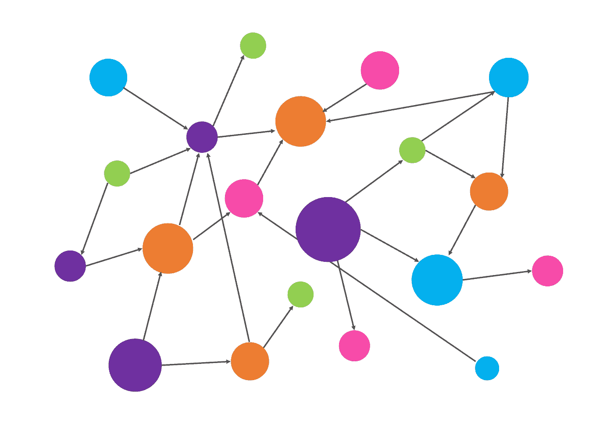
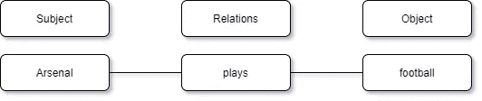
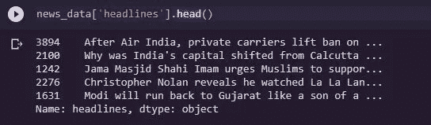
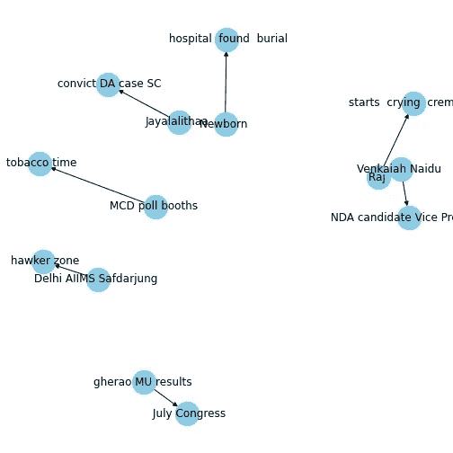

# 使用简单知识图进行查询

> 原文：<https://medium.com/analytics-vidhya/querying-using-simple-knowledge-graphs-abeb13d05e48?source=collection_archive---------7----------------------->

当人们得到某个问题的答案时，他们往往会着迷。有许多方法可以创建一个简单的查询或 Q&A 系统，它可以部署为一个简单的信息应用程序，并在后端运行一个数据库。在这里，我尝试使用 python 中一些流行的包来创建一个查询应用程序。

**什么是知识图？**

简单地说，知识图是数据点之间连接形式的数据库。知识图的主要属性是节点和边。为了从文本中创建知识图，你只需要知道基本的语法概念，比如什么是句子的主语和宾语，什么是动词等等。节点表示主语和宾语，而它们由句子中动词部分表示的边连接。如果你对词类概念很熟悉，你可以很容易地为你的文本文档建立一个知识图谱库。请参考下面给出的例子作为参考。句子是“阿森纳踢足球”，下面给出的图像表示为其构建的知识图。

**构建知识图谱**

我们将使用新闻标题数据集来为我们考虑准备的解决方案创建图表数据库。这个数据集为创建知识数据库提供了完美的设置。我们将使用数据集中的标题来创建我们的知识图表。下图给了我们数据集的要点。

所以这里我们使用 ***spacy*** 包中的词性标注来确定每个句子的不同部分。所以我们的逻辑应该能够得到连接前两部分的主语、宾语和动词部分。

所以模式应该是 ***“名词-动词-名词”，*** 从上面的代码片段中我们可以看到，我在句子的动词和名词部分之间插入了一个分隔符 **' < '** 。这是创建“主语-边缘-宾语”集合的简单方法，通过使用更多的词性、依存性解析逻辑，这可以变得更复杂和更好。

上面的代码片段有助于用我们要求的初始文本查询数据帧。举个例子，假设有一句话“孟买警察因为缺少船只而停止在岛上巡逻”，如果我们想问类似“孟买的警察停止了什么？”我们可以把它重新表述为“孟买警察停止-”。我将阈值分数设置为 75%,结果如下所示

查询函数接受两个输入:要查询的字符串和过滤最佳结果的置信度阈值。分数是数据帧中的单词列表和查询字符串中的标记之间的平均模糊相似性分数。通过在创建*“主语-关系-宾语”集合时去除停用词，进一步提高了算法的效率。*

我们还可以利用 pandas 和 networkx 库来可视化图形数据。下面给出的片段给出了主语和宾语是如何链接的，线表示链接。我使用“已声明”作为要搜索的关系。

因此，伙计们，我们已经创建了一个图形数据库，并分析了如何使它可查询的简单问答的东西。这是实现知识图和查询知识图的一种非常简单和原始的方式，它可以变得更加高效和复杂。请留下您的宝贵反馈。