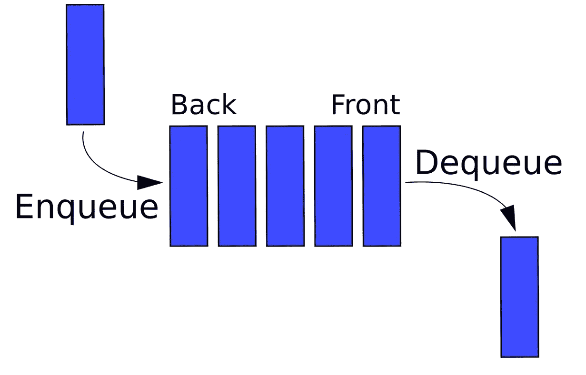

# 队列和出队概述及其在 Python 中的实现

> 原文：<https://medium.com/analytics-vidhya/queue-deque-overview-and-its-implementation-in-python-c36c56b532b8?source=collection_archive---------11----------------------->

## 队列概述


队列数据结构示例[来源](https://www.google.com/url?sa=i&url=https%3A%2F%2Fwww.tutorialspoint.com%2Fdata_structures_algorithms%2Fdsa_queue.htm&psig=AOvVaw0dZHE-BlcExn6lT1tXSIHV&ust=1610087145981000&source=images&cd=vfe&ved=0CAIQjRxqFwoTCIi5yZaYie4CFQAAAAAdAAAAABAD)

队列是编程中一种有用的数据结构。它类似于电影院大厅外的购票队列，第一个进入队列的人是第一个拿到票的人。

队列是项目的有序集合，其中新项目的添加发生在一端，称为“**后方“【T3”)，现有项目的移除发生在另一端，通常称为“**前方”。****

当一个元素进入队列时，它从后面开始向前面移动，一直等到下一个元素被删除。队列中最近添加的项必须在集合末尾等待。

在集合中时间最长的项目在最前面。这种排序原则有时被称为 **FIFO，先进先出**。它也被称为“先到先得”。



入队术语描述了我们何时将一个新项目添加到队列中。出列术语描述从前面移除项目。

# 队列的实现

我们现在将通过实现我们自己的队列类来建立我们对队列的理解！

# 队列方法和属性

在我们开始实现自己的队列之前，让我们回顾一下它将具有的属性和方法:

*   Queue()创建一个新的空队列。它不需要参数，返回一个空队列。
*   enqueue(item)将新项目添加到队列的末尾。它需要该项目，但不返回任何内容。
*   dequeue()从队列中删除前面的项目。它不需要参数并返回项目。队列被修改。
*   isEmpty()测试队列是否为空。它不需要参数，返回一个布尔值。
*   size()返回队列中的项目数。它不需要参数，返回一个整数。

# 队列实现

```
class Queue:
    def __init__(self):
        self.items = [] def isEmpty(self):
        return self.items == [] def enqueue(self, item):
        self.items.insert(0,item) def dequeue(self):
        return self.items.pop() def size(self):
        return len(self.items)q = Queue()q.size()0q.isEmpty()Trueq.enqueue(1)q.dequeue()1
```

## 德克概述

一个双端队列，也称为双端队列，它是一个类似于队列的有序项目集合。它有两个末端，一个前端和一个后端，这些项目仍然位于集合中。

使 deque 与众不同的是添加和删除项目的无限制性。新的物品可以添加在前面或者稀有。同样，可以从任意一端移除现有项目。在某种意义上，这种混合线性结构在一个数据结构中提供了堆栈和队列的所有功能。

重要的是要注意，即使 deque 可以假定堆栈和队列的许多特征，它也不需要那些数据结构所强制的 LIFO 和 FIFO 排序。我们需要始终如一地使用添加和删除操作。


# Deque 的实现

现在我们将实现我们自己的 Deque 类！

## 方法和属性

*   dequee()创建一个新的空 dequee。它不需要参数，返回一个空的队列。
*   addFront(item)向队列的前面添加一个新项目。它需要该项目，但不返回任何内容。
*   addRear(item)将新项目添加到队列的后面。它需要该项目，但不返回任何内容。
*   removeFront()从队列中移除前面的项目。它不需要参数并返回项目。该队列被修改。
*   removeRear()从队列中移除后面的项目。它不需要参数并返回项目。该队列被修改。
*   isEmpty()测试队列是否为空。它不需要参数，返回一个布尔值。
*   size()返回队列中的项数。它不需要参数，返回一个整数。

# Deque 实现

```
class Deque:
    def __init__(self):
        self.items = [] def isEmpty(self):
        return self.items == [] def addFront(self, item):
        self.items.append(item) def addRear(self, item):
        self.items.insert(0,item) def removeFront(self):
        return self.items.pop() def removeRear(self):
        return self.items.pop(0) def size(self):
        return len(self.items)
```

在下一篇博客中，我们将看到链表及其在 python 中的实现。

如果你有任何反馈或批评，请随时与我分享。如果本演练对您有所帮助，请喜欢👏文章。干杯！🍻