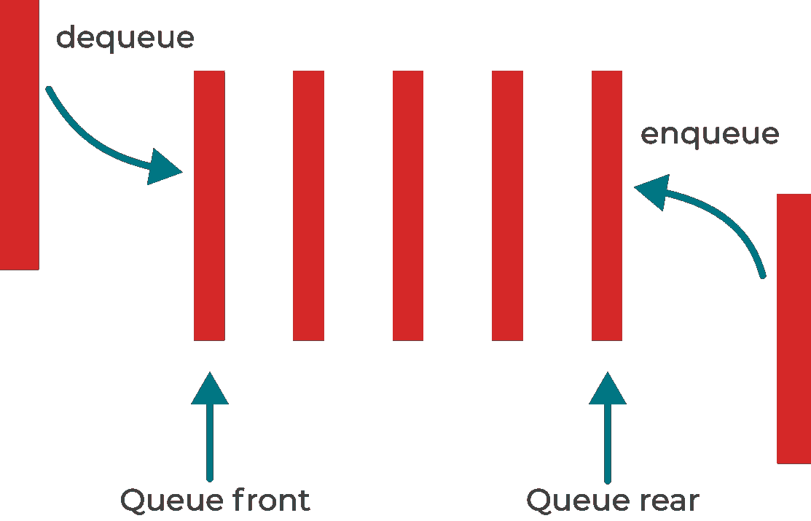

# 在 Python 中使用队列

> 原文：<https://medium.com/analytics-vidhya/queues-in-python-7783244ac507?source=collection_archive---------2----------------------->


人们在路易威登商店旁排队。来自[梅勒妮·庞格拉茨](https://unsplash.com/@melanie_sophie)

在编程和软件开发中，数据结构用于存储和排列一组值。不同的用例有不同类型的数据结构。它们包括堆栈、队列、列表等。本文主要关注队列和可以在队列上执行的基本操作。

# 队列数据结构是什么？

队列数据结构的工作方式类似于现实生活中的队列，比如在商场、付款柜台和登机处。

# 队列的应用有哪些？

*   打印机队列
*   客户服务热线
*   CPU 调度

# 先进先出概念

*FIFO* 是先进先出的缩写，它解释了队列工作中执行操作的顺序。第一个进入队列的对象是第一个出去的对象。

因此，新元素的添加发生在队列的末尾，而元素的删除发生在队列的开头，就像商场中的队列一样。

这与[堆栈数据结构](https://jkaylight.medium.com/stacks-in-python-bbacc60510a)形成对比，后者元素的添加(`push`)和移除(`pop`)发生在队列的末尾。这被描述为后进先出， *LIFO* 你可以在本文中了解更多关于栈的知识，Python 中的 [*栈*](https://jkaylight.medium.com/stacks-in-python-bbacc60510a) 。

# 主要队列操作

1.  enqueue():这需要在队列末尾添加新元素
2.  dequeue():这涉及到从队列前面删除队列成员。



描述主要队列操作、入队和出队的图表

# 用 Python 编写队列类

在面向对象编程概念中，类是计算机程序的模块化元素。对 OOP 中类的工作原理有一个基本的了解对于使用类是很重要的。可以通过本教程学习 Python 中的面向对象编程， [*Python —面向对象*](https://www.tutorialspoint.com/python/python_classes_objects.htm) 。

接下来，我们将导入`deque()`数据类型，因为像在堆栈类中一样使用列表数据类型只有当我们想要在列表末尾添加或删除时才是有效的。

试图从列表的开头移除列表的元素是困难且缓慢的。然而，我们需要从头删除一个队列元素。

因此，我们将导入 Python 中内置的`deque()`数据类型。

```
from collections import deque
```

然后，让我们宣布我们的`Queue`类。

```
from collections import deque
​
#new addition
class Queue:
 def __init__(self):
        self.items = deque()
```

我们已经声明了 Queue 类并添加了`__init__()`构造函数，这使我们能够使用`Queue`类的对象。

`items`是一个我们用来保存队列元素的列表。

# 排队()

我们现在将添加`enqueue()`函数，它从后面向队列添加一个新元素。

```
from collections import deque
​
class Queue:
    def __init__(self):
        self.items = deque()

    #new addition
    def enqueue(self, item):
        self.items.append(item)
```

# 出列()

`dequeue()`函数将用于删除队列前面的元素。我们将使用`popleft()`功能从左侧移除一个项目。

```
from collections import deque
​
class Queue:
    def __init__(self):
        self.items = deque()

    def enqueue(self, item):
        self.items.append(item)

    #new addition
    def dequeue(self):
        return self.items.popleft()
```

# peek()

现在，我们将添加`peek()`函数来返回队列中最前面的数据项，而不删除它。

```
from collections import deque
​
class Queue:
    def __init__(self):
        self.items = deque()

    def enqueue(self, item):
        self.items.append(item)

    def dequeue(self):
        return self.items.popleft()

    #new addition
    def peek(self):
        return self.items[0]
```

# is_empty()

让我们添加一个`is_empty()`函数，告诉我们队列是否为空。`len()`函数返回列表中元素的数量。因此，当我们的队列长度为 0 时，我们将使用`len()`进行检查。

```
from collections import deque
​
class Queue:
    def __init__(self):
        self.items = deque()

    def enqueue(self, item):
        self.items.append(item)

    def dequeue(self):
        return self.items.popleft()

    def peek(self):
        return self.items[0]

    #new addition
    def is_empty(self):
        return len(self.items) == 0
```

# 大小()

我们还可以使用`len()`功能来检查队列中的项目数量。因此，让我们创建一个函数，我们可以调用它来返回队列的大小

```
from collections import deque
​
class Queue:
    def __init__(self):
        self.items = deque()

    def enqueue(self, item):
        self.items.append(item)

    def dequeue(self):
        return self.items.popleft()

    def peek(self):
        return self.items[0]

    def is_empty(self):
        return len(self.items) == 0

    #new addition
    def size(self):
        return len(self.items)
```

上述函数是可以在队列上完成的一些常见操作。

现在，让我们将`__str__()`添加到，以便在我们的程序中使用`print`语句

```
from collections import deque
​
class Queue:
    def __init__(self):
        self.items = deque()

    def enqueue(self, item):
        self.items.append(item)

    def dequeue(self):
        return self.items.popleft()

    def peek(self):
        return self.items[0]

    def is_empty(self):
        return len(self.items) == 0

    def size(self):
        return len(self.items)

    #new addition
    def __str__(self):
        return str(self.items)
```

我们可以用下面的打印语句测试上面的代码。在使用 print 语句之前，我们需要添加一个条件语句，`if "__name__" = "__main__"`来检查当前文件是否是主文件。这只是帮助我们能够在其他 Python 文件中导入我们的`Queue`类，这样就可以在那里使用该类。

```
from collections import deque
​
class Queue:
    def __init__(self):
        self.items = deque()

    def enqueue(self, item):
        self.items.append(item)

    def dequeue(self):
        return self.items.popleft()

    def peek(self):
        return self.items[0]

    def is_empty(self):
        return len(self.items) == 0

    def size(self):
        return len(self.items)

    def __str__(self):
        return str(self.items)

#new addition
if "__name__" = "__main__":
    q = Queue()
​
    print(q)
    print(q.is_empty())
​
    q.enqueue("1")
    q.enqueue("2")
    q.enqueue("3")
​
    q.dequeue()
​
    q.enqueue("4")
    q.enqueue("5")
    q.enqueue("6")
​
    q.dequeue()
​
    print(q)
    print("size of the queue: ", q.size())
​
    print("foremost item in the queue:", q.peek())
    print(q)
```

对于上面代码中的每个`print`语句，我们有以下输出:

```
deque([])
True
deque(['3', '4', '5', '6'])
size of the queue:  4
foremost item in the queue: 3
deque(['3', '4', '5', '6'])
```

# 结论

我们简要讨论了队列数据结构和对队列执行的主要操作。队列操作按照先进先出的顺序发生。在实现计算机科学中的算法时，队列非常有用，例如在航班预订系统中使用的广度优先搜索算法。

感谢您的耐心和抽出时间来阅读我的帖子。我在这里写在[介质](https://jkaylight.medium.com/)上。你可以通过推特[@ JK ailight](https://twitter.com/JKayLight)向我提出问题和想法