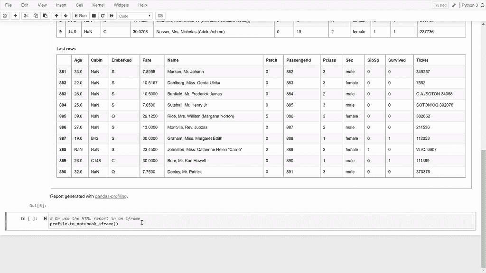
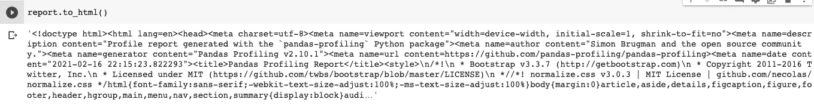

# 使用 Python 快速生成数据报告

> 原文：<https://medium.com/analytics-vidhya/quickly-generate-data-reports-with-python-47421f86c220?source=collection_archive---------3----------------------->

## 熊猫简介。


图片由熊猫简介

# 开始之前

别忘了关注我的 GitHub 和 T2 LinkedIn 账户。我喜欢写关于数据科学的文章，并在网上与人分享很酷的东西。

# 放松你的 EDA

有没有一种更简单的方法来开始你的**探索性** **数据** **分析** (EDA)并做出给你深刻见解的数据报告？听起来不错，是吧？

有了[熊猫图谱](https://github.com/pandas-profiling/pandas-profiling)，这是可能的。

你可能会问自己什么是熊猫概况。**不，不是一堆中国熊猫在计算数据。**


Damian Patkowski 在 [Unsplash](https://unsplash.com/s/photos/panda-bear?utm_source=unsplash&utm_medium=referral&utm_content=creditCopyText) 上拍摄的照片

Pandas Profiling 是一个**开源 python 库**，它允许你非常快速地完成 EDA。顺便说一下，它还生成了一个**交互式 HTML 报告**，你可以给任何人看。想象一下，你带着对公司数据的交互式描述去见你的老板，他不写代码。对你的品牌很有帮助，对吧？

以下是您在报告中得到的一些信息:

*   类型推断:检测数据帧中列的[类型](https://github.com/pandas-profiling/pandas-profiling#types)。
*   要素:类型、唯一值、缺失值。
*   分位数统计，如最小值、Q1、中值、Q3、最大值、范围、四分位间距。
*   描述性统计，如平均值、众数、标准差、总和、中位数绝对偏差、变异系数、峰度、偏斜度。
*   最常见的值。
*   直方图。
*   相关性突出高度相关的变量，斯皮尔曼，皮尔逊和肯德尔矩阵。
*   缺失值矩阵、计数、缺失值热图和树状图。
*   文本分析了解文本数据的类别(大写、空格)、脚本(拉丁文、西里尔文)和块(ASCII)。
*   文件和图像分析提取文件大小、创建日期和尺寸，并扫描截断的图像或包含 EXIF 信息的图像。

鉴于此，我们开始吧。

首先你需要安装**包**。

```
#installing Pandas Profiling
!pip install https://github.com/pandas-profiling/pandas-profiling/archive/master.zip -q
```

现在，让我们导入`pandas`和`panda_profiling`。

```
#importing modules
from pandas_profiling import ProfileReport
import pandas as pd
```

我们将使用[泰坦尼克号](https://raw.githubusercontent.com/datasciencedojo/datasets/master/titanic.csv)数据集来完成我们的分析，让我们导入它:

```
#linking df to our dataset
df = pd.read_csv("https://raw.githubusercontent.com/datasciencedojo/
datasets/master/titanic.csv")
```

在你导入它之后，你应该总是看看你的数据集，然后仅仅链接`report`到它:

```
report = ProfileReport(df)
```

现在，您只需“告诉”Pandas Profiling 从您的数据集生成一份报告。

```
report.to_notebook_iframe()
```

给你。就这么简单。你可以在这里查看结果。



熊猫简介 GIF。

如果你用的是 Jupyter 笔记本，你的报告就嵌在里面。但是，您可能想在其他地方使用它，熊猫概况也允许您这样做。只需键入以下内容，将您的报告保存为 HTML 文件:

```
report.to_file('file_name')
```

如果您想要 HTML 源代码“代码”(不要因为我称之为代码而杀了我)，这将是非常罕见的，但是可能的，只需键入:

```
report.to_html()
```

它将返回完整的 HTML 源代码。



HTML 已返回

您甚至可以将其保存为 JSON 文件:

```
# As a string
json_data = profile.to_json()

# As a file
profile.to_file("your_report.json")
```

# 结论

今天你学习了熊猫概况的基础知识(没有比这更复杂的了)，这是一个简单但功能强大的工具。

在您的报告中，您将有以下几个部分:

*   概述。
*   变量。
*   互动。
*   相关性。
*   缺少值。
*   样本。

通过四行代码，您可以得到这个漂亮的报告。如果我是你，它将完全在我的数据分析程序的工具清单上。这只会让你的工作更有活力。

它甚至可以为你节省几个小时。

不是说**报道** **好看**，**极简**，**互动**，让任何看一眼的人都容易理解。

顺便说一下，你也可以编辑报告，但是，这是另一篇文章的内容。:)

**参考:**

[](https://github.com/pandas-profiling/pandas-profiling) [## 熊猫简介/熊猫简介

### 文档|松弛|堆栈溢出从 pandas 数据帧生成配置文件报告。熊猫 df.describe()…

github.com](https://github.com/pandas-profiling/pandas-profiling)