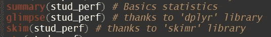
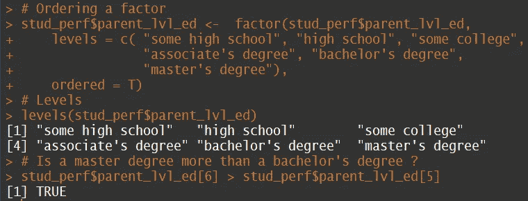
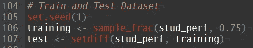

# r-基本数据操作

> 原文：<https://medium.com/analytics-vidhya/r-basic-data-manipulation-89e56c10fa8d?source=collection_archive---------12----------------------->

为了使用数据集，您需要了解一些最常见、最基本和最有用的数据操作。

必需的库:

`library(tidyverse)`

`library(magrittr)`

导入数据集后，看到 it🕵️‍♀️很重要！

数据集摘要

以下是您可能会喜欢的一些其他有用的功能:

有用的探索功能

当然还有我的马🐎我们必须看它的结构:

数据集摘要

# 基本转换

到目前为止，我们可以看到一些需要改变的地方:

1.  “字符”类型的属性应被视为“因子”类型。
2.  将数据存储为数字比存储为名称更有效。例如，注意“性别”对于每一行都存储为“女性”或“男性”。这在这些规模的数据集中无关紧要，但我们想为大联盟练习，对吗？🔥

虽然您不需要这样做，但最好使用“tibbles”对象。“tibble”增强了数据帧的结构，以便更好地与“tidyverse”包一起工作。注意，所有的“tible”都是数据帧，但不是所有的数据帧都是“tible”。由于我们的数据集实际上是一个数据框，我使用`as_tibble()`将其转换成一个‘tible’对象。

数据集的类别

我们接下来要做的就是检查 NA。他们是闪光灯下的痛！🔦

这里，您可以使用两个选项来检查缺失值:

检查缺少的值

如您所见，我们没有丢失值。选择这个数据集是我的错。但是，对我来说坐下来太难了😫并写下，我们将与这一个合作！

没问题，朋友🤠！我们将模拟一些 NA 值:

`data_NA[1:30, 'reading.score'] <- NA`

在这里，我用 NA 替换了“reading.score”列的前 30 行:

缺少值的数据集

此时，您需要决定如何处理丢失的值。你要么放弃它们，要么用某个值来代替它们。我将用某种集中趋势来代替它们。为此，选择一个更好地坚持你的值的分布，所以它不会改变你的结果。

R' base 没有获取模式的函数，请为它创建一个函数，或者使用类似于' modeest '的库并键入:

`mlv(data, method = "mfv")`

假设我们想获得一个函数的模式，那么我们创建它，然后获得所有三个中心趋势值:

用于获取属性“阅读分数”的众数和集中趋势值的函数

我们可以看到所有的值都非常接近，所以考虑到我在询问 Google 时手工制作了整个请求，我将选择替换缺失值的模式😜！尽管我添加了“如果-否则”的逻辑🤯。

是的，这是正确的！我们搜索了很多，这是过程的一部分。不要记住那些你很容易找到的东西。

# 替换 NA 的

## 选项 1

替换缺失值的选项一

替换缺失值的选项一的结果

完成的😎注意，现在“reading.score”的前 30 行的值都是 72。

## 选项 2

这个选项有点复杂。

1.  用缺少值的列的名称创建一个列表。
2.  在这里，我们要求对于每个值(在本例中为“reading.score”)呈现在我们从第一步开始的列表中(它包含具有 NA 值的属性的名称)，计算平均值并将其存储在名为“missing”的变量下。

`If you have not seen the pipe operator (' %>% '), just think of it as a 'then'. I want you to do bring me a beer 🍺, 'then', a sandwich 🥪😋!`

3. *Mutate* 函数来自于' *dplyr* '库，该库内置于' *tidyverse* '库中。这对于创建新属性很有用。现在我们说:“取‘data _ NA’数据集，*然后*，用一个新的属性突变它，如果值是 NA，用我们的‘missing’变量(它保存 69.22 的值)值替换它；如果没有，保留原始值”。因为这创建了一个新属性(在本例中为:“replace_mean_reading”)，所以我们的最后一行代码选择了除“reading.score”之外的所有属性。

替换缺失值的选项二

替换缺失值的选项二的结果

## 选项 3

最后一个选项更加实用:

放下武器。

但是，如果 NA 值很少，我们应该只删除它们，如果删除，其他属性的分布不会有明显的改变。

`data_NA %<>% na.omit()`

选项三:删除缺失值

`This is called the ‘assignment pipe operator’ (%<>%). As it does the computation, it also stores the output into the same variable.`

太好了！我们完成了这一部分！🤓

出于演示的目的，下面是我们如何更改属性的名称:

重命名属性

接下来，我们必须将所有类型“字符”更改为“因子”。幸运的是，这很简单:

将“字符”类型更改为“因子”类型

让我们来看看数据框的结构:

`str()`

数据集摘要

比较一下我们的第一个`str()`！我可以等🕊.现在，“R”将我们的属性存储为数字！这比以前更有效率🤖。

我还想给你看三样东西。通常，您必须对因子进行排序，因为它有继承顺序。我们的“parent_lvl_ed”属性是实现这一目标的绝佳机会:

或确定一个因素

# 创建范围

有时，创建一些范围并向其添加一个类别是很有用的。例如，在处理和探索年龄时，它就派上了用场。您可以为年龄创建不同的范围，并为其附加一个类别，如“20 岁以下”或“50 岁以上”)。你需要多少就有多少！

假设我们没有年龄变量，让我们尝试为“writing_score”属性设置范围:

为属性“写入分数类别”创建范围

结果:

为属性创建范围后的结果:“写入分数类别”

现在，这很好，但是，你可能想知道我如何使用它？或者你想吃点披萨🍕。无论哪种方式，你都可以使用你的新属性和‘gg plot 2’来创建一些很棒的情节！

只绘制两个图形，因为这不是本文的目的。我只是给你一些你可以用它做什么的想法。

绘图示例

**注意**:当我将刻度设置为“自由”时，仔细比较这最后一幅图。注意每个图都有自己的比例。

绘图示例

如果您感兴趣，以下是相应的代码:

`> ggplot(stud_perf) + geom_bar(aes(x = gender, fill = gender)) + facet_wrap(~writing_score_category, scales = 'free') + labs(title = "Title", subtitle = "subtitle", x = "x — axis", y = "y-axis", caption = "caption") + theme(plot.title = element_text(hjust = 0.5), axis.text.x = element_text(angle = 45, hjust = 1), plot.caption = element_text(hjust = 0.5), legend.title = element_text(hjust = 0.5))`

`> ggplot(stud_perf) + geom_bar(aes(x = forcats::fct_infreq(writing_score_category), fill = gender)) + labs(title = "Title", subtitle = "subtitle", x = "x -axis", y = "y-axis", caption = "caption") + theme(plot.title = element_text(hjust = 0.5), axis.text.x = element_text(angle = 45, hjust = 1))`

# 最后的想法

也许你的下一步是应用机器学习技术。好吧，如果你选择做一些监督学习算法，你将不得不分割你的数据集。这是我想给你看的最后一部分。您需要创建一个训练数据集和一个测试数据集。

首先你必须`set.seed(1).`以获得可重复的结果。你可以选择任何数字，但选择一个，并忠实于它。就像对妻子一样👰！

现在:

*   **'sample_frac'** 接收两个参数:a)原始数据集；b)要选择的行数。
*   **'set_diff'** 接收两个参数:a)原始数据集；b)训练变量。这将原始数据集和训练数据集之间的差异分配给新的测试数据集。

放下🎤！我们完了🔥！

谢谢你亲爱的🦌读者花时间和实际阅读它！

我希望你从中有所收获。

不断学习👩‍💻继续前进🏃‍♂️!

# 资源

数据集:

[http://roycekimmons.com/tools/generated_data/exams](http://roycekimmons.com/tools/generated_data/exams)