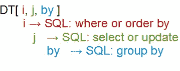

# r 数据表连接

> 原文：<https://medium.com/analytics-vidhya/r-data-table-joins-48f00b46ce29?source=collection_archive---------0----------------------->


照片由 [Sam Moqadam](https://unsplash.com/@sammoqadam?utm_source=medium&utm_medium=referral) 在 [Unsplash](https://unsplash.com?utm_source=medium&utm_medium=referral) 拍摄

# 介绍

`Data.table`是古老的`data.frame`的强大现代更新。在引擎盖下，该包已经过调整，以惊人的速度和最小的内存使用量与一个圆滑和备用的语法。对于初学者来说，简洁的语法是一种福气，但对于新用户来说，这可能是一个障碍。

对我来说，其中一个领域是连接多个`data.table`。这个包的设计使得`data.table`特别擅长连接，所以我发现努力掌握语法是非常值得的。据我所知，我找不到任何资源可以将我想要的所有信息收集到一个地方。这是我希望能找到的文件。我希望它能帮助你掌握这个最强大的 R 包的强大特性。

# 入门指南

要快速了解`data.table`包本身，你真的没有比阅读该项目的官方主页[上的介绍性简介更好的了。](https://rdatatable.gitlab.io/data.table/index.html)

在这里，我将对从单个`data.table`中读取和操作数据的基础知识做一个最简短的概述，供那些可能是软件包新手或者只是生疏的人使用。已经具备基本知识的读者应该跳到下一节。

正如您在阅读官方文档时将会看到的，`data.table`包的创建者鼓励用户考虑对单个表进行操作，就像您考虑查询关系数据库一样。`data.table`、 *DT* 的逗号分隔字段可以映射到 SQL 查询的相应特性。



作者图片

第一个字段 *i* ，对表格数据行进行排序或筛选。第二个
字段 *j* 选择用于计算或显示的数据列，而最后一个
*by* 字段起到 *group-by* 的作用。

在继续讨论连接之前，连接的语法与这个查询语法不同，让我们构建一个单独的查询来练习所有这些类似 SQL 的子句。

首先，让我们创建一些要处理的数据。

```
# Create a data.table to work with
library(data.table)set.seed(42)
x <- data.table( 
  id = sample(LETTERS[1:3], 10, replace = TRUE),
  value = sample(1:5, 10, replace = TRUE)
)x##         id value
##     <char> <int>
##  1:      A     4
##  2:      A     1
##  3:      A     5
##  4:      A     4
##  5:      B     2
##  6:      B     2
##  7:      B     3
##  8:      A     1
##  9:      C     1
## 10:      C     3
```

为了说明一个使用所有类似 SQL 的主要操作的查询，让我们找到( *select* )所有(*where*)B 和 C 的值字段的平均值，用于每个
( *group by* ) id。

```
x[ id > 'A', .(mean_value = mean(value)), by = .(id)]##        id mean_value
##    <char>      <num>
## 1:      B   2.333333
## 2:      C   2.000000
```

我们过滤了 *x* 的行，只给出了 *id* 大于 A 的行，并且
将这些行传递给选择步骤。在这里，我们取*值*
字段的平均值，按 *id* 字段分组，并将计算值命名为
*mean_value* 。

这是查询一个`data.table`的基本逻辑和语法的(超级压缩)演练。稍后，当我们对将要生成的合并的`data.table`执行一些基本操作时，我们将使用一些查询逻辑。如果这一部分的一些材料被你忽略了，你不应该感到难过。我只是试图为您提供一些必要的基本知识，让您能够理解本文的其余部分，而不会让那些想跳到表连接的读者感到厌烦。如果你觉得这一部分很难理解，那么这个包的官方介绍会让你很快上手。

# 简单等值联接

为了演示基于表之间变量相等(或其
否定)的表之间的连接，让我们创建两个数据表来
处理。

```
set.seed(42)big <- data.table( 
  id = LETTERS[2:11],
  a = sample(101:105, 10, replace = TRUE),
  b = sample(200:300, 10)
)small <- data.table(
  id = LETTERS[1:5],
  y = sample(1:5, 5, replace = TRUE),
  z = sample(10:20, 5) 
)big##         id     a     b
##     <char> <int> <int>
##  1:      B   101   288
##  2:      C   105   236
##  3:      D   101   219
##  4:      E   101   225
##  5:      F   102   202
##  6:      G   104   240
##  7:      H   102   300
##  8:      I   102   226
##  9:      J   101   235
## 10:      K   104   204small##        id     y     z
##    <char> <int> <int>
## 1:      A     4    10
## 2:      B     2    19
## 3:      C     4    17
## 4:      D     3    15
## 5:      E     2    12
```

我们将从一个带有默认参数的非常简单的连接开始。

```
# Right outer join
big[small, on = .(id)]##        id     a     b     y     z
##    <char> <int> <int> <int> <int>
## 1:      A    NA    NA     4    10
## 2:      B   101   288     2    19
## 3:      C   105   236     4    17
## 4:      D   101   219     3    15
## 5:      E   101   225     2    12
```

我们通过将*小*放入*大*的第一个
槽中，并告诉`data.table`用关键字`on`连接哪个字段，从而连接了*大*和*小*表格。

如果你习惯了`merge.data.frame()`的默认行为，这个加入的结果可能会让你大吃一惊。默认情况下，用这个 **X[Y]** 语法连接`data.table` s 会产生一个**右外连接**，其中*大*作为左表，而*小*作为右表。这里， *small* 中带有 *id* == 'A '的行出现在结果集中。由于在*大*中没有相应的记录，因此该
记录的字段显示为`NA`。此时，唯一需要注意的是，结果表中的
列反映了过程调用中表从左到右的顺序(即*即*，*大*列后面跟着*小*)。

如果我们改变要连接的表的命名顺序，结果连接的性质可能会更加明显。

```
# Right outer join
small[big, on = .(id)]##         id     y     z     a     b
##     <char> <int> <int> <int> <int>
##  1:      B     2    19   101   288
##  2:      C     4    17   105   236
##  3:      D     3    15   101   219
##  4:      E     2    12   101   225
##  5:      F    NA    NA   102   202
##  6:      G    NA    NA   104   240
##  7:      H    NA    NA   102   300
##  8:      I    NA    NA   102   226
##  9:      J    NA    NA   101   235
## 10:      K    NA    NA   104   204
```

正如我们已经看到的，在这个**left _ table[right _ table]**语法中，默认情况下，所有连接都是右外连接。我们需要设置参数`nomatch`来改变这种行为。要获得一个**内部连接**，您需要将`nomatch`参数设置为 NULL 或 0。

```
# Inner join
small[big, on = .(id), **nomatch = NULL**]##        id     y     z     a     b
##    <char> <int> <int> <int> <int>
## 1:      B     2    19   101   288
## 2:      C     4    17   105   236
## 3:      D     3    15   101   219
## 4:      E     2    12   101   225
```

内部连接是调用`merge.data.frame()`的默认结果。为了兼容，默认情况下，`merge.data.table()`也执行内部连接。

```
# X[Y, nomatch = NULL] == merge(X,Y)
all(small[big, on = .(id), nomatch = NULL] == merge(small, big))## [1] TRUE
```

既然`data.table`已经实现了自己的`merge()`函数，你可能会问自己为什么要放弃熟悉的`merge()`来使用这种更简单的语法。这是个很好的问题。一般来说，非合并 **X[Y]** 语法是首选的、更像`data.table`的连接方式。原因是`data.table`自动询问 *j* 字段，以检测完成 *j* 中指定的计算所需的最小列集合。另一方面，使用`merge()`要么合并 RHS 表中的所有列，不管它们是否需要(浪费)，要么要求用户手动将 RHS 表中的列减少到最少的必要列(冗长且不必要)。

因此，例如，下面的连接/查询只合并来自 *big* 的列 *a* ，因为 *a* 是 RHS 表中后续计算所需的唯一列。

```
# data.table takes care of minimizing the number of 
# joined columns
small[big, on = .(id), .('a + z' = a + z)]##     a + z
##     <int>
##  1:   120
##  2:   122
##  3:   116
##  4:   113
##  5:    NA
##  6:    NA
##  7:    NA
##  8:    NA
##  9:    NA
## 10:    NA
```

显然，对于这个玩具示例来说，效率增益是最小的，但是`data.table`包是关于高效处理大型数据集的，这种优化可能意味着是否能够在内存中运行分析。

有两种所谓的连接，即**反连接**和**半连接**，它们并不真正从两个表中返回列的组合。只返回*大*中与*小*中的 *id* 不匹配的行很简单。要获得这种反连接行为，只需对 RHS 表求反即可。

```
# Anti-join 
# (return rows of big with no match in small)
big[!small, on = .(id)]##        id     a     b
##    <char> <int> <int>
## 1:      F   102   202
## 2:      G   104   240
## 3:      H   102   300
## 4:      I   102   226
## 5:      J   101   235
## 6:      K   104   204
```

半连接有点像反反连接。它只返回 LHS 表中与 RHS 表匹配的行。这样做的语法有点笨拙，但是可以如下所示获得与*小*中的 *id* s 匹配的*大*的元素。

```
# Semi-join 
# (return only rows of big that have a 
# match in small)
big[na.omit(big[small, on = .(id), which=TRUE])]##        id     a     b
##    <char> <int> <int>
## 1:      B   101   288
## 2:      C   105   236
## 3:      D   101   219
## 4:      E   101   225
```

`which`参数只是指示`data.table`返回*大*中与*小*匹配的行的索引，返回`NA`中与*大*小*不匹配的行的索引。*然后，我们将这些行索引减去`NA`值，输入到 *big* 的外部查询的 *i* 字段中。

最后，如果想连接两个表中的所有可用数据，该怎么做呢？一个聪明的想法是用 X[Y] 语法实现**全外部**连接，这个想法来自于[这个](https://stackoverflow.com/questions/12773822/why-does-xy-join-of-data-tables-not-allow-a-full-outer-join-or-a-left-join?rq=1&newreg=c55095bfee4e4d67a6f52576549c939b)经典的 Stackoverflow 交换。

实现 Stackoverflow 的想法需要我们稍微绕道介绍一下**键**的想法。到目前为止，我们已经用`on`参数指定了每次加入的变量。我们可以通过将 id*设置为两个表中的键，使其成为所有后续连接中的隐式连接变量。这使得连接速度非常快，代价是变量的前期引用排序非常小。它还简化了基于键选择行的语法。让我们先来看看这个特性。*

```
setkey(small, id)
setkey(big, id)# With keys set, we don't need to specify 
# columns to join on
big[c('A','C', 'E' )]##        id     a     b
##    <char> <int> <int>
## 1:      A    NA    NA
## 2:      C   105   236
## 3:      E   101   225
```

上面，`data.table`“知道”我们想要对应于 *id* s A、C 和 e 的 *big* 的行。这种类型的行索引在下面的全外连接中起作用。

```
# Full outer join
unique_ids = unique(c(big[, id], small[, id]))
big[small[unique_ids]]##         id     a     b     y     z
##     <char> <int> <int> <int> <int>
##  1:      B   101   288     2    19
##  2:      C   105   236     4    17
##  3:      D   101   219     3    15
##  4:      E   101   225     2    12
##  5:      F   102   202    NA    NA
##  6:      G   104   240    NA    NA
##  7:      H   102   300    NA    NA
##  8:      I   102   226    NA    NA
##  9:      J   101   235    NA    NA
## 10:      K   104   204    NA    NA
## 11:      A    NA    NA     4    10
```

显然，无论 *big* 是 LHS 表还是 RHS 表，都只会在我们执行完全外部连接时影响连接表中列的顺序。

在我们离开这一部分之前，让我们明确地演示一个**自连接**，一个表对它自己的连接来实现一些转换。我们在本教程中创建的第一个`data.table`， *x* ，在 *id* 字段中有重复的值。假设我们只想挑选出每个 *id* 值第一次出现的记录。这可以通过将`mult`(针对多个匹配)参数设置为‘first’来实现。`mult`的其他合法值为‘all’(默认值)和‘last’。

```
# Self-join
setkey(x, id)
x[unique(id), mult = 'first']##        id value
##    <char> <int>
## 1:      A     4
## 2:      B     2
## 3:      C     1
```

为了说明这是如何做到的，也因为出于教学目的，我更喜欢`on` 语法的明确性，所以我将从这些表中删除这些键。不过，在真正的研究中，我几乎总是会使用按键。

```
setkey(x, NULL)
setkey(small, NULL)
setkey(big, NULL)# Now when we try to access rows as we did when
#  id was a key, we get an error ...
big[c('A','C', 'E' )]## Error in `[.data.table`(big, c("A", "C", "E")): When i is a data.table (or character vector), the columns to join by must be specified using 'on=' argument (see ?data.table), by keying x (i.e. sorted, and, marked as sorted, see ?setkey), or by sharing column names between x and i (i.e., a natural join). Keyed joins might have further speed benefits on very large data due to x being sorted in RAM.
```

在进入下一部分之前，上面这个真正精心制作的错误消息值得您的尊敬。

# 非对等连接

到目前为止，我们看到的所有连接都涉及到连接列之间的相等性(或者相等性的否定)。基于不等式的连接也受`data.table`的本地支持。

让我们开始探索这个强大的功能，将红袜队 2021 年 9 月的主场时间表加载到一个带有`fread()`的`data.table`中，这个包是一个异常快速、异常智能的文件阅读器。在下面的代码片段中，花点时间来欣赏一下`fread()`的数据类型识别。每次都让我会心一笑。😄

```
# Red Sox home schedule
fenway <- fread(
    "Visitor, Start, End
    Cleveland, 2021-09-03, 2021-09-05
    Tampa Bay, 2021-09-06, 2021-09-08
    Baltimore, 2021-09-17, 2021-09-19
    NY Mets, 2021-09-21, 2021-09-22
    NY Yankees, 2021-09-24, 2021-09-26")fenway##       Visitor      Start        End
##        <char>     <IDat>     <IDat>
## 1:  Cleveland 2021-09-03 2021-09-05
## 2:  Tampa Bay 2021-09-06 2021-09-08
## 3:  Baltimore 2021-09-17 2021-09-19
## 4:    NY Mets 2021-09-21 2021-09-22
## 5: NY Yankees 2021-09-24 2021-09-26
```

让我们用 2021 年 9 月的所有日期生成一个`data.table`。

```
# All the days of September 2021
september <- 
   data.table(date = seq(as.Date('2021-09-01'), 
   as.Date('2021-09-30'), 'days'))head(september)##          date
##        <Date>
## 1: 2021-09-01
## 2: 2021-09-02
## 3: 2021-09-03
## 4: 2021-09-04
## 5: 2021-09-05
## 6: 2021-09-06
```

通过使用每个主场的开始和结束日期的范围将 *fenway* 表连接到每月的日期，并执行一点清理，我们可以获得红袜主场比赛的完整列表！

```
# The dates of all Red Sox home games in September 2021
home_games <- 
  fenway[september, on = .(Start <= date, End >= date), 
  .(Visitor, Date = Start)][!is.na(Visitor)]home_games##        Visitor       Date
##         <char>     <Date>
##  1:  Cleveland 2021-09-03
##  2:  Cleveland 2021-09-04
##  3:  Cleveland 2021-09-05
##  4:  Tampa Bay 2021-09-06
##  5:  Tampa Bay 2021-09-07
##  6:  Tampa Bay 2021-09-08
##  7:  Baltimore 2021-09-17
##  8:  Baltimore 2021-09-18
##  9:  Baltimore 2021-09-19
## 10:    NY Mets 2021-09-21
## 11:    NY Mets 2021-09-22
## 12: NY Yankees 2021-09-24
## 13: NY Yankees 2021-09-25
## 14: NY Yankees 2021-09-26
```

对于那些以前可能没有见过它的人，我应该注意到最后两个方括号(`[!is.na(Visitor)]`)之间的代码段是一种操作链形式，它允许我们在前面的操作中细化结果，这里删除了 *Visitor* 字段为空的行。

在继续讨论滚动连接之前，我需要注意一个很大的语法问题:不等式(或等式，就此而言)中各项的顺序非常重要。这种逻辑上等价的——在我看来，更直观的——执行操作的尝试将会失败。

```
# The dates of all Red Sox home games in September 2021
fenway[september, on = .(date >= Start, date <= End), 
       .(Visitor, Date = Start)][!is.na(Visitor)]## Error in colnamesInt(x, names(on), check_dups = FALSE): argument specifying columns specify non existing column(s): cols[1]='date'
```

好了，*错误消息*有点难以理解，但是 join 语句中关系左侧必须对应于 LHS 表，反之亦然。*开始*是一个 LHS 字段，*日期*是一个 RHS 字段，所以排序必须是*开始* <操作符> *日期*，例如，仔细想想，这种行为是完全合理的。这两个表可能有名称冲突的列，这种术语排序方式便于消除歧义。

# 滚动连接

一个**滚动连接**在表之间匹配，向前结转或向前看下一个匹配，直到匹配条件发生变化。让我们继续使用我们的 *home_games* 和 *september* 表来看一个公认的人为例子。我们将建立一个 9 月份所有日期的列表，对于每个日期，我们将跟踪最后一次面对的主场对手。很难想象为什么这可能有用，但是它锻炼了功能。

提醒一下，两个表之间简单的右外连接会在 Visitor 字段中产生间隙，这些间隙是我在上一节中通过将`[!is.na(Visitor)]`添加到不等式连接的末尾而消除的。我们现在希望用最后填充的值来填补这些空白。

```
# Without !is.na(Visitor)home_games[september, on = .(Date == date)]##        Visitor       Date
##         <char>     <Date>
##  1:       <NA> 2021-09-01
##  2:       <NA> 2021-09-02
##  3:  Cleveland 2021-09-03
##  4:  Cleveland 2021-09-04
##  5:  Cleveland 2021-09-05
##  6:  Tampa Bay 2021-09-06
##  7:  Tampa Bay 2021-09-07
##  8:  Tampa Bay 2021-09-08
##  9:       <NA> 2021-09-09
## 10:       <NA> 2021-09-10
## 11:       <NA> 2021-09-11
## 12:       <NA> 2021-09-12
## 13:       <NA> 2021-09-13
## 14:       <NA> 2021-09-14
## 15:       <NA> 2021-09-15
## 16:       <NA> 2021-09-16
## 17:  Baltimore 2021-09-17
## 18:  Baltimore 2021-09-18
## 19:  Baltimore 2021-09-19
## 20:       <NA> 2021-09-20
## 21:    NY Mets 2021-09-21
## 22:    NY Mets 2021-09-22
## 23:       <NA> 2021-09-23
## 24: NY Yankees 2021-09-24
## 25: NY Yankees 2021-09-25
## 26: NY Yankees 2021-09-26
## 27:       <NA> 2021-09-27
## 28:       <NA> 2021-09-28
## 29:       <NA> 2021-09-29
## 30:       <NA> 2021-09-30
##        Visitor       Date
```

我们只要在之前加入的基础上加上`roll = TRUE`就可以把上一个主场对手的名字发扬光大。

```
# Roll the name of the last home opponent forwardhome_games[september, 
           on = .(Date == date), **roll = TRUE**]##        Visitor       Date
##         <char>     <Date>
##  1:       <NA> 2021-09-01
##  2:       <NA> 2021-09-02
##  3:  Cleveland 2021-09-03
##  4:  Cleveland 2021-09-04
##  5:  Cleveland 2021-09-05
##  6:  Tampa Bay 2021-09-06
##  7:  Tampa Bay 2021-09-07
##  8:  Tampa Bay 2021-09-08
##  9:  Tampa Bay 2021-09-09
## 10:  Tampa Bay 2021-09-10
## 11:  Tampa Bay 2021-09-11
## 12:  Tampa Bay 2021-09-12
## 13:  Tampa Bay 2021-09-13
## 14:  Tampa Bay 2021-09-14
## 15:  Tampa Bay 2021-09-15
## 16:  Tampa Bay 2021-09-16
## 17:  Baltimore 2021-09-17
## 18:  Baltimore 2021-09-18
## 19:  Baltimore 2021-09-19
## 20:  Baltimore 2021-09-20
## 21:    NY Mets 2021-09-21
## 22:    NY Mets 2021-09-22
## 23:    NY Mets 2021-09-23
## 24: NY Yankees 2021-09-24
## 25: NY Yankees 2021-09-25
## 26: NY Yankees 2021-09-26
## 27: NY Yankees 2021-09-27
## 28: NY Yankees 2021-09-28
## 29: NY Yankees 2021-09-29
## 30: NY Yankees 2021-09-30
##        Visitor       Date
```

通过指定`roll = -Inf`可以反转辊的方向。

# 重叠范围连接

我们已经看到了带有范围形式数据的`data.table`。芬威球台按日期范围列出了红袜队的主场比赛。比方说，我们想在主场比赛中关注扬基队的对手。`data.table`包提供了`foverlaps()`函数来通过重叠范围连接表。(函数名中的‘f’代表快速。对于`fread()`、`fwrite()`以及这个包中几乎所有其他以 f 开头的函数也是如此。速度是这个包的游戏名称。)

让我们建立一个九月洋基队前几场比赛的表格。

```
yankees <- fread(
  "NYY Opponent, Start, End
  Anaheim, 2021-09-01, 2021-09-01
  Baltimore, 2021-09-03, 2021-09-05
  Toronto, 2021-09-06, 2021-09-09"
)setkey(yankees, Start, End)
```

通过重叠日期连接这两个表再简单不过了。(困难的是将输出格式化，以便在介质上良好打印，但这是另一个故事了。)

```
foverlaps(fenway, yankees)NYY Opponent  Start   End        Visitor    i.Start    i.End
<char>     <IDat>     <IDat>     <char>     <IDat>     <IDat>
Baltimore  2021-09-03 2021-09-05 Cleveland  2021-09-03 2021-09-05
Toronto    2021-09-06 2021-09-09 Tampa Bay  2021-09-06 2021-09-08
<NA>       <NA>       <NA>       Baltimore  2021-09-17 2021-09-19
<NA>       <NA>       <NA>       NY Mets    2021-09-21 2021-09-22
<NA>       <NA>       <NA>       NY Yankees 2021-09-24 2021-09-26
```

# 结论

所以这就是我所知道的(或认为我知道的)关于加入`data.table` s 的全部情况。

就像它之前的杰出前辈 R 的`data.frame`，`data.table`包激发了 Python 世界的模仿，所以我们在这里讨论的一些内容可能会对你的 Python 工作有所帮助。

不管是用 R 还是用 Python，希望这篇教程有所帮助。