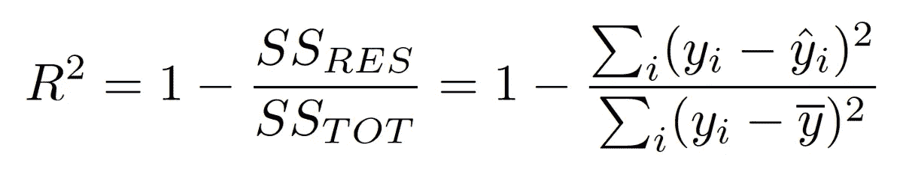
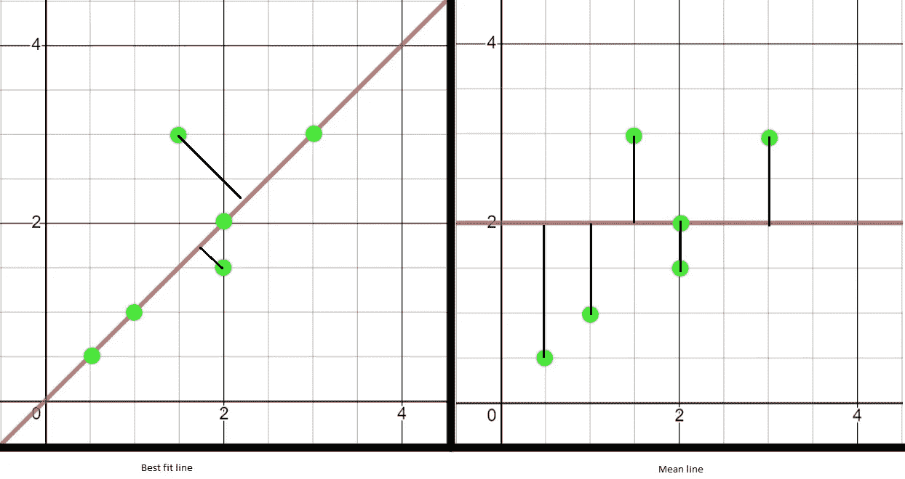
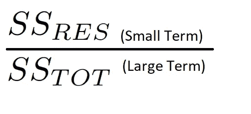

# r 平方:公式解释

> 原文：<https://medium.com/analytics-vidhya/r-squared-formula-explanation-6dc0096ce3ba?source=collection_archive---------9----------------------->

每当我们处理回归模型时，我们一定都见过这些术语。我们都知道定义，我们都知道用法，我们都知道他们的公式但是我们没有想到的是公式是如何工作的。

今天我们要讨论他们的公式，它是什么意思，它是如何工作的，为什么越接近 1 越好。

我们将分解公式，并试图理解每一项如何影响 R 平方的值。

R 平方的公式

最佳拟合线模型和平均线模型

公式中的 SS RES 项在最佳拟合线图中进行了描述。它显示最佳拟合线中实际点和预测点之间距离的平方和。

公式中的 SS TOT 项在均值线图中描述。它显示实际点和中线所有点的平均值之间的距离的平方和。

现在考虑一条最佳拟合线，大多数预测点都在这条线上或更接近这条线，最佳拟合的残差将变小，因此 SS RES 将是小项。与 SS RES 相比，SS TOT 始终是一个大项，因为它代表预测点与平均值(中线)的距离。

从 1 中减去之前

当分子是一个小项，分母是一个大项时，我们会得到一个很小的值，小于 1。当你从 1 中减去这个很小的值，我们得到一个更接近 1 的值。

因此，随着我们的最佳拟合模型的改进，残差将减少，SS RES 将变得更小，R 平方将更接近 1。

## 如果 R 平方为 0 或小于 0

对于这个条件为真，分子(SS RES)必须等于或大于分母(SS TOT ),如果是这种情况，这意味着我们创建的模型比平均线的表现差。

## 最后的想法

判断一个 R 平方模型需要考虑很多因素，其中之一就是。当我们分解各项，分别研究每项的影响时，就很容易理解它的公式了。我们使用了一个简单的线性回归图，其中只有一个因素影响多元线性回归 R 平方失败。