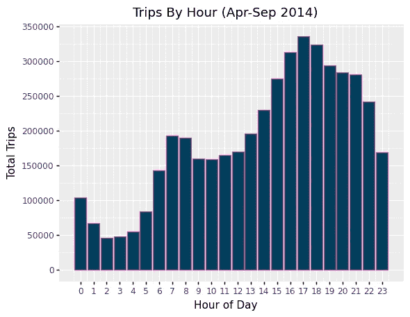
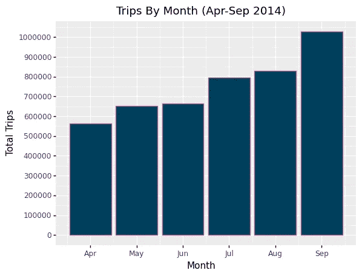

# Python 中的 r 风格可视化

> 原文：<https://medium.com/analytics-vidhya/r-style-visualizations-in-python-560c6bbfb14a?source=collection_archive---------18----------------------->

可视化是快速理解新数据集的好方法。它们使得识别不同列之间的相关性以及识别数据中的信息模式变得更加容易。有几个[可视化库](https://blog.ine.com/python-visualization-libraries-you-should-know-in-2020-and-how-to-use-them)可供 Python 用户使用，比如 matplotlib、seaborn、plotly 和 graphiz。由于 R 和 Python 都常用于数据科学和分析，您可能会发现自己在这两种语言之间徘徊。也许您的组织正在将项目从 R 转换为 Python，或者您是一个 R 用户，加入了一个专门使用 Python 的团队。或者你可能遇到过用 R 做的一些事情，只是想知道它是否可以用 Python 实现。

Ggplot 是 R 中用于数据可视化的常用库。Python 的等价物是 plotnine。本文将探讨如何使用 plotnine 进行基本的可视化，并总结实现的优缺点。这个探索还假设了 Python 及其常用库的基础知识，比如用于数据操作的 [pandas](https://pandas.pydata.org/) 。

# **理解并加载数据**

这一探索基于托管在 [Kaggle](https://www.kaggle.com/fivethirtyeight/uber-pickups-in-new-york-city?select=uber-raw-data-apr14.csv) 上的 2014 年优步数据集。数据中的四列是:

*   `Date/Time`:优步取件的日期和时间
*   `Lat`:优步皮卡的纬度
*   `Lon`:优步皮卡的经度
*   `Base`:隶属于优步皮卡的 TLC(出租车&豪华轿车佣金)基本公司代码

为了演示 plotnine，我们将关注数据/时间列。首先，将数据加载到 pandas 数据框中，并将它们连接成一个数据框。我们还需要将日期/时间列转换为 datetime 数据类型，以便从中提取有用的信息。

下一步是创建几个与时间相关的列和一个行程计数列，以便更容易地按不同的时间单位对数据进行分组。

# **创建可视化效果**

现在是时候创建一些图表了。对于创建的所有地块，需要使用 Pandas groupby 方法对原始数据框进行一些操作。为 ggplot 提供一个仅包含必要列的较小数据框会更干净。

上面代码块的输出如下图所示，它显示了 6 个月期间每天每小时的出行情况。

图表清楚地显示了更多的游乐设施何时完成，从晚上高峰时间开始。易于解释的可视化的酷之处在于它们会导致更多的问题，尤其是在数据探索阶段。第一个图表可能会让你好奇这个信息是否依赖于月份、月份中的某一天、星期几等等。那么我们来看看另一个配置。

九月似乎有更多的旅行，尤其是在晚上，但是在这种格式下有点难以分辨。热图会让我们更容易看到关系。

热图证实了 9 月份傍晚时段的乘车次数较多，这应该会引发超出该数据集范围的进一步调查。

只需稍作修改，上面提供的代码片段就可以用来研究人们感兴趣的任何其他配置。

# **结论**

虽然可以使用更常用的 Python 库来创建这些可视化效果，但在寻求类似 ggplot 的体验时，使用 plotnine 的优缺点如下:

**优点**

1.  plotnine 文档很容易理解和实现。
2.  如果您从 R 进入 Python，或者将 R 转换成 Python，使用 plotnine 可能比尝试在不同的库中做同样的事情更容易。
3.  如果您需要展示您的绘图或与合作者分享发现，plotnine 提供了一种保存方法。

**缺点**

1.  ggplot 中可用的一些功能在 plotnine 中不可用，例如使用 theme_map 创建地图。
2.  对于常见的功能，实现并不总是直接从 R 转换到 Python，所以要准备好花时间钻研 plotnine 文档(但从学习的角度来看，这可以被认为是专业的)。
3.  r 提供了一个数据框操作库(dplyr ),可以在可视化之前轻松地对数据框执行操作。Python 的对等物 dfply 不太直观。不过，对于这个项目中所需的几个步骤，使用 pandas 方法工作得很好。

这个项目的完整实现可以在[这里](https://github.com/ngachago/uber_analysis)找到。