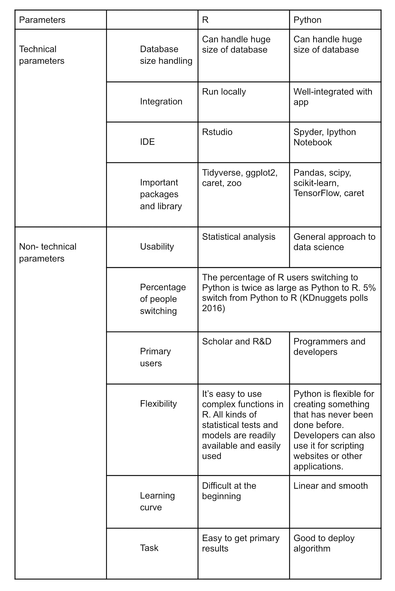

# r 与 python- 10 的区别来选择最适合你的编程语言

> 原文：<https://medium.com/analytics-vidhya/r-vs-python-10-differences-to-choose-the-best-programming-language-for-you-6367d4bf87d?source=collection_archive---------13----------------------->

r vs python——没错，很难选择，就像 c 罗 vs 梅西。关键的一点是，一种语言并不比另一种更好。r 和 python 是两种最常用的开源编程语言。每一种都有自己的优点和缺点。这完全取决于您的用例。

截至 2021 年 7 月，python 在衡量编程语言受欢迎程度的 [TIOBE 指数](https://www.tiobe.com/tiobe-index/)中排名第 3，而 R 排名第 12。

在这篇博客中，我将带你了解它们的主要区别，以及如何选择最适合你的。我们开始吧！

**什么是 Python？**

Python 是一种面向对象的通用编程语言，使用空白来强调代码的可读性。Python 于 1989 年首次发布，从那以后，在 Java 和 c 之前，它在开发人员和程序员中非常流行。

各种 Python 库支持数据科学任务，包括以下名称。

● Numpy:以处理大型数组而闻名

●熊猫:以数据处理和分析闻名

● Matplotlib:构建数据可视化

机器学习在 Python 的帮助下可以很容易的大规模部署。Python 的机器学习和深度学习库包括 TensorFlow、Keras 和 sci-kit-learn 等工具，可帮助数据科学家开发可以轻松与生产系统接口的完美数据模型。

包含数据科学解释、等式、Python 代码和可视化信息的文档可以通过 web 应用程序 Jupyter Notebooks 轻松共享。它很容易使用，因为它是开源的。

现在让我向你们展示 r 的基本原理。

**什么是 R？**

r 可以被定义为开源类的编程语言，它是为数据可视化和统计分析而优化的。它出现于 1992 年，在其丰富的生态系统中有复杂的数据模型，以及主要用于数据报告的优雅工具。

如果你对深度分析感兴趣，那么通过全面的 R 存档网络(CRAN)，你可以使用 13，000 个以上的 R 包。

r 有各种各样的工具和库，让研究人员和数据科学学者非常感兴趣。其中一些提到如下:

1.  数据准备和清理
2.  可视化创建者

RStudio 在评估和训练深度学习算法以及机器学习方面非常有效，借助于集成开发环境(IDE)进行可视化、简化的统计分析和报告。

在 Shiny 的帮助下，你可以在 web 上直接交互式地使用 R 应用。

因此，我们已经奠定了基础。在下一节中，我将分享这些编程语言如何让您受益。

这些编程语言如何让我们受益？

这两种语言都以其独特的方式对我们非常有用。虽然 R 主要用于数据分析或开发统计软件，但 Python 的用途要灵活得多。

Python 可以用来编写任何可编程的东西，甚至是咖啡机，没错，你可以用 Python 编写咖啡机的程序，让你周一喝浓咖啡，周二喝拿铁。另一方面，r 的用途相对有限，但却非常强大。

如果你经营一家大型纺织公司，你想开发一个分析运行趋势的软件，这样你就能更好地了解应该生产什么样的产品，那么 R 是最适合你的语言。

是时候进入真正的游戏了。让我们根据主要参数在一个表格中比较 R 和 python 的主要区别。

你现在可能已经知道了。下一节我为你准备了一些有趣的东西。

**R 和 python 在数据科学中用法的差异**

r 和 Python 有不同的数据科学方法，这是它们的主要区别。它们都是开源编程语言，并不断扩展它们的工具和库:这就是大型社区支持它们的原因。但是 Python 流行于数据争论，R 流行于统计分析。

我们将进入细节。准备好了吗？

● R 与 Python 在数据收集方面的对比

将 SQL 表放入 Python 代码很容易，因为它支持多种数据格式，如 JSON 源代码和逗号分隔值(CSV)。使用 Python 构建数据集很容易，因为它灵活的库让您可以方便地获取数据进行 web 开发。在 R 中，您必须从文本文件、CSV 和 Excel 中导入数据。r 数据框可以很容易地通过把文件建立在 SPSS 或 Minitab 格式。而 Python 可以很容易地从 web 上获取数据。

● R 与 Python 在数据探索方面的对比:

在 Python 的数据分析库的帮助下，可以使用 Pandas 探索数据，并且可以在几秒钟内过滤显示和排序数据。另一方面，R 为数据探索提供了许多不同的选择，并优化了大型数据集的统计分析。

● R 与 Python 的数据建模

用 Python 进行数据建模是一件容易的工作，因为它有标准的库，如用于计算和科学计算的 SciPy，用于数值建模分析的 Numpy:和用于机器学习算法的 sci-kit learn。如果您想使用 R 进行特定的建模分析，您将不得不使用 R 的核心功能中没有的包。

● R 与 Python 在数据可视化方面的对比:

对于基本图表和图形的生成，可以在 Python 中使用 Matplotlib 库，因为可视化不是它的强项。为了获得更多信息，可以在 Python 中使用 Seaborn 库。但是，R 的基本图形模块可以帮助您创建图表和统计分析的基本图表。

● R 与 Python 在数据操作方面的对比

可以从几个库中检索数据操作方法。dplyr(tidy verse 包的库部分)或集成数据框可以在 R 中用于数据聚合。然而，Python 只有一个库，Pandas，用于执行数据操作。

为什么我在结束这篇文章的时候没有带你去逛逛 R 和 python 结合在一起是如何帮助我们的呢？

**如何通过结合 R 和 python 来发挥最佳效果？**

r 和 Python 都是很棒的语言，但是你知道什么是很棒的东西吗？当你把它们放在一起时，它们变得更伟大。

使用 R 和 Python 进行开发给我们带来了大量的可能性。这可以通过将 R 在处理统计数据方面的强大功能与 Python 的灵活性结合起来实现。

这可以在某些库的帮助下完成，如 PypeR、pyReserve 或 rpy2，它们是在 python 程序中实现 R 脚本的 Python 库，也有 R 的库，工作方式正好相反，如 rPython、SnakeCharmR 等。

这有助于我们创建高效的程序并解决可能出现的问题，同时也带来了更大的灵活性。

关于 R vs Python 大战就是这样。现在你确切地知道哪一个适合你。谈到可用性，两者各有利弊。分析你的背景，并明智地利用它们！