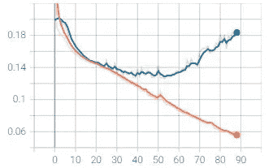

# 雨林物种音频检测-自我案例研究

> 原文：<https://medium.com/analytics-vidhya/rainforest-species-audio-detection-a-self-case-study-aef5260ce496?source=collection_archive---------6----------------------->

[https://wildfor.life/collaborator/rainforest-connection](https://wildfor.life/collaborator/rainforest-connection)

# 目录:

商业问题

数据集的来源

关于使用的数据集和指标

解决方案方法概述

探索性数据分析

数据预处理和特征工程

系统模型化

结果

部署

源代码

未来的工作

参考

# 业务问题:

大多数时候，声音比环顾一大片森林来观察某些物种并采取适当的行动更容易识别和接近。在这个案例研究中，给定来自热带雨林的音频记录，我们将检测并分类某些物种的声音。并不是每个人都是仅仅通过听觉来对不同物种的声音进行分类的专家。这就是需要自动语音检测的地方，它可以帮助森林中或某些危险区域中的人在需要时采取适当的行动。这也有助于发现人类对生态系统的某些影响，并有助于保护环境。

我们可以用有限但声学上复杂的数据创建 ML/DL 模型来自动检测物种，以帮助每个不是该领域专家的人。我们将这个问题映射为多标签分类问题。这里我们必须检测每个物种在给定音频文件中出现的概率。

# 数据来源:

这个数据集是由雨林连接(RFCx)提供的，它存在于 Kaggle 中，可以从下面的链接下载。

 [## 雨林连接物种音频检测

### 自动检测热带声景中的鸟类和青蛙种类

www.kaggle.com](https://www.kaggle.com/c/rfcx-species-audio-detection/data) 

# 关于数据集:

**train_tp.csv** —真阳性物种标签的训练数据，对应时间定位

**train _ FP . CSV**——假阳性物种标签的训练数据，带有相应的时间定位

**训练/** —训练音频文件

**/**—测试音频文件；任务是预测在每个音频文件中发现的物种

train_tp.csv 和 train_fp.csv 的列

*   recording_id —记录的唯一标识符
*   物种 id —物种的唯一标识符
*   歌曲类型 id —歌曲类型的唯一标识符
*   t_min —注释信号的开始秒
*   f _ min——注释信号的较低频率
*   t_max —注释信号的结束秒
*   f_max-注释信号的上限频率
*   is _ TP-[仅 tfrecords 指示标签是来自 train_tp (1)还是 train_fp (0)文件。

**tfrecords/{train，test }**-TF record 格式的比赛数据，包括 recording_id、audio_wav(以 16 位 PCM 格式编码)和 label_info(仅用于 train)，label _ info 提供了以-分隔的下列字符串(减去 recording_id)，其中 recording_id 的多个标签是；-分隔。

本案例研究中使用的指标是标签平均排名精度。它是分配给每个样本的每个基本事实标签与总分数较低的标签之比的平均值。这种度量通常用于多标签分类问题。如果您能够给与每个样本相关联的标签更好的排名，则性能度量将会更高。

# 解决方案方法概述:

在这个案例研究中，我采用了两种不同特征的迁移学习方法，然后建立了一个模型集合，最后取类预测的平均值。

对于集合中的 CNN 部分，我使用 Mel-spectrogram 作为特征，将它们转换为 RGB 图像，执行数据扩充，并使用迁移学习训练 3 个独立的 CNN 模型。对于模型的 LSTM 部分，我使用了 google 提供的预训练 Yamnet 模型，该模型是在大型音频语料库上训练的。它产生音频嵌入，然后可以用作训练 LSTM 模型的特征。

最后，我取了所有模型的预测值，取了预测值的平均值，得到了最终结果。

# 探索性数据分析:

EDA 是任何数据科学项目中非常关键的一步。它有助于更好地理解我们的数据，探索我们数据中的各种模式，并发现变量之间有趣的关系。这反过来帮助我们设计更好的功能并获得更好的结果。

我们有真阳性和假阳性标记数据。在本案例研究中，我们仅使用了真正的阳性标记数据。

**检查空值:**

我们的数据中没有任何空值。

**分类标签分配**

我们在第 23 课有最大阅读量，在第 10 课有最小阅读量。其余的课程分布相当均匀。

现在让我们检查一下每个文件中存在的物种数量是多少。

我们的训练数据中用于真阳性标记的大多数记录只有 1 个种类。

现在我们将检查 t_min 和 t_max 的分布。t_min 表示注释信号的开始，t_max 表示注释信号的结束。

观察-

1.  对于大多数记录，注释信号的开始位于第 50-55 秒，随后是第 0-5 秒。
2.  对于大多数记录，注释信号的结束位于第 55-60 秒，随后是第 50-55 秒。
3.  我们还可以从这些图中推断出我们的记录持续时间为 1 分钟。

让我们检查分布 f_min 和 f_max。f_min 表示带注释信号的较低频率，f_max 表示带注释信号的较高频率。

观察结果:

1.对于大多数记录，标注信号的较低频率位于 0–800Hz 之间。

2.对于大多数记录，注释信号的上限频率在 4.2 KHz 到 5KHz 之间。

现在我们将检查类标签和 f_min，f_max 之间的关系。

观察结果:

1.  基于 f_min 值，很少有类可以被分离。

2.如果 f_min 位于 5.5 KHz 到 5.8 KHz 之间，则该物种属于 0 类。

3.如果 f_min 大于 10 KHz，则该物种属于第 22 类

4.如果 f_min 在 6 KHz 到 7.8 KHz 之间，则该物种属于第 23 类。

5.如果 f_min 位于 4.8 KHz 到 5.6 Khz 之间，则该物种属于类别 5。

6.13 级和 15 级在较低频率的基础上是不可分的。

7.大多数种类的低频范围很窄。

1.  根据 f_max 值，很少有类可以被分开。

2.第二类和第三类很容易分开。

3.第 14 类和第 17 类的值范围很广，可能包含一些异常值。

4.如果 f_max 大于 12 KHz，则数据属于类别 22。

# 数据预处理和特征工程；

当我们构建模型集合时，我们将把我们的方法分成两部分。第一部分是将原始音频信号转换成 mel 光谱图，然后再转换成 RGB 图像。然后我们将在这些图像上训练单独的 CNN 模型。

该方法的第二部分将是将原始音频信号转换为音频嵌入，该音频嵌入将由 tensorflow hub 中可用的 Yamnet 模型生成。该嵌入将作为特征传递给 LSTM 模型。

我们先来了解一下什么是 mel 谱图。频谱图是一种直观的方式，表示在特定波形中出现的频率下信号强度或响度随时间的变化。我们可以从光谱图推断不同频率的能量是多还是少，以及能量如何随时间变化。现在我们知道了什么是声谱图，让我们进一步了解梅尔标度和梅尔声谱图。

研究表明，人类不会在线性尺度上感知频率。例如，我们很容易区分 500KHz 和 1000 KHz，但我们很难区分 10000 KHz 和 10500 KHz，即使它们之间的距离相同。因此，有人提出了一种音高单位，使得音高距离相等时，听者听起来距离相等。这就是所谓的梅尔标度。从赫兹标度到梅尔标度的转换如下:

mel 声谱图以 Mel 标度显示声音。

现在我们已经了解了什么是 mel 光谱图，让我们看看将原始音频信号转换为 mel 光谱图，然后转换为 RGB 图像的代码。

我们将把数据分成训练集和验证集，并在训练数据集上应用图像增强。

现在调用这些函数并准备数据管道来训练 CNN 模型。

现在我们将转向我们的嵌入特性。在此之前让我们了解一下 Yamnet。

YAMNet(又一个移动网络)是由 Dan Ellis 在 AudioSet 数据集上训练的预训练神经网络模型，该数据集包含来自超过 200 万个 youtube 视频的标记数据。它采用移动 V1 深度方向可分离卷积结构。它采用音频形式作为输入，并对 521 个音频事件进行独立预测。它返回概率得分、嵌入和频谱图作为输出。该模型接受包含任意长度波形的 1-D float32 张量或 NumPy 数组，表示为范围`[-1.0, +1.0]`内的单通道(单声道)16 kHz 样本。我们将使用 YAMNet 生成的这个嵌入作为我们的 LSTM 模型的特性。

请参考下面的链接，了解更多关于 YAMNet 的信息，以及如何将其用于迁移学习。

 [## 环境声音分类的 YAMNet 迁移学习

### YAMNet 是一个预先训练好的深度神经网络，可以预测来自 521 个类别的音频事件，如笑声、犬吠声…

www.tensorflow.org](https://www.tensorflow.org/tutorials/audio/transfer_learning_audio) 

现在让我们看看将原始音频转换成嵌入内容的代码。

# 建模:

让我们也定义一下我们的度量标准。

对于 CNN 模型，我使用了 Sigmoid 焦点交叉熵损失和优化器作为修正的 Adam。

sigmoid 焦交叉熵损失基于分类误差来衡量每个样本对损失的贡献。这背后的想法是减少正确分类的样本的贡献，并且更多地关注难以分类的样本。与正确分类的样本相比，被分类器错误分类的样本的损失值将高得多。此损失函数在 tensorflow 附加模块中可用。请参考下面的链接了解更多关于 sigmoid 焦交叉熵损失。

 [## 了解分类交叉熵损失，二元交叉熵损失，软最大损失，逻辑…

### 人们喜欢用很酷的名字，这些名字常常让人迷惑。当我开始玩 CNN 超越单一标签…

gombru.github.io](https://gombru.github.io/2018/05/23/cross_entropy_loss/) 

现在让我们开始定义我们的架构。我尝试了各种型号的组合，但 EfficientNetB2、EfficientNetB3 和 DenseNet121 的组合效果很好。我已经使用了 imagenet 权重，并在最后添加了几层。

效率网络 b

B3 效率网

DenseNet 121

在对模型个体进行训练后，损失和指标公布如下:

【DenseNet121 的损失图:

【DenseNet121 的公制图:

**效率损失图 B2:**

**效率的度量图 B2:**

**效率网络的损失图 B3:**

**效率网络的度量图 B3:**

现在让我们继续构建嵌入 YAMNet 的 LSTM 模型。我们在这里使用了二元交叉熵损失和 Adam 作为优化器。

**LSTM 模型的损失图:**

**LSTM 模型的度量图:**

从上面的图中我们可以看出，我们的单个模型倾向于过度拟合。这可能是由于我们真正的阳性标记数据非常少的原因。因此，我们将在集合方法中使用它们，最终减少过度拟合并更好地概括。

现在，让我们建立我们的集合，对训练集和验证集进行预测。

# 结果:

# 部署:

我们的集合模型表现最好。我们现在将部署我们的集合方法。我已经使用 streamlit 将模型部署为 webapp。下面是使用 streamlit 框架将模型部署为简单 webapp 的代码。app.py 文件分为 3 个主要功能。load_files 函数加载包含模型架构和权重文件的 json 文件。

数据预处理功能将文件索引作为输入，并从 yamnet 创建谱图图像、嵌入。最后，它返回图像和嵌入。

最后，预测函数将 id 作为输入。它调用加载文件和 data_preprocess 函数。然后，它运行预测并返回前三个预测标签和预测所用的时间。

webapp 将文件的索引作为用户输入，并输出前三个预测物种和预测所用的时间。由于模型的计算量很大，在 CPU 资源上运行时，预测物种需要更多的时间。请参考演示视频，看看最终结果。

# 源代码:

项目源代码请参考下面提到的 github 资源库。

 [## GitHub-vdhar 1992/雨林 _ 物种 _ 音频 _ 检测

### 在 GitHub 上创建一个帐户，为 vdhar 1992/rain forest _ species _ audio _ detection 开发做贡献。

github.com](https://github.com/vdhar1992/Rainforest_species_audio_detection) 

# 未来工作:

交叉验证可用于减少单个模型的过度拟合。

也可以使用基于注意力的模型。

我们只使用了真正的正面数据，只有 1216 个样本。很少的数据使单个模型过度拟合。我们也可以使用假阳性数据，重新标记它们，并在训练数据之外使用它们。

# 参考资料:

[1。https://www . tensor flow . org/tutorials/audio/transfer _ learning _ audio # load _ the _ audio _ files _ and _ retrieve _ embeddings](https://www.tensorflow.org/tutorials/audio/transfer_learning_audio#load_the_audio_files_and_retrieve_embeddings)

[2。https://github . com/cerlymarco/MEDIUM _ NoteBook/blob/master/neural net _ Ensemble/neural net _ Ensemble . ipynb](https://github.com/cerlymarco/MEDIUM_NoteBook/blob/master/NeuralNet_Ensemble/NeuralNet_Ensemble.ipynb)

[3。https://arxiv.org/abs/1608.04363](https://arxiv.org/abs/1608.04363)

[4。https://www.appliedaicourse.com/](https://www.appliedaicourse.com/)