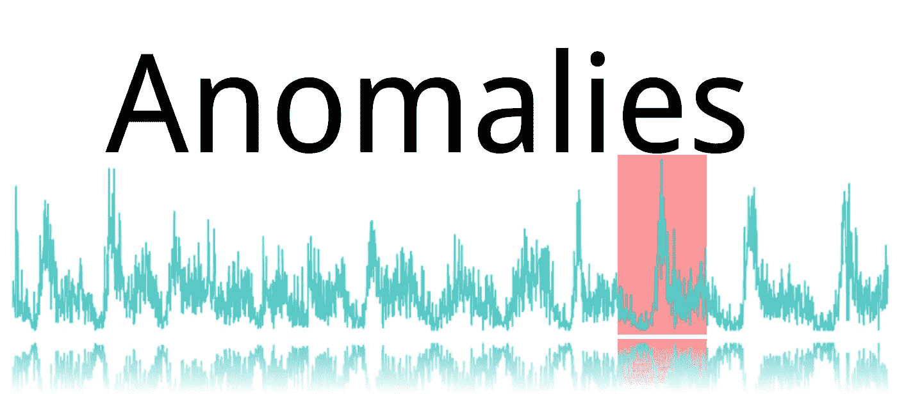
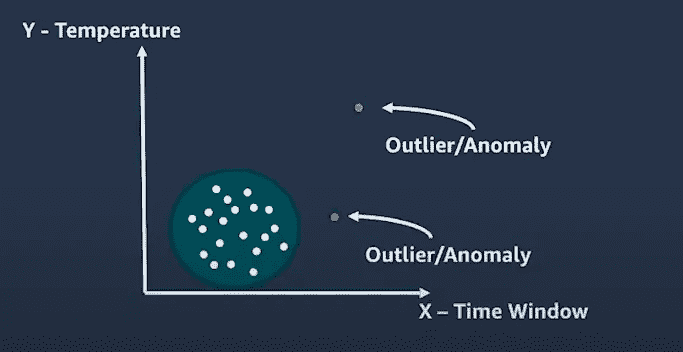
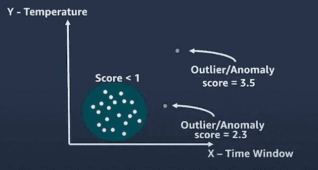
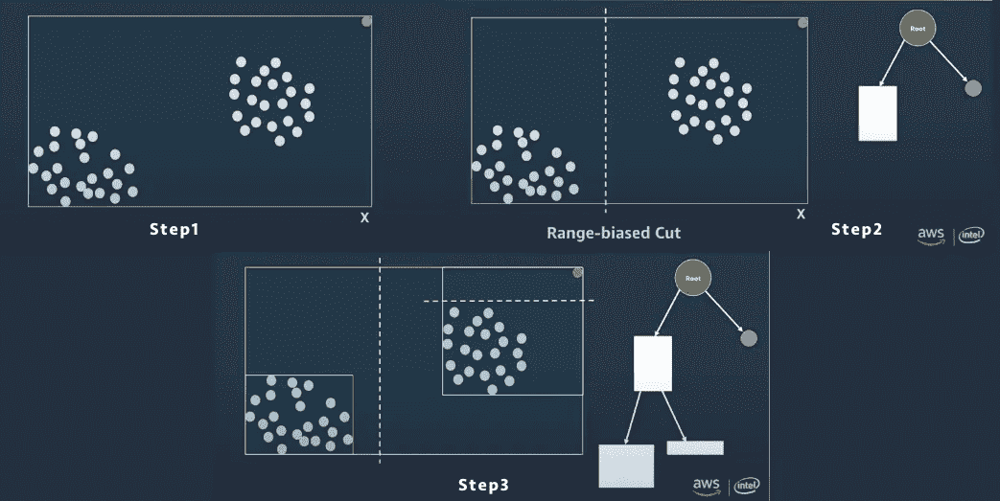

# 随机采伐森林

> 原文：<https://medium.com/analytics-vidhya/random-cut-forest-321aae4d8a59?source=collection_archive---------3----------------------->

关于这个无监督的机器学习算法你应该知道的事情。

威尔·梅尔斯在 [Unsplash](https://unsplash.com?utm_source=medium&utm_medium=referral) 上拍照

我猜如果你正在寻找这个算法，那么你一定已经开始在 AWS Sagemaker 上工作了。这是一种异常检测算法，我们可以将它作为内置算法与 Sagemaker 一起使用。

异常是偏离其他标准分布数据的观察结果。

## Sagemaker 的无监督内置算法

AWS Sagemaker 的几个算法。

*   [K-Means 算法](https://docs.aws.amazon.com/sagemaker/latest/dg/k-means.html)
*   [主成分分析算法](https://docs.aws.amazon.com/sagemaker/latest/dg/pca.html)
*   [随机砍伐森林(RCF)算法](https://docs.aws.amazon.com/sagemaker/latest/dg/randomcutforest.html)
*   [知识产权洞察](https://docs.aws.amazon.com/sagemaker/latest/dg/ip-insights.html)

## [**随机砍伐森林**](https://d1.awsstatic.com/whitepapers/kinesis-anomaly-detection-on-streaming-data.pdf)**【RCF】算法**

RCF 检测数据集内偏离其他结构良好或模式化数据的异常数据点。

## 它是如何工作的

该算法采用一组随机数据点，将它们切割成相同数量的点，并创建树。如果我们将所有的树结合起来，就会创建一个数据点的森林，以确定某个特定的数据点是否异常。

例子

用亚马逊 SageMaker 检测你的数据中的异常

在这张图片中，我们在这个 2D 中有这些数据点。该算法将根据其位置给出一个分数。所以橙色的点会得到更多的分数。

在这个圆圈内，每个数据点的分数将小于异常值。正如你在下图中看到的。

用亚马逊 SageMaker 检测你数据中的异常(等级 300)

这 3.5 的高值说明数据存在异常。分数取决于偏差本身。

为了将任何数据点视为异常值，我们可以假设与标准偏差大于 3 的数据点可能是异常值。

## **它如何计算这些分数**

[用亚马逊 SageMaker](https://www.youtube.com/watch?v=yx1vf3uapX8&t=377s&ab_channel=AmazonWebServices) 检测你数据中的异常(等级 300)

对于这个例子，我们可以考虑一个简单的例子，因为在 2D 平面上有数据点，并且大多数数据都在聚类中，其中一个异常值被绘制为橙色。

[用亚马逊 SageMaker](https://www.youtube.com/watch?v=yx1vf3uapX8&t=377s&ab_channel=AmazonWebServices) (等级 300)检测你数据中的异常

1.  第一步将通过获取每个维度的最小值和最大值来创建数据的边界框。
2.  我们选择其中一个维度，并在该维度的任意范围内随机切割。在本例中，我们垂直切入，即 x 轴。
3.  再次为左侧和右侧创建边界框。
4.  在每个新的边界框处随机剪切它。
5.  最后但并非最不重要的是，如果有任何点靠近树根，它们将被切割并变得孤立，这些点越靠近树根，得分越高。

这将一直进行到树中的每个点都被完全隔离。

# 现在怎么办？

这边请..你现在明白随机砍伐森林是怎么运作的了。在下一篇博客中，我们将通过代码示例来仔细观察 RCF。

感谢阅读。

如果你喜欢这篇文章，请一定要鼓掌。请关注我的 Github 和我的 medium 个人资料上的更多项目和文章。

 [## tapanKumarPatro -概述

### Arctic Code Vault 贡献者来自 greensdata/成为数据科学家的 10 个步骤📢准备学习或复习…

github.com](https://github.com/tapanKumarPatro)  [## Tapan Kumar Patro -中等

### 这就像占星家用历史数据预测未来一样简单。伙计们，我是塔潘。在…

medium.com](/@tapankumarpatro05) 

不要忘记查看 Android 应用程序开发深度学习项目的端到端部署。

 [## 基于深度学习的端到端 app。

### 聪明烹饪

medium.com](/analytics-vidhya/end-to-end-deep-learning-based-app-af67d4008550) 

谢了。如有任何疑问，请留言。