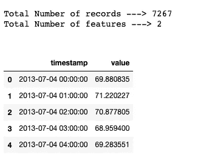
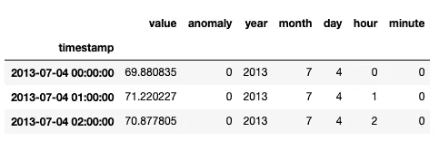
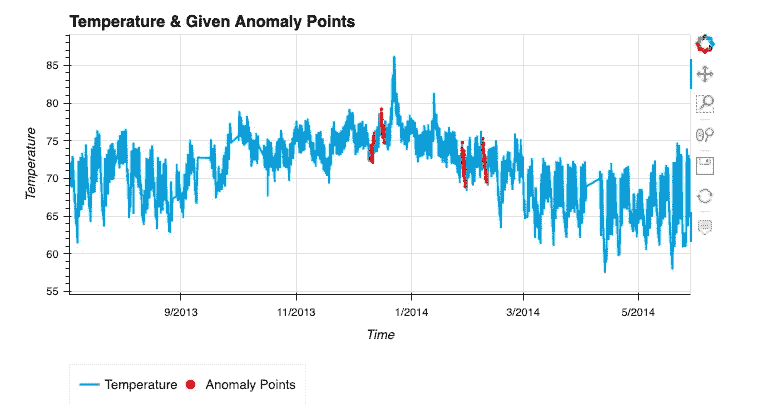
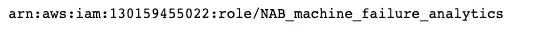
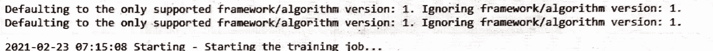
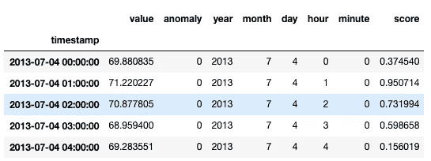
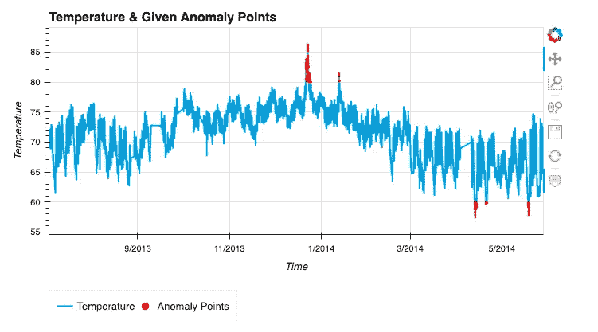

# 随机采伐森林示例

> 原文：<https://medium.com/analytics-vidhya/random-cut-forest-with-example-84ad62453361?source=collection_archive---------5----------------------->

[代码为](https://sagemaker-examples.readthedocs.io/en/latest/introduction_to_amazon_algorithms/random_cut_forest/random_cut_forest.html)的乱砍森林，你要提防什么。

这是我之前的故事的延续，在那里我必须解释随机采伐森林的理论。


照片由[詹姆斯·哈里逊](https://unsplash.com/@jstrippa?utm_source=medium&utm_medium=referral)在 [Unsplash](https://unsplash.com?utm_source=medium&utm_medium=referral) 上拍摄

嘿，伙计们，我们已经知道 RCF 是如何工作的，让我们直接进入编码。我可以保证这将是迄今为止你面对任何异常检测代码时最简单的方法。

简单地说，基于我们的数据点，RCF 模型会分配分数，并基于该分数来决定异常情况。

首先，我不会直接举 AWS 提供纽约出租车数据的例子，而是使用[这里](https://github.com/numenta/NAB/blob/master/data/realKnownCause/ambient_temperature_system_failure.csv)的机器故障数据。

## 密码

让我们导入所有必需的库

```
## Importing all necessary Libs that will be required
import pandas as pd
import numpy as np
import os
import warnings
import pickle
import matplotlib.pyplot as plt
import boto3
# import sagemaker
import sys
import seaborn as sns
import holoviews as hv
from holoviews import opts
hv.extension('bokeh')
```

也将增加一些更好的视图选项

```
warnings.simplefilter('ignore')
pd.set_option('display.max_columns', None)
pd.set_option('display.max_rows', None)sns.set_style('white')
sns.set_palette('pastel',8)seed=345
np.random.seed(seed)
```

加载数据:

```
## Loading Data
df = pd.read_csv("./data/nab_machine_failure.csv")
print("")
# print("Data columns ---> {}".format(list(fulldata.columns)))
# fulldata = df
print("Total Number of records ---> {}".format(df.shape[0]))
print("Total Number of features ---> {}".format(df.shape[1]))
print("")
df.head()
```



```
anomaly_points = [
        ["2013-12-10 06:25:00.000000","2013-12-12 05:35:00.000000"],
        ["2013-12-15 17:50:00.000000","2013-12-17 17:00:00.000000"],
        ["2014-01-27 14:20:00.000000","2014-01-29 13:30:00.000000"],
        ["2014-02-07 14:55:00.000000","2014-02-09 14:05:00.000000"]
]df['timestamp'] = pd.to_datetime(df['timestamp'])
#is anomaly? : True => 1, False => 0
df['anomaly'] = 0
for start, end in anomaly_points:
    df.loc[((df['timestamp'] >= start) & (df['timestamp'] <= end)), 'anomaly'] = 1df['year'] = df['timestamp'].apply(lambda x : x.year)
df['month'] = df['timestamp'].apply(lambda x : x.month)
df['day'] = df['timestamp'].apply(lambda x : x.day)
df['hour'] = df['timestamp'].apply(lambda x : x.hour)
df['minute'] = df['timestamp'].apply(lambda x : x.minute)
```

修改了数据框，增加了一些功能，将完整的日期时间戳转换为单独的功能。让我们看看它们是如何形成的。

```
df.index = df['timestamp']
df.drop(['timestamp'], axis=1, inplace=True)
df.head(3)
```



我们将看到一个异常点的例子。因为我们已经明确给出了基于 anomly _ point 的异常点。所以为了形象化，我使用了孔视图，它们很棒，有时会在上面写一个故事。

```
anomalies = [[ind, value] for ind, value in zip(df[df['anomaly']==1].index, df.loc[df['anomaly']==1,'value'])]
(hv.Curve(df['value'], label="Temperature") * hv.Points(anomalies, label="Anomaly Points").opts(color='red', legend_position='bottom', size=2, title="Temperature & Given Anomaly Points"))\
    .opts(opts.Curve(xlabel="Time", ylabel="Temperature", width=700, height=400,tools=['hover'],show_grid=True))
```



现在对于主事件，如何将 RCF 应用于此，并将得到我们所有的异常。让我们从再次导入一些 imp 库开始，以便使用随机切割森林。由于 RCF 是 AWS 创建的模型，我们必须加载 Sagemaker、boto3 等。

```
from sagemaker import RandomCutForest
import boto3
import botocare
import sagemaker
import sys
```

定义角色:

```
iam = boto3.client('iam')
role = iam.get_role(RoleName='NAB_machine_failure_analytics')['Role']['Arn']
print(role)
```



准备好培训评估员角色:

```
# Training
rcf = RandomCutForest(
    role=role,
    instance_count=1,
    instance_type='ml.m4.xlarge'
    output_path='s3://data/output_rcf',
    num_sample_per_tree=512,
    num_trees=50
)# automatically upload the training data to s3 and run the training job
rcf.fit(rcf.record_set(data['value'].to_numpy().reshape(-1,1)))
```



如果你看到这样的东西，这意味着你的训练开始了。确保您在培训结束时也能收到培训完成的消息。

为了预测数据，我们必须推断它，这意味着我们必须部署它。我们有一个部署好的方法来创建推论。

```
rcf_interference = rcf.deploy(initial_instance_count=1, ins)
```

然后，我们必须对其进行序列化，以便将分数添加到主数据框中。然后你会得到一个这样的数据帧。

```
from sagemaker.serializers import CSVSerializer
from sagemaker.deserializers import JSONDeserializerrcf_inference.serializer = CSVSerializer()
rcf_inference.deserializer = JSONDeserializer()machine_data_numpy = data.value.to_numpy().reshape(-1, 1)
print(machine_data_numpy[:6])
results = rcf_inference.predict(
    machine_data_numpy[:6], initial_args={"ContentType": "text/csv", "Accept": "application/json"}
)results = rcf_inference.predict(machine_data_numpy)
scores = [datum["score"] for datum in results["scores"]]# add scores to taxi data frame and print first few values
data["score"] = pd.Series(scores, index=data.index)
data.head()
```



让我们看看分数向我们展示了什么异常。



如您所见，这是一种非常简单的异常检测方法。

谢谢你们阅读这篇文章。如有任何疑问，请发表评论。

# 现在怎么办？

这边请..你现在编码随机砍伐森林。下一篇博客将探讨其他 AWS 模型。然后我们会仔细观察全息视图。

感谢阅读。


如果你喜欢这篇文章，请一定要鼓掌。请关注我的 Github 和我的 medium 个人资料上的更多项目和文章。

[](https://github.com/tapanKumarPatro) [## tapanKumarPatro -概述

### Arctic Code Vault 贡献者来自 greensdata/成为数据科学家的 10 个步骤📢准备学习或复习…

github.com](https://github.com/tapanKumarPatro) [](https://tapanpatro.medium.com/) [## Tapan Kumar Patro -中等

### 关于这个无监督的机器学习算法你应该知道的事情。我猜如果你在找这个…

tapanpatro.medium.com](https://tapanpatro.medium.com/) 

不要忘了用 Android 应用程序开发来检查深度学习项目的端到端部署。

[](/analytics-vidhya/end-to-end-deep-learning-based-app-af67d4008550) [## 基于深度学习的端到端 app。

### 聪明烹饪

medium.com](/analytics-vidhya/end-to-end-deep-learning-based-app-af67d4008550) 

谢了。如有任何疑问，请留言。