# 随机森林

> 原文：<https://medium.com/analytics-vidhya/random-forest-4a2981aab4f7?source=collection_archive---------11----------------------->

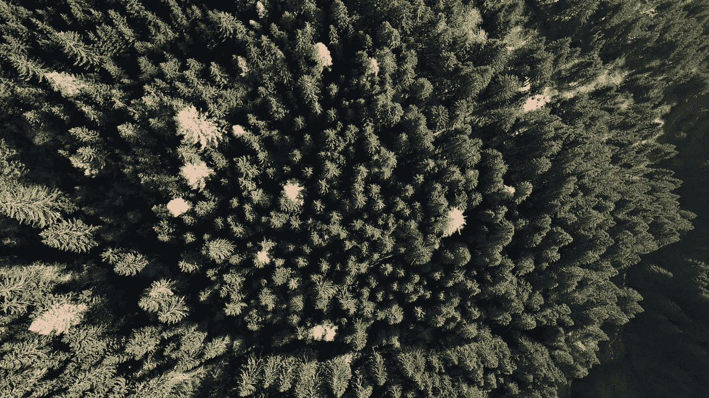

**随机森林**是一种流行的机器学习算法，属于监督学习技术。它可用于 ML 中的分类和回归问题。它基于集成学习的概念，集成学习是一个组合多个分类器来解决复杂问题并提高模型性能的过程。

顾名思义，“ ***随机森林是一种分类器，它包含了给定数据集的各个子集上的若干决策树，并取平均值以提高该数据集的预测精度。*** “随机森林不是依赖于一棵决策树，而是从每棵树中提取预测，并基于预测的多数票，它预测最终的输出。

森林中的树的数量越多，精度越高，并且防止了过度拟合的问题。

下图解释了随机森林算法的工作原理:

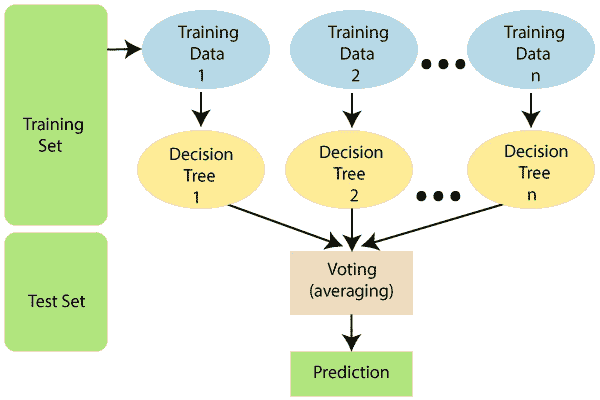

**例子**

假设有一个包含多个水果图像的数据集。因此，这个数据集被提供给随机森林分类器。数据集被分成子集，并提供给每个决策树。在训练阶段，每个决策树产生一个预测结果，当一个新的数据点出现时，随机森林分类器根据大多数结果预测最终的决策。考虑下图:

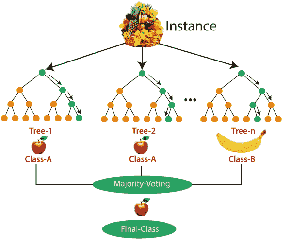

**随机森林的假设**

由于随机森林组合了多个树来预测数据集的类别，因此一些决策树可能会预测正确的输出，而另一些则可能不会。但是所有的树一起预测正确的输出。因此，下面是对更好的随机森林分类器的两个假设:

*   数据集的特征变量中应该有一些实际值，以便分类器可以预测准确的结果，而不是猜测的结果。
*   来自每棵树的预测必须具有非常低的相关性。

**Python 实现**

```
**from** sklearn.ensemble **import** RandomForestClassifierrndmFrst = RandomForestClassifier(criterion= 'entropy',
 **max_depth** = 12,
 **max_features** = 'log2',
 **min_samples_leaf** = 1,
 **min_samples_split**= 5,
 **n_estimators** = 90,random_state=6)
```

**随机森林分类器的超参数**

> RandomForestClassifier(n _ estimators = 100，*，criterion='gini '，max_depth=None，min_samples_split=2，min_samples_leaf=1，min_weight_fraction_leaf=0.0，max_features='auto '，max_leaf_nodes=None，min _ infinity _ decrease = 0.0，min _ infinity _ split = None，bootstrap=True，oob_score=False，n_jobs=None，random_state=None，verbose=0，warm_start=False，class_weight=None

*   **n_estimators: int，default=100** —森林中树木的数量。
*   **标准:{"gini "，" entropy"}，default="gini"** —支持的标准是基尼杂质的" gini "和信息增益的" entropy "。
*   **max_depth : int，default=None —** 树的最大深度。
*   **min_samples_split : int 或 float，default=2 —** 拆分内部节点所需的最小样本数
*   **min_samples_leaf : int 或 float，default=1 —** 叶节点所需的最小样本数。
*   **min _ weight _ fraction _ leaf:float，default=0.0 —** (所有输入样本的)权重总和在叶节点上所需的最小加权分数。
*   **max_leaf_nodes : int，default=None —** 用`max_leaf_nodes`以最佳优先方式生长树。最佳节点被定义为杂质的相对减少。如果没有，则无限数量的叶节点。
*   **min _ infinity _ decrease:float，default=0.0 —** 如果分割导致杂质减少大于或等于该值，则将分割节点。
*   **min _ infinity _ split:float，default=None —** 提前停止树生长的阈值。如果一个节点的杂质高于阈值，它就会分裂，否则它就是一片叶子。
*   **bootstrap : bool，default=True —** 构建树时是否使用 bootstrap 样本。如果为 False，则使用整个数据集来构建每棵树。
*   **n_jobs : int，default=None —** 并行运行的作业数。`-1`表示使用所有处理器
*   **random_state: int，RandomState instance or None，default=None —** 控制构建树时使用的样本自举的随机性(如果`bootstrap=True`)和在每个节点寻找最佳分割时考虑的特征采样(如果`max_features < n_features`)
*   **max_samples : int 或 float，default=None —** 如果 bootstrap 为真，则从 X 中抽取的用于训练每个基本估计量的样本数。

尝试使用 wine 数据集实现

**导入库**

```
**import** pandas as pd
from sklearn.tree **import** DecisionTreeClassifier, export_graphviz
from sklearn.ensemble **import** RandomForestClassifier
from sklearn **import** tree
from sklearn.model_selection **import** train_test_split,GridSearchCV
from sklearn.preprocessing **import** StandardScaler
from sklearn.metrics **import** accuracy_score, confusion_matrix, roc_curve, roc_auc_score
from sklearn.externals.six **import** StringIO  
from IPython.display **import** Image  
from sklearn.tree **import** export_graphviz
**import** pydotplus
```

**读取数据**

```
**data** = pd.read_csv("winequality_red.csv")
**data**
```

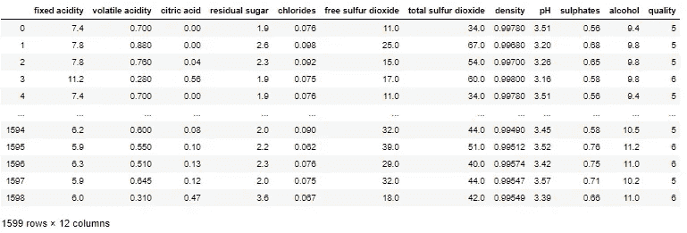

葡萄酒数据集

**指定因变量&自变量**

```
X = data.drop(columns = 'quality')
y = data['quality']
```

**将数据分割成训练并测试**

```
**x_train**,x_test,y_train,y_test = train_test_split(X,y,test_size = 0.30, random_state= 355)
```

**初始化随机森林分类器模型**

```
rand_clf = RandomForestClassifier(random_state=6)rand_clf.fit(x_train,y_train)rand_clf.score(x_test,y_test)
```

0.64375

模型的准确率 64%。我们需要通过调整超参数来调整该模型，以获得该模型的最佳拟合参数。让我们来看看细节。

应用如下的超参数，

```
grid_param = {
    "n_estimators" : [90,100,115,130],
    'criterion': ['gini', 'entropy'],
    'max_depth' : **range**(2,20,1),
    'min_samples_leaf' : **range**(1,10,1),
    'min_samples_split': **range**(2,10,1),
    'max_features' : ['auto','log2']
}
```

使用 GridsearchCV 的下一步是执行超参数调整的过程，以便确定给定模型的最佳值。GridSearchCV 是 Scikit-learn(或 SK-learn)的 model_selection 包中的一个函数

```
sklearn.model_selection.GridSearchCV(estimator, param_grid,scoring=None,
          n_jobs=None, iid='deprecated', refit=True, cv=None, verbose=0, 
          pre_dispatch='2*n_jobs', error_score=nan, return_train_score=False)
```

1.estimator:传递您想要检查超参数的模型实例。

2.params_grid:保存想要尝试的超参数的字典对象

3.评分:您想要使用的评估指标，您可以简单地传递一个有效的字符串/评估指标的对象

4.cv:对于每一组选定的超参数，您必须尝试的交叉验证的次数

5.verbose:在将数据放入 GridSearchCV 时，可以将它设置为 1 以获得详细的打印结果

6.n_jobs:您希望为该任务并行运行的进程数，如果为-1，将使用所有可用的处理器。

让我们尝试将随机森林分类器应用到 GridSearchCV 中。

```
**grid_search** = GridSearchCV(estimator=rand_clf,param_grid=grid_param,cv=5,n_jobs =-1,verbose = 3)grid_search.fit(x_train,y_train)**grid_search**.best_params_**{'criterion': 'entropy',
 'max_depth': 12,
 'max_features': 'log2',
 'min_samples_leaf': 1,
 'min_samples_split': 5,
 'n_estimators': 90}**
```

上述参数是该模型的最佳参数。我们需要将这些参数应用于随机森林分类器，并验证其准确性。

```
rand_clf = RandomForestClassifier(criterion= 'entropy',
 max_depth = 12,
 max_features = 'log2',
 min_samples_leaf = 1,
 min_samples_split= 5,
 n_estimators = 90,random_state=6)rand_clf.fit(x_train,y_train)rand_clf.score(x_test,y_test)
```

0.6604166666666667

太好了！在使用 GridsearchCV 的最佳参数后，我们的准确度提高了 2%。

**集成学习**

集成学习通过组合几个模型来帮助改善机器学习结果。与单一模型相比，这种方法可以产生更好的预测性能。基本思想是学习一组分类器(专家)，并允许他们投票。

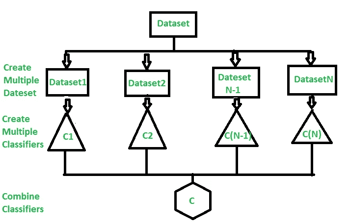

我们用一个例子来理解集成学习的概念。

> 假设你是一名电影导演，你创作了一部关于一个非常重要和有趣的主题的短片。现在，您希望在电影公开之前获得初步反馈(评级)。你能做那件事的可能方法是什么？
> 
> **答:**你可以让你的一个朋友为你的电影评分。
> 现在完全有可能你选择的那个人非常爱你，不想让你心碎，所以给你创作的糟糕作品打了 1 星。
> 
> 另一种方法是请你的 5 位同事给电影评分。这应该能让你对这部电影有更好的了解。这种方法可以为您的电影提供真实的评级。但是一个问题仍然存在。这 5 个人可能不是你电影主题的“主题专家”。当然，他们可能理解电影摄影、镜头或音频，但同时可能不是黑色幽默的最佳评判者。
> 
> 让 50 个人给电影打分怎么样？有些可能是你的朋友，有些可能是你的同事，有些甚至可能是完全陌生的人。
> 
> 在这种情况下，回答会更加一般化和多样化，因为现在你有了拥有不同技能的人。事实证明，这是一种比我们之前看到的案例更好的获得诚实评级的方法。
> 
> 通过这些例子，你可以推断出，与个人相比，一个多样化的群体可能会做出更好的决定。与单一模型相比，多样化的模型也是如此。机器学习中的这种多样化是通过一种称为集成学习的技术实现的。

**集成技术**

**装袋**

Bagging 是一种集成技术，其中对训练数据的不同子集使用单个训练算法，其中子集采样通过替换(引导)来完成。一旦在所有子集上训练了该算法，bagging 就通过聚合该算法在不同子集上做出的所有预测来做出预测。在回归的情况下，bagging 预测只是所有预测的平均值，而在分类器的情况下，bagging 预测是所有预测中最频繁的预测(多数投票)。

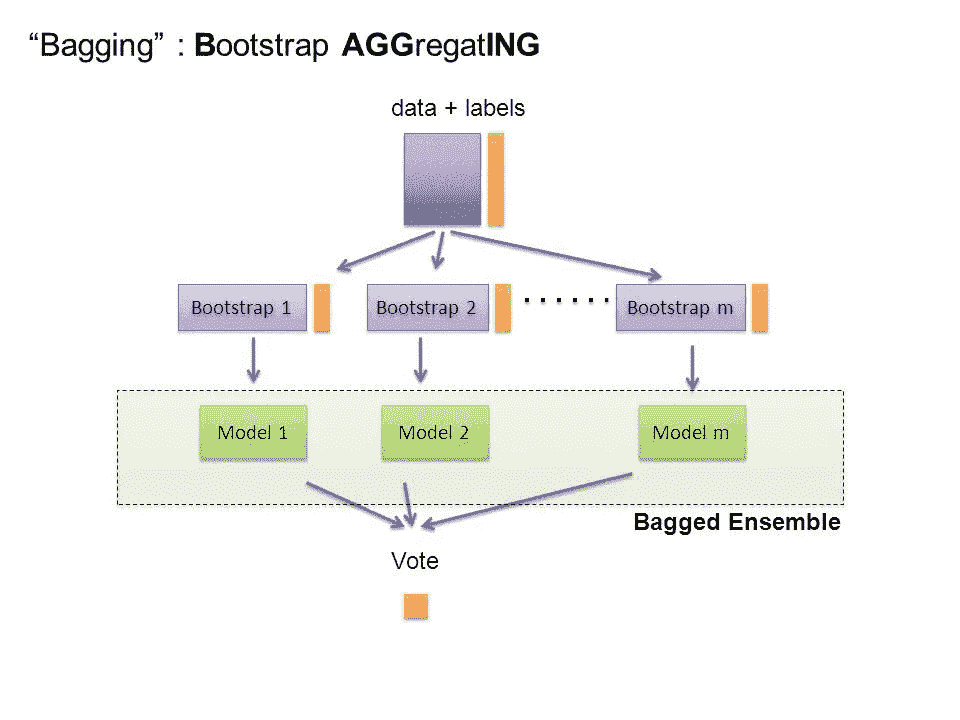

**增压**

Boosting 是一种集成建模技术，它试图从多个弱分类器中构建一个强分类器。通过使用串联的弱模型来建立模型。首先，根据训练数据建立模型。然后建立第二个模型，试图纠正第一个模型中存在的错误。继续这个过程并添加模型，直到正确预测了完整的训练数据集或者添加了最大数量的模型。

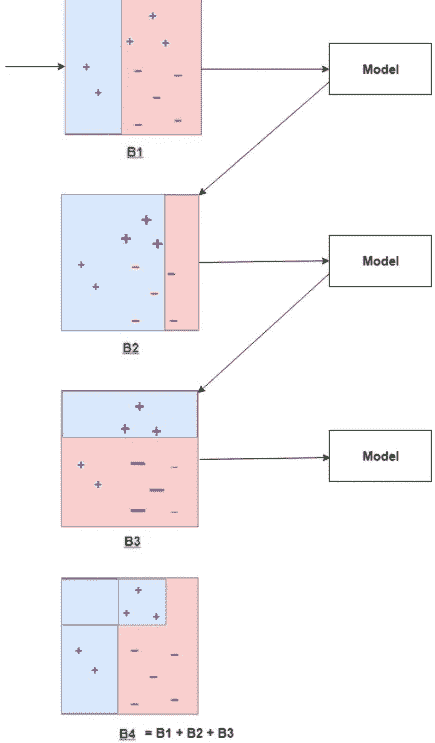

让我们试着按部就班地理解它:

*   B1 由 10 个数据点组成，这 10 个数据点由两种类型组成，即加号(+)和减号(-)，其中 5 个数据点为加号(+)，另外 5 个数据点为减号(-)，每个点最初都被赋予相同的权重。第一个模型试图对数据点进行分类，并生成一条垂直分隔线，但它错误地将 3 加号(+)分类为减号(-)。
*   B2 由来自先前模型的 10 个数据点组成，其中 3 个错误分类的加号(+)的权重更大，使得当前模型更努力地正确分类这些加号(+)。该模型生成一条垂直分隔线，该分隔线正确分类了先前错误分类的加号(+)，但在这次尝试中，它错误分类了三个减号(-)。
*   B3 由来自先前模型的 10 个数据点组成，其中 3 个错误分类的负号(-)的权重更大，使得当前模型更努力地正确分类这些负号(-)。该模型生成一条水平分隔线，该分隔线可以正确分类之前错误分类的减号(-)。
*   B4 将 B1、B2 和 B3 结合在一起，以建立一个强有力的预测模型，该模型比使用的任何单个模型都好得多。

**堆叠**

叠加是一种集成技术，它将两个或多个模型(也称为基础模型)的预测进行组合，并将该组合用作新模型(元模型)的输入，即新模型基于基础模型的预测进行训练。

假设你有一个分类问题，你可以使用几个模型，如逻辑回归，SVM，KNN，随机森林等。这个想法是使用一些模型，如 KNN，SVM 作为基础模型，并使用这些模型进行预测。现在，这些模型做出的预测被用作随机森林的输入特征，以进行训练并给出预测。

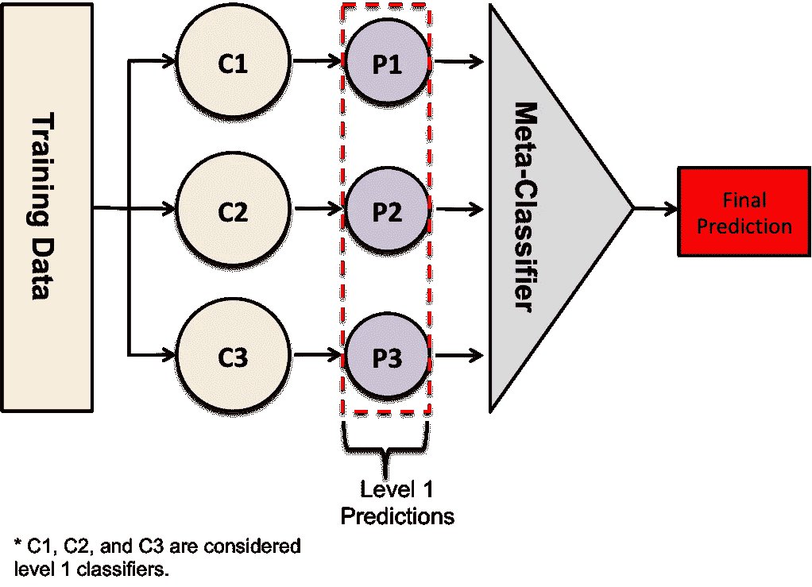

**叠加技术的实现**

导入所需的库

```
**Copy****import** pandas **as** pd 
**import** matplotlib.pyplot **as** plt 
**from** mlxtend.plotting **import** plot_confusion_matrix 
**from** mlxtend.classifier **import** StackingClassifier 
**from** sklearn.model_selection **import** train_test_split 
**from** sklearn.preprocessing **import** StandardScaler 
**from** sklearn.linear_model **import** LogisticRegression 
**from** sklearn.neighbors **import** KNeighborsClassifier 
**from** sklearn.naive_bayes **import** GaussianNB 
**from** sklearn.metrics **import** confusion_matrix 
**from** sklearn.metrics **import** accuracy_score
```

正在加载数据集

```
**df** = pd.read_csv('heart.csv') # loading the dataset 
df.head() 
```

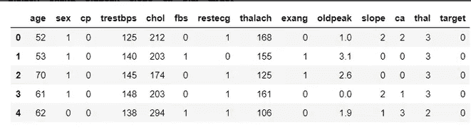

将数据分为训练和测试

```
# Creating X and y for training 
**X** = df.drop('target', axis = 1) 
**y** = df['target']# 20 % training dataset is considered for testing 
**X_train**, X_test, y_train, y_test = train_test_split(X, y, test_size = 0.2, random_state = 42)
```

标准化数据

```
# initializing sc object 
sc = StandardScaler() # variables that needed to be transformed 
var_transform = ['thalach', 'age', 'trestbps', 'oldpeak', 'chol'] 
X_train[var_transform] = sc.fit_transform(X_train[var_transform])# standardising training data 
X_test[var_transform] = sc.transform(X_test[var_transform])# standardising test data 
print(X_train.head())
```

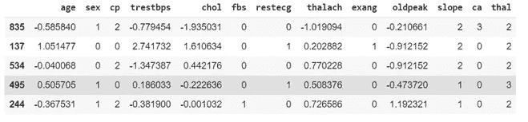

构建第一层估算器

```
KNC = KNeighborsClassifier() # initialising KNeighbors Classifier 
NB = GaussianNB()			 # initialising Naive Bayes
```

让我们用第一层估计量进行训练和评估，以观察堆叠模型和一般模型的性能差异

```
model_kNeighborsClassifier = KNC.fit(X_train, y_train) # fitting Training Set 
pred_knc = model_kNeighborsClassifier.predict(X_test) # Predicting on test dataset
```

估价

```
acc_knc = accuracy_score(y_test, pred_knc) # evaluating accuracy score 
print('accuracy score of KNeighbors Classifier is:', acc_knc * 100)
```

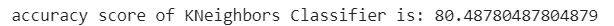

朴素贝叶斯分类器

```
model_NaiveBayes = NB.fit(X_train, y_train) 
pred_nb = model_NaiveBayes.predict(X_test)acc_nb = accuracy_score(y_test, pred_nb) 
print('Accuracy of Naive Bayes Classifier:', acc_nb * 100)
```

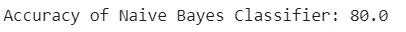

实现堆叠分类器

```
lr = LogisticRegression() # defining meta-classifier 
clf_stack = StackingClassifier(classifiers =[KNC, NB], meta_classifier = lr, use_probas = True, use_features_in_secondary = True)
```

培训和评估

```
# training of stacked model
model_stack = clf_stack.fit(X_train, y_train) # predictions on test data using stacked model
pred_stack = model_stack.predict(X_test)acc_stack = accuracy_score(y_test, pred_stack) 
# evaluating accuracy 
print('accuray score of Stacked model:', acc_stack * 100)
```

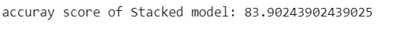

我们的两个独立模型的准确率接近 80%，我们的堆叠模型的准确率接近 84%。通过组合两个独立的模型，我们获得了显著的性能提升。

我们会赶上另一篇有趣的文章。

快乐学习:)