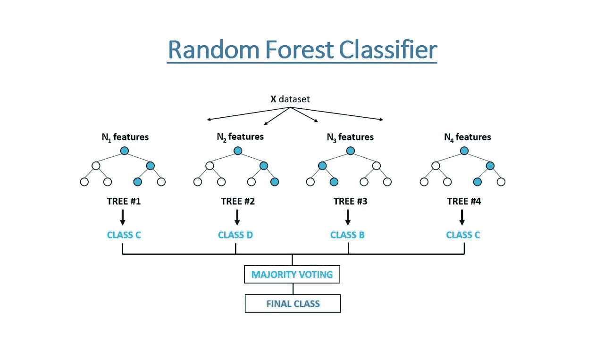
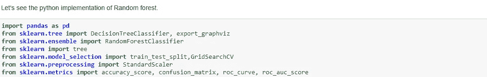
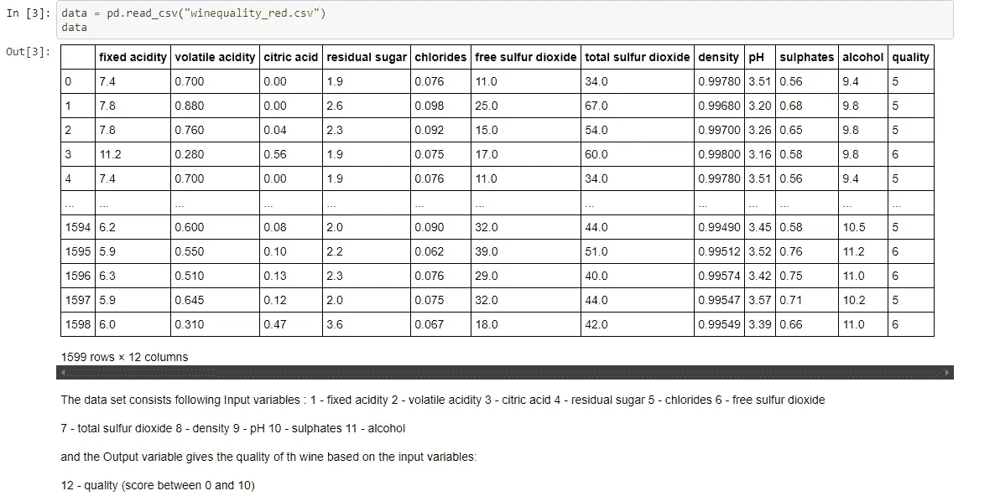
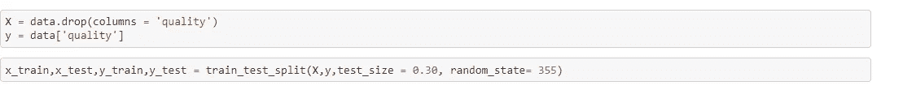
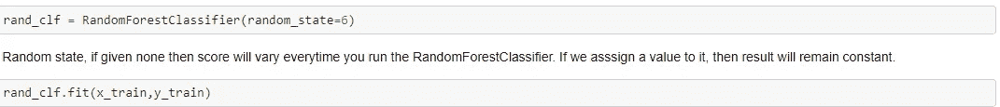
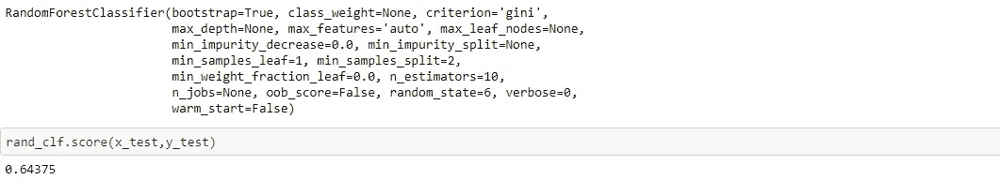
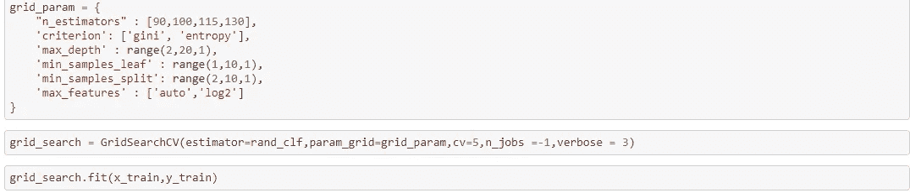
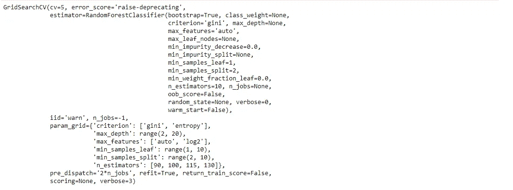
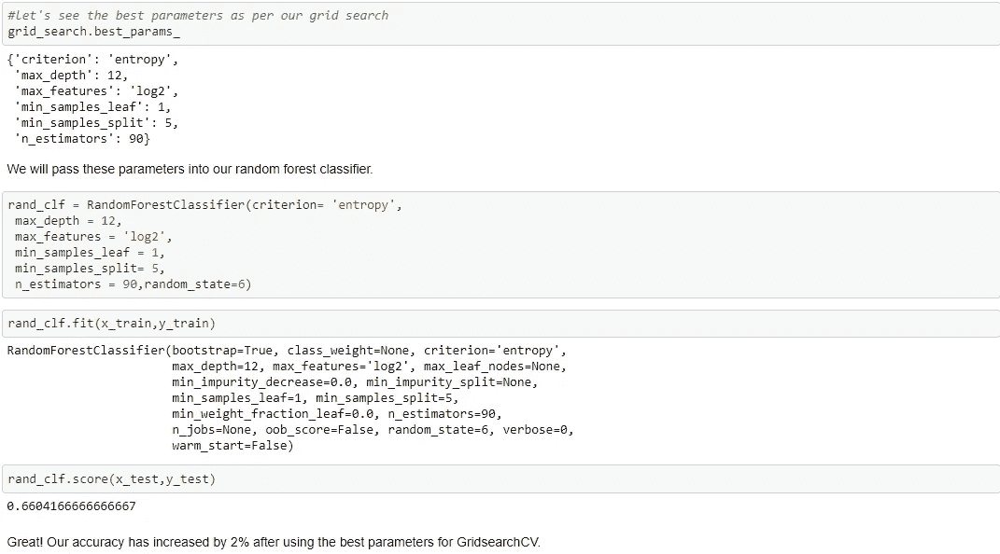

# 随机森林分类器及其超参数

> 原文：<https://medium.com/analytics-vidhya/random-forest-classifier-and-its-hyperparameters-8467bec755f6?source=collection_archive---------0----------------------->

*了解随机森林分类器的工作原理*

数据科学提供了大量的分类算法，如支持向量机、朴素贝叶斯分类器、逻辑回归、决策树等。但是在分类器层次的顶端附近是**随机森林分类器**(也有随机森林回归器，但是那是另一天的主题)。

为了理解随机森林分类器的工作，我们需要首先理解决策树的概念。

如果您不知道决策树分类器的概念，请在开始学习随机森林算法的工作性质之前，花一些时间了解一下 [**决策树分类器**](https://dataaspirant.com/2017/01/30/how-decision-tree-algorithm-works/) 是如何工作的。如果你想学习决策树分类器的实现，你可以从下面的文章中找到它。

[用 Python 实现决策树分类器](https://dataaspirant.com/2017/02/01/decision-tree-algorithm-python-with-scikit-learn/)

[用 R 编程语言构建决策树分类器](https://dataaspirant.com/2017/02/03/decision-tree-classifier-implementation-in-r/)

[如何可视化建模的决策树分类器](https://dataaspirant.com/2017/04/21/visualize-decision-tree-python-graphviz/)

# 基本决策树概念:

决策树的概念更适合于基于规则的系统。给定具有目标和特征的训练数据集，决策树算法将得出某个**规则集**。同一组规则可用于对测试数据集执行预测。

假设你想预测你的朋友会不会喜欢新上映的动画电影。为了对决策树进行建模，您将使用训练数据集，就像您的朋友在过去的电影中喜欢的动画卡通人物一样。

因此，一旦你将目标数据集传递给决策树分类器，你的朋友就会**喜欢或不喜欢这部电影，**。决策树将开始建立规则，将你朋友喜欢的角色作为节点，将目标喜欢或不喜欢作为叶节点。通过考虑从根节点到叶节点的路径。你可以得到规则。

简单的规则可能是，如果某个 ***x*** 角色扮演主角，那么你的朋友会喜欢这部电影。你可以根据这个例子想出更多的规则。

然后预测**你的朋友** **是否会喜欢这部电影**。你只需要检查由决策树创建的规则来预测你的朋友是否会喜欢新上映的电影。

在决策树算法中，使用 ***信息增益和基尼系数计算*** 来计算这些节点并形成规则。

在随机森林算法中，寻找根节点和分裂特征节点的过程将随机发生，而不是使用信息增益或基尼指数来计算根节点。将在下一节中详细讨论它。

**随机森林分类器:**

具有低偏差和高方差的决策树倾向于过度拟合数据。因此[装袋技术](../Blog%201%20-%20Ensemble%20Learning/ENSEMBLE%20METHODS.docx)成为降低决策树方差的一个非常好的解决方案。除了使用底层模型作为决策树的 bagging 模型之外，我们还可以使用随机森林，这对于决策树来说更加方便和优化。bagging 的主要问题是采样数据集之间没有太多的独立性，即存在相关性。

随机森林相对于 bagging 模型的优势在于，随机森林对 bagging 模型的工作算法进行了**调整**，以降低树中的相关性。这个想法是在创建树的时候引入更多的随机性，这将有助于减少相关性。

随机森林是一种**监督学习算法**，用于分类和回归。但是，它主要用于分类问题。众所周知，森林是由树组成的，更多的树意味着更健壮的森林。类似地，随机森林算法在数据样本上创建决策树，然后从每个样本中获得预测，最后选择最佳解决方案。

一般来说，森林里的树越多，森林看起来就越茂盛。同样，在随机森林分类器中，**森林中的树木数量**越高，则**结果的准确度**越高。

随机森林背后的基本概念是简单而强大的——群体的智慧。用数据科学的话说，随机森林模型如此有效的原因是:

***大量相对不相关的模型(树)作为一个委员会运作，将胜过任何一个单独的组成模型。***

模型之间的低相关性是关键。

不相关的模型可以产生比任何单个预测都更准确的集合预测。产生这种奇妙效果的原因是，这些树相互保护，不受各自错误的影响(只要它们不总是朝着同一个方向出错)。虽然有些树可能是错误的，但许多其他的树将是正确的，所以作为一个群体，这些树可以朝着正确的方向前进。因此，随机森林运行良好的先决条件是:

1.我们的特征中需要有一些实际的信号，以便使用这些特征建立的模型比随机猜测做得更好。

2.由单个树做出的预测(以及因此产生的误差)需要彼此具有低相关性。

随机森林算法的伪代码可以分为两个阶段。

*   **随机森林**创建伪代码。
*   **根据创建的随机森林分类器执行预测**的伪代码。

首先，让我们从随机森林创建伪代码开始

## 随机森林伪代码:

1.就像 bagging 一样，使用 bootstrapping 从训练数据集中收集不同的样本。

2.在每个样本上，我们训练我们的树模型，并且我们允许树以很高的深度生长。

*现在，随机森林的区别在于树木是如何形成的。在 bootstrapping 中，我们允许所有样本数据用于分割节点，但不包括随机森林。当构建决策树时，每次发生分裂时，从总的“p”个预测值中选择“m”个预测值的随机样本。只有那些“m”个预测值被允许用于分割。*

*m<p*

*为什么会这样？*

*假设在那些‘p’个预测因子中，1 个预测因子很强。现在在每个样本中，这个预测器将保持最强。因此，每当为这些采样数据构建树时，所有树都会选择该预测值进行分割，从而为每个引导模型生成类似的树。这在数据集中引入了相关性，并且平均相关的数据集结果不会导致低方差。这就是为什么在随机森林中，选择分裂节点的选择是有限的，并且在树的形成中也引入了随机性。*

*大部分预测因子不允许考虑拆分。*

*一般情况下，取‘m’的值为 m ≈√p，其中‘p’为样本中预测值的个数。*

*当 m=p 时，随机森林模型变成了 bagging 模型。*

3.在**“m”**特征中，使用最佳分割点计算节点**“d”**。

4.使用**最佳分割**将节点分割成**子节点**。

5.重复 **1 到 4** 步骤，直到达到“l”个节点。

6.通过重复步骤 **1 到 5**n 次来建立森林，以创建**“n”个树**。

随机森林算法的开始是从全部**“p”**个特征中随机选择**“m”**个特征。

在下一阶段，我们将使用随机选择的**“m”**特征，通过使用[最佳分裂](https://dataaspirant.com/2017/01/30/how-decision-tree-algorithm-works/)方法来找到根节点。

在下一阶段，我们将使用相同的最佳分割方法计算子节点。我们将重复前 4 个阶段，直到我们形成一个根节点，目标节点为叶节点的树。

最后，我们重复 1 到 5 个阶段来创建**“n”**随机创建的树。这些随机创建的树形成了**随机森林。**

## 随机森林预测伪代码:

为了使用训练的随机森林算法执行预测，使用下面的伪代码。

1.采用**测试特征**并使用每个随机创建的决策树的**规则**来预测结果并存储预测结果(目标)。

2.计算每个预测目标的**票数**。

3.将**高票**预测目标视为来自随机森林算法的**最终预测**。

为了使用经过训练的随机森林算法来执行预测，我们需要通过每个随机创建的树的规则来传递测试特征。假设我们从随机森林中形成了 100 棵随机决策树。

每个随机树将预测相同测试特征的不同目标(结果)。然后通过考虑每个预测目标，计算票数。假设 100 个随机决策树预测了大约 3 个独特的目标 **x，y，z** 那么 x 的投票什么也不是，但是在 100 个随机决策树中有多少个树预测是 **x.**

其他两个目标(y，z)也是如此。如果 x 获得最高票数。假设 100 个随机决策树**中有 60 个**树预测目标将是 x。然后最终的随机树返回 x 作为预测目标。

这种投票的概念被称为**多数投票**。

随机森林分类器的可视化表示:

图片提供:谷歌

**随机森林分类器的 Python 实现:**

导入所有必需的库

拆分训练和测试数据

将模型拟合到训练数据

计算精确度

****随机森林分类器的超参数:****

**1. **max_depth:** 随机森林中一棵树的 *max_depth* 定义为根节点和叶节点之间的最长路径。**

**2. **min_sample_split:** 参数 ***默认= 2*****

**3. **max_leaf_nodes:** **该超参数设置了树中节点分裂的条件，从而限制了树的增长。****

**4. **min_samples_leaf:** 这个随机森林超参数指定在分割一个节点之后，在叶节点**中应该出现的最小样本数。**默认= 1******

**5. **n_estimators:** 森林中的树木数量。**

**6.**max _ sample:***max _ samples*超参数决定了原始数据集的多少部分被分配给任何一棵树。**

**7.这类似于提供给随机森林中每棵树的最大特征数量。**

**8. **bootstrap** :采样数据点的方法(有无替换)。**默认=真****

**9.**判据:**衡量分割质量的函数。支持的标准是基尼杂质的“基尼”和信息增益的“熵”。**

***现在，手动设置超参数，并使用 GridSearchCV 进行超参数调整:***

****

**使用网格搜索寻找最佳参数**

********

**用最佳参数拟合训练数据并计算新的精度**

**超参数调整后的最终精度有所提高。**

****随机森林分类器的优势:****

**它通过平均或组合不同决策树的结果来克服过拟合问题。**

**随机森林比单个决策树更适用于大范围的数据项。**

**随机森林比单一决策树具有更小的方差。**

**随机森林非常灵活，并且具有非常高的准确性。**

**在随机森林算法中不需要缩放数据。即使在提供未经缩放的数据后，它也能保持良好的准确性。**

**即使大部分数据丢失，随机森林算法也能保持良好的准确性。**

****随机森林分类器的缺点:****

**复杂性是随机森林算法的主要缺点。**

**随机森林的构建比决策树要困难和耗时得多。**

**实现随机森林算法需要更多的计算资源。**

**当我们有一个大的决策树集合时，它就不那么直观了。**

**与其他算法相比，使用随机森林的预测过程非常耗时。**

****结论:****

**至此，我们结束了对随机森林分类器的工作以及如何调整随机森林的各种超参数的讨论。为了更好地理解超参数调谐，您可以尝试自己处理“葡萄酒质量数据集”。**

**下载数据集—【https://www.kaggle.com/rajyellow46/wine-quality **

****随机森林分类器的 YouTube 链接:****

**1.统计任务:[https://www.youtube.com/watch?v=J4Wdy0Wc_xQ](https://www.youtube.com/watch?v=J4Wdy0Wc_xQ)**

**2.https://www.youtube.com/watch?v=nxFG5xdpDto 的克里斯·纳伊克**

****看看我之前的文章！****

**[综合方法——装袋、助推和堆叠](/analytics-vidhya/ensemble-methods-bagging-boosting-and-stacking-28d006708731)。**

**我希望你喜欢这篇文章。如果你有任何问题，欢迎在下面评论。如果你想让我写一个关于机器学习的特定话题，请在下面的评论中告诉我。**

**感谢阅读！**

****参考文献:****

**1.[伊内乌龙](https://ineuron.ai/home)**

**2.[走向数据科学](https://towardsdatascience.com/)**

**3.[数据野心家](https://dataaspirant.com/)**

**4.[https://github.com/Ankit-c2104/Machine-Learning-Notes](https://github.com/Ankit-c2104/Machine-Learning-Notes)**