# 随机森林分类器

> 原文：<https://medium.com/analytics-vidhya/random-forest-classifier-d8666aa34a55?source=collection_archive---------21----------------------->


森林|照片由[杰伊·曼特里](https://unsplash.com/@jaymantri?utm_source=medium&utm_medium=referral)在 [Unsplash](https://unsplash.com?utm_source=medium&utm_medium=referral) 上拍摄

本课使用的笔记本:[点击此处](https://www.kaggle.com/tanishsawant2002/random-forest-classifier)(如果你喜欢，请投赞成票😉)

> 随机森林是一种元估计器，它在数据集的各个子样本上拟合多个决策树分类器，并使用平均来提高预测精度和控制过拟合。如果`bootstrap=True`(默认)，子样本大小由`max_samples`参数控制，否则使用整个数据集构建每棵树。~ [sklearn 文档](https://scikit-learn.org/stable/modules/generated/sklearn.ensemble.RandomForestClassifier.html)

上面的定义很费解，我们来分解一下。

在机器学习中，有一个概念叫做决策树。通过基于属性值测试将源集合分割成子集，可以*“学习”*一个树。这个过程以一种称为*递归分割*的递归方式在每个派生子集上重复。当拆分没有给预测增加任何值时，递归停止。

还有…..森林是树木的集合体。所以随机森林算法包含了大量的决策树。它既可以用于分类，也可以用于回归。这也是最灵活和最容易使用的算法。

随机森林有多种应用，例如推荐引擎、图像分类和特征选择。它可以用来对忠诚的贷款申请人进行分类，识别欺诈活动和预测疾病。

> 在这节课中，我们将使用澳大利亚数据集中 [Kaggle 的](https://www.kaggle.com/#) [Rain。](https://www.kaggle.com/jsphyg/weather-dataset-rattle-package)

首先是分类问题。因此我们必须使用 [RandomForestClassifier](https://scikit-learn.org/stable/modules/generated/sklearn.ensemble.RandomForestClassifier.html) 来达到这个目的。

在此之前，让我们对数据进行一些清理和预处理。

```
import numpy as np *# linear algebra*
import pandas as pd *# data processing, CSV file I/O (e.g. pd.read_csv)*

*# Input data files are available in the read-only "../input/" directory*
*# For example, running this (by clicking run or pressing Shift+Enter) will list all files under the input directory*

import os
for dirname, _, filenames **in** os.walk('/kaggle/input'):
    for filename **in** filenames:
        print(os.path.join(dirname, filename))

*# You can write up to 20GB to the current directory (/kaggle/working/) that gets preserved as output when you create a version using "Save & Run All"* 
*# You can also write temporary files to /kaggle/temp/, but they won't be saved outside of the current session* 
```


这将输出数据的目录。

让我们把这些数据转换成熊猫的数据框架。

```
df = pd.read_csv("/kaggle/input/weather-dataset-rattle-package/weatherAUS.csv")df.head()
```

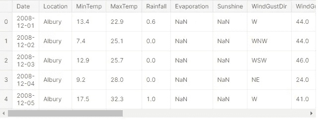

输出

别忘了，我总是把数据框的所有栏目列成一个清单，以后，它肯定会派上用场。

```
cols = list(df.columns)
cols
```

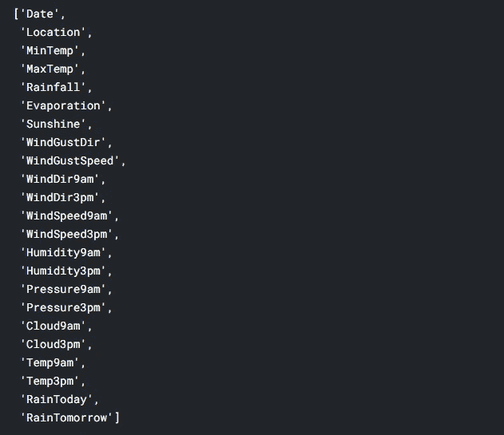

列列表

描述表格:

```
df.describe().T 
```

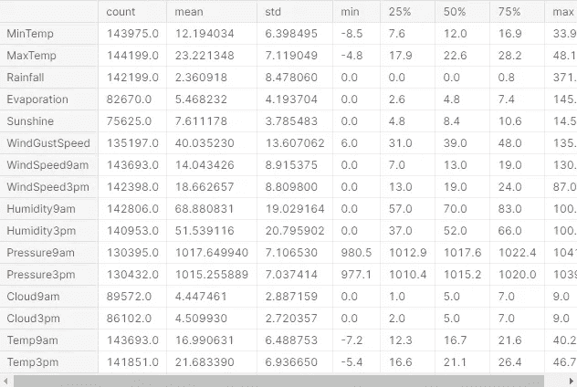

肯定没必要拿转置，但是好看。

这个 describe()方法确实有助于解析数据库的数字数据。

让我们导入一些库来可视化数据。

```
import matplotlib.pyplot as plt
import seaborn as sns
```

现在到了一个重要的部分，我们必须检查特征之间的相关性，去掉那些高度相关的特征。

为此，我们需要首先聚集特征，我们可以通过分离目标列(RainTomorrow)来做到这一点。)

```
X = df.drop('RainTomorrow', axis=1)
X.head()
```

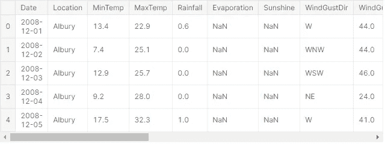

X

```
y = df[["RainTomorrow"]]
y.head() 
```

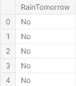

Y

我们准备好检查相关性了。将相关性可视化的最佳工具是 Seaborn 的热图。

```
plt.figure(figsize=(20,20))
sns.heatmap(X.corr())
plt.show() 
```

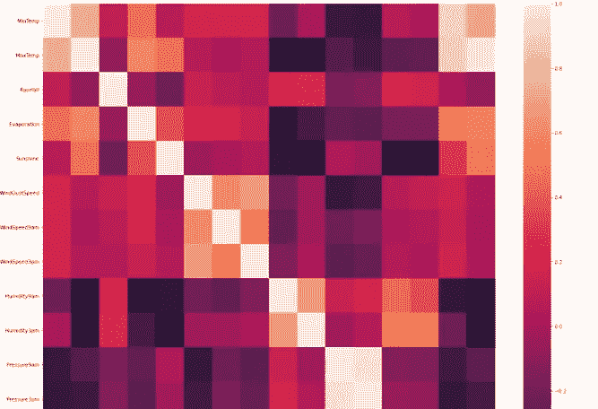

你可以看到这样的热图。

对角线显然是要关联的。除此之外，深色方块代表我们想要的较小相关性。

到目前为止，很明显有些特征是绝对相关的。让我们放弃他们。

```
cor_matrix = df.corr().abs()
print(cor_matrix)
```

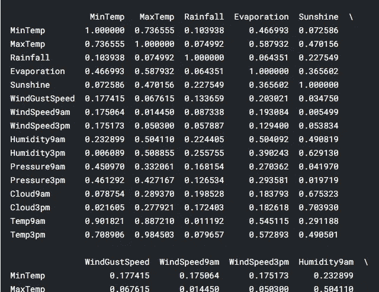

相关矩阵

```
upper_tri = cor_matrix.where(np.triu(np.ones(cor_matrix.shape),k=1).astype(np.bool))
print(upper_tri)
```

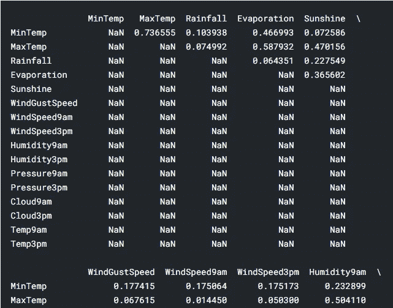

上三角矩阵。

```
to_drop = [column for column **in** upper_tri.columns if any(upper_tri[column] > 0.95)]
print(); print(to_drop) 
```

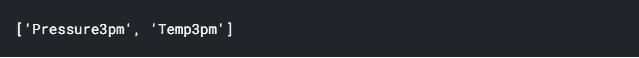

喔喔喔！！我们得到了多余的功能！

好吧…..代码太多了。我们所做的是非常有说服力的，首先，相关矩阵被创建，然后它被转换成上三角矩阵。从上面训练矩阵中，我们选择指数大于 0.95 的特征。

# 有一件事没有被注意到！

日期和位置栏对于确定明天是否会下雨也没有多大帮助。(把它们也扔掉)。

```
df = df.drop(['Pressure3pm', 'Temp3pm', 'Date', 'Location'], axis=1)
print(df.head())
```

我们就要做出我们的模型了！

在解决分类问题时要记住的一点是，

我们需要预处理我们的数据，以便算法可以有效地预测值。分类变量必须转换成指示变量。为此，我们可以使用 pandas 的 get_dummies() 方法。

```
ohe = pd.get_dummies(data=df, columns=['WindGustDir','WindDir9am','WindDir3pm'])
ohe.info()
```

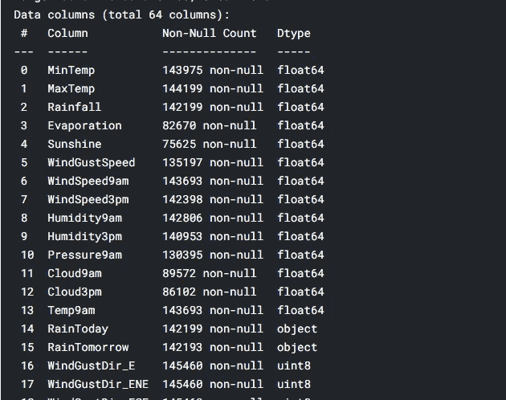

我们缺少更多的预处理…..

```
from sklearn import preprocessing
from numpy import array

ohe['RainToday'] = df['RainToday'].astype(str)
ohe['RainTomorrow'] = df['RainTomorrow'].astype(str)

lb = preprocessing.LabelBinarizer()

ohe['RainToday'] = lb.fit_transform(ohe['RainToday'])
ohe['RainTomorrow'] = lb.fit_transform(ohe['RainTomorrow'])y = ohe['RainTomorrow']
X = ohe.drop(['RainTomorrow'], axis=1)
```

好……振作起来！！我们已经走了一半了！🎉🎉

我们接下来要做的是分割数据并定义我们的模型。

```
from sklearn.model_selection import train_test_split
X_train, X_test, y_train, y_test = train_test_split(X, y, test_size=0.3, random_state=0)from sklearn.impute import SimpleImputer
imp = SimpleImputer(missing_values=np.nan, strategy='mean')
imp.fit_transform(X_train)
```

> 简单的估算器充当空值填充器。它用数据的平均值替换空值。

创建一个管道，并将 SimpleImputer 和 RandomForestClassifier 添加到管道中。

```
from sklearn.ensemble import RandomForestClassifier

model = make_pipeline(
    SimpleImputer(),
    RandomForestClassifier(n_jobs=4, verbose=True, n_estimators=200, max_depth=10, criterion='gini', )
)

model.fit(X_train, y_train)
```

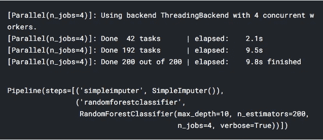

n_jobs 是用于确定有助于拟合数据的内核数量的参数。

现在，评估模型。

```
model.score(X_test, y_test)
```

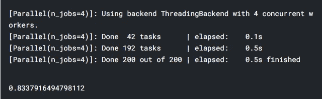

分数接近 83%

```
model.score(X_train, y_train)
```

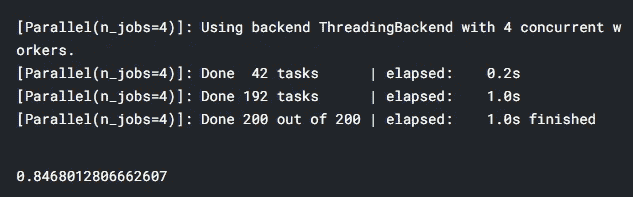

不出所料，训练分数更多。

计算 F1 分数

```
from sklearn.metrics import f1_score

pred = model.predict(X_test)
print(f1_score(y_test, pred))
```

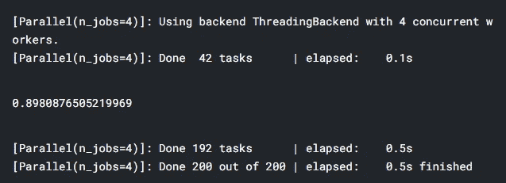

就是这样！！！

我们完了。

恭喜你！！🎉你设计了一个预测澳大利亚降雨量的模型。

这显然不是你能做的全部。您甚至可以使用称为参数调整的概念来争取更好的模型。

如果你有任何问题，请留下评论…

谢谢大家！！