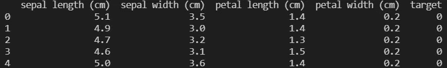
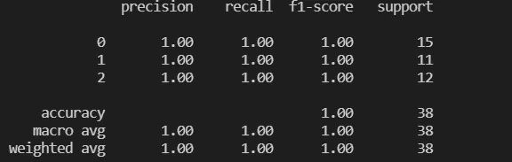

# 随机森林 ML 算法

> 原文：<https://medium.com/analytics-vidhya/random-forest-ml-algorithm-fbb5188222cf?source=collection_archive---------1----------------------->

有许多机器学习算法用于监督机器学习。一种流行的机器学习算法是随机森林算法。

随机森林(RF)是一种集成机器学习算法。集成机器学习算法利用了使用多种算法预测的优势。整体技术包括增压和装袋技术。


随机森林:来源- [https://community . tibco . com/wiki/random-Forest-template-tibco-spot firer-wiki-page](https://community.tibco.com/wiki/random-forest-template-tibco-spotfirer-wiki-page)(Venkata Jagannath-Wikipedia)

> **随机森林是一种 bagging 集成机器学习算法**。

在装袋中，可以使用不同的机器学习模型。然而，在随机森林中，只存在多个决策树。 **RF 可用于回归和分类任务。**

## 随机森林分类器

决策树的主要缺点是容易过拟合，导致低偏差和高方差。对于 RF，我们的目标是避免这种情况，并实现低偏置和低方差。
在 RF 分类器中，**对数据进行行和列采样**，并将其提供给每个决策树。这里需要注意的一点是，每个决策树收到的数据可能会有重叠。这也称为自举聚合，用于减少噪声数据集的方差。最后，在采样的训练数据上训练每个决策树。在测试阶段，收集每个决策树的输出，并应用多数表决来实现输出类。

## 随机森林回归量

如上所述，随机森林也能够回归。在这种情况下，也使用了与随机森林分类器类似的方法。区别在于输出阶段。在随机森林回归的情况下，取所有决策树输出的平均值。

## 随机森林编码样本

让我们来看一个使用随机森林解决虹膜分类问题的示例代码。关于在 [IRIS](https://scikit-learn.org/stable/auto_examples/datasets/plot_iris_dataset.html) 数据集上加载和执行探索性数据分析(EDA)，请参考我之前的博客[这里的](/p/589a002989f8)。

让我们获取数据:

```
from sklearn.datasets import load_iris
import pandas as pddata = load_iris() 
X = pd.DataFrame(data.data, columns=data.feature_names)
y = pd.DataFrame(data.target, columns=["target"])
df = pd.concat([X, y], axis=1)
print(df.head())
```

下载的数据集如下所示:



```
# Perform Train-Test Split
from sklearn.model_selection import train_test_split
X_train, X_test, y_train, y_test = train_test_split(X, y, test_size=0.25, random_state=42)
```

让我们从 sklearn 创建一个随机森林分类器对象。更多参数信息可在[这里](https://scikit-learn.org/stable/modules/generated/sklearn.ensemble.RandomForestClassifier.html)找到。

```
from sklearn.ensemble import RandomForestClassifier
model = RandomForestClassifier(max_depth=5, n_estimators=10)
```

理解随机森林算法的内部参数非常重要，因为它们在避免过拟合方面起着巨大的作用。**在这种情况下，我们没有优化算法，因为这是出于演示目的**。现在，让我们在这个随机森林模型上拟合数据，并在测试数据上测试它。

```
from sklearn.metrics import classification_reportmodel.fit(X_train, y_train)
y_pred = model.predict(X_test)
print(classification_report(y_test, y_pred))
```



从分类矩阵中可以明显看出，随机森林分类器在分类鸢尾属物种方面做得很好。

> **补充信息:随机森林算法中不需要进行归一化。**