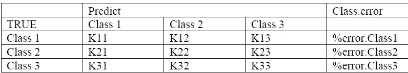
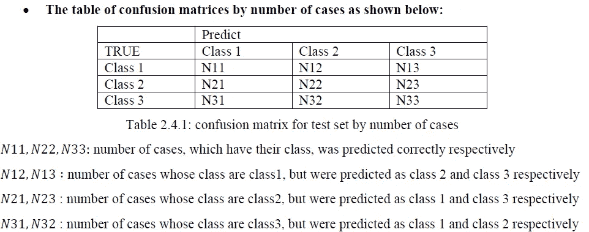
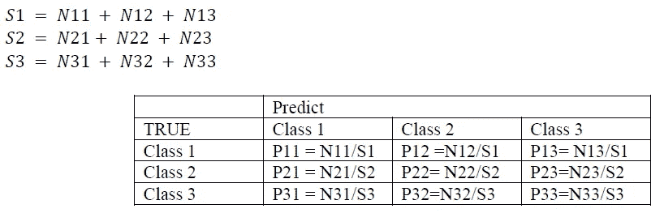
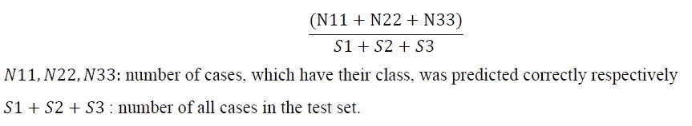

# 随机森林——逐步概述算法原理和 R 编程中 RF 函数的详细应用:输入、参数、选项、输出、全局精度、混淆矩阵。

> 原文：<https://medium.com/analytics-vidhya/random-forests-outline-algorithmic-principles-and-detailed-application-of-the-rf-function-in-r-7d2361f0b08a?source=collection_archive---------13----------------------->

# 1.概述基本随机森林的算法原理。

随机森林(RF)使用树作为构建块来构建强大的预测模型。它由大量决策树组成，可以应用于回归和分类问题。

对于回归树，观察的预测响应由属于同一终端节点的训练观察的平均响应给出。对于分类树，预测每个观察值属于其所属区域中最常出现的训练观察值类别。

在随机森林中，在自举训练样本中建立决策树的数目，并且分裂节点的算法考虑特征的随机子集。在树的每次分裂中，随机特征子集的一个特征被选择来分裂具有最佳阈值的节点，其目标是最小化分裂处节点的所有基尼系数。如果数据点满足阈值，它将进入一个分支，否则它将进入另一个分支。数据点继续在树的分支上向下移动，直到它位于包含给定观察的树的分类的节点处。这个最后的节点也被称为树的叶子。

在运行模型之前，用户选择创建的树的数量，因此上述过程继续，直到所有的树都完成。值得注意的是，每棵树都将使用随机的特征子集。因此，原始数据集中的某个要素可能不属于随机森林，而其他要素会被多次使用。还应该注意，该过程将在训练集上引导。随机森林建立多个决策树，并将它们合并在一起，以获得更稳定和准确的预测。

当一个新的观察通过随机森林时，它将通过所有的决策树。模型中的每棵树都将为观察值分配一个类别，并选择这些树中最常出现的类别。当一个新的观察值到达树叶时，它的类别被定义。

# 2.R 程序设计中的 RF 函数

在 R 中，randomForest()函数用于训练训练数据，可用于调整 RF 模型的两个参数是决策树的数量(ntree)和在每个阶段随机采样的特征的数量(mtry)。

用作每次分割的潜在候选的特征数量(mtry)通常被设置为 sqrt(p)。p 是数据集中特征的总数，而决策树的数目(ntree)是随机选择的。

## r𝑎𝑛𝑑𝑜𝑚𝐹𝑜𝑟𝑒𝑠𝑡(𝑓𝑜𝑟𝑚𝑢𝑙𝑎、𝑑𝑎𝑡𝑎、𝑛𝑡𝑟𝑒𝑒、𝑚𝑡𝑟𝑦、𝑖𝑚𝑝𝑜𝑟𝑡𝑎𝑛𝑐𝑒=𝐹𝐴𝐿𝑆𝐸)

## 输入:

𝐹𝑜𝑟𝑚𝑢𝑙𝑎:描述要安装的模型。

𝐷𝑎𝑡𝑎:包含模型中变量的数据框，通常是训练数据集。

𝑁𝑡𝑟𝑒𝑒:要种多少棵树。

𝑀𝑡𝑟𝑦::每次分裂时随机抽样作为候选变量的变量数。(sqrt(变量数))

𝐼𝑚𝑝𝑜𝑟𝑡𝑎𝑛𝑐𝑒:应该评估预测因子的重要性吗？

## 输出:

数据的𝑇𝑦𝑝𝑒 𝑜𝑓 𝑟𝑎𝑛𝑑𝑜𝑚 𝑓𝑜𝑟𝑒𝑠𝑡:分类

𝑁𝑢𝑚𝑏𝑒𝑟 𝑜𝑓 𝑡𝑟𝑒𝑒𝑠:输入中选择的 Ntree

𝑁𝑜.输入中选择的𝑂𝑓 𝑣𝑎𝑟𝑖𝑎𝑏𝑙𝑒𝑠 𝑡𝑟𝑖𝑒𝑑 𝑎𝑡 𝑒𝑎𝑐ℎ 𝑠𝑝𝑙𝑖𝑡:

𝑂𝑂𝐵 𝑒𝑠𝑡𝑖𝑚𝑎𝑡𝑒 𝑜𝑓 𝑒𝑟𝑟𝑜𝑟 𝑟𝑎𝑡𝑒:全球训练集错误分类百分比

混淆矩阵-通过 3 类数据集的袋外技术(OOB)计算。

其中:

正确分类的病例数= K11 + K22 + K33

误差百分比 seto = (K12 + K13) / (K11 + K12 + K13)

混淆矩阵的百分比值 Pij = Kij / (Ki1 + Ki2 + Ki3)

## 3.展示与射频功能相关的预测功能

在将 RF 函数应用于训练数据以构建模型之后，使用 predict()来预测测试数据中所有案例的类别。

## 𝑃𝑟𝑒𝑑𝑖𝑐𝑡(𝑜𝑏𝑗𝑒𝑐𝑡,𝑛𝑒𝑤𝑑𝑎𝑡𝑎)

## 投入

𝑂𝑏𝑗𝑒𝑐𝑡:类随机森林对象，训练数据的射频训练模型

𝑁𝑒𝑤𝑑𝑎𝑡𝑎:测试数据集。

输出

基于车列射频模型的测试数据集中每个观察值的预测类别的因素向量。它被称为预测测试标签。

## 4.评估模型

在获得测试集中每个观察值的预测类之后，应该应用函数表()来根据案例数创建测试集的混淆矩阵。

## 4.1 案例混淆矩阵

## t𝑎𝑏𝑙𝑒(test 数据标签、预测测试标签)

## 输出:

## 4.2 百分比混淆矩阵

## 4.3 测试集的全局精度性能

通过函数计算测试集的全局精度性能:

𝑚𝑒𝑎𝑛(𝑡𝑒𝑠𝑡 𝑑𝑎𝑡𝑎 𝑙𝑎𝑏𝑒𝑙== 𝑝𝑟𝑒𝑑𝑖𝑐𝑡 𝑡𝑒𝑠𝑡 𝑠𝑒𝑡)

其输出是正确预测的案例总数与测试集中案例总数的比率。该函数可以计算如下:

注意:

*   *一个集群的基尼系数是用来衡量其杂质的。目标是让集群尽可能的纯净。