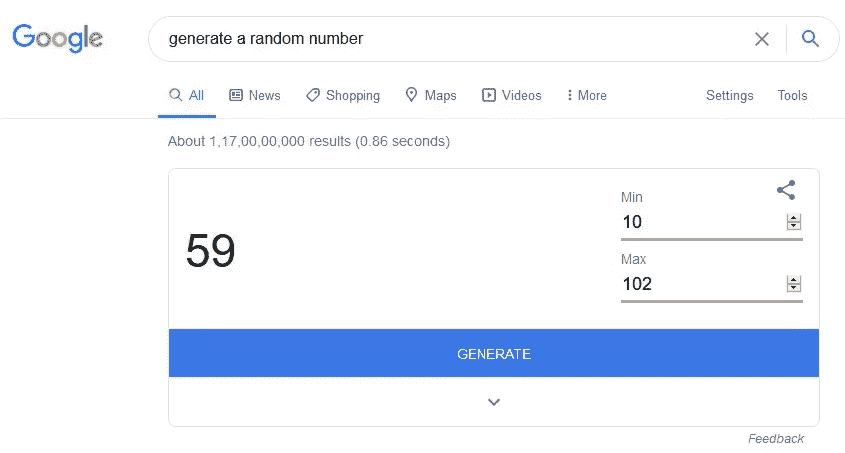
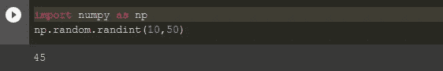
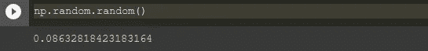
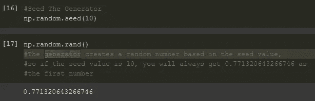
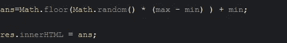
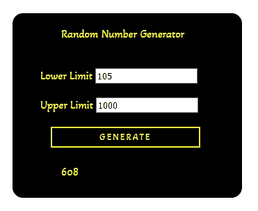
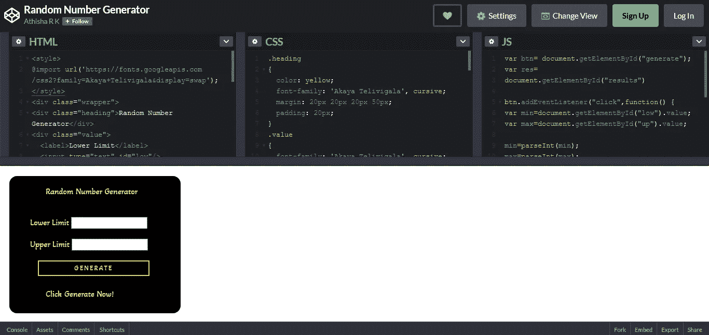

# 随机数！

> 原文：<https://medium.com/analytics-vidhya/random-numbers-in-python-and-javascript-89dc6e6a3de4?source=collection_archive---------14----------------------->

亚伦·塞巴斯蒂安在 [Unsplash](https://unsplash.com?utm_source=medium&utm_medium=referral) 上拍摄的照片

O 我当前项目的目标之一是让从进化算法中获得的结果具有可重复性。首先要做的是提取随机数生成器的当前状态。我花了几个小时阅读真随机数、伪随机数、随机数生成算法等。在这篇文章中，我想讨论一些我遇到的事情。

*   什么是随机数？
*   真随机数和伪随机数
*   Python 中的随机数
*   种子
*   使用 JavaScript 的随机数生成器

## 什么是随机数？

我是在学校的 C++编程课上碰到这个概念的。一个简单的谷歌搜索“生成随机数”可以解释给你听(如下所示)。系统在用户指定的范围内生成一个随机数。每一个数字都有均等的机会被无偏见地产生。

随机数生成器示例

## **真随机数和伪随机数发生器**

TRNGs 从一些预期随机的物理现象(如系统时间、放射性衰变过程等)中收获了随机性的来源。

PRNGs 使用计算算法来生成不完全随机的随机数。结果取决于称为种子的初始值。因此，知道了算法和种子就可以重现这些随机结果。几乎所有的编程语言都只能生成伪随机数。

## Python 中的随机数

在 python 中， [*NumPy.random*](https://numpy.org/doc/1.16/reference/routines.random.html) 库有各种函数可以根据我们的要求生成随机数。以下是几个例子:

生成一个范围在[10，50]内的随机整数

生成一个范围在[0.0，0.1]内的随机浮点数

*   [*Github:random numbers _ python . ipynb*](https://github.com/athisha-rk/mediumArticlesRelatedFiles/blob/master/RandomNumbers_Python.ipynb)

## **种子**

种子是初始化伪随机数发生器的随机数。对于特定的种子，产生相同的数字序列。因此，设置种子可以使结果可重复。

Python 中的种子

**np.random.get_state()** 和 **np.random.set_state()** 也可以帮助我们在 python 中保存或初始化随机数生成器的状态。

*   [*Seed 示例—立即试用！*](https://onlinegdb.com/B1ciWOLfu)

## **使用 JavaScript 的随机数生成器**

在 JavaScript 中，没有在给定范围内生成随机整数的直接函数。Math.random()返回一个介于 0(含)和 1(不含)之间的随机数。需要对其进行操作以产生随机整数。

生成一个介于最小值和最大值之间的随机整数(JavaScript)

生成一个介于 105 和 1000 之间的随机数

> min = 105max = 1000**=>math . floor(math . random()* 895)+105**

我制作的随机数生成器的快照

[*CodePen—R . k . athisha 的随机数生成器*](https://codepen.io/rk_athisha/pen/LYbQbOP)

希望这对你有帮助。请在下面的评论区告诉我你的想法/建议/反馈。谢谢大家！