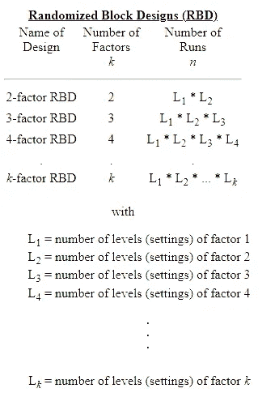
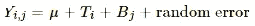
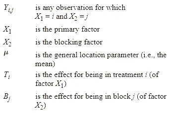
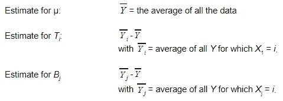

# 随机区组设计:简介，模型和估计一目了然！

> 原文：<https://medium.com/analytics-vidhya/randomized-block-design-introduction-model-and-estimates-at-a-glance-8683a4914518?source=collection_archive---------8----------------------->

随机区组设计相当于研究设计中的分层随机抽样。随机区组设计旨在最大限度地减少数据中的噪声或变化，这与分层抽样非常相似。

对于随机区组设计，有一个因素或变量是最重要的。然而，还有许多其他讨厌的因素。干扰因素是指那些可能影响计算结果，但不是最重要的因素。当我们试图监控有害因素时，可以使用一种称为阻塞的重要技术来最小化或消除有害因素对实验误差的影响。基本目标是设置同质块，其中滋扰因子保持不变，利益因子允许不同。感兴趣因素的不同水平的影响可以在块内测量，而不必担心由于在分析中考虑的块变量的变化而导致的差异。

如果主要因素的任何级别在滋扰因素的每个级别出现相同的次数，则滋扰因素被用作阻塞因素。实验的分析将集中在不同水平的主要因素的实验的每个块内的效果。为了消除一些最重要的有害变量的影响，使用了阻塞。为了减少剩余的有害变量的污染影响，然后使用随机化。

研究人员首先需要将样本分成相对均匀的(类似于分层抽样中的“阶层”)小组或区块。然后，在同质子群的块中，您想要实现的实验设计被实施。核心原则是变异性小于每个区块内整个样本的变异性。

因此，在一个区块内对治疗效果的任何估计都比整个样本的估计更有效。如果我们将这些更有效的估计值跨块进行汇总，我们可以得到一个比没有分块时更有效的平均估计值。

## 随机区组设计模型

随机区组设计的具有一个干扰变量的模型为:

在哪里

## 随机区组设计的估计

