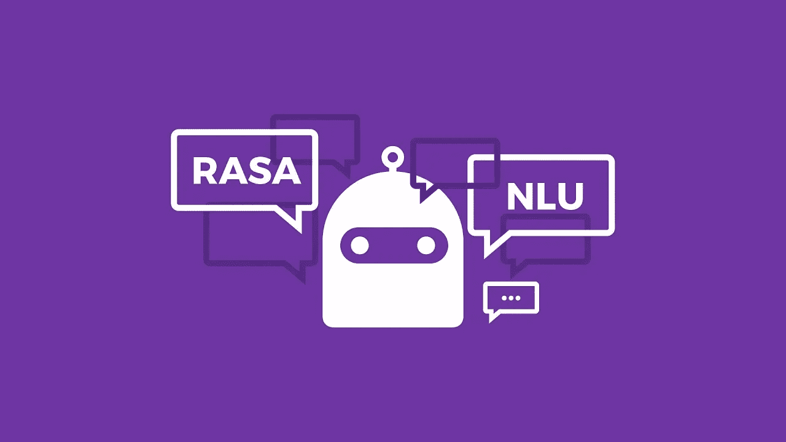

# voyage-1-了解什么是 Rasa 并制作第一个聊天机器人

> 原文：<https://medium.com/analytics-vidhya/rasa-chat-bot-voyage-1-a73b6e8e4947?source=collection_archive---------15----------------------->

## 我们将在这里为旅游业建造聊天机器人

那是 2020 年 7 月 6 日
,这是我在办公室的第一天，在介绍和我的工作任务之后，我被分配了我的第一个项目(在 RASA ),我的团队应该用 RASA 开发一个聊天机器人。我们对这项技术和聊天机器人领域还很陌生，但不知何故，经过 3 个月的努力，我们在最后期限前完成了我们的第一个项目。
但是我在三个月内注意到的事情。缺乏合适的博客，即使有几个，他们也不处理整个生产水平的聊天机器人。

所以我主动提出
在接下来的 7 篇博客中(至少有 7 篇我已经计划好了，数量只会增加)我会试着教你以下的事情

1.  RASA 的基本术语和 RASA 入门(虚拟环境设置和基本机器人)
2.  RASA 的文件结构是什么，我们如何处理意图和实体，我们可以做我们自己的？
3.  如何处理常见问题和聊天机器人。
    a .如何处理多个域文件和 Nlu 文件
4.  **自定义动作**
    a .自定义动作的基本用法。
    b .将句子转换器用于自定义动作
5.  什么是 **RASA X** 以及我们如何使用它？
6.  在您的网站上部署它
7.  Dockerise 你的聊天机器人(这样每个人都可以不用安装 RASA 就可以使用它)

免责声明—不需要 RASA 知识:微笑:

在这一系列博客中，我们将使用 **RASA** 制作**旅游机器人**

所以让我们直接进入主题。

**Rasa** 是一个开源的机器学习框架，用于构建 AI 助手和聊天机器人。大多数情况下，在 Rasa 中工作不需要任何编程语言经验



为

Ubuntu 16+、Mac OS 和 Windows 10 (Visual C++构建工具)

**注意:**如果您使用的是 windows，请确保您已经安装了 Visual c++构建工具。这是一些 python 包所必需的。使用 miniconda 可以避免系统中其他已安装 Python 包或冲突 Python 版本的问题。

然后安装 **Miniconda**

 [## Miniconda - Conda 文档

### Miniconda 是 conda 的免费最小安装程序。它是 Anaconda 的一个小型引导版本，只包含 conda…

conda.io](https://conda.io/miniconda.html) 

安装 miniconda 后，按照下面的命令在 conda 中创建一个虚拟环境。这将允许您无错误地运行 Rasa。

**如何为 Rasa 制作虚拟环境**

对于本教程，我使用的是 Ubuntu 18.04

```
conda update conda
conda create -n travel-bot python**=3.6** anaconda
conda activate travel-bot
```


在制作虚拟环境之后

**如何在虚拟环境中安装 Rasa**

```
pip3 install -U pip
pip3 install rasa
```

万一你得到一个关于**鲁梅尔的错误。试试这个**


```
pip3 install rasa --ignore-installed ruamel.yaml
```

是的，你已经完成了第一部分，而我感觉到了最艰难的部分。

现在让我们

## 基本机器人

只需键入:-

```
rasa init
```

它会问你是否要训练你的模型，按 **yes。**

所以花了将近 2 分钟后，你会看到这个


你会相信吗
你已经做出了基本的机器人。Rasa 每次都为您提供这个非常简单的架构，现在即将推出教程，我们将修改这个环境，使我们的**旅行机器人。**

试着和你的机器人说话在下一个教程中，我会解释你用**Rasa Init
得到的
文件，以及它们的**是什么意思****

停止和你的机器人说话

```
/stop
```

希望你喜欢
:+1:

如果是的话，将会很棒，接下来将会是巨大的
:火: