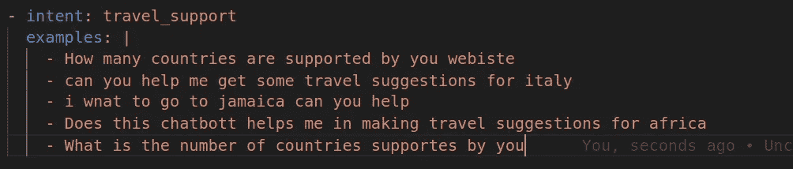

# 解释你的聊天机器人的文件结构

> 原文：<https://medium.com/analytics-vidhya/rasa-chatbot-voyage-2-198e633e8c0e?source=collection_archive---------6----------------------->

嘿，欢迎来到这个使用 Rasa 系列的**聊天机器人的第二部分。我希望你已经看到了我解释的第一部分。
如何建立一个虚拟环境并制作一个初始机器人。如果您尚未看到该部分，请单击此处**

[](/analytics-vidhya/rasa-chat-bot-voyage-1-a73b6e8e4947) [## voyage-1-了解什么是 Rasa 并制作第一个聊天机器人

### 旅游业的旅游机器人

medium.com](/analytics-vidhya/rasa-chat-bot-voyage-1-a73b6e8e4947) 

今天博客的议程:-

1.  rasa 中的**意图**和**实体**是什么？
2.  Rasa 中的文件结构(Rasa Init 后得到的文件)做了一些自定义的意图。
3.  **训练修改后的模型**并与之对话


鸣谢:blog.spg.ai

# 什么是意图和实体

我将举例说明意图，比如说我们有 5 个句子

1.  我能买些披萨吗
2.  上周我在纽约的时候，我喝了一杯非常美味的奶昔
3.  我已经很久没有吃到美味的巧克力蛋糕了。
4.  宝贝，我们今天出去吃晚饭好吗
5.  我的**蛋白奶昔**在哪里？

现在试着仔细分析这 5 个句子，你观察到了什么
它们都与**食物查询**有某种联系

因此，我们将在 rasa 中做的是，我们将制作一个名为 **food-query** 的 **intent** ，我们将把所有这 5 个句子放在它下面，并训练我们的 Rasa 模型。

好的，先生，我明白了**意图的**但是什么是**实体**。
所有突出显示的单词被称为**实体**，它们将被标记为
实体**食品。** 可以在训练数据中生成，也可以借助**正则表达式**生成

# RASA 中的文件结构


rasa 初始化后的文件

## 数据:-

这个文件夹包含所有的 **NLU** 和**规则**和**故事**文件。

但是阁下，这些文件是什么，它们是什么意思？

# NLU 文件:-


NLU 代表**自然语言理解**这个简单语言的文件包含你的**自然语言数据**，Rasa 将在其上进行训练。NLU 文件(nlu.yml)包含了我上面解释过的**意图**和**实体**等类别。在每一个意图下，都有实际上是你的训练数据的训练例子。
***重要点*** 制作训练数据时要牢记。

*   给每个意图下的例子添加补充，但是例子不应该太不同，以免你的意图混淆。
*   在每个意图下至少添加 5 个例子。
*   **意图**应该传达用户可以向聊天机器人提问的感觉，因为不是每个问题都被认为是**意图**。
*   **在每个意图中添加一些错误的例子，因为没有训练数据是不完美的**

## 规则文件:-


规则非常适合处理小型的特定对话模式。一旦 rasa 识别出**用户的意图，这些基本上是必须遵守的硬性限制。** 

1.  我们在 domain.yml 中定义这些 **utter 的**。
2.  Rasa 使用 **config.yml** 中定义的管道做出响应

## 不要担心，我会在这个博客中解释域名文件和下面的内容:)

## 以及在以后的博客中，Rasa 如何借助 config.yml 中定义的管道使用 ML 做出响应

定义规则时要记住的要点:-

1.  **不要过度使用规则(最重要的是因为我们的目标是制作一个上下文聊天机器人)**
2.  取消对 **config.yml** 中的规则策略的注释(在您的项目中必须使用规则)


## 故事文件:-


每当你和机器人说话的时候。可能有两种情况

*   要么你们的谈话进行得很顺利(**快乐之路**)。
*   或者不是(**悲伤之路**)

故事是用户和人工智能助手之间对话的表示，被转换成特定的格式，其中用户输入被表示为意图(和必要时的实体)，而助手的响应和动作被表示为动作名称。

重要提示:-

*   好的故事有助于减少聊天机器人中的误报(我从自己的经验中看到的)。
*   记住，你不能为每一个意图编一个故事，也不能在 stories.yml 中涵盖每一条快乐的路。

## Domain.yml

域文件这是你的聊天机器人的世界。它包含了你想要训练的所有意图，以及每个意图的所有**发声**(响应)。

定义话语时要记住的规则:-

假设您的意图的名称是 **goodbye** ，那么在 domain.yml 中，我们将使用名称 **utter_goodbye** 来定义它的响应(这是强制的)，以这种特定的方式定义响应。

1.  我们必须在**域文件**中定义**聊天机器人**的每个意图
2.  我们可以制作**多个域文件**如果我们有这个项目的大项目，我们将制作多个域文件。

## Config.yml

这个文件包含了你的聊天机器人将用来解释用户信息和**预测它的意图**，然后预测正确的**发出**的管道。所有这些意图和话语的预测都是在政策的帮助下完成的(我们将在以后的博客中讨论政策)

## 行动

该文件夹包含一个非常重要的文件，即 **actions.py** 这将是我们编写自定义动作的地方。

## *等等:(*


嘿，但是听着，这是最有趣的部分(**这是一个 python 文件** )
意味着你可以用它做几乎所有的事情

1.  *点击一个 API*
2.  *为用户消息编写自定义回复。*
3.  *从数据库中提取数据*

任何事都意味着任何事。
(例如，我为我的一个客户在这个动作文件中写了一个自定义拼写检查器，并在我们的聊天机器人中使用了它)那真是太有趣了

最后 **Credentials.yml** 和 **endpoints.yml** 我将在部署博客(5-6)中解释这些文件，因为它们仅在那时使用

# 让我们实际一点

在这里，我正在制定我们的第一个定制意图



仔细看我犯的小拼写错误
(例子 4 聊天机器人的拼写)

定义其答案头为 **Domain.yml**


现在让我们训练我们的模型

单纯型精神分裂症

```
rasa train
```

在你激活的虚拟环境中。
训练完成后
你可以对你的 **TravelBot** 说

```
rasa shell
```

看看它能否回答与您的 **travel_support** 意图相似的问题。
1。如果是，你可以添加更多的意图。

2.如果没有，添加更多的训练数据

干得好，伙计们，你们今天学到了很多。
如果你喜欢我的作品
**分享**和**拍**会很棒。
关注作者:)

**https://github.com/sahibpreetsingh12/travel-bot**[项目的 Github 回购](https://github.com/sahibpreetsingh12/travel-bot)