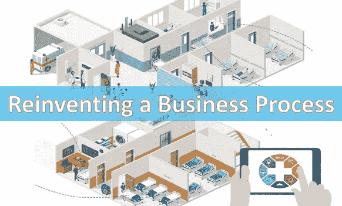

# 将数据科学融入业务流程以取得成功

> 原文：<https://medium.com/analytics-vidhya/re-inventing-a-business-process-31b672ab691a?source=collection_archive---------3----------------------->

你可能是一个注重运营效率的创业者。你可能是一名业务分析师，正在寻找复杂操作的洞察力。你可能想要增加机器学习的能力来提高生产力。或者你可能需要为变更管理提出一个新的过程。如果以上任何一条适用于你的努力，你会发现这篇文章非常相关。本文提出了建议和对策