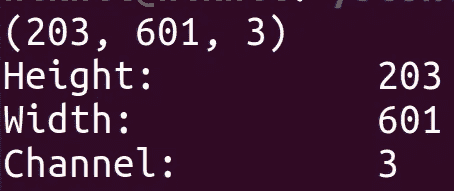
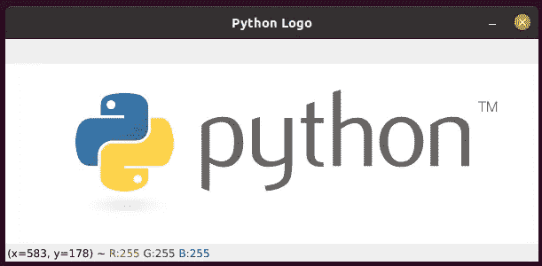
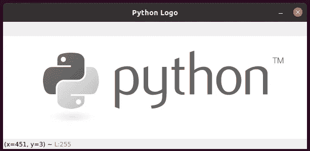

# 使用 cv2.imread() — OpenCV Python —白痴开发者读取图像

> 原文：<https://medium.com/analytics-vidhya/read-image-using-cv2-imread-opencv-python-idiot-developer-4b7401e76c20?source=collection_archive---------0----------------------->

在本教程中，我们将重点介绍使用 Python 编程语言读取图像。为此，我们将使用 OpenCV 库。OpenCV 是指以计算机视觉和机器学习为目标的开源计算机视觉库。

要在 Python 中使用 OpenCV，请安装以下库:

1.  NumPy
2.  OpenCV

要安装上述库，请使用以下命令。

```
pip install opencv-python 
pip install numpy
```

# 导入

在这里，我们将导入所有需要的库。

```
import numpy as np 
import cv2
```

# cv2.imread —读取图像

使用函数 **cv2.imread()** 读取图像。

**语法:** cv2.imread(path，flag)

*   **路径:**路径代表图像在磁盘上的位置。
*   **标志:**标志代表图像应该被读取的方式。默认值为 **cv2。IMREAD_COLOR** 。

如果路径正确，则返回图像矩阵，否则不返回任何内容(None)。

有三种方法可以读取图像。我们可以为 **cv2.imread()** 函数中的**标志**参数使用以下值。

*   **cv2。IMREAD_COLOR:** 用于读取 RGB 图像。它会忽略图像中存在的 alpha 通道。这是标志参数的默认值。您也可以为该标志指定 **1** 。
*   **cv2。im read _ gray:**用于读取灰度图像，即黑白格式。您也可以为此标志指定 0。
*   **cv2。IMREAD_UNCHANGED:** 用来照原样读取图像。它不会进行任何更改或忽略图像中的任何内容。您还可以为此标志指定-1。

# 读取 RGB 格式的图像

```
""" Image path representing the location of the image on the disk. """ 
image_path = "python-logo.png" """ Reading the image and returning the image matrix """
image = cv2.imread(image_path, cv2.IMREAD_COLOR)
```

image 变量以 **numpy.ndarray** 类的形式表示图像矩阵。若要获得此 numpy.ndarray 的形状，请使用 shape 函数。

```
print(image.shape) print(f"Height:\t\t {image.shape[0]}") 
print(f"Width:\t\t {image.shape[1]}") 
print(f"Channel:\t {image.shape[2]}")
```



RGB 图像的高度、宽度和通道数。

语句 **image.shape** 返回一个包含三个值的列表，这三个值分别代表通道的高度、宽度和数量。

```
""" Displays the image in a GUI window. Press ESC key and the window is removed automatically. """
cv2.imshow("Python Logo", image)
cv2.waitKey(0)
cv2.destroyAllWindows()
```



图像以 RGB 格式显示在 GUI 窗口中。

# 读取灰度格式的图像

```
import numpy as np 
import cv2 """ Image path representing the location of the image on the disk. """ 
image_path = "python-logo.png" """ Reading the image and returning the image matrix """ 
image = cv2.imread(image_path, cv2.IMREAD_GRAYSCALE) print(image.shape) print(f"Height:\t\t {image.shape[0]}") 
print(f"Width:\t\t {image.shape[1]}")
```


灰度图像的高度和宽度。

```
""" Displays the image in a GUI window. Press ESC key and the window is removed automatically. """ 
cv2.imshow("Python Logo", image) 
cv2.waitKey(0) 
cv2.destroyAllWindows()
```



图像以灰度格式显示在 GUI 窗口中。

# 阅读更多

*   [**图像文件读写**](https://docs.opencv.org/master/d4/da8/group__imgcodecs.html)
*   [**Python OpenCV 读取图像— cv2 imread()**](https://pythonexamples.org/python-opencv-read-image-cv2-imread/)

*原载于 2021 年 6 月 3 日*[*【https://idiotdeveloper.com】*](https://idiotdeveloper.com/read-image-using-cv2-imread-opencv-python/)*。*