# 通过 Python 阅读你在脸书的朋友网络

> 原文：<https://medium.com/analytics-vidhya/read-your-network-of-friends-in-facebook-by-scraping-with-python-a012adabb713?source=collection_archive---------7----------------------->

**注**:你可以在一个 [Kaggle 笔记本](https://www.kaggle.com/rubchume/read-your-network-of-friends-in-facebook)中访问本文的所有代码。


照片由[阿丽娜·格鲁布尼亚](https://unsplash.com/@alinnnaaaa?utm_source=medium&utm_medium=referral)在 [Unsplash](https://unsplash.com?utm_source=medium&utm_medium=referral) 上拍摄

在数学中[图](https://en.wikipedia.org/wiki/Graph_theory)是*数学结构，用于建模对象*(根据维基百科)*。*

用通俗的话来说，就是抽象的表示一组元素以及它们之间的联系。例如，它可以用来表示城市是如何通过铁路连接起来的。在最简单的形式中，如果我们想要表示一个连接，一个图可以由一组表示元素(或图命名法中的节点)的圆和连接这些圆的线(或边)来直观地表示。

例如，这是一个图表:

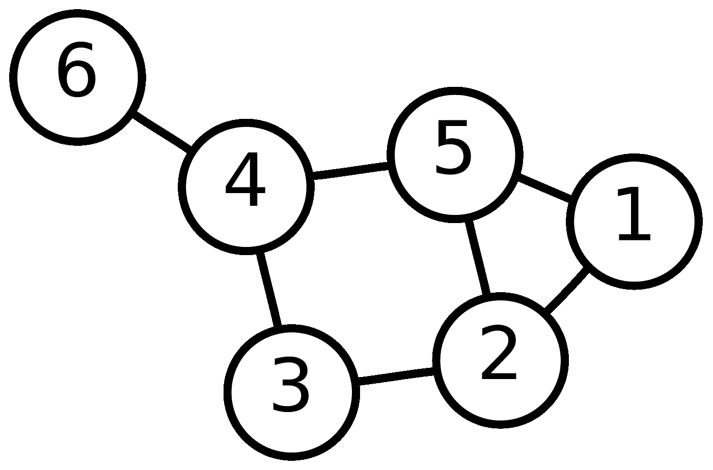

6 号元素/节点连接到 4 号元素/节点，4 号元素/节点连接到 5 号元素和 3 号元素，依此类推。

图形也可以用来模拟社会网络，也就是人的网络。如果每一个节点都是一个人，每一条边都代表他们是否是朋友，那么我们可以用一个图来建模一个友谊网络，并如上图用圆圈和线条来可视化。

这就是我们将要做的。但是，我们要用什么样的社交网络来做呢？嗯，我们将使用你们自己的脸书网络。

脸书是一个巨大的社交网络。你不可能知道整个脸书网络的结构。有几千几百万用户。你无法访问它，也没有计算资源来处理所有这些信息。但是，您可以访问该网络的一个子集。怎么会？

你不能接触到所有的信息，但你可以接触到一些。首先，你在脸书(我猜，否则这篇文章对你没有多大意义)。所以，你知道你是网络的一个节点。


你还知道什么？你了解你的朋友。它们也是图/网络的节点。你知道你和他们是朋友，所以你和他们之间有边缘/联系。

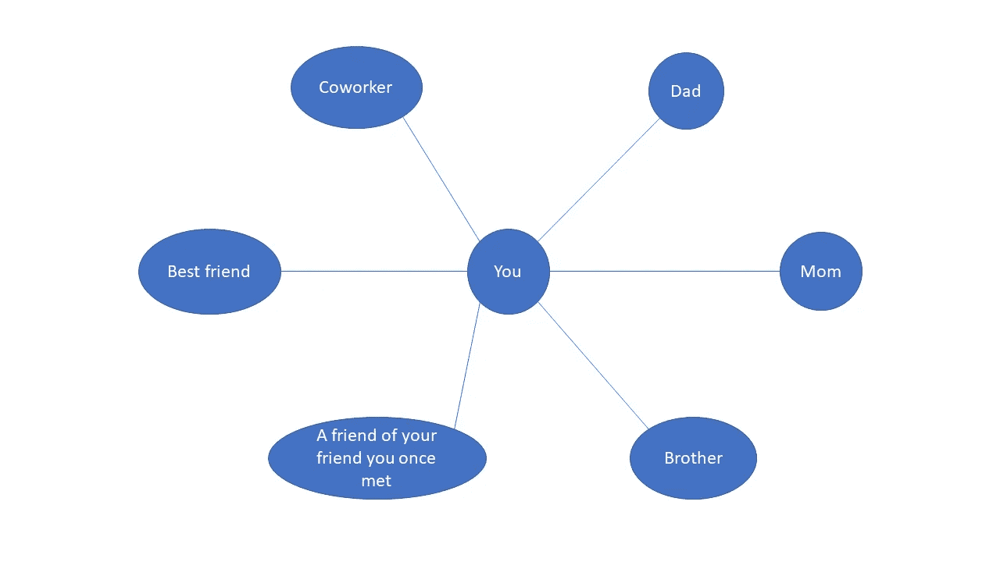

你还知道什么？你了解你的朋友。它们也是图/网络的节点。你知道你和他们是朋友，所以你和他们之间有边缘/联系。


所以，你可以知道你的脸书网络！它不是整个网络，但它是整个网络的一个子集。这确实是您可能最感兴趣的子集。

然而，这个网络有一条我们并不真正感兴趣的信息，因为它是多余的。你已经知道你是所有剩余节点的朋友。所以，你作为一个节点，你和其他节点之间的所有边都是噪音。如果我们删除它们，留给我们的是一个只包含新信息的网络。

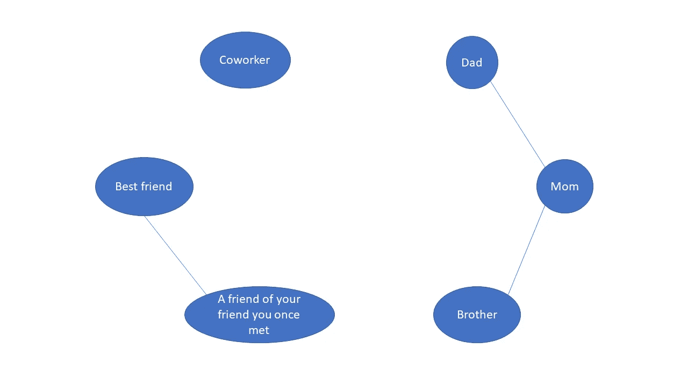

这就是我们感兴趣的网络。

在这篇文章中，我将向你展示如何获取必要的信息来构建这个图表。这些信息一方面是你的朋友列表，另一方面是他们之间的联系。我们将通过抓取 Facebooks 网页来做到这一点，即每次登录时从下载到浏览器的 html 代码中获取信息。

我们将要使用的主要工具是 [Selenium](https://www.selenium.dev/) ，这是一个用于这类项目的强大 Python 库。

当我们得到所有这些信息时，我将在下一篇文章中教你如何可视化那个图:[用 Python 中的社交网络分析组织你的婚礼](https://rubchume.medium.com/organize-your-wedding-with-social-network-analysis-in-python-aeab9d8814b3)。

如果你只是想做，但对学习如何做不感兴趣，你也可以下载一个我用 Django 开发的 web 应用程序来做所有这些。从 GitHub [库](https://github.com/rubchume/FacebookFriendNetworkAnalyzer)下载它，并遵循`Readme.md`文件中的说明。

开始吧！！！

**重要提示**

脸书经常改变它的网页设计。这意味着，在您阅读本文时，我在这里提出的解决方案可能不起作用。

但是不要难过。我在这里介绍的过程实际上是有用的，但是您必须找到的特定按钮或`<div>`元素可能是不同的，所以您应该修改我在更新的脸书设计中使用的 CSS 选择器。

# 安装 Selenium

Selenium 是一个软件工具，允许自动使用网络浏览器。简而言之，我们可以执行普通网络用户用鼠标和键盘就能完成的动作，但是我们可以通过编写代码来定义它们，从而自动化它们，安排它们，非常快速地重复它们，等等。用途由你决定。

这有什么用？比方说，你的朋友整周都在恳求你喜欢她在 Instagram 上的所有新照片。那是一项乏味的任务。你没那么喜欢 Instagram，你甚至不喜欢她的图片，她用了那么多滤镜都认不出来了。你甚至不知道为什么你们还是朋友…但那不关我的事，让我们集中注意力好吗。

你可以使用 Selenium 自动完成这项任务，而不是每个周末都在她所有的照片上点击“喜欢”按钮。你只需要写一些代码，Selenium 就会连接到，比如说，谷歌 Chrome，来喜欢你朋友所有的照片。

它可以在很多编程语言中使用，当然也有一个用于 Python 的 [API。](https://selenium-python.readthedocs.io/)

安装 Selenium 通常不会产生太多问题，但有时会很麻烦。有关说明，请参考前面的链接。

你需要一些基本的东西。首先，从安装 Python 包开始:

```
pip install selenium
```

然后，您需要选择允许 Selenium 使用的浏览器。我选择了谷歌浏览器，因为它是我一直使用的。

为了允许 Selenium 和 Chrome 之间的通信，您需要为 Selenium 提供一个 web 驱动程序。如果你想像我一样使用 Chrome，你可以在这个[链接](https://sites.google.com/a/chromium.org/chromedriver/downloads)中下载与你的 Chrome 版本对应的 web 驱动。下载。根据您的操作系统，提取该文件并将其放在您要执行代码的同一个文件夹中。

最后，导入 Python 中的库并实例化 web 驱动程序:

```
from selenium import webdriver
from webdriver_manager.chrome import ChromeDriverManagerdriver = webdriver.Chrome()
```

如果您将它放在其他文件夹中，也可以提供路径:

```
driver = webdriver.Chrome(“path/to/chromedriver.exe”)
```

然而，对我来说最简单的选择是使用一个叫做 [webdriver_manager](https://pypi.org/project/webdriver-manager/) 的工具，它为你处理驱动程序下载并保存在缓存中以备将来使用。

```
from webdriver_manager.chrome import ChromeDriverManager driver = webdriver.Chrome(ChromeDriverManager().install())
```

当我们执行上面提到的三个选项中的任何一个时(我个人更喜欢最后一个)，就会出现一个 Chrome 窗口。您可能会得到稍微不同的视图，并且您将看到的文本可能是您的语言。我是西班牙人，所以我看到西班牙语文本。

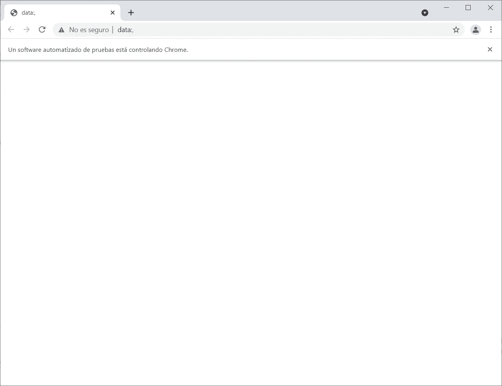

如果顺利的话，我们可以从娱乐开始。

# 登录 Faceboo

获得我们的朋友脸书网络的第一步是登录脸书。我们必须首先访问页面。这很简单:

```
driver.get(“https://www.facebook.com/")
```

我们将看到这样一个屏幕:

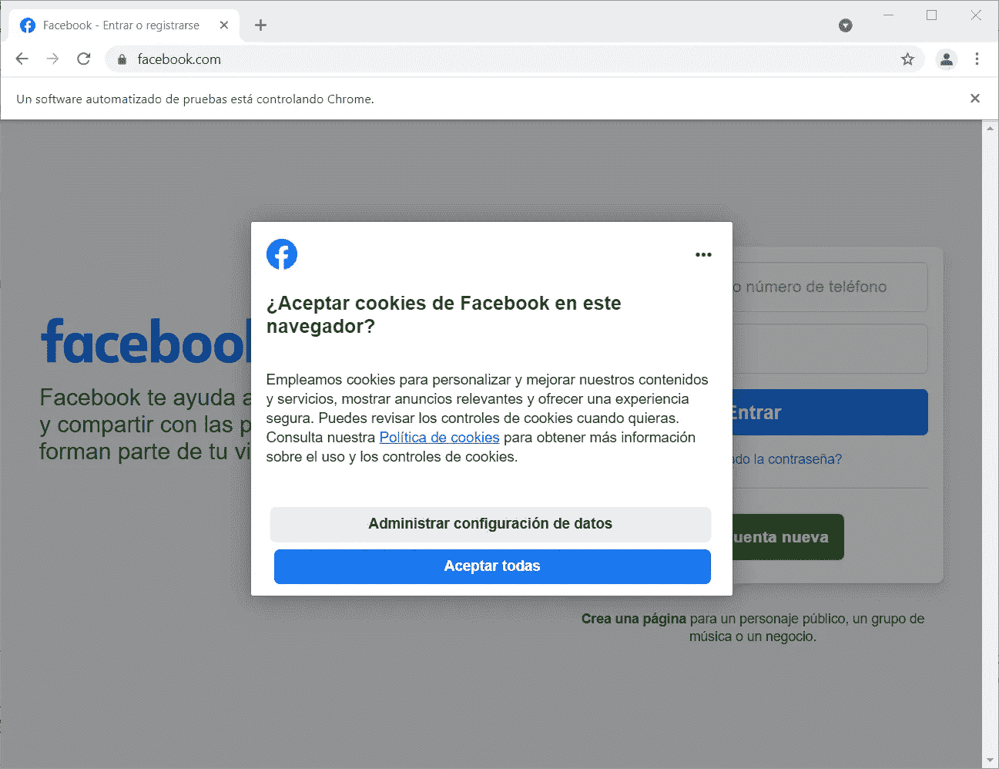

它要求我们接受 cookies，因为我们不在我们通常的 Chrome 实例中，我们已经登录，并且我们可以访问所有的 cookies。这是一个新会话，没有用户登录，因此从脸书的角度来看，我们是一个未知用户。

要接受 cookies，我们必须找到“接受全部”按钮，然后点击它，但不是用鼠标，而是用代码。

但是由于页面不会立即加载，我们必须告诉 Selenium 等待几秒钟，直到按钮被加载，也就是说，直到 html 代码中出现。

我们将使用一个 [CSS 选择器](https://www.w3schools.com/cssref/css_selectors.asp)来找到按钮，同样的方法将在文章的其余部分使用。要查看 CSS 选择器会找到每个按钮或任何其他元素，您可以使用一些 Chrome 扩展或只打开 Chrome 开发工具(Ctrl + Shift + I)并浏览页面的 html 代码。

```
from selenium.webdriver.support.wait import WebDriverWait
from selenium.webdriver.support import expected_conditions as EC
from selenium.webdriver.common.by import By

accept_cookies_button = WebDriverWait(driver, 10).until(
    EC.element_to_be_clickable(
        (By.CSS_SELECTOR, "button[data-testid='cookie-policy-dialog-accept-button']")
    )
)

accept_cookies_button.click()
```

很好！你按了第一个按钮！恭喜你。让我们继续前进。

现在我们可以用我们的用户和密码填充登录字段。

```
user_css_selector = "input[name='email']"
password_css_selector = "input[name='pass']"

username_input = WebDriverWait(driver, 10).until(
    EC.element_to_be_clickable((By.CSS_SELECTOR, user_css_selector))
)
password_input = WebDriverWait(driver, 10).until(
    EC.element_to_be_clickable((By.CSS_SELECTOR, password_css_selector))
)

username_input.clear()
username_input.send_keys("myuser@blablabla.com")
password_input.clear()
password_input.send_keys("myPassword1232345345")
```

或者，如果您将您的用户和密码保存在一个`. env '文件中，我推荐您这样做，您可以使用` dotenv '来加载它们:

```
from dotenv import dotenv_values

config = dotenv_values(".env")

username_input.clear()
username_input.send_keys(config["user"])
password_input.clear()
password_input.send_keys(config["password"])
```

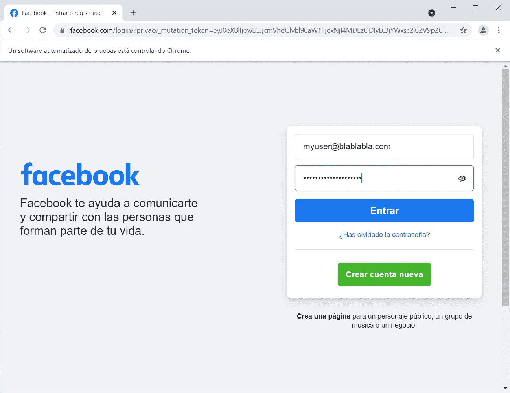

现在，只需点击登录按钮。你能从上面的例子中猜出怎么做吗？

```
WebDriverWait(driver, 2).until(
    EC.element_to_be_clickable((By.CSS_SELECTOR, "button[type='submit']"))
).click()
```

我们登录了！！！是不是感觉很强大。

但是我们不要这么早庆祝。我们继续。我们现在想做什么？我们想得到我们的朋友名单。然后我们必须进入相应的页面。但首先，等待几秒钟，以便脸书页面可以正确加载。

```
import time

time.sleep(2)
driver.get("https://www.facebook.com/friends/list")
```

# 阅读朋友列表

现在我们进入了混乱的水域。我们想得到我们所有朋友的名单。这里有两种方法。一种，是手动向下滚动所有朋友的面板。另一种方法是利用 GraphQL API 以更高效、更优雅的方式完成这项工作。我选择了第二种方式，因为我觉得它更有趣。

想法是这样的。当您向下滚动 friends 面板时，后面发生的事情是您的浏览器正在向服务器发送 http 请求，请求 JSON 格式的新一批朋友(接下来的 10 个朋友将在屏幕上可见)信息。

因此，我们不做滚动，只是模拟相同的 http 请求，使用 [GraphQL](https://graphql.org/) 。你不需要知道 GraphQL 是什么，不用担心。我也不太了解。如果你不想花时间研究它，就认为它是一套在后端和前端之间共享信息的规则。这是一种设计 web APIs 的改进方法。

我们将用来发出 http 请求的库是[请求](https://docs.python-requests.org/en/master/)。我创建请求所做的只是使用 Chrome 开发工具(网络选项卡)来检查交换了哪些请求，并查看发送到`graphql/`端点的请求使用了哪些头部和主体:

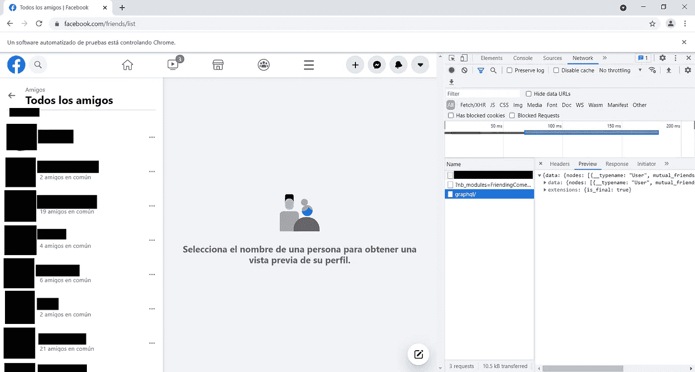

我不打算详细描述请求和响应的头部和主体，主要是因为它可能会随时间而改变，可能会早于晚。

亲爱的读者，这对你来说是个坏消息，因为这意味着你必须修改代码，我将向你展示。无论如何，您必须遵循的推导正确的标题和正文的过程与我遵循的过程相同。

我发现的是。为了让后端向你提供你所要求的信息，它必须确保你就是你所说的那个人。它通过两种方式做到这一点。首先，你应该为会话设置与 Chrome 实例使用的相同的 cookies。其次，您必须在 http 请求数据中发送一个名为“fb_dtsg”的字段。我不是 web 开发人员，所以我不打算假装我理解 GraphQL 是如何工作的，有哪些约定，或者为什么脸书除了 cookies 之外还需要这个“fb_dtsg”字段来识别用户。无论如何，这两个值是我需要设置的，这样我就可以得到我想要的信息。

cookies 问题很容易解决。您可以使用 Selenium 驱动程序轻松访问 cookie 字段，并将它们分配给请求会话:

```
import requests

session = requests.session()
session.cookies.update({
    cookie["name"]: cookie["value"]
    for cookie **in** driver.get_cookies()
})
```

可以通过在好友列表页面的 html 源代码中找到一个模式来找到`fb_dtsg`标记:

```
import json
import re

pattern = r'\["DTSGInitData",\[\],{"token":"\S+","async_get_token":"\S+?"},\d+\]'match = re.search(pattern, driver.page_source)
fb_dtsg_token = json.loads(match.group())[2]["token"]
```

现在我们准备询问我们第一批朋友的信息:

```
import urllib

url = 'https://www.facebook.com/api/graphql/'

headers = {
    "accept": "*/*",
    "accept-language": "es-ES,es;q=0.9",
    "content-type": "application/x-www-form-urlencoded",
    "sec-ch-ua": "**\"** Not;A Brand**\"**;v=**\"**99**\"**, **\"**Google Chrome**\"**;v=**\"**91**\"**, **\"**Chromium**\"**;v=**\"**91**\"**",
    "sec-ch-ua-mobile": "?0",
    "sec-fetch-dest": "empty",
    "sec-fetch-mode": "cors",
    "sec-fetch-site": "same-origin",
    "x-fb-friendly-name": "FriendingCometFriendsListPaginationQuery",
    "referrer": "https://www.facebook.com/friends/list",
    "referrerPolicy": "strict-origin-when-cross-origin",
}

response = session.post(
    url,
    headers=headers,
    data=urllib.parse.urlencode(
        {
            "fb_dtsg": fb_dtsg_token,
            "fb_api_req_friendly_name": "FriendingCometFriendsListPaginationQuery",
            "variables": json.dumps(
                {
                    "count": 30,
                    "cursor": None,
                    "scale": 1,
                }
            ).replace(" ", ""),
            "doc_id": 4268740419836267,
        }
    )
)
```

有两件事要提一下。第一，不要担心那些你不知道是什么意思的字段。就像我一样设置它们。其中一个你必须注意的是`doc_id`。当你用 Chrome 开发者工具检查请求数据时，这是一个出现在请求数据中的数字。和以前一样，我不打算假装它是用来做什么的或者为什么是必要的。包括它就行了。否则，这是行不通的。

我认为这是一个识别你所要求的数据类型的数字。我观察到这个数字经常变化，但是，只要你使用你观察到的人，它就会起作用。至少，它对我有用。这意味着可能有多个有效的 doc _ ids，这是个好消息。上面那个是对我有效的。我不知道它们是通用的还是必须为每个用户定制的。

现在我们继续。我们用朋友的数据得到了一个 http 响应。让我们把它解析成一个 Python 字典:

```
response_dict = json.loads(response.content)
friend_objects = response_dict["data"]["viewer"]["all_friends"]["edges"]

friends = [
    dict(
        user_id=str(friend["node"]["id"]),
        name=friend['node']['name'],
        link=friend['node']['url'],
        gender=friend['node']['gender']
    )
    for friend **in** friend_objects
    if friend["node"]["__typename"] == "User"
]

print(f"Number of friends: **{**len(friends)**}**")# Output:
Number of friends: 30
```

你会注意到两件事。一是反应的结构相当复杂。同样，它与 GraphQL 中信息的格式化方式有关。但是一旦找到相关信息的途径，就很容易处理了。有很多信息，但我发现唯一相关的字段是用户 id、姓名和配置文件链接。我也存了性别，因为我很好奇我的男性朋友多还是女性朋友多。

第二件应该引起你注意的事情是只有 30 个朋友。这是怎么回事？我以为我会更受欢迎一点😭。

实际上，我有 300 多个朋友。为什么名单上只有 30 个？嗯，我们告诉它这样做。如果你注意请求数据中的字段`count`，我们请求了 30 个朋友，这就是我们得到的。为什么我们不邀请 300 个朋友呢？我试过了，但没用。

原因是后端只给浏览器发送面板上可见好友的信息。向下滚动时，浏览器会依次请求下一批好友，直到到达列表的末尾。

在第一个请求中，我们只有 30 个朋友，因为这是目前唯一相关的信息。想象一下，每当你只想和你最好的朋友聊天的时候，下载你所有的朋友列表会是多么的低效。这是对带宽的浪费。由于这是普通用户的预期行为，他们必须设置每个请求 30 个好友的限制。

但是我们如何要求下一批朋友呢？嗯，有一个“秘密”。当我们得到响应时，会有一个字段告诉我们是否有更多可用的信息。而且，在这种情况下，它还告诉我们下一个朋友的`cursor`是什么。

`cursor`？那是什么？似乎当请求您的朋友列表时，每个朋友都有一个字母数字长代码(一个`cursor`)与之相关联。因此，在我们得到的响应中，它在告诉我们:“嘿，有更多的朋友可用，列表中的下一个朋友就是有这个光标的朋友”。

你是怎么得到这些信息的？像这样:

```
page_info = response_dict[“data”][“viewer”][“all_friends”][“page_info”]
```

字段`page_info`是具有两个字段的对象:`has_next_page`和`end_cursor`。`has_next_page`是一个布尔值，它告诉我们是否有更多的朋友需要添加，或者是否已经到了列表的末尾。在有更多的情况下，`end_cursor`是下一个朋友的光标。例如:

```
{
    'has_next_page': True,
    'end_cursor': 'VeryLongRandomAlphanumericSequence-x9QpwrV7w2xv2QS6DlDOOKQIIfWJAQropRaZvQUz'
}
```

我们用这个做什么？当发送一个新的请求时，如果它与前一个相同，后端将向我们发送相同的信息。我们必须告诉它，我们希望下一个朋友序列从光标等于我们得到的`end_cursor`值的用户开始。

```
response = session.post(
    url,
    headers=headers,
    data=urllib.parse.urlencode(
        {
            "fb_dtsg": fb_dtsg_token,
            "fb_api_req_friendly_name": "FriendingCometFriendsListPaginationQuery",
            "variables": json.dumps(
                {
                    "count": 30,
                    "cursor": page_info["end_cursor"],
                    "scale": 1,
                }
            ).replace(" ", ""),
            "doc_id": 4268740419836267,
        }
    )
)

response_dict = json.loads(response.content)
friend_objects = response_dict["data"]["viewer"]["all_friends"]["edges"]

friends += [
    dict(
        user_id=str(friend["node"]["id"]),
        name=friend['node']['name'],
        link=friend['node']['url'],
        gender=friend['node']['gender']
    )
    for friend **in** friend_objects
    if friend["node"]["__typename"] == "User"
]

print(f"Number of friends: **{**len(friends)**}**")# Output:
Number of friends: 60
```

如你所见，现在我们又多了 30 个朋友。你可以这样做，直到没有朋友了:

```
page_info = dict(has_next_page=True, end_cursor=None)

url = 'https://www.facebook.com/api/graphql/'

headers = {
    "accept": "*/*",
    "accept-language": "es-ES,es;q=0.9",
    "content-type": "application/x-www-form-urlencoded",
    "sec-ch-ua": "**\"** Not;A Brand**\"**;v=**\"**99**\"**, **\"**Google Chrome**\"**;v=**\"**91**\"**, **\"**Chromium**\"**;v=**\"**91**\"**",
    "sec-ch-ua-mobile": "?0",
    "sec-fetch-dest": "empty",
    "sec-fetch-mode": "cors",
    "sec-fetch-site": "same-origin",
    "x-fb-friendly-name": "FriendingCometFriendsListPaginationQuery",
    "referrer": "https://www.facebook.com/friends/list",
    "referrerPolicy": "strict-origin-when-cross-origin",
}

friends = []

while page_info["has_next_page"]:
    response = session.post(
        url,
        headers=headers,
        data=urllib.parse.urlencode(
            {
                "fb_dtsg": fb_dtsg_token,
                "fb_api_req_friendly_name": "FriendingCometFriendsListPaginationQuery",
                "variables": json.dumps(
                    {
                        "count": 30,
                        "cursor": page_info["end_cursor"],
                        "scale": 1,
                    }
                ).replace(" ", ""),
                "doc_id": 4268740419836267,
            }
        )
    )

    response_dict = json.loads(response.content)
    friend_objects = response_dict["data"]["viewer"]["all_friends"]["edges"]

    friends += [
        dict(
            user_id=str(friend["node"]["id"]),
            name=friend['node']['name'],
            link=friend['node']['url'],
            gender=friend['node']['gender']
        )
        for friend **in** friend_objects
        if friend["node"]["__typename"] == "User"
    ]

    page_info = response_dict["data"]["viewer"]["all_friends"]["page_info"]

print(f"Number of friends: **{**len(friends)**}**")
```

我们有完整的朋友名单！！！恭喜你，伙计，你成功了一半！休息一会儿，等你准备好了再回来。

# 找到你所有朋友的共同朋友

这是最繁琐的部分，抱歉。但是现在你已经在这里了，不要放弃，当你得到你的结果时，你会满意的。

我们要做的是得到网络的边(连接圆的线)。我们将用我能想到的最简单原始的方法来做。我们将一个接一个地访问您的每个朋友的个人资料，转到“共同的朋友”部分，向下滚动，直到所有朋友都出现，最后阅读并保存它们。

> 为什么不再使用 GraphQL API 呢？

这是一个合理的问题。答案是我已经尝试过了，而且我成功了(在短短几秒钟内我就下载了所有的信息)，但是脸书会知道你有可疑的行为，并会阻止你的帐户的一些功能至少几个小时，这是非常不方便的。但是不要抱怨。这个政策很有意义，因为脸书不知道是你用 Python 做了一些网页抓取练习，还是一个恶意软件未经你同意使用了你的浏览器。因此，脸书以这种方式保护我们的数据实际上是一个好消息。

无论如何，我最终使用的解决方法是假装我们是一个普通用户访问他朋友的个人资料。直到现在我的账户还没有被封。

让我们从简单的步骤开始，然后把所有的东西放在一起。我们需要做的第一件事是什么？转到我们朋友的个人资料。为此，我们需要该页面的 URL。这很棘手，因为当涉及到用户资料时，有两种类型的 URL。

其中一些，我猜是旧的，有这种形式(id 是一个不存在的例子):

```
[https://www.facebook.com/profile.php?id=123456789014389713490753713](https://www.facebook.com/profile.php?id=123456789014389713490753713)
```

但是它们中的大多数都有这样的形式:

```
[https://www.facebook.com/barack.obama.or.something](https://www.facebook.com/barack.obama.or.something)
```

根据我们拥有的不同，共同好友页面的 URL 略有不同。在第一种情况下，它是一个查询参数。在第二种情况下，它是路径的一部分。让我们以我们的第一个朋友为例:

```
friend = friends[0]

profile_link = friend["link"]

url_parsed = urllib.parse.urlparse(profile_link)

if url_parsed.path == "/profile.php":
    mutual_friends_link =  f"**{**profile_link**}**&sk=friends_mutual"
else:
    mutual_friends_link = f"**{**profile_link**}**/friends_mutual"

driver.get(mutual_friends_link)
time.sleep(1.5)
```

Booom！干得好。

现在我们在页面上。但是，即使我们等了一段时间让它加载，它很可能还没有完全加载，而且无论你等多久都不会加载。

记住:如果用户不向下滚动，脸书不会加载所有信息，否则会浪费资源。所以，如果你和你的朋友有很多共同的朋友，他们不会显示在屏幕上，直到你不向下滚动。

我们怎么知道所有东西都装上了吗？我们必须寻找表示更多朋友正在加载的`<div>`元素:

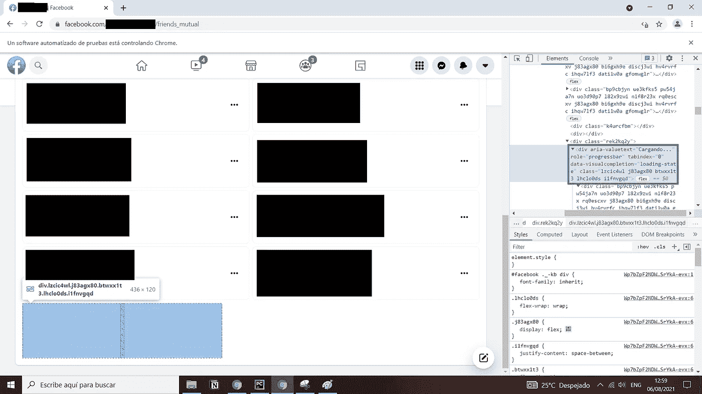

如果我们找到该元素，那么我们将向下滚动。如果我们再次找到它，我们将再次向下滚动，直到它消失，即，直到所有的朋友都已被加载。

```
from selenium.webdriver.common.keys import Keys

loading_mutual_friends_panel_class = "lzcic4wl j83agx80 btwxx1t3 lhclo0ds i1fnvgqd"
loading_mutual_friends_panel_selector = f"div[class='**{**loading_mutual_friends_panel_class**}**'][data-visualcompletion='loading-state']"

loading_element = driver.find_elements_by_css_selector(
    loading_mutual_friends_panel_selector
)

while len(loading_element) > 0:
    driver.find_element_by_xpath('//body').send_keys(Keys.END)
    time.sleep(0.5)
    loading_element = driver.find_elements_by_css_selector(
        loading_mutual_friends_panel_selector
    )
```

现在我们可以确定所有共同好友都已加载。剩下的部分就是去读它们。先找有共同好友的面板。

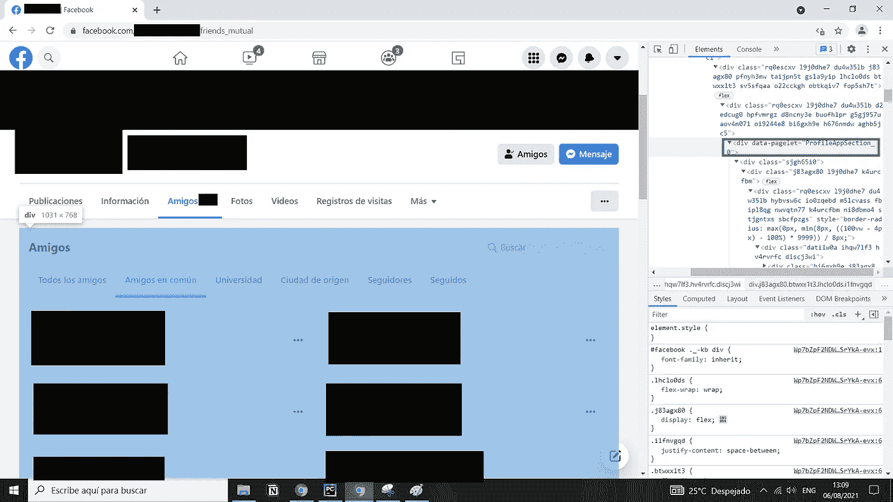

```
mutual_friends_panel_selector = "div[data-pagelet='ProfileAppSection_0']"

mutual_friends_pannel = driver.find_element_by_css_selector(
    mutual_friends_panel_selector
)
```

每个共同的好友都会出现在自己的“卡片”中，他或她的名字是一个`<a>`元素:

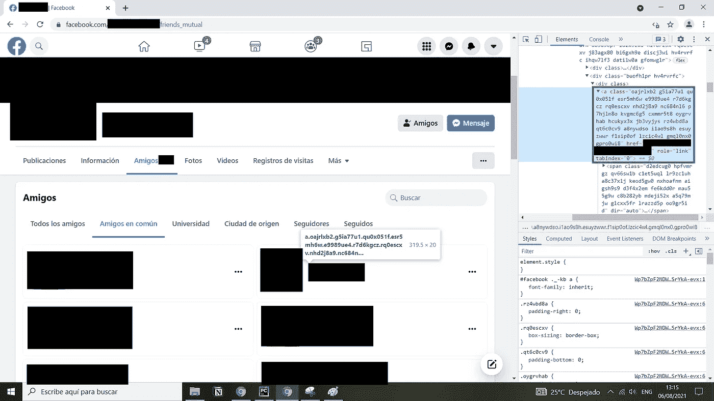

```
mutual_friend_link_class = (
    "oajrlxb2 g5ia77u1 qu0x051f esr5mh6w e9989ue4 r7d6kgcz rq0escxv"
    " nhd2j8a9 nc684nl6 p7hjln8o kvgmc6g5 cxmmr5t8 oygrvhab hcukyx3x"
    " jb3vyjys rz4wbd8a qt6c0cv9 a8nywdso i1ao9s8h esuyzwwr f1sip0of lzcic4wl gmql0nx0 gpro0wi8"
)

mutual_friend_link_selector = f"a[class='**{**mutual_friend_link_class**}**']"

mutual_friend_links = mutual_friends_pannel.find_elements_by_css_selector(
    mutual_friend_link_selector
)

print(f"Number of mutual friends with **{**friend['name']**}**: **{**len(mutual_friend_links)**}**")
```

每个链接都有两条有用的信息。一方面是文本，这是共同朋友的名字。另一个是它重定向到的 URL，这是他或她的个人资料链接。

```
mutual_friends = []
for link **in** mutual_friend_links:
    name = link.text
    link = link.get_attribute("href")
    mutual_friends.append(
        dict(
            name=name,
            link=link
        )
    )
```

Goooood！我们快到了。

我们知道有问题。嗯，这只是个人喜好。我想使用`user_id`作为每个人的唯一标识符。我可以使用简介链接`link`，这可能是独一无二的，但我只是更喜欢`user_id`。

链接中没有直接提供，但是我们可以从我们的好友列表中获取。因此，我们将把前面的循环改为:

```
def get_friend_by_link(link):
    for friend **in** friends:
        if friend["link"] == link:
            return friend

    return None

mutual_friends = []
for link **in** mutual_friend_links:
    name = link.text
    link = link.get_attribute("href")

    friend = get_friend_by_link(link)
    user_id = friend["user_id"]
    gender = friend["gender"]

    mutual_friends.append(
        dict(
            user_id = user_id,
            name=name,
            link=link,
            gender = gender,
        )
    )
```

如果我们把这些放在一起，为你所有的朋友做这个手术会怎么样？

```
loading_mutual_friends_panel_class = "lzcic4wl j83agx80 btwxx1t3 lhclo0ds i1fnvgqd"loading_mutual_friends_panel_selector = f"div[class='**{**loading_mutual_friends_panel_class**}**'][data-visualcompletion='loading-state']"mutual_friends_panel_selector = "div[data-pagelet='ProfileAppSection_0']"mutual_friend_link_class = (
    "oajrlxb2 g5ia77u1 qu0x051f esr5mh6w e9989ue4 r7d6kgcz rq0escxv"
    " nhd2j8a9 nc684nl6 p7hjln8o kvgmc6g5 cxmmr5t8 oygrvhab hcukyx3x"
    " jb3vyjys rz4wbd8a qt6c0cv9 a8nywdso i1ao9s8h esuyzwwr f1sip0of lzcic4wl gmql0nx0 gpro0wi8"
)mutual_friend_link_selector = f"a[class='**{**mutual_friend_link_class**}**']"

def visit_mutual_friends_page(friend):
    profile_link = friend["link"]
    url_parsed = urllib.parse.urlparse(profile_link)

    if url_parsed.path == "/profile.php":
        mutual_friends_link =  f"**{**profile_link**}**&sk=friends_mutual"
    else:
        mutual_friends_link = f"**{**profile_link**}**/friends_mutual"

    driver.get(mutual_friends_link)
    time.sleep(1.5)

def wait_for_every_friend_to_load():
    loading_element = driver.find_elements_by_css_selector(
        loading_mutual_friends_panel_selector
    )

    while len(loading_element) > 0:
        driver.find_element_by_xpath('//body').send_keys(Keys.END)
        time.sleep(0.5)
        loading_element = driver.find_elements_by_css_selector(
            loading_mutual_friends_panel_selector
        )

def get_friend_by_link(link):
    for friend **in** friends:
        if friend["link"] == link:
            return friend

    return None

mutual_friends_all = {}
num_friends = len(friends)
for i, friend **in** enumerate(friends, start=1):
    print(f"Reading mutual friends with **{**friend['name']**}**. (**{**i**}** of **{**num_friends**}**)")

    visit_mutual_friends_page(friend)

    wait_for_every_friend_to_load()

    mutual_friends_pannel = driver.find_element_by_css_selector(
        mutual_friends_panel_selector
    )

    mutual_friend_links = mutual_friends_pannel.find_elements_by_css_selector(
        mutual_friend_link_selector
    )

    mutual_friends = []
    for link **in** mutual_friend_links:
        link = link.get_attribute("href")

        friend = get_friend_by_link(link)

        mutual_friends.append(
            dict(
                user_id=friend["user_id"],
                name=friend["name"],
                link=link,
                gender=friend["gender"],
            )
        )

    mutual_friends_all[friend["user_id"]] = mutual_friends
```

这并不容易，但我们做到了。在您的笔记本电脑电池耗尽之前保存它！

```
with open("my_friends_network", "w") as outfile:
    json.dump(
        dict(
            friend_list=friends,
            mutual_friends=mutual_friends_all,
        ),
        outfile
    )
```

我们做到了！！！！！🥳🥳🥳

现在，我们可以使用它以不同的方式可视化网络，甚至可以找到不同的用户群，如下图所示:

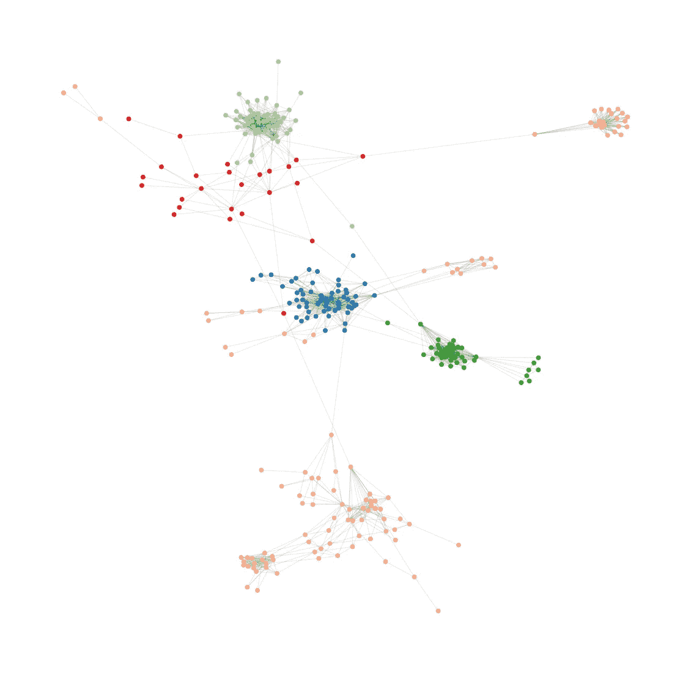

我将在下一篇文章中教你如何做:[用 Python 中的社交网络分析来组织你的婚礼](https://rubchume.medium.com/organize-your-wedding-with-social-network-analysis-in-python-aeab9d8814b3)。

*原载于*[](https://www.listeningtothedata.com/posts/read-your-network-of-friends-in-facebook-by-scraping-with-python/)**。**