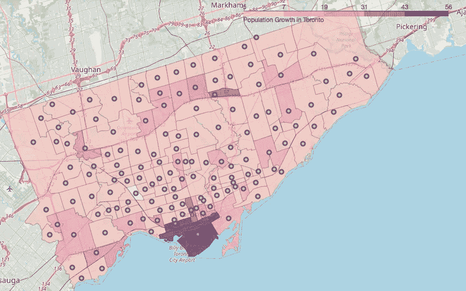
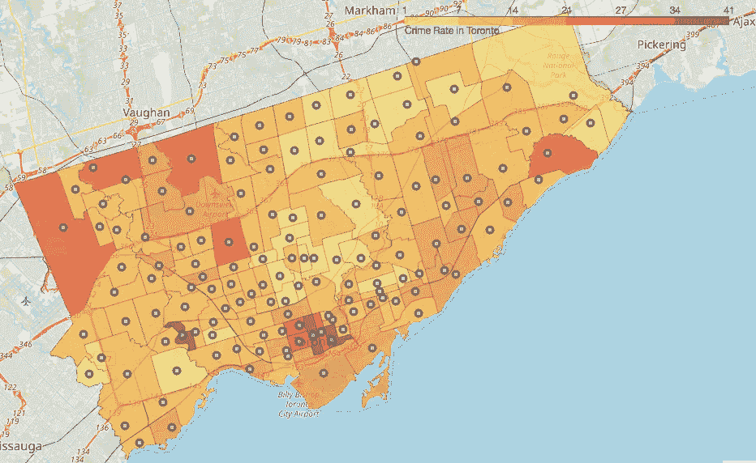
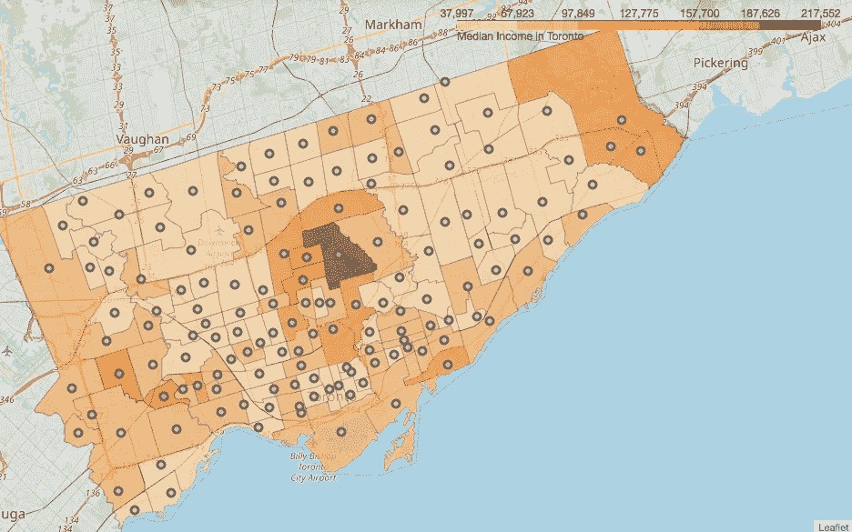
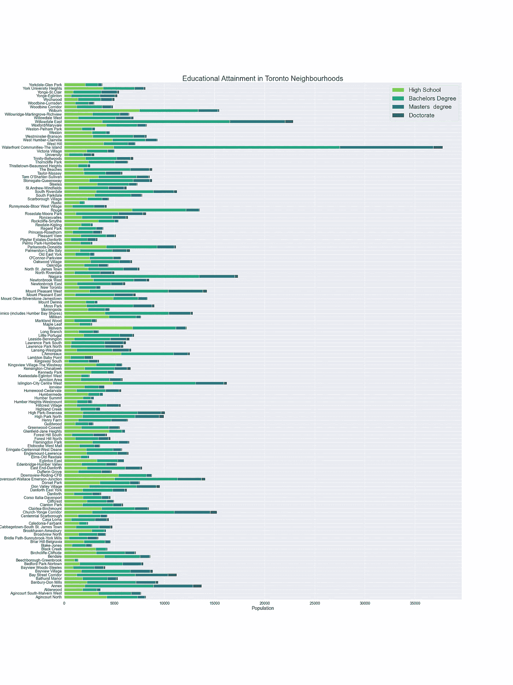
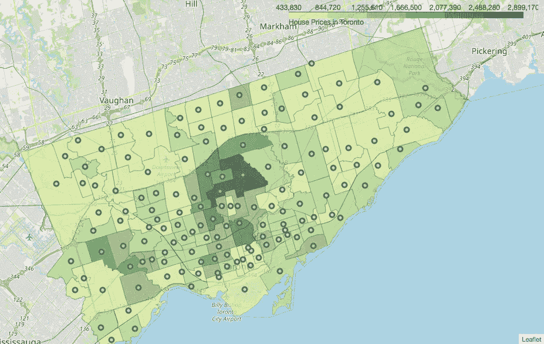
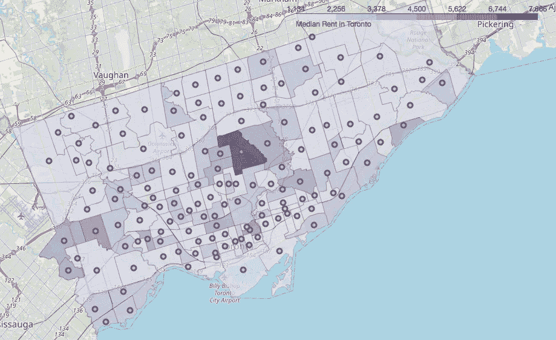
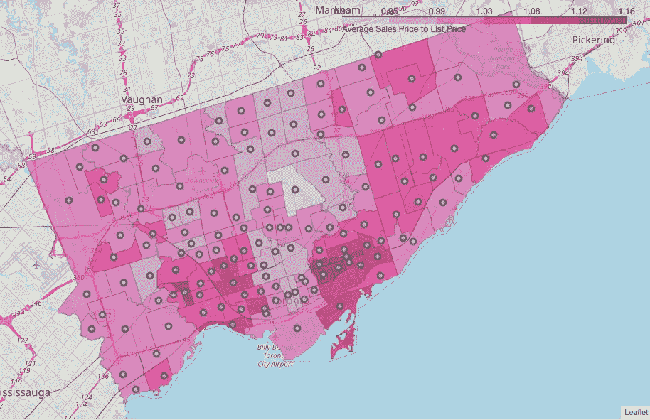
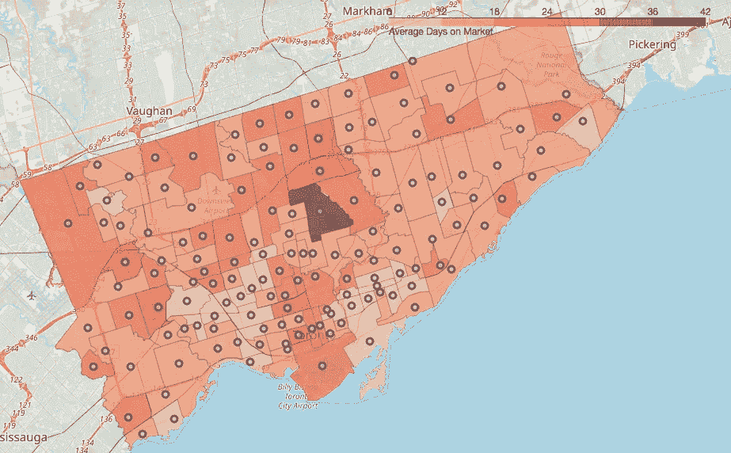
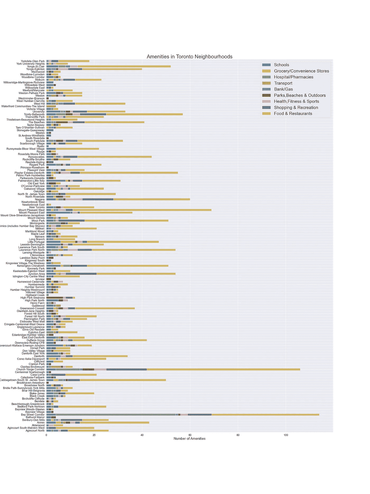
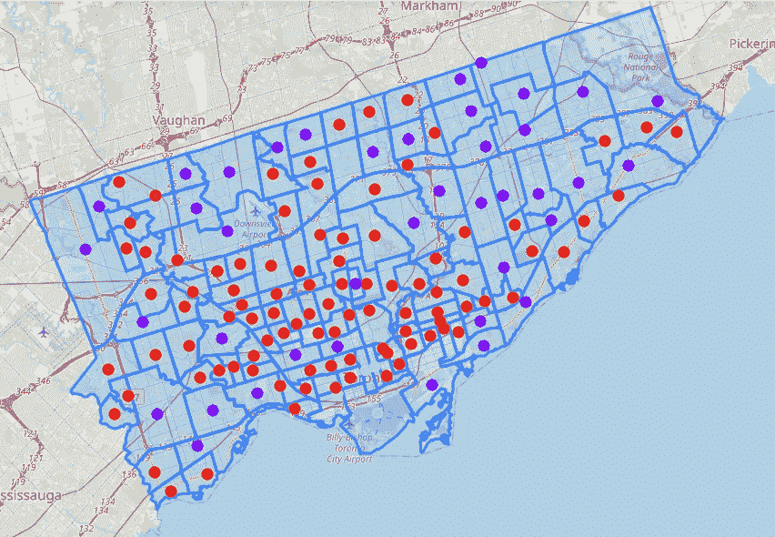

# 多伦多街区房地产投资分析

> 原文：<https://medium.com/analytics-vidhya/real-estate-investment-analysis-of-toronto-neighbourhoods-879d09df8c64?source=collection_archive---------10----------------------->

## 利用 Foursquare API、Folium & Data Science 进行智能投资决策

蒂姆·高在 [Unsplash](https://unsplash.com?utm_source=medium&utm_medium=referral) 上拍摄的照片

**房地产投资**涉及购买、管理、出租和出售不动产或实物以获取利润。这种投资的特点是需要大量的资金，并且需要仔细的计划和决策，这样才能成功。

多伦多是加拿大最大、人口最稠密的城市，以多样化、多元文化和世界级便利设施而闻名，是投资买房的好地方！

投资房地产时，全面的市场分析会提供一个很好的趋势概念，但这还不够。在**右邻**购买房产势在必行，因为即使整体市场很大，错误的位置也可能导致未来房产价值下降。

让我们利用数据科学的力量对多伦多的 **140 个社区的**住宅房地产**进行**邻里分析**，以确定哪个社区可能提供良好的投资回报。**

对于此分析，使用了来自多伦多开放数据门户[城市的**人口统计**数据、](https://open.toronto.ca/dataset/neighbourhood-profiles/)房地产**数据、**社区报告** & **市场观察**、TRREB(多伦多房地产委员会) & [房地产哲学、](https://www.realosophy.com/toronto/neighbourhood-map)和**位置**数据。**

## 分析人口统计特征

一个街区的**人口、教育程度、犯罪率和中等收入水平**，对该街区房屋的*价值和投资潜力*有很大影响。一个人口增长良好、受教育程度高、收入中值较高、失业率和犯罪率较低的社区通常被认为是理想的社区。让我们使用 Let 和 Seaborn 来可视化这些变量。

多伦多的人口增长

**人口增长**

**人口增长最快的街区**是**滨水社区——岛屿**和**尼亚加拉**。紧随其后的是**湾街走廊**和**亨利农场**。人口下降最快的街区是韦斯顿-佩勒姆公园。

多伦多的犯罪率

**犯罪率(每 1000 人)**

犯罪率最高的街区是海湾街走廊、莫斯公园和兰伯顿婴儿点(T21)。甚至**周边地区**也有**高犯罪率**即**教堂-央街走廊、肯辛顿-唐人街和大学**。

多伦多的中等收入

**收入中位数**

**Bridle Path-sunny brook-York Mills 及周边地区**拥有**最高收入中位数**。除此之外，Kingsway South 和 Princess-Rosethorn 的居民区也有很高的平均收入。

**教育程度**

受教育程度较高的社区被认为更有价值，因为教育对社会前景有很大影响。教育程度高的地区自然有更高的收入和就业率，这使它们有利于投资。我们可以看到,**受教育最少的**街区是**比奇伯勒-格林布鲁克、枫叶、喀里多尼亚-费正清、格伦菲尔德-简高地和乡村**，他们受教育最多的是**高中**。受教育程度最高的街区是海滨社区----岛屿、Willowdale East、附属建筑、海湾街走廊、Church-Yonge 走廊和尼亚加拉河。

## 分析房地产特征

房地产数据，如房屋价值、结构类型、卧室数量、建造年份、租金、总销售额和销售量、销售价格与标价之比以及平均上市天数，都是影响房地产价值的因素。让我们用叶子把其中的一些形象化。

多伦多的房价

**房价**

如你所见，最贵的房子位于城市的中心。**房价最高的街区**是**马勒小路-桑尼布鲁克-约克米尔斯、劳伦斯公园南及其周边**。远离市中心,**公主玫瑰街和 Kingsway South** 附近都有昂贵的房子。

多伦多租金中位数

**租金中位数**

同样，租金最高的城市位于市中心。租金最高的街区是 Bridle Path-sunny brook-York Mills。除此之外，**公主-玫瑰镇、卷心菜镇-南圣詹姆士镇**和**吉尔德伍德**地区的租金也很高。

多伦多的平均 SP/LP

**销售价格与标价的比率**

它是房地产投资分析中的一个关键指标。就是 ***最终售价/最后标价* 100*** *。*高于 100 的 SP/LP **意味着该房产以高于标价的价格出售。100** 的 SP/LP **表示该房产以标价出售。低于 100** 的 SP/LP **意味着房产以低于标价的价格出售。最高销售价格与标价之比**最高的地区**是**布雷克琼斯、北河谷镇、玩家庄园-丹佛斯及周边街区**。除了他们，就连**兰尼米德-布鲁尔西村**的 SP/LP 也很高。**马道-桑尼布鲁克-约克米尔斯**有**最低的 SP/LP** 。**

多伦多的平均上市天数

**平均上市天数**

**较低的**平均上市天数，意味着房产销售非常迅速，而且需求量很大。**更高的**平均上市天数，意味着房产不会很快售出，需求也更少。被列为**最高**上市天数的房产属于**Bridle Path-sunny brook-York Mills**。

## 分析位置数据

这是房地产投资中最**重要的**因素。就位置而言，我们指的是该物业与各种**便利设施**的接近程度。

**便利设施**是增强功能，有利于一个地方，有助于它的享受和*增加它的价值*。一个**的好位置**有**靠近**交通、学校、娱乐、购物、就业和各种其他便利设施。该物业可**到达**公共交通、道路、医院、学校、便利店等。诸如此类的东西，比那些没有价值的财产要有价值得多。

使用 **Foursquare API** 的**搜索**和**探索端点**收集位置数据。我使用了**搜索端点**来收集最重要的便利设施的数据，它们是**学校、杂货店/便利店和医院**，使用**探索端点**来收集娱乐、购物、餐馆、交通、银行等便利设施的数据。在每一个街区，然后进行排序&把它们归入相关的类别。

让我们想象一下获得的便利设施:

舒适

如上所述，Foursquare API 主要返回餐馆作为场所。

*   数量最多的**学校**在**芒特普莱森特东部**。
*   小葡萄牙和 Corso Italia-Davenport 的杂货店数量最多。
*   数量最多的**医院**在**湾街走廊和教堂-央街走廊**。
*   交通便利设施数量最多的是在**滨水社区——岛屿和克莱尔利-伯奇蒙特。**
*   银行/煤气设施在社区中分布相当均匀。
*   数量最多的**公园、海滩和户外**在**高公园-斯旺西、海滩和教堂-央格走廊。**
*   健康、健身和运动设施数量最多的是尼亚加拉河和教堂-央街走廊。
*   最多的**购物和娱乐**设施位于**尼亚加拉河、教堂-央街走廊、三一-贝尔伍兹和海湾街走廊**。
*   数量最多的**食物和餐馆**在**教堂-央街走廊、芒特普莱森特西街和海湾街走廊**。

## k 均值聚类

现在，我们对多伦多街区的关键特征有了一个很好的想法，让我们应用 **k-means 算法**，这是一种无监督的机器学习算法，对街区进行聚类，以便**揭示它们的投资潜力**。 **K-Means** 会以这样的方式分割邻域，一个簇内的邻域会非常相似，而不同簇之间的邻域会不相似。

让我们把这些街区分成三组:

聚集的街区

现在，我们可以**根据上面的聚类描述**我们的邻居，并且**根据邻居的**共同特征**给他们分配适当的标签**。在仔细观察由 k-means 算法产生的聚类之后，这三个聚类可以被描述为:

**集群 1:人口较少，老式**

该集群由 95 个社区组成，但平均总人口**最低**约为 14，000 人，人口增长率**较低**约为 2.9%。它包括**大部分家庭和老年人**，类似于集群 2。教育程度最高的是 T21，46%的人拥有“学士学位”，21%的人拥有“硕士及以上学位”。他们的平均收入最高，约为 74，000 美元，就业率高达 60%。与其他集群相比，犯罪率最低。这些房屋大多是公寓/公寓和其他附属住宅，占社区房屋的 72%。所有数量的卧室，从 **1 到**4，都是通用的。**自有和出租房屋**数量几乎相等。大多数**房屋都非常古老**，大约 45%建于 20 世纪 60 年代之前，34%建于 20 世纪 80 年代之前。新建筑数量急剧减少。**房价很贵**，和其他集群相比最高。这些房子大多以高于标价的价格出售。与其他集群相比，**的租金最高**。与其他集群相比，他们拥有适中的便利设施。

**集群 2:中等人口，原型**

该集群由 40 个居民区组成，平均总人口约为 30，000，人口增长率**非常低**。它主要由有孩子和老人的**家庭组成**，占总人口的 33%。**的教育程度较低**，41%的人最高学历为“高中”，42%为“学士学位”。他们的平均收入为 64，940 美元，低于其他群体，失业率也很高。与其他集群相比，犯罪率适中。这些房屋大多是附属住宅，约占邻近房屋的 69%,但也有相当数量的独立房屋，即约 31%。**2–3 卧室**的房子比较常见，占总房型的 58%。也有更多的自有住房，而不是租来的。大多数**房屋都是旧的**，其中 32%建于 1960 年之前，43%建于 1961-1980 年期间。它几乎没有新建筑，而且从 1990 年开始，新建筑的数量急剧下降。根据卧室的结构不同，房价从中等到昂贵不等。这些房子大多以高于标价的价格出售，而且很快就卖出去了。租金大多在中等水平(T21)，但根据房子的不同也可能很高。与其他集群相比，它们的生活设施相对较少。

**集群 3:人口密集、熙熙攘攘的城市**

该集群仅由 5 个居民区组成，但拥有**最高的约 40，000 的平均总人口，以及约 30%的极高人口增长率**。它拥有**最高的工作年龄人口**，即 68%，其中大多数似乎是**单身或没有孩子的夫妇**。**教育程度最高**，约 56%的人拥有最高学历“学士学位”，约 27%的人拥有“硕士及以上学位”。他们的平均收入约为 65，000 美元，最高就业率约为 68%。与其他集群相比，**犯罪率最高**。这些房子大部分是公寓/共管公寓，约占社区房屋的 84%。**1–2 卧室**的房子最常见，约占全部房子的 90%。也有更多的出租房屋，而不是自有房屋。大多数房屋都是新建的，大约 63%是在 2000 年后建造的。它有迅速增加的新建筑。**的房价是中低价位的**，与其他集群相比要便宜得多。这些房子大多以低于或等于标价的价格出售。租金大多处于中等水平，变化不大。与其他集群相比，他们拥有最高的便利设施。

## 投资策略

对多伦多 140 个社区的社区分析揭示了这些社区基于其特点的投资潜力。让我们从个人投资者和房地产公司两个角度来看。

**a.** 对于寻求在一个具有**高速发展&增长、靠近商业/营业网点、新的现代化建筑、同时具有中等规模资本投资**的地区投资的投资者来说，**集群 3** 的邻近地区是最理想的。

*   个人投资者可以选择购买共管公寓，用于出租资产投资，因为这是这里最受欢迎的房屋结构，租金也很高。然而，如果一个人想选择**买入并持有策略**，它可能有利可图，也可能无利可图，因为这些街区的房子通常卖得比标价低一点或与之持平。此外，房子不像其他集群那样卖得快。
*   一家房地产公司会发现投资一套**公寓**是有利可图的，因为这些街区的大多数居民都住在租来的房子里。另一个关键点是，在这样的社区里，1-2 间卧室的小房子比大房子更受欢迎。

在这些地区投资的一个不利因素是极高的犯罪率，这可能是因为商业机构、市场和企业的存在，因为一些犯罪发生在繁华地区，如抢劫。这可能解释了为什么在这些街区生活的家庭较少而单身者较多。

**b.** 对于一个寻求在一个典型的、家庭友好型的、具有巨大价值的社区投资的投资者来说，第**集群 2** 的社区是有利的。

*   一个个人投资者如果想找一个家和他的家人住在一起，或者想赚取租金收入，可以投资这些街区的房产。这些社区有很好的资本增值，从长远来看非常有利可图。他们的犯罪率很低，而且环境宜人。大多数房屋都是自住的，并且随着时间的推移而增值。
*   房地产公司既可以投资公寓，也可以投资独立式住宅。这类社区的房屋需求量很大，因为它们很快就能卖出去，而且大多高于标价。由于家庭规模的原因，拥有两个以上卧室的大房子需求量很大。

这些街区的不利之处是教育程度较低，失业率高。这可能会对及时支付租金产生负面影响，如果是租赁物业投资的话。

对于一个想在奢华、和平的高档社区投资的投资者来说，第一产业区有很多这样的社区。

*   想要生活在受过良好教育的高级社区，或者仅仅想要高资本增值的个人投资者，可以在这个集群中投资合适的社区。租赁物业投资也是一个很好的选择，投资回报率高。它拥有最安全的社区，犯罪率最低。自有房屋和租赁房屋的分布是均等的，因此**买入并持有策略和**租赁房产投资都很棒，这取决于投资者的要求。
*   房地产公司可以投资公寓，无论大小，因为两者的租金都很高，也可以投资大房子，比如某些地区的豪宅，它们的售价很高。人们对住宅房地产的需求很高，房屋售价大多高于标价。

这些街区的一个不利之处是存在工人阶级街区，因为 k-means 算法根据总人口对一些街区进行了分类。因此，在投资之前，你必须仔细观察各个社区。

## **结论**

该分析的目的是确定多伦多具有高投资潜力和投资回报的街区。

借助于人口统计、位置和房地产数据、深刻的可视化，以及最终的社区聚类，我们可以根据投资者的偏好，确定潜在的投资区域。

在整个分析过程中，一个不断脱颖而出的街区是**滨水社区——岛屿**。在我看来，它具有最高的投资潜力，无论投资者是谁。它有最高的发展，人口增长，教育，接近生活设施…..诸如此类。此外，价格非常合理。

其他一些具有巨大投资潜力的街区有尼亚加拉、Willowdale East 和 Runnymede-Bloor West Village。我认为，无论从短期还是长期来看，这些社区都将超出投资者的预期。

然而，投资或不投资的最终决定取决于投资者，因为每个人都有自己的需求和偏好。

希望这个分析能对任何想回答这个问题的人有所帮助，**“这个领域值得仔细研究吗？”**

**注**:你可以在 Github 上我的[笔记本](https://github.com/ruhi-i/Coursera-Capstone/blob/master/Capstone%20Project%20-%20Battle%20of%20the%20Neighborhoods%20-%20Final.ipynb)里找到完整的代码。