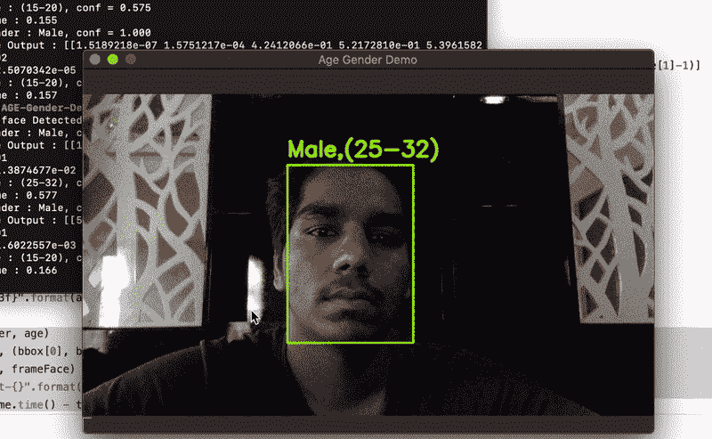

# 基于 OpenCV 的实时年龄性别检测

> 原文：<https://medium.com/analytics-vidhya/real-time-age-gender-detection-using-opencv-fa705fe0e1fa?source=collection_archive---------4----------------------->

你好，我希望你们所有人在这些困难时期都过得很好，我希望 2021 年比 2020 年对你们更好。所以今天让我们使用**转移学习**实时编码年龄-性别检测(显然，当我们已经有了预训练的具有更好准确性的模型时，为什么要经历从零开始创建模型的所有麻烦(但在不久的将来会尝试建立一个定制的模型) )

## 导入库

让我们从导入代码所需的库开始

## 创建 getFaceBox

我们将创建一个名为 **getFaceBox** 的函数来预处理图像，创建图像的一个斑点(以便它可以专注于更重要的特征)并使用预训练的模型来检测人脸，如*opencv _ face _ detector _ uint 8 . Pb*如果我们检测到一个人脸(只有当它的概率大于 conf_threshold 时才能被检测到)，我们使用 [cv2.rectangle()](https://docs.opencv.org/master/dc/da5/tutorial_py_drawing_functions.html) 函数在它周围画一个框，是的，它将检测到多个人脸

## 模型和变量

我们使用 caffe 模型进行年龄和性别检测，并定义年龄和性别值的变量

## 加载并启动

现在让我们通过使用 **cv2.dnn.readNet** 加载年龄、性别和面部的预训练模型来加载网络。通过使用 **cv2 使用您系统的网络摄像头。视频捕获(0)**

## 读取、调整大小和检测

现在读取帧，调整它的大小以获得更好的准确性(来吧，不是所有人都有 GPU)使用 **getFaceBox** 函数检测面部和方框，并创建另一个大小为(227，227)的 blob(模型更容易处理这个大小的帧)，并在 blob 上使用预训练的模型，打印出概率，并使用 **cv2.imshow()** 来实时查看结果！一个**年龄性别检测器**就在 Codeven 外面(我知道这是个可怕的双关语)

你可以从 [**这里**](https://github.com/Pavankunchala/AGE-Gender-Detection) 找到这个博客的代码

结束了！(至少目前如此)

PS:如果您有任何疑问，您可以在这里给我发邮件[，您可以在我的 linkedin 上从](http://pavankunchalapk@gmail.com/) [**这里**](https://www.linkedin.com/in/pavan-kumar-reddy-kunchala/) 联系我，您也可以在我的 Github 上从 [**这里**](https://github.com/Pavankunchala) 查看我的其他代码(它有非常酷的东西)

我也在寻找深度学习和计算机视觉领域的**自由职业机会**如果你愿意合作，请在这里给我发邮件(【pavankunchalapk@gmail.com】T2

祝你有美好的一天！