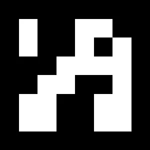
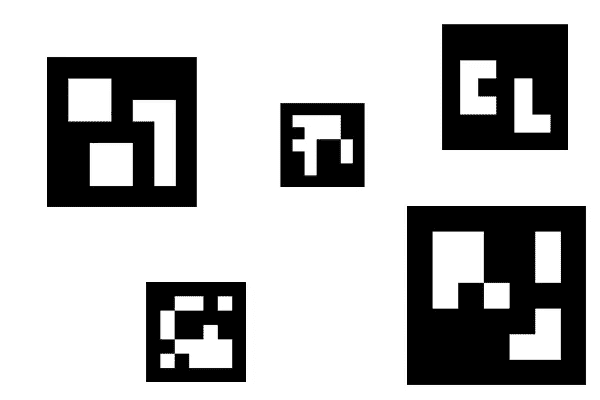

# 使用 ARUCO 标记进行实时距离计算

> 原文：<https://medium.com/analytics-vidhya/real-time-distance-calculation-using-aruco-markers-b469d5f9791d?source=collection_archive---------3----------------------->


本周我遇到了一个非常热门的话题——增强现实，但在理解之前，我们需要对 ArUco 标记背后有一种直觉。

## **阿鲁科标记..它们是什么？**

ArUco 标记类似于 QR 码，区别因素是 QR 码比 ArUco 标记存储更多的信息，因此很难用于我们将要做的事情。
它是一个由黑色边框组成的二进制矩阵，它是一个合成标记，用于在图像或视频中立即定位它。
这是阿鲁科标记的样子-



阿鲁科标记

现在，由于它是二进制的并且包含某种信息，我们需要有一些变化，所以这些标记有两个独特的属性——ID 和类型

现在标记的 id 取决于它是什么类型，让我们了解这是一些细节:
在上面的标记中，如果你会看到，在所有的边上都有一个 1 框填充，并且在标记中你可以看到，在一行中(去除填充后)你可以安装 6 个白盒，所以这是一个 6X6 的标记，现在标记的类型你不能猜测(你不应该！).因此，类型是预定义的，这里有点小问题，cv2 中总共有 25 种类型(或字典)的标记，每个字典包含相同数量的位或块以及固定数量的标记(50、100、250 或 1000)。
上图标记器是 DICT _ 6X6 _ 250 的 id 23。
所以，这里的类型是 DICT_6X6_250，id 是 23。(注意，这里的 id 不能超过 250，因为字典中只有 250 个可用的标记)。

## 工业用途:

姿势估计，机器人自动化，2D 投影，增强现实等等！当然，今天我们将学习如何使用它们来计算距离。

在使用它们之前，让我们看看它们是如何生成的-
在 Python 中，你可以借助 cv2.aruco.drawMarker()函数来生成它们，让我们看看它是如何运行的！

所需的软件包包括:

```
import cv2
import numpy as np
import argparse
import sys
import os
```

现在，你需要标记的 id 和类型，所以让我们把它们作为参数-

```
ap.add_argument("-i", "--id", type=int, required=True,
                help="id of the aruco marker to be generated")
ap.add_argument("-t", "--type", type=str,
                default="DICT_ARUCO_ORIGINAL", help="type of ARUCO marker")
```

现在，为了生成这些标记，我们正在制作一个 ArUco 字典的字典。

```
ARUCO_DICT = {
    "DICT_4X4_50": cv2.aruco.DICT_4X4_50,
    "DICT_4X4_100": cv2.aruco.DICT_4X4_100,
    "DICT_4X4_250": cv2.aruco.DICT_4X4_250,
    "DICT_4X4_1000": cv2.aruco.DICT_4X4_1000,
    "DICT_5X5_50": cv2.aruco.DICT_5X5_50,
    "DICT_5X5_100": cv2.aruco.DICT_5X5_100,
    "DICT_5X5_250": cv2.aruco.DICT_5X5_250,
    "DICT_5X5_1000": cv2.aruco.DICT_5X5_1000,
    "DICT_6X6_50": cv2.aruco.DICT_6X6_50,
    "DICT_6X6_100": cv2.aruco.DICT_6X6_100,
    "DICT_6X6_250": cv2.aruco.DICT_6X6_250,
    "DICT_6X6_1000": cv2.aruco.DICT_6X6_1000,
    "DICT_7X7_50": cv2.aruco.DICT_7X7_50,
    "DICT_7X7_100": cv2.aruco.DICT_7X7_100,
    "DICT_7X7_250": cv2.aruco.DICT_7X7_250,
    "DICT_7X7_1000": cv2.aruco.DICT_7X7_1000,
    "DICT_ARUCO_ORIGINAL": cv2.aruco.DICT_ARUCO_ORIGINAL,
    "DICT_APRILTAG_16h5": cv2.aruco.DICT_APRILTAG_16h5,
    "DICT_APRILTAG_25h9": cv2.aruco.DICT_APRILTAG_25h9,
    "DICT_APRILTAG_36h10": cv2.aruco.DICT_APRILTAG_36h10,
    "DICT_APRILTAG_36h11": cv2.aruco.DICT_APRILTAG_36h11
}
```

现在使用给定的类型，我们将得到 cv2 中的 marker 字典，

```
arucoDict = cv2.aruco.Dictionary_get(ARUCO_DICT[args['type']])tag = np.zeros((300, 300, 1), dtype="uint8")
cv2.aruco.drawMarker(arucoDict, args["id"], 300, tag, 1)
```

现在，使用 ArUco 字典，我们使用 *cv2.drawMarker()，*这个函数中的参数是:arucoDict-要生成的标记的字典，args[' id ']-字典中标记的 id，300-标记的大小，tag-标记的画布，padding-标记周围的填充

现在使用 cv2.imshow()，我们将可视化标记

```
cv2.imwrite('output_marker.jpg',tag)
cv2.imshow("marker", tag)
cv2.waitKey(0)
cv2.destroyAllWindows()
```

运行，使用命令

```
python .\aruco_marker_generation.py --id 50 --type DICT_6X6_250
```

我们的标记生成并保存到磁盘。

现在，我们将尝试检测图像中的标记，我们需要的参数是:

```
ap.add_argument("-i", "--image", required=True, help="path to the image")
ap.add_argument("-t", "--type", required=True,
                help="tag of the marker to b detected")
```

在这里，正如您所看到的，我们实际上需要检测标记的类型，因此在处理未知标记时这是一个问题。然而，我们将在下一篇文章中解决这个问题，现在让我们在给定的图像中检测一个标记，



```
image = cv2.imread(args['image'])ARUCO_DICT = {
    "DICT_4X4_50": cv2.aruco.DICT_4X4_50,
    "DICT_4X4_100": cv2.aruco.DICT_4X4_100,
    "DICT_4X4_250": cv2.aruco.DICT_4X4_250,
    "DICT_4X4_1000": cv2.aruco.DICT_4X4_1000,
    "DICT_5X5_50": cv2.aruco.DICT_5X5_50,
    "DICT_5X5_100": cv2.aruco.DICT_5X5_100,
    "DICT_5X5_250": cv2.aruco.DICT_5X5_250,
    "DICT_5X5_1000": cv2.aruco.DICT_5X5_1000,
    "DICT_6X6_50": cv2.aruco.DICT_6X6_50,
    "DICT_6X6_100": cv2.aruco.DICT_6X6_100,
    "DICT_6X6_250": cv2.aruco.DICT_6X6_250,
    "DICT_6X6_1000": cv2.aruco.DICT_6X6_1000,
    "DICT_7X7_50": cv2.aruco.DICT_7X7_50,
    "DICT_7X7_100": cv2.aruco.DICT_7X7_100,
    "DICT_7X7_250": cv2.aruco.DICT_7X7_250,
    "DICT_7X7_1000": cv2.aruco.DICT_7X7_1000,
    "DICT_ARUCO_ORIGINAL": cv2.aruco.DICT_ARUCO_ORIGINAL,
    "DICT_APRILTAG_16h5": cv2.aruco.DICT_APRILTAG_16h5,
    "DICT_APRILTAG_25h9": cv2.aruco.DICT_APRILTAG_25h9,
    "DICT_APRILTAG_36h10": cv2.aruco.DICT_APRILTAG_36h10,
    "DICT_APRILTAG_36h11": cv2.aruco.DICT_APRILTAG_36h11
}
```

现在，为了检测我们的标记，我们将使用*cv2 . aruco . detect markers()*，我们需要标记的类型——即 aruco 标记字典，以及我们需要传递包含标记的图像的图像，现在还有一个参数，即我们正在使用的检测器的参数，我们将使用*cv2 . aruco . Detector parameters _ create()初始化它。*

```
arucoDict = cv2.aruco.Dictionary_get(ARUCO_DICT[args['type']])
arucoParams = cv2.aruco.DetectorParameters_create()
(corners, ids, rejected) = cv2.aruco.detectMarkers(
    image, arucoDict, parameters=arucoParams)
```

这样，cv2.aruco.detectMarkers()返回一个三元组，其中角是检测到的每个标记的所有 4 个点，ids 是我们正在检测的标记类型的检测 id，被拒绝的是被分类为非标记的点。

现在，我们将使用下面的代码片段一个接一个地可视化这些标记。

```
if len(corners) > 0:
    ids = ids.flatten()
    for (markerCorner, markerId) in zip(corners, ids): corners_abcd = markerCorner.reshape((4, 2))
        (topLeft, topRight, bottomRight, bottomLeft) = corners_abcd topRightPoint = (int(topRight[0]), int(topRight[1]))
         topLeftPoint = (int(topLeft[0]), int(topLeft[1]))
         bottomRightPoint = (int(bottomRight[0]),      int(bottomRight[1]))
         bottomLeftPoint = (int(bottomLeft[0]), int(bottomLeft[1])) cv2.line(image, topLeftPoint, topRightPoint, (0, 255, 0), 2)
        cv2.line(image, topRightPoint, bottomRightPoint, (0, 255, 0), 2)
        cv2.line(image, bottomRightPoint, bottomLeftPoint, (0, 255, 0), 2)
        cv2.line(image, bottomLeftPoint, topLeftPoint, (0, 255, 0), 2) cX = int((topLeft[0] + bottomRight[0])//2)
        cY = int((topLeft[1] + bottomRight[1])//2)
        cv2.circle(image, (cX, cY), 4, (255, 0, 0), -1) cv2.putText(image, str(
            int(markerId)), (int(topLeft[0]-10),   int(topLeft[1]-10)), cv2.FONT_HERSHEY_COMPLEX, 1, (0, 0, 255)) # print(arucoDict)
        cv2.imshow("[INFO] marker detected", image)
        cv2.waitKey(0)else:
    # print("[INFO] No marker Detected")
    passcv2.destroyAllWindows()
```

每个角有四个点，每个点由两个坐标(x，y)，
组成，从左上角开始按顺时针顺序排列。

利用这一点，我们可以检测论点中提到的标记类型。
现在，我们将使用这些技术来实际计算两个标记之间的实时距离，现在我们将使用一点数学知识来进行计算，但这里需要注意的一点是——您需要将标记打印出来，并知道它的实际尺寸，单位为厘米或英寸或米。
现在，我打印出两个 DICT_ARUCO_ORIGINAL 类型的记号笔，每个记号笔每边的尺寸为 7.5 厘米。现在使用下面的代码，我们实际上可以可视化两个标记之间的距离。

```
import cv2
import imutils
import sys
import os
import numpy as np
import argparse
import time
from imutils.video import VideoStream
```

我们将使用实时视频流来计算距离。

```
ap = argparse.ArgumentParser()

ap.add_argument(“-t”, “ — type”, required=True,
 help=”tag of the marker to b detected”)
args = vars(ap.parse_args())
```

我们只需要检测标记的类型。

```
vs = VideoStream(src=0).start()
time.sleep(2.0)ARUCO_DICT = {
    "DICT_4X4_50": cv2.aruco.DICT_4X4_50,
    "DICT_4X4_100": cv2.aruco.DICT_4X4_100,
    "DICT_4X4_250": cv2.aruco.DICT_4X4_250,
    "DICT_4X4_1000": cv2.aruco.DICT_4X4_1000,
    "DICT_5X5_50": cv2.aruco.DICT_5X5_50,
    "DICT_5X5_100": cv2.aruco.DICT_5X5_100,
    "DICT_5X5_250": cv2.aruco.DICT_5X5_250,
    "DICT_5X5_1000": cv2.aruco.DICT_5X5_1000,
    "DICT_6X6_50": cv2.aruco.DICT_6X6_50,
    "DICT_6X6_100": cv2.aruco.DICT_6X6_100,
    "DICT_6X6_250": cv2.aruco.DICT_6X6_250,
    "DICT_6X6_1000": cv2.aruco.DICT_6X6_1000,
    "DICT_7X7_50": cv2.aruco.DICT_7X7_50,
    "DICT_7X7_100": cv2.aruco.DICT_7X7_100,
    "DICT_7X7_250": cv2.aruco.DICT_7X7_250,
    "DICT_7X7_1000": cv2.aruco.DICT_7X7_1000,
    "DICT_ARUCO_ORIGINAL": cv2.aruco.DICT_ARUCO_ORIGINAL,
    "DICT_APRILTAG_16h5": cv2.aruco.DICT_APRILTAG_16h5,
    "DICT_APRILTAG_25h9": cv2.aruco.DICT_APRILTAG_25h9,
    "DICT_APRILTAG_36h10": cv2.aruco.DICT_APRILTAG_36h10,
    "DICT_APRILTAG_36h11": cv2.aruco.DICT_APRILTAG_36h11
}arucoDict = cv2.aruco.Dictionary_get(ARUCO_DICT[args['type']])
arucoParams = cv2.aruco.DetectorParameters_create()
```

我们现在将使用与之前相同的代码来检测标记，但这次是在实时视频流中。

```
CACHED_PTS = None
CACHED_IDS = None
Line_Pts = None
measure = None
while True:
    Dist = []
    image = vs.read()
    image = imutils.resize(image, width=800)
    (corners, ids, rejected) = cv2.aruco.detectMarkers(
        image, arucoDict, parameters=arucoParams) if len(corners) <= 0:
        if CACHED_PTS is not None:
            corners = CACHED_PTS if len(corners) > 0:
        CACHED_PTS = corners if ids is not None:
           ids = ids.flatten()
           CACHED_IDS = ids
        else:
           if CACHED_IDS is not None:
              ids = CACHED_IDS
        if len(corners) < 2:
           if len(CACHED_PTS) >= 2:
              corners = CACHED_PTS
        for (markerCorner, markerId) in zip(corners, ids):
            print("[INFO] Marker detected")
            corners_abcd = markerCorner.reshape((4, 2))
            (topLeft, topRight, bottomRight, bottomLeft) = corners_abcd topRightPoint = (int(topRight[0]), int(topRight[1]))
            topLeftPoint = (int(topLeft[0]), int(topLeft[1]))
            bottomRightPoint = (int(bottomRight[0]), int(bottomRight[1]))
            bottomLeftPoint = (int(bottomLeft[0]), int(bottomLeft[1])) cv2.line(image, topLeftPoint, topRightPoint, (0, 255, 0), 2)
            cv2.line(image, topRightPoint, bottomRightPoint, (0, 255, 0), 2)
            cv2.line(image, bottomRightPoint, bottomLeftPoint, (0, 255, 0), 2)
            cv2.line(image, bottomLeftPoint, topLeftPoint, (0, 255, 0), 2) cX = int((topLeft[0] + bottomRight[0])//2)
            cY = int((topLeft[1] + bottomRight[1])//2)
```

到目前为止，代码大致相同，但现在我们将进行一些更改，我们将获取像素与厘米的比率，因为现在我们知道了左上角和右上角，我们可以计算它们之间的欧几里德距离，并将它们与实际距离(在这种情况下为 7.5 厘米)进行比较，之后我们将知道比率，通过使用两个不同标记上的两个点，我们实际上可以使用欧几里德公式进行计算。

在代码中，我将中心点和左上角点作为参考点，比率是在假设它们在一条线上的情况下计算的，您可以使用欧几里德距离作为参考来更改该比率。

```
measure = abs(3.5/(topLeft[0]-cX))
            cv2.circle(image, (cX, cY), 4, (255, 0, 0), -1)
            cv2.putText(image, str(
                int(markerId)), (int(topLeft[0]-10), int(topLeft[1]-10)), cv2.FONT_HERSHEY_COMPLEX, 1, (0, 0, 255))
            Dist.append((cX, cY))
            # print(arucoDict)
           if len(Dist) == 0:
             if Line_Pts is not None:
                 Dist = Line_Pts
           if len(Dist) == 2:
             Line_Pts = Dist
           if len(Dist) == 2:
             cv2.line(image, Dist[0], Dist[1], (255, 0, 255), 2)
             ed = ((Dist[0][0] - Dist[1][0])**2 +
              ((Dist[0][1] - Dist[1][1])**2))**(0.5)
             cv2.putText(image, str(int(measure*(ed))) + "cm", (int(300), int(
            300)), cv2.FONT_HERSHEY_COMPLEX, 1, (0, 0, 255))
          cv2.imshow("[INFO] marker detected", image)
          key = cv2.waitKey(1) & 0xFF
          if key == ord('q'):
             break
cv2.destroyAllWindows()
vs.stop()
```

瞧啊。你实际上可以计算两个标记之间的实时距离。

接下来，我们将看到一篇关于增强现实的短文。

参考:

[PyimageSearch](https://www.pyimagesearch.com)
OpenCV