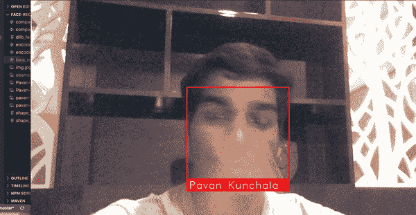

# 利用 OpenCV 和 Face-Recog 进行实时人脸识别

> 原文：<https://medium.com/analytics-vidhya/real-time-face-recognition-using-opencv-face-recog-507d355e0018?source=collection_archive---------9----------------------->

嘿，这是我准备在 medium 上写的第一篇文章，所以你已经看到了标题，这是关于人脸识别的，所以让我们开始吧。

你可以从 [**这里**](https://github.com/Pavankunchala/Deep-Learning/blob/master/Face-Recognisation/face_recog_live.py) 查看我的 Github 回购的代码

# **进口货色**

好了，让我们开始导入我们需要的，正如你已经猜到的 [**OpenCV**](https://pypi.org/project/opencv-python/) (你可以从那里安装它)和 numpy，以及这个代码最重要的一个[**face _ recognition**](https://pypi.org/project/face-recognition/)

**访问网络摄像头并加载样本图像**

我们可以使用 openCV 中的 **VideoCapture(0)** 来使用网络摄像头，然后开始加载您的图像或其他您想要识别的图像，您可以使用 face_recog lib 对其进行编码

**为已知编码创建一个数组**

上面的标题状态创建了一个数组(有时就是这么简单)并初始化了几个变量

## 阅读、调整大小和处理

现在，当 True 读取帧时，调整它的大小(这样它可以实时工作)并处理它，以便我们可以比较人脸编码。我使用了最小距离公式，以便我们可以轻松地比较人脸，还有比这更好的方法。自己试验它们

好吧，这就是结局(至少现在)

**附言:**我知道我的解释和大部分代码还有很多需要改进的地方，我会尽快更新它们，并将你的建议发送到我的 [**邮箱**](http://pavankunchalapk@gmail.com) (可能的改进或我应该写一篇文章的主题)如果你想谈论这个或任何 ML 或计算机视觉主题，请在我的 Linkedin 上给我发消息 [**这里**](https://www.linkedin.com/in/pavan-kumar-reddy-kunchala/)

我也在寻找深度学习和计算机视觉领域的自由职业机会，如果你愿意合作，请给我发邮件([pavankunchalapk@gmail.com](mailto:pavankunchalapk@gmail.com))

祝你有美好的一天