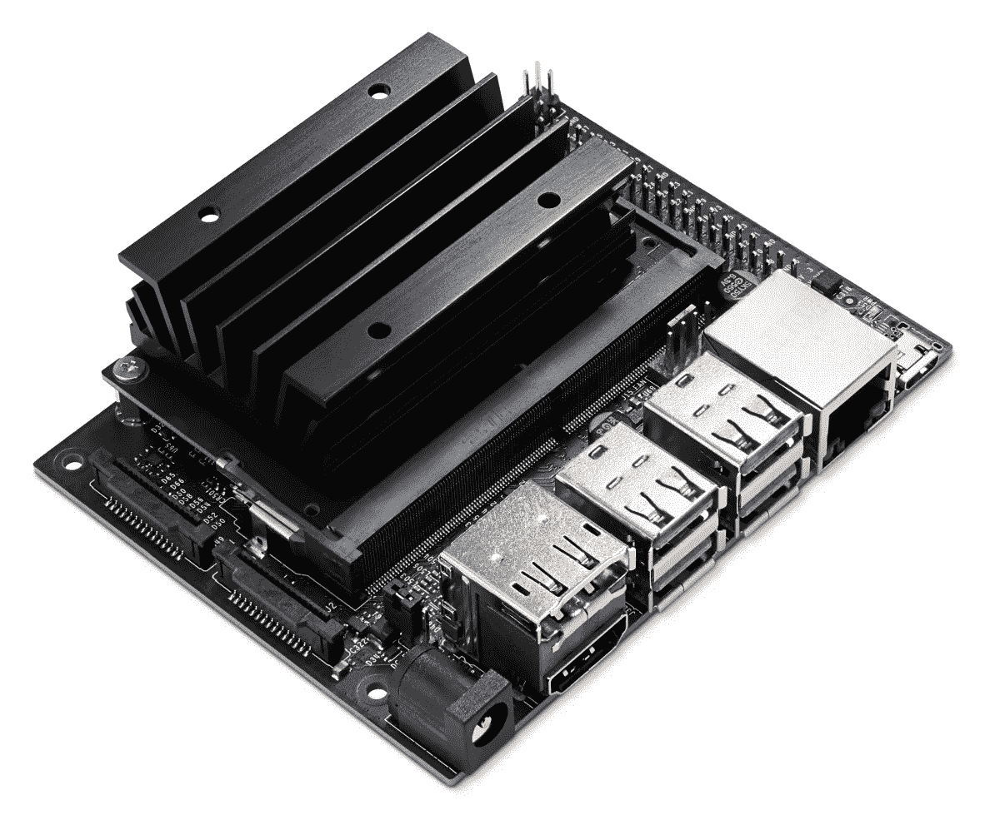

# 使用热像仪的实时目标跟踪系统

> 原文：<https://medium.com/analytics-vidhya/real-time-object-tracking-system-using-thermal-camera-b4d077a20f16?source=collection_archive---------1----------------------->

夜间光线强度很低，人类很难看到和识别周围的物体。人类需要额外的工具才能在晚上看得更清楚，比如路灯和手电筒等照明设备，甚至是夜视或热成像相机等其他先进技术。


图片取自[财富](https://fortune.com/2020/04/20/coronavirus-fever-temperature-thermal-imaging-cameras/)

*但是热感相机是如何工作的呢？*

所有物体都会发出热信号，也称为**红外线**能量。热像仪检测和测量物体的红外能量。然后，摄像机将红外数据转换成电子图像，显示物体的表面温度，以便进一步处理。

# 构建产品

在这个项目中，我被分配到一个团队去开发一个在夜晚工作的实时人物跟踪系统。我们使用 FLIR 轻子作为我们的热成像相机，NVIDIA Jetson Nano 作为处理单元的单板计算机，以及两个伺服电机来旋转相机，以便它可以跟踪目标。该产品的主要目标是识别画面上是否有人，同时保持和调整摄像机位置以实时跟踪目标。



杰特森纳米，图片来自[英伟达](https://developer.nvidia.com/embedded/jetson-nano-developer-kit)


前视轻子 3.5，图片来自[前视轻子](https://www.flir.com/news-center/camera-cores--components/flir-lepton-3.5-now-available-to-manufacturers-and-makers/)

我们采取了几个步骤来构建跟踪系统。

1.  首先，我们研究了最新的目标检测算法。在所有选项中，我们选择了 YOLO 目标检测架构。
2.  然后，我们收集热图像中人的数据集，并将其训练到我们的模型中。
3.  之后，我们将该模型实现到 NVIDIA Jetson Nano 中，并与其他组件组装在一起。
4.  最后要做的是测试和校准我们的产品，以实现更好的性能。

# 你只看一次(YOLO)

**Y**O**O**only**L**ook**O**nce(YOLO)是众所周知的对象检测算法的最新发展水平之一。该算法是一个突破，其中对象检测情况被识别为一个回归问题，以将图像划分为某些更小的像素组，并将它们与用边界框检测到对象的概率和类的概率相关联。

我们用的是 YOLO(当时)的最新版本，是 YOLOv4。因为我们要在单板计算机上部署它，所以我们使用微型版本。下图显示了与处理时间或 FPS(每秒帧数)相关的对象检测算法的基准比较。


几种物体检测算法的基准比较，图片来自 [Aleksey Bochkovskiy 的博客](https://alexeyab84.medium.com/yolov4-the-most-accurate-real-time-neural-network-on-ms-coco-dataset-73adfd3602fe)

YOLO 相对于其他对象检测算法的优势在于其处理时间快得多，因为它仅对每个像素处理一次。我们需要具有快速处理时间(高 FPS)的算法，因为我们的跟踪系统实时工作。

在这个项目中，我们使用 **darknet** 框架来适应 YOLO 架构。Darknet 是人工神经网络(ANN)的工作框架，常用于开发深度学习项目。Darknet 是用 C 和 CUDA 编程语言编写的。它有几个优点，处理时间快，易于安装在任何设备上，我们可以选择运行 CPU 或 GPU 的框架。

如果你想了解更多关于 Darknet 和 YOLOv4 的详细信息，你可以在[阿列克谢·博奇科夫斯基的博客](https://alexeyab84.medium.com/yolov4-the-most-accurate-real-time-neural-network-on-ms-coco-dataset-73adfd3602fe)这里阅读。

# 收集数据集

我们必须手动收集数据集，因为很难在互联网上找到它，因为热图像研究仍然非常罕见。该数据集是通过使用 FLIR 轻子 3.5 相机记录人的视频来收集的。我们改变了背景点，并使用尽可能多的人样本，以防止过度拟合，或者模型可能只在某些情况下工作。我们还改变了姿势，如面向后、举起手、蹲下等等，以提高模型本身的性能。

在收集了数据集之后，我们对每张图像进行标记，以标注照片中人的位置。提供的标签必须符合 YOLO 的格式。以下是数据集中的图像以及该图像标签的示例。


一个人的数据集，图片来自私人收藏


前一张图片的标签，图片来自私人收藏

对于数据集中的每个图像，都有一个. txt 文件作为与图像文件同名的标签，其中包含图像上的对象注释信息。以下是我们在这个标签中遵循的一些 YOLO 注释规则。

*   标签文件中的行数表示图像中检测到的对象的数量。
*   值为 0 的第一列是被检测对象的类别索引，即人类。
*   第二列和第三列是边界框中心点的坐标(x，y)。
*   第四和第五列是创建的边界框的宽度和高度(w，h)。
*   第二至第五列的十进制值介于 0 和 1 之间，因为该列是对图像大小(416x416 像素)进行规范化处理的结果。

我们使用了慈大麟创造的图像注释工具，这样我们可以更容易、更快地标记数百张图像。你可以从他的 Github 页面[这里](https://github.com/tzutalin/labelImg)访问它。

# 培训模式

收集数据集后，下一步是将数据集上传到培训存储库，并将其分成三个不同的文件夹，即培训、验证和测试。这个项目中使用的比例是 7:2:1，即 679 幅图像用于训练，194 幅图像用于验证，97 幅图像用于测试过程。

之后，我们使用数据集训练模型。目标是获得神经网络中神经元的权重或乘数系数。在这项研究中，使用 Google Collaboratory 进行训练，以获得良好的 GPU 资源并加快训练过程。darknet 框架也支持训练过程，因此 darknet 被选为这个过程的代码库。下面是在终端中使用 darknet 运行训练过程的代码片段。

```
./darknet detector train data/obj.data cfg/custom-yolov4-tiny-detector.cfg yolov4-tiny.conv.29 -dont_show -map
```

代码片段解释:

1.  上面代码片段中的第一个词， **darknet detector** ，是初始化 darknet 框架中特性的默认命令。
2.  发出**训练**命令来训练模型。
3.  第一个参数 **data/obj.data** 是一个包含数据集的所有路径的文件，该数据集已被划分为前面的三个部分。
4.  第二个参数**CFG/custom-yolov 4-tiny-detector . CFG**，包含 tiny YOLOv4 的架构配置。
5.  第三个参数， **yolov4-tiny.conv.29** ，是一个包含预训练权值的文件或者是已经预训练到一定阶段的权值文件，用于执行卷积和特征提取。
6.  接下来的两个参数，**–dont _ show**和 **-map** ，用于在训练过程中减少终端的输出，并且只关注 map(平均精度)度量。

我们的定制模型表现良好。它得到了地图价值的 96.61%。然后，我们决定下载权重文件，并将其部署到 Jetson Nano 进行现场测试。


终端输出显示私人收藏的地图、图片

如果你想了解更多关于训练过程的信息，我在参考资料中加入了 Roboflow 的这篇关于用自定义数据集训练 YOLOv4 的[博客](https://blog.roboflow.com/training-yolov4-on-a-custom-dataset/)。在我们进行这个项目的时候，它真的帮了我们很多。

# 结果和现场测试

这是该产品的视频演示。

实时测试，视频上传到 [youtube](https://www.youtube.com/watch?v=kQFtU8FpsDM)

该系统成功地检测到具有高置信度(超过 90%)的人。它还通过旋转伺服系统不断调整摄像机位置，使目标人物保持在画面中。

我们还试图通过在程序执行时从日志中抓取 FPS 数据来测试它的 **FPS** (每秒帧数)性能。FPS 值通过将每帧的执行持续时间除以 1 来计算。有数百个记录的 FPS 数据，所以我们需要创建一个 Python 脚本来抓取并绘制它，如下所示。


FPS 图表，图片来自私人收藏

从上图可以看出，经常出现的 FPS 值是 **14** 。有时该值为 13 或接近 1。但是，似乎这些信息是 Jetson Nano 设备或使用的摄像头产生的噪音，因为数量远远少于 14。这也表明 YOLOv4 算法是实时对象检测情况下的正确选择。

# 参考

*   [热成像相机是如何工作的？](https://www.fluke.com/en-us/learn/blog/thermal-imaging/how-infrared-cameras-work)
*   [NVIDIA Jetson Nano 规格](https://developer.nvidia.com/embedded/jetson-nano)
*   [前视轻子 3.5 规格](https://www.flir.com/products/lepton/?model=3.5%20Lepton)
*   [阿列克谢·博奇科夫斯基的博客](https://alexeyab84.medium.com/yolov4-the-most-accurate-real-time-neural-network-on-ms-coco-dataset-73adfd3602fe)
*   [慈达林的图像标注图形工具](https://github.com/tzutalin/labelImg)
*   [在暗网上训练自定义数据集](https://blog.roboflow.com/training-yolov4-on-a-custom-dataset/)
*   [暗网知识库](https://github.com/AlexeyAB/darknet)