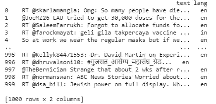
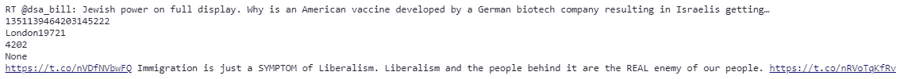
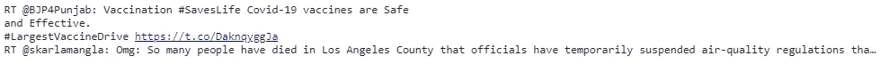
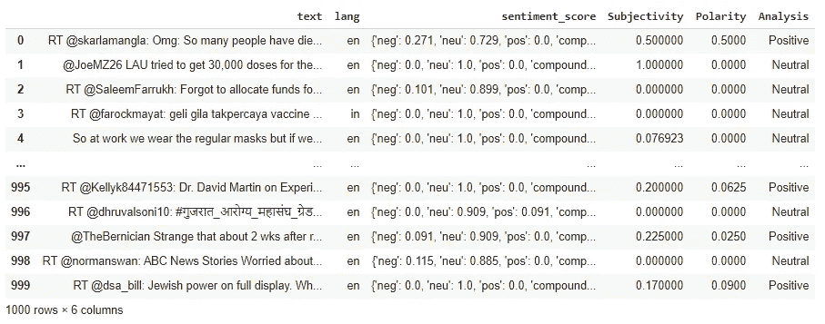
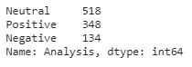
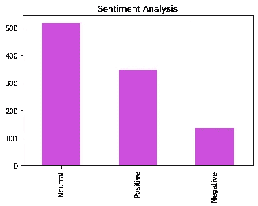
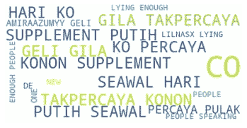

# 使用 Python 对新冠肺炎疫苗进行实时推文分析

> 原文：<https://medium.com/analytics-vidhya/real-time-tweet-analysis-for-covid-19-vaccine-using-python-1f9e32af2abd?source=collection_archive---------14----------------------->

Joshua Hoehne 在 [Unsplash](https://unsplash.com/s/photos/twitter?utm_source=unsplash&utm_medium=referral&utm_content=creditCopyText) 上拍摄的照片

本文分析了关于新冠肺炎疫苗的实时推文。我的分析给出了人们对新冠肺炎疫苗的看法是积极还是消极，或者是中立的答案。你会看到哪些关于新冠肺炎疫苗的词在推特上出现的次数最多。此外，关于疫苗类型的推文也进行了比较。

我用我的 Twitter 开发者账户获得了这些推文，并使用了 Python。

# 数据

我从在相关变量中存储认证凭证开始。我限制了最后 1000 条微博。

我过滤了推文，只追踪这些关键词；“covid19 疫苗”、“新冠肺炎疫苗”、“冠状病毒疫苗”、“covid19 疫苗”、“新冠肺炎疫苗”、“冠状病毒疫苗”、“疫苗”、“疫苗”。

打印后，第一个 tweet dict 的按键已经看到。它包括创建时间、id、位置、用户、状态、回复状态 id、回复用户 id、转发状态、坐标、转发次数、回复次数、收藏次数等。在这种情况下，文本和语言是作为一个特性添加的。

让我们快速浏览一下数据。

图 1:数据框。

图 2

图 2 显示了一个关于疫苗的推文示例。第一行显示了这条推文，它是 dsa_bill 的用户转发的。用户 id 显示在第二行，分别显示了他/她的用户名、该用户的关注者数量、位置和帐户描述。

# 使用 Vader 进行情感分析

情感分析属于文本分类的大类，分类器应该告诉背后的情感是积极的、消极的还是中性的。

图 3:正面和负面推文的例子。

图 4:新的数据帧。

添加到数据框架的情感评分、主观性、极性和分析的特征。以下是正面、中立和负面推文的数量。

图 5

用图表看区别更清楚。

图 6:情感分析图。

关于辉瑞、Moderna 和 Coronavac 的推文进行了比较。下面是比例:

## 词云

在包含新冠肺炎疫苗的文本中，最热门的词可能会在词云上看到。为了把云这个词说清楚，我把这些词停了下来；“covid”、“covid19”、“疫苗”、“疫苗”、“https”、“威尔”、“冠状病毒”、“rt”。字数限制在 20 个以内。

图 7:云这个词。

## 结论

结果，这项分析是在过去 1000 条关于新冠肺炎疫苗的推文中进行的。有 518 条中立、348 条正面和 134 条负面推文。提及辉瑞的推文比例为 0.05%，Moderna 为 0.015%，Coronavac 为 0.003%。

感谢您的阅读。

请不要犹豫给我反馈。