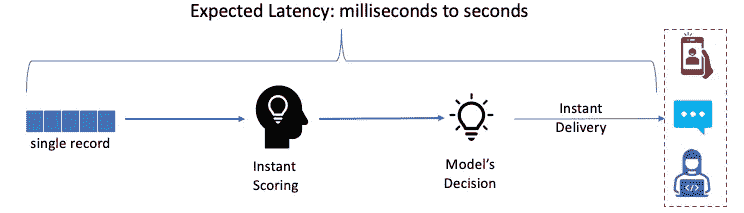
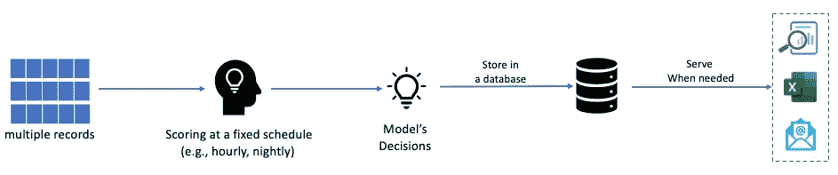

# 快与慢:你应该选择哪条路线为你的商业用户提供人工智能？

> 原文：<https://medium.com/analytics-vidhya/real-time-vs-batch-inferencing-which-one-is-the-right-inferencing-strategy-for-your-ai-use-case-2b9e031603cd?source=collection_archive---------21----------------------->

2017 年，我在 IBM 领导一个数据科学项目。我们希望建立一个机器学习(ML)模型，帮助确定不续订产品许可证风险较高的客户名单。基于这种预测性的洞察力，我们的客户团队将挑选他们应该首先主动交谈的客户。

利用历史客户记录和业务专家的知识，我们在两个月内开发了一个不错的 ML 模型。接下来，我们需要决定运行模型来生成预测的频率。我们有两个选择:(1)实时推理和(2)离线/批量推理。哪个选项适合我们的人工智能用例？

# 实时推理

在这个策略中，当一个新记录到达时，ML 模型立即计算它的预测，并立即传递给用户。当 ML 结果需要基于新数据立即交付给实时用户时，实时推理是默认选择。例如，Uber Eats 应用程序可能会使用实时推理，使用当前位置、过去的订单和当前用户会话中最近的搜索活动向实时客户推荐餐馆。

实时推理

对于实时评分解决方案，模型执行环境需要 24x7 在线。该解决方案以 24x7 ML 基础设施成本为代价提供了速度。

# 批量推理

通过批量评分，在固定的时间间隔(例如，每小时、每天、每周)，模型接收一批观察值并立即计算它们的预测值。接下来，评分过程将预测保存到数据库中，以便在以后为用户服务。如果企业不需要立即根据预测采取行动，批量评分可能是正确的选择。

批量推理

这种评分方法不需要 24x7 ML 运行时间；它只在批处理作业执行期间需要 ML 运行时。批量评分可以为组织节省 IT 成本。

# 我们如何为 ML 模型选择正确的部署选项？

我们向利益相关者询问了以下几个问题，以帮助我们为 ML 模型选择正确的推理策略:

**a.** **模型的输入数据多久更新一次？**

我们的模型从数据库中生成预测。数据库管理员告诉我们，他们每周运行一次脚本，将新的客户记录放入数据库。这意味着在每周数据库更新之间的七天内，我们模型的输入特性不会改变。根据这一知识，我们得出结论，对于任何客户记录，如果模型在一周内多次生成预测，在每周数据库更新之间，预测将保持不变。

**b.** **用户会如何消费预测？**

接下来，我们想知道用户会在一周内查看任何客户的模型预测的次数。我们与客户团队的几个成员进行了交谈，他们每个人都在处理与一部分客户的关系。每天早上，他们会查看分配给他们的客户名单，并选择一个或几个他们想在一天中关注的客户。当时，他们使用他们的直觉，例如，与客户相关的收入，来选择客户。在我们的 ML 模型与他们的仪表板集成后，他们将使用模型的决策(预测的非续保风险)来帮助选择每天重点关注的客户。在这一周中，他们会多次审查我们的模型对每个指定客户的决策。

从上面的见解中，我们发现我们的模型对客户的决策在每周数据库更新之间的七天内保持不变。此外，用户将在一周内多次查看模型对客户的决策。我们的结论是，我们的人工智能用例不需要实时推理解决方案。离线批量评分推理解决方案是适合我们的解决方案。我们创建了一个推理过程，该过程将在数据库刷新后不久计算所有客户的预测，将这些预测保存到数据库表中，然后在一周内将这些预测提供给用户。借助这一解决方案，我们避免了 ML 模型的冗余计算，并通过离线模型部署节省了 IT 成本。