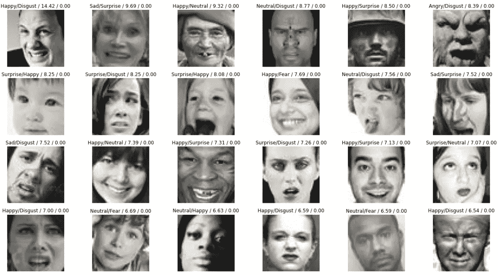
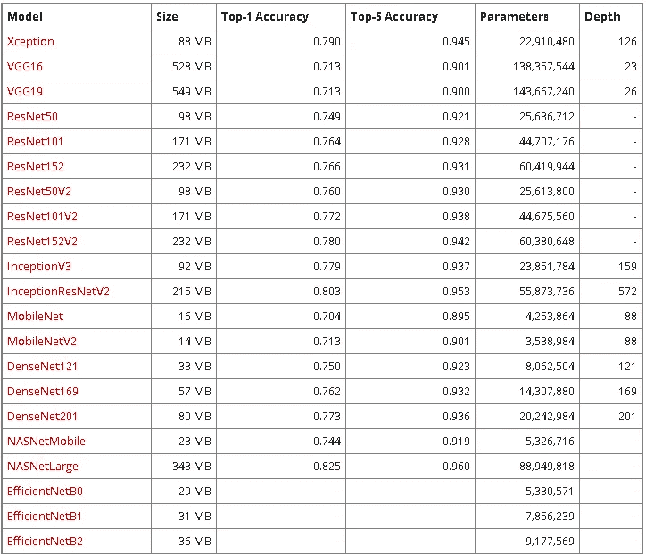

# TensorFlow 中基于迁移学习的实时人脸情感识别

> 原文：<https://medium.com/analytics-vidhya/realtime-face-emotion-recognition-using-transfer-learning-in-tensorflow-3add4f4f3ff3?source=collection_archive---------0----------------------->

让项目开始吧！！

# 数据集:

我们将使用的数据集是 2013 年在国际机器学习会议上发表的 fer2013。



您可以通过以下链接下载该数据集:

[](https://www.kaggle.com/msambare/fer2013) [## FER-2013 年

### 从图像中学习面部表情

www.kaggle.com](https://www.kaggle.com/msambare/fer2013) 

让我们深入到项目中，首先使用 Jupyter Notebook 或任何其他您喜欢的环境打开一个新项目。首先也是最重要的，导入库

```
import tensorflow as tf 
import cv2 
import os
import matplotlib.pyplot as plt 
import pandas as pd
import numpy as np
```

OpenCV-Python 是一个 Python 绑定库，旨在解决计算机视觉问题。方法从指定的文件中加载一幅图像。如果图像无法读取(由于缺少文件、不正确的权限、不支持或无效的格式)，则此方法返回一个空矩阵。我们可以通过下面一行代码来读取图像:

```
img_array = cv2.imread(‘train/0/Training_3908.jpg’)
```

为了检查图像的大小，我们使用:

```
img_array.shape
```

matplotlib 函数 **imshow** ()从一个二维 numpy 数组中创建一个图像。对于数组中的每个元素，该图像都有一个正方形。每个方块的颜色由相应数组元素的值和 **imshow** ()使用的颜色图决定。

```
plt.imshow(img_array)
```

现在我们将创建一个包含目录名的变量和一个包含该目录下文件夹名的列表。在我的例子中，我已经根据情感标签重命名了文件夹。

```
Datadirectory = "Training/"
Classes = ["0","1","2","3","4","5","6"]
```

**ImageNet** 数据集包含固定**大小**的图像 **224** * **224** 和**具有** RGB 通道，但由于 **fer2013** 具有大小 **48*48** 的图像，因此我们必须调整图像的大小。为了调整图像的大小，OpenCV 提供了 cv2.resize()函数。 **cv2.cvtColor()** 方法用于将图像从一个颜色空间转换到另一个颜色空间。

```
img_size = 224 
new_array = cv2.resize(img_array, (img_size, img_size))
plt.imshow(cv2.cvtColor(new_array, cv2.COLOR_BGR2RGB))
plt.show()
```

执行上述代码的原因是我们正在使用迁移学习，因此对于迁移学习，如果我们想要使用任何深度学习分类器，那么这些维度必须相同。现在，我们将读取所有的图像，并将它们转换为数组。

```
training_Data = []
def create_training_Data():
  for category in Classes:
    path = os.path.join(Datadirectory, category)
    class_num = Classes.index(category)
    for img in os.listdir(path):
      try:
        img_array = cv2.imread(os.path.join(path, img))
        new_array = cv2.resize(img_array, (img_size, img_size))
        training_Data.append([new_array, class_num])
      except Exception as e:
        pass
```

让我们调用这个函数:

```
create_training_Data()
```

为了让我们的深度学习架构变得动态和健壮，让我们打乱顺序:

```
import random
random.shuffle(training_Data)
```

让我们把特性和标签分开。我们将使用深度学习架构 MobileNet，它需要 4 个维度，因此我们将重塑功能列表。

```
X = []
y = []
for features, label in training_Data:
  X.append(features)
  y.append(label)
X = np.array(X).reshape(-1, img_size, img_size, 3) 
# 3 is the channel for RGB
```

训练神经网络的最佳实践之一是将你的数据标准化以获得一个接近于 0 的平均值。数据通常会加速学习并导致更快的收敛。让我们在训练前将数据标准化

```
X =X/255.0
```

现在我们将使用迁移学习来训练我们的深度学习模型

```
from tensorflow import keras
from tensorflow.keras import layers
```

Keras 应用程序是深度学习模型，可与预训练的权重一起使用。这些模型可用于预测、特征提取和微调。这是一些可用模型的图表。



现在我们将使用 MobileNetV2

```
model = tf.keras.applications.MobileNetV2()
```

让我们改变基本输入

```
base_input = model.layers[0].input
```

因为我们想要七个班级，所以让我们削减产量

```
base_output = model.layers[-2].output
```

**密集层**是深度连接的神经网络**层**，这意味着**密集层**中的每个神经元接收来自其前一**层**的所有神经元的输入。**激活**功能是一个数学“门”，位于馈入当前神经元的输入和去往下一个**层**的输出之间。它可以像阶跃函数一样简单，根据规则或阈值打开或关闭神经元输出。这里我们使用 relu 作为激活函数。

```
final_output = layers.Dense(128)(base_output) 
final_output = layers.Activation(‘relu’)(final_output) 
final_output = layers.Dense(64)(final_output)
final_output = layers.Activation(‘relu’)(final_output)
final_output = layers.Dense(7, activation=’softmax’)(final_output) 
```

让我们创建我们的新模型。

```
new_model = keras.Model(inputs = base_input, outputs = final_output)
```

**编译**定义损失函数、优化器和指标。仅此而已。这与重量无关，您可以**编译**一个**模型**任意多次，而不会对预训练的重量造成任何问题。你需要一个**编译的模型**来训练(因为训练使用了损失函数和优化器)。

```
new_model.compile(loss=”sparse_categorical_crossentropy”, optimizer = “adam”, metrics = [“accuracy”])
```

训练**型号**25 个时代。

```
new_model.fit(X, Y, epochs = 25)
```

下面是保存模型的代码。

```
new_model.save(‘Final_model_95p07.h5’)
```

下面的代码是测试它使用一个现场摄像头。

```
import cv2 # pip install opencv-python
#pip install opencv-contrib-python full package
#from deepface import DeepFace #pip install deepface
path = "haarcascade_frontalface_default.xml"
font_scale = 1.5
font = cv2.FONT_HERSHEY_PLAIN#set the rectangle background to white
rectangle_bgr = (255, 255, 255)
#make a black image
img = np.zeros((500, 500))
#set some text
text = "Some text in a box!"
# get the width and height of the text box
(text_width, text_height) = cv2.getTextSize(text, font, fontScale=font_scale, thickness=1)[0]
# set the text start position
text_offset_x = 10
text_offset_y = img.shape[0] - 25
#make the coords of the box with a small padding of two pixels
box_coords = ((text_offset_x, text_offset_y), (text_offset_x + text_width + 2, text_offset_y - text_height - 2))
cv2.rectangle(img, box_coords[0], box_coords[1], rectangle_bgr, cv2.FILLED)
cv2.putText(img, text, (text_offset_x, text_offset_y), font, fontScale=font_scale, color=(0, 0, 0), thickness=1)cap = cv2.VideoCapture(1)
# Check if the webcam is opened correctly
if not cap.isOpened():
  cap = cv2.VideoCapture(0)
if not cap.isOpened():
  raise IOError("Cannot open webcam")while True:
  ret, frame = cap.read()
  #eye_cascade = cv2.CascadeClassifier(cv2.data.haarcascades + 'haarcascade_eye.xml')
  faceCascade = cv2.CascadeClassifier(cv2.data.haarcascades + 'haarcascade_frontalface_default.xml')
  gray = cv2.cvtColor(frame, cv2.COLOR_BGR2GRAY)
  #print(faceCascade.empty())
  faces = faceCascade.detectMultiScale(gray,1.1,4)
  for x,y,w,h in faces:
    roi_gray = gray[y:y+h, x:x+w]
    roi_color = frame[y:y+h, x:x+w]
    cv2.rectangle(frame, (x, y), (x+w, y+h), (255, 0, 0), 2)
    facess = faceCascade.detectMultiScale(roi_gray)
    if len(facess) == 0:
      print("Face not detected")
    else:
      for (ex,ey,ew,eh) in facess:
        face_roi = roi_color[ey: ey+eh, ex:ex + ew] ## cropping the face

    final_image = cv2.resize(face_roi, (224,224))
    final_image = np.expand_dims(final_image,axis=0) ## need fourth dimension
    final_image = final_image/255.0font = cv2.FONT_HERSHEY_SIMPLEXPredictions = new_model.predict(final_image)font_scale = 1.5
    font = cv2.FONT_HERSHEY_PLAINif(np.argmax(Predictions)==0):
      status = "Angry"x1,y1,w1,h1 = 0,0,175,75
      #Draw black background rectangle
      cv2.rectangle(frame, (x1, x1), (x1 + w1, y1 + h1), (0,0,0), -1)
      #Addd text
      cv2.putText(frame, status, (x1 + int(w1/10), y1 + int(h1/2)), cv2.FONT_HERSHEY_SIMPLEX, 0.7, (0,0,255), 2)cv2.putText(frame, status,(100,150),font, 3,(0, 0, 255),2,cv2.LINE_4)cv2.rectangle(frame, (x,y), (x+w, y+h), (0, 0, 255))elif (np.argmax(Predictions)==1):
      status = "Disgust"x1,y1,w1,h1 = 0,0,175,75
      #Draw black background rectangle
      cv2.rectangle(frame, (x1, x1), (x1 + w1, y1 + h1), (0,0,0), -1)
      #Addd text
      cv2.putText(frame, status, (x1 + int(w1/10), y1 + int(h1/2)), cv2.FONT_HERSHEY_SIMPLEX, 0.7, (0,0,255), 2)cv2.putText(frame, status,(100,150),font, 3,(0, 0, 255),2,cv2.LINE_4)cv2.rectangle(frame, (x,y), (x+w, y+h), (0, 0, 255))elif (np.argmax(Predictions)==2):
      status = "Fear"x1,y1,w1,h1 = 0,0,175,75
      #Draw black background rectangle
      cv2.rectangle(frame, (x1, x1), (x1 + w1, y1 + h1), (0,0,0), -1)
      #Addd text
      cv2.putText(frame, status, (x1 + int(w1/10), y1 + int(h1/2)), cv2.FONT_HERSHEY_SIMPLEX, 0.7, (0,0,255), 2)cv2.putText(frame, status,(100,150),font, 3,(0, 0, 255),2,cv2.LINE_4)cv2.rectangle(frame, (x,y), (x+w, y+h), (0, 0, 255))

    elif (np.argmax(Predictions)==3):
      status = "Happy"x1,y1,w1,h1 = 0,0,175,75
      #Draw black background rectangle
      cv2.rectangle(frame, (x1, x1), (x1 + w1, y1 + h1), (0,0,0), -1)
      #Addd text
      cv2.putText(frame, status, (x1 + int(w1/10), y1 + int(h1/2)), cv2.FONT_HERSHEY_SIMPLEX, 0.7, (0,0,255), 2)cv2.putText(frame, status,(100,150),font, 3,(0, 0, 255),2,cv2.LINE_4)cv2.rectangle(frame, (x,y), (x+w, y+h), (0, 0, 255))elif (np.argmax(Predictions)==4):
      status = "Sad"x1,y1,w1,h1 = 0,0,175,75
      #Draw black background rectangle
      cv2.rectangle(frame, (x1, x1), (x1 + w1, y1 + h1), (0,0,0), -1)
      #Addd text
      cv2.putText(frame, status, (x1 + int(w1/10), y1 + int(h1/2)), cv2.FONT_HERSHEY_SIMPLEX, 0.7, (0,0,255), 2)cv2.putText(frame, status,(100,150),font, 3,(0, 0, 255),2,cv2.LINE_4)cv2.rectangle(frame, (x,y), (x+w, y+h), (0, 0, 255))elif (np.argmax(Predictions)==5):
      status = "Surprise"x1,y1,w1,h1 = 0,0,175,75
      #Draw black background rectangle
      cv2.rectangle(frame, (x1, x1), (x1 + w1, y1 + h1), (0,0,0), -1)
      #Addd text
      cv2.putText(frame, status, (x1 + int(w1/10), y1 + int(h1/2)), cv2.FONT_HERSHEY_SIMPLEX, 0.7, (0,0,255), 2)cv2.putText(frame, status,(100,150),font, 3,(0, 0, 255),2,cv2.LINE_4)cv2.rectangle(frame, (x,y), (x+w, y+h), (0, 0, 255))else:
      status = "Neutral"x1,y1,w1,h1 = 0,0,175,75
      #Draw black background rectangle
      cv2.rectangle(frame, (x1, x1), (x1 + w1, y1 + h1), (0,0,0), -1)
      #Addd text
      cv2.putText(frame, status, (x1 + int(w1/10), y1 + int(h1/2)), cv2.FONT_HERSHEY_SIMPLEX, 0.7, (0,0,255), 2)cv2.putText(frame, status,(100,150),font, 3,(0, 0, 255),2,cv2.LINE_4)cv2.rectangle(frame, (x,y), (x+w, y+h), (0, 0, 255))cv2.imshow('Face Emotion Recognition', frame)if cv2.waitKey(2) & 0xFF == ord('q'):
    breakcap.release()
cv2.destroyAllWindows()
```