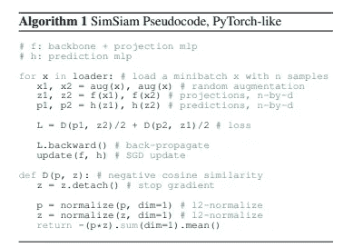

# 自我监督和无监督表征学习的最新进展(2019~2022)。

> 原文：<https://medium.com/analytics-vidhya/recent-advances-in-self-supervised-and-unsupervised-representation-learning-2019-2022-1553a45cf8fd?source=collection_archive---------0----------------------->

我上一次关于半监督学习的工作碰巧引起了很多人的兴趣。所以，我决定对表征学习做一个类似的总结。我个人热爱这个领域，对 2022 年寄予厚望。在这篇文章中，我试图总结最近出版的许多重要作品。我可能已经错过了一些，但我仍然试图作出一个很好的介绍文章，这个领域的 ML。希望节省某人消化信息的时间。

# 对比学习

由 [Sumit Chopra 等人](http://yann.lecun.com/exdb/publis/pdf/chopra-05.pdf)提出。2005 年。

对比学习是从被组织成相似/不相似对的数据中学习相似/不相似表示的框架。这种损失也称为 InfoNCE，通常表示为:

摘自 [MoCo](https://arxiv.org/pdf/2003.04297.pdf)

其中 q 是查询样本的表示，而 k+和 k-分别是正和负关键样本的表示。通常，q 和 k 样本是同一图像的增强对。最后，使用温度超参数τ来调节灵敏度。这个框架是许多作品的核心思想。

# 视觉表征对比学习的简单框架

也称为 SimCLR，由[陈婷等人](https://arxiv.org/pdf/2002.05709.pdf)提出。

[SimCLR](https://arxiv.org/pdf/2002.05709.pdf)

最初，我们增加一个小批量以获得阳性配对。然后，相同的编码器 f 和投影头 g (MLP)被应用于扩充的样本。最后，我们应用上面定义的对比损失来最大化一致性，最小化同一样本图像的增强对之间的距离。因此，重要的是要注意，批量越大，我们的对比学习框架的负面样本就越多。这带来了计算的复杂性。

[SimCLR](https://arxiv.org/pdf/2002.05709.pdf)

# 借口不变表征的自我监督学习

PIRL 提议由[伊山·米斯拉等人](https://arxiv.org/pdf/1912.01991.pdf)提出。在上面的 SimCLR 图中，您可能已经注意到了这个方法。因此，我觉得有必要简单介绍一下，因为它与该领域的最新进展密切相关。

[PIRL](https://arxiv.org/pdf/1912.01991.pdf)

上图显示了 PIRL 框架的概况。I_t 是原始样本图像 I 的增强视图，而θ表示主编码器(ResNet)的权重，f 和 g 是两个独立的投影头(全连接层)。正如我们所看到的，我们需要获得 9 个变换/增强的图像补片并连接它们的表示。因此，投影头 g 采用比来自顶部分支的嵌入大 9 倍的级联嵌入。在我们应用投影头之后，我们应用如下的对比学习:

[PIRL](https://arxiv.org/pdf/1912.01991.pdf)

其中 m_I 是由存储体 m 存储的原始图像(未扩充)的特征向量。因此，我们试图最大化特征向量 m_I 和来自两个分支的相应投影之间的一致性。注意，负样本是从存储体中随机采样的。

# 无监督视觉表征学习的动量对比

明凯何等人提出了一种无监督的表示学习方法，称为。

[MoCo](https://arxiv.org/pdf/1911.05722.pdf)

如上图所示，作者放弃了在整个训练过程中存储特征表示的记忆库，因为它在训练中带来了内存开销。取而代之的是，他们引入了一个动量编码器，这个编码器可以根据主编码器的移动平均值进行更新。此外，他们建议字典作为一个队列结构(先进先出)，它也存储特征表示。它比记忆库小得多，因为作者认为没有必要存储过去某个时期获得的特征向量。如图所示，对比损失是通过最小化来自两个网络的图像的扩充对的表示的距离和最大化从字典中随机采样的表示的距离来实现的。有趣的是，有许多工作表明，由记忆库完成的表征平均与编码器平均(动量编码器)非常相似。然而，动量编码器显著降低了存储成本。

下面附上伪代码:

[MoCo](https://arxiv.org/pdf/1911.05722.pdf)

# MoCo v2 和 MoCo v3

[MoCo v2](https://arxiv.org/pdf/2003.04297.pdf)

MoCo v2 对原始框架做了一些修改。我想根据上图总结如下:

1.  附加 MLP 头作为最终模块(添加到两个编码器)。下面附上的原始代码快照总结了这个 MLP 头。我们看到，我们简单地用一对全连接层替换最后一个全连接层，在它们之间有 ReLU 激活(隐藏层 2048-d，带有 ReLU)。

[原始代码](https://github.com/facebookresearch/moco)

2.作者通过包括模糊增强来包括更强的增强。

3.作者包括一个余弦学习率调度程序。

# 激发你自己的潜能——自我监督学习的新方法

BYOL 由 J [ean-Bastien Grill 等人](https://arxiv.org/pdf/2006.07733.pdf)提出。

[BYOL](https://arxiv.org/pdf/2006.07733.pdf)

我希望到现在为止，你已经熟悉了“表现”和“投射”这样的术语。如果不是，请花时间去了解其中的区别:d。

BYOL 的主要贡献是，作者放弃了 MoCo 和 PIRL 分别使用的字典或内存缓冲区。相反，他们引入了另一个**预测头** (MLP 类似于投影头)。因此，从上图中我们可以注意到，预测头获取在线编码器(主编码器)的投影，并尝试预测来自动量编码器的投影。预测头非常重要，因为它有助于避免折叠(当所有表示都相同时)。

> 注意，这个预测器只应用于在线分支，使得在线管道和目标管道之间的架构不对称。

因此，我认为这是一种正规化。此外，作者完全放弃使用负样本，并提出损失如下:

[BYOL](https://arxiv.org/pdf/2006.07733.pdf)

其中所有的特征向量都是 l2 归一化的。

[BYOL](https://arxiv.org/pdf/2006.07733.pdf)

尽管框架不同寻常，但 BYOL 的表现优于所有之前的同行。

## MoCo v3

现在回到 MoCo 家族(译注:

它是为自监督 ResNet 和 ViT 开发的，去年由何等人提出

[MoCo v3](https://arxiv.org/pdf/2104.02057.pdf)

我想把这些贡献总结如下:

1.  作者放弃字典，使用预测头作为 BYOL。

> 在 MoCo v3 中，两个 MLP 中的所有层都具有 BN。BYOL/SwAV 的 MLP 头有不同的 BN 设计。

1.  对比损失还在游戏里。作者发现大批量(4096)足以获得优异的性能。

3.主干可以用 VisionTransformer (ViT)代替。事实上，整个工作是为了融入 ViTs lol。

更多详情请参考[原文](https://arxiv.org/pdf/2104.02057.pdf)。

# 探索简单的连体表示学习

SimSiam 是由何等人于 2020 年提出的。

[暹罗](https://arxiv.org/pdf/2011.10566.pdf)

在这项工作中，作者表明可能没有必要使用动量编码器作为教师模型。事实上，一个简单而古老的连体框架可以取得很大的效果。然而，在上图中，我们可以看到有一个**预测器**头，它试图预测同一图像的增强样本的输出表示。此外，作者指出停车梯度操作在避免坍塌中起着至关重要的作用。乍一看，这个框架与 SimCLR 非常相似。但是，您应该记得，SimCLR 依赖于阴性样本，它不执行梯度停止。因此，SimCLR 还需要更大的批量，这带来了额外的计算成本。下面提供了伪代码:

[辛暹](https://arxiv.org/pdf/2011.10566.pdf)

我简单总结一下，以防你不熟悉 PyTorch 框架。

1.  你放大一幅图像以获得一对放大的样本。
2.  我们使用网络 f_theta 获得我们的投影。
3.  我们使用**预测器**头(MLP)来计算预测嵌入。注意，对于增强图像的每个投影，我们试图预测该对本身的投影。
4.  计算负余弦相似性损失。注意，停止毕业。在目标投影(z)上执行。

作者还指出，如果我们放弃我们的预测器(即预测器 h 是单位矩阵)，该框架就会失败。此外，预测器的学习率不需要在整个训练过程中衰减。事实上，如果预测器的 lr 保持不变，SimSiam 甚至可以获得更好的结果。

> 一种可能的解释是 h 应该适应最新的表示，因此在表示被充分训练之前，没有必要强迫它收敛(通过减少 lr)。在我们的模型的许多变体中，我们已经观察到具有常数 lr 的 h 提供了稍好的结果。

[辛暹](https://arxiv.org/pdf/2011.10566.pdf)

我们可以观察到，像 SimSiam 这样简单的框架可以实现与当前 SOTA 方法相当的结果。这绝对是一个有趣的作品，我希望这个想法在未来会得到更深入的研究。

# 奖金(:

# 逃离你的老师:用一种新颖的自我监督的方法理解 BYOL

RAFT 是由[海州石等人](https://arxiv.org/pdf/2011.10944.pdf)在 2020 年提出的。

实际上，我认为作者们正在研究和改进这项工作。但是，我觉得很有趣，想和大家分享一下。

[木筏](https://arxiv.org/pdf/2011.10944.pdf)

作者对试图匹配动量编码器的想法提出了质疑。因此，他们提出了一种不同的方法，其中在线编码器试图最大化其表示和平均教师(MT)的表示之间的距离。同时，它还试图最小化同一图像的增强样本的表示之间的距离。RAFT 以一种与 BYOL 完全相反的方式整合了 MT，它通过鼓励在线与过去不同(势头更新)来明确防止崩溃。而且，他们证明 BYOL 实际上是一种特殊形式的木筏(更多细节请参考原始论文)。上图非常清楚地显示了 BYOL 框架和 RAFT 框架之间的区别。总的来说，我们也已经注意到了我们现在非常熟悉的**预测器**。(:

[筏](https://arxiv.org/pdf/2011.10944.pdf)

上面提供了 RAFT 的算法。我总结如下:

1.  获得同一图像的增强对。
2.  计算两个扩充样本的**预测**嵌入。
3.  计算相同样本的 MT 投影嵌入。
4.  **对齐损失**是在两个**预测**嵌入之间计算的，它鼓励一对尽可能接近。这只是 l2 归一化嵌入的 MSE 损失。
5.  **负的跨模型损失**促使预测嵌入(来自在线编码器)与 MT 的投影嵌入不同。

[木筏](https://arxiv.org/pdf/2011.10944.pdf)

作者还指出，**预测器**在其他作品中起到了至关重要的作用，有助于避免表示崩溃。他们认为这是 BYOL 尽管有着不同寻常的学习策略却没有失败的主要原因。此外，他们认为 RIFT 框架鼓励在线编码器不断改进其历史(MT ),因此我们不需要期待完全的融合。总体而言，MT 是一种正则化子，作者认为 RAFT 比 BYOL 更有利。

# 然后

 [## 自我监督学习:通过不变因果机制的表征学习

### 你好，我最近不太活跃，但我有一些空闲时间来提供这篇文章。我发现了更多有趣的作品…

chingisoinar.medium.com](https://chingisoinar.medium.com/self-supervised-learning-representation-learning-via-invariant-causal-mechanisms-42ca16f45902)  [## 自我监督学习:对比学习中什么不应该是对比

### 如果你研究对比学习，你会发现这项工作是非常有见地的。不像以前的作品在…

chingisoinar.medium.com](https://chingisoinar.medium.com/self-supervised-learning-what-should-not-be-contrastive-in-contrastive-learning-937814576cef) 

# 一些遗言

我试图涵盖最近出版的所有重要作品。然而，我可能已经错过了一些。如果我错过了这方面的有趣作品，请告诉我。总的来说，我可能错过了本文中一些有趣的技术细节；然而，我的目标是尽快向你介绍这个领域。如果您对其中任何一部作品感兴趣，请慢慢阅读原文，了解更多更好的细节(:感谢您花时间阅读我的文章。我希望通过节省一些消化信息的时间来减轻某人的生活。

## 我的看法

正如我们可能注意到的那样，脸书研究小组在这一领域一直做着令人惊叹的工作。此外，我们可以注意到这一领域的一些趋势，因为最近的工作大多使用动量编码器。此外，我们还注意到，最近的工作不依赖于负面样本。我只想分享这些发现。