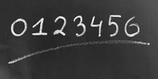
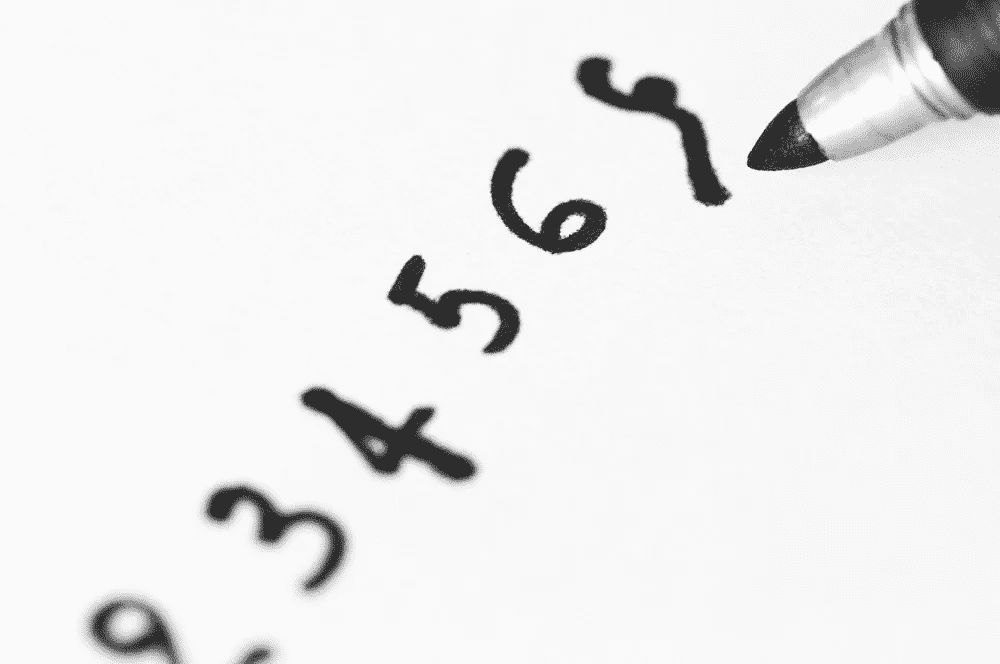
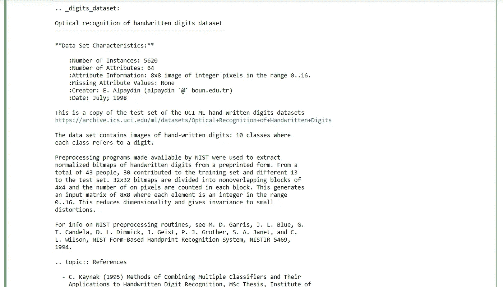
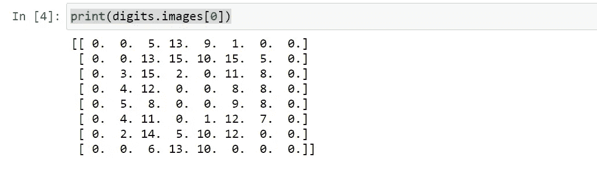
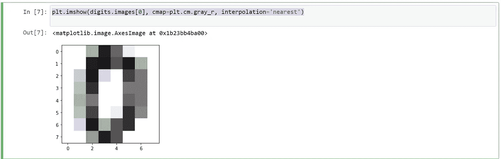
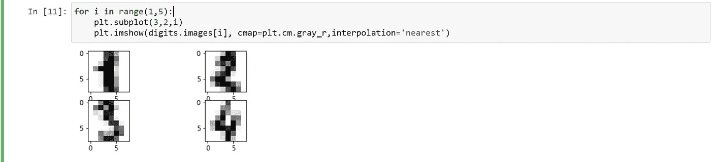

# 识别手写数字

> 原文：<https://medium.com/analytics-vidhya/recognizing-hand-written-digits-2434c5821c3?source=collection_archive---------13----------------------->

这个例子展示了如何使用 scikit-learn 来识别手写数字(从 0 到 9)的图像。



手写数字。

我将使用**支持向量机(SVM)** 分析手写数字。SVM 是一种受监督的机器学习算法，可用于分类或回归挑战。但多用于分类问题，称为**支持向量分类器****【SVC】**。

我使用了 python 的 scikit-learn 库和 matplotlib 库来执行这个项目，并使用了 scikit-learn 预定义的数据集 **load_digits** 用于这个项目。



在这个项目中，你可能要面对的问题包括预测一个数值，然后阅读和解释一个使用手写字体的图像。因此，即使在这种情况下，您也将有一个评估器，它的任务是通过 fit()函数进行学习，一旦它达到一定程度的预测能力(一个足够有效的模型)，它将使用 predict()函数进行预测。然后我们将讨论这次从一系列图像中创建的训练集和验证集。在这种情况下有用的估计器是 sklearn。SVM。SVC，它使用支持向量分类(SVC)技术。因此，您必须导入 scikit-learn 库的 SVM 模块。您可以创建 SVC 类型的估计器，然后选择初始设置，将值 C 和 gamma 指定为通用值。在分析过程中，可以对这些值进行不同的调整。从 sklearn 导入 svm svc = svm。SVC(γ= 0.001，C=100。).

# **1。实现-** 首先我们会根据自己的需求实现一些库。

> 从 sklearn 导入数据集
> 从 sklearn 导入 svm
> 从 matplotlib 导入 pyplot 作为 plt

**2。导入数据集-**sci kit-learn 库提供了大量数据集，可用于测试许多数据分析和结果预测问题。同样在这种情况下，有一个图像数据集称为数字。

> svc = svm。SVC(γ= 0.001，C=100。)
> digits = datasets . load _ digits()

**3。分析我们的数据集-** 加载完数据集，就可以分析内容了。首先，您可以通过调用 DESCR 属性来读取关于数据集的大量信息。对于数据集的文字描述，参与创建的作者和参考资料将如图所示。

> 打印(数字。描述)



手写数字的图像包含在数字中。图像数组。该数组的每个元素都是一个图像，由一个 8×8 的数值矩阵表示，这些数值对应于从值为 0 的白色到值为 15 的黑色的灰度。

> 打印(digits.images[0])



通过 plt。imshow()命令，你将获得如图所示的灰度图像。

> plt.imshow(digits.images[0]，cmap=plt.cm.gray_r，interpolation='nearest ')



> 打印(数字.目标)

输出:-

```
[0 1 2 ... 8 9 8]
```

> 对于范围(1，5)中的 I:
> PLT . subplot(3，2，I)
> PLT . im show(digits . images[I]，cmap=plt.cm.gray_r，interpolation='nearest ')



> #生成模型我们来建立支持向量机模型。首先，导入 SVM 模块，并通过将自变量内核作为 SVC()函数中的线性内核进行传递来创建一个支持向量分类器对象。
> 
> 然后，使用 fit()在训练集上拟合您的模型，并使用 predict()在测试集上执行预测。
> 
> #现在，您可以训练之前定义的 svc 估计器。
> svc.fit(数字.数据[1:1790]，数字.目标[1:1790])
> svc.predict(数字.数据[1:7])
> 
> 输出:-数组([1，2，3，4，5，6])
> 
> digits.target[1:7]

```
array([1, 2, 3, 4, 5, 6]) 
```

为了测试我们预测的准确性，我们可以使用 ***accuracy_score。*** 这个数字是测试样本中的数字被分类到正确类别的概率，意味着我们得到 100 个 ***%*** 的数字是正确的。

从 sklearn.metrics 导入 accuracy _ score
accuracy _ score(SVC . predict(digits . data[1:7])，digits.target[1:7])

输出:-

```
1.0
```

> a = digits . target[1:7]
> b = SVC . predict(digits . data[1:7])
> #比较 a 和 b 我们得到精度为:
> 对于范围内的 I(len(a)):
> yes = no = 0
> if a[I]= = b[I]:
> yes+= 1
> else:
> no+= 1
> 精度=(yes/(no+yes))*100
> 
> 打印(准确性)

```
100.0
```

## 结论:-我们可以看到导入数据集、使用 Scikit-Learn 库构建模型是多么容易。然后训练模型，用它进行预测，并找出我们预测的准确性(在我们的例子中是 100 ***%*** )。

> github:[-https://github . com/harshalpatil 20](https://github.com/HarshalPatil20)
> 
> LinkedIn:-[https://www.linkedin.com/in/harshal-patil-0249431a1/](https://www.linkedin.com/in/harshal-patil-0249431a1/)

谢谢……