# 用 scikit-learn 识别手写数字

> 原文：<https://medium.com/analytics-vidhya/recognizing-handwritten-digits-with-scikit-learn-e3a59493a12f?source=collection_archive---------8----------------------->

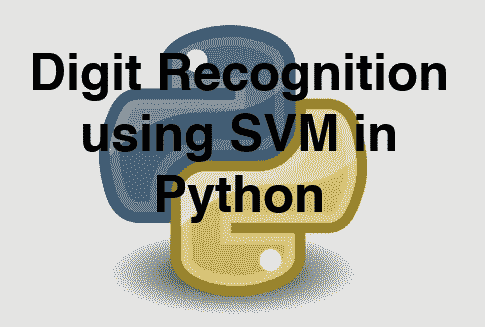

在这篇博客中，我将使用**支持向量机(SVM)** 来分析手写数字。SVM 是一种受监督的机器学习算法，可用于分类或回归挑战。但多用于分类问题，称为**支持向量分类器** **(SVC)** 。

我使用了 python 的 scikit-learn 库和 matplotlib 库来执行该项目，并使用了 scikit-learn 预定义数据集 **load_digits** 来执行该项目。我已经给了下面的链接。

 [## sk learn . datasets . load _ digits-sci kit-learn 0 . 24 . 0 文档

### 编辑描述

scikit-learn.org](https://scikit-learn.org/stable/modules/generated/sklearn.datasets.load_digits.html) 

**待测假设:***scikit-learn 库的 Digits 数据集提供了大量的数据集，可用于测试数据分析和结果预测的许多问题。一些科学家声称它 95%的时候都能准确预测数字。进行数据分析来接受或拒绝这个假设。*

在这种情况下，我们运行了 3 个测试用例，每个用例用于不同范围的训练和测试集。

不要浪费任何时间，让我们深入研究我们的项目。我在这个项目中使用了 Jupyter 笔记本。

我把这个项目分为 3 个部分。

1.  收集数据并分析数据。
2.  数据预处理和设置我们的机器学习算法 **(SVM)**
3.  把数据输入我们的算法，得到我们的预测。

# **1。收集数据并分析数据。**

在收集数据之前，我们必须在 python 上导入所需的库。这里我使用了 matplotlib 和 scikit-learn 库来导入 SVM、test_train_split 和 load_digits。

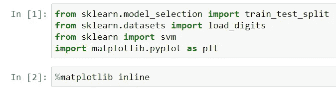

这些是包裹

现在我已经将数字数据保存在一个变量中。

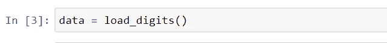

现在是时候探索我们的数据了。首先，我研究图像，这是一个数组。这个图像阵列将成为我们的训练数据，这些数据将输入到我们的算法中。我也打印了我们阵列的长度和形状。

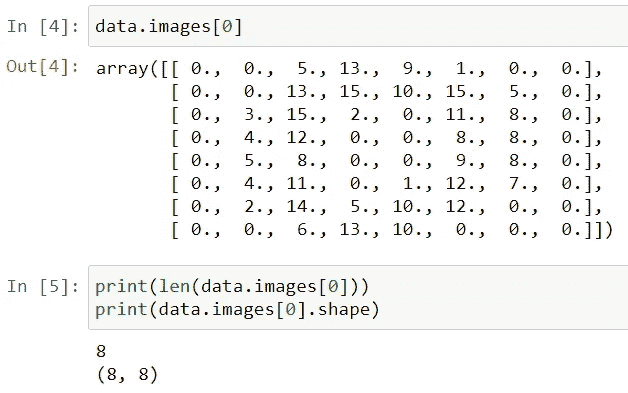

探索数据(图像)

现在，我绘制了这个 **data.images[0]** 数组来可视化数据。

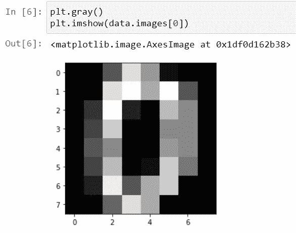

所以，从上面的情节中，我们可以清楚地看到，这是一个手写的数字。实际的绘图是丰富多彩的，但为了便于观察，我将图表绘制成了灰度格式。通过移除第一行[ **plt.gray()** ]可以获得图形的彩色图像。

现在，是时候探索我们数据的第二部分了，它是数据的目标变量。它也是与数据集关联的数组。该阵列将用于我们的测试目的。

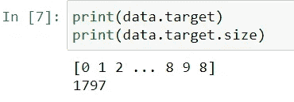

从上图中，我们可以得出结论，目标数组由 1797 个条目组成。

# **2。数据预处理和设置我们的机器学习算法(SVM)**

到目前为止，我们已经收集了数据，并可视化我们的数据。现在，是时候对数据进行预处理，准备我们的机器学习算法了。

了解数据的形状，并执行预处理数据所需的任何操作。

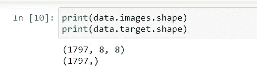

现在，我们需要将图像数据的形状从 3D 改为 2D。

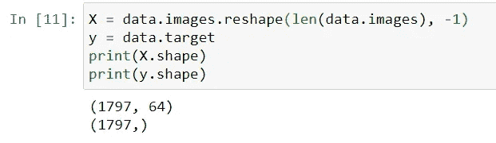

我们已经成功地将输入数据从 3D 重塑为 2D。

现在，我们将把数据分成训练和测试两部分。训练部分将反馈给算法，并且算法的输出与测试部分进行比较。

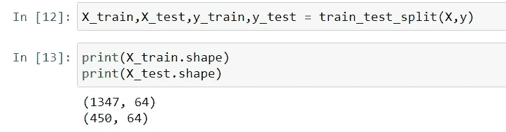

分割我们的数据

现在，我们根据需要准备我们的机器学习算法**【SVM】**。我用过γ为 0.001，c 为 100。用户可以更改该值，并检查输出结果。

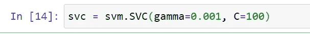

SVM 算法。

# **3。把数据输入我们的算法，得到我们的预测。**

现在，我们将数据输入算法，获得输出，完成预测。我已经用 3 种不同类型的数据范围测试了数据。

# **1。**

通过将我们的训练数据输入我们的算法来训练我们的算法。

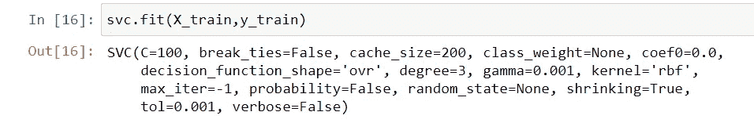

输入数据

现在，我们将检查我们的算法如何工作。我们将测试数据(X 部分)提供给算法进行预测，并检查输出。

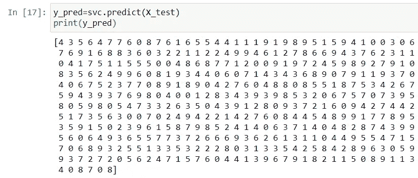

现在，在与预测进行比较之前，先看一下测试数据(y 部分)。

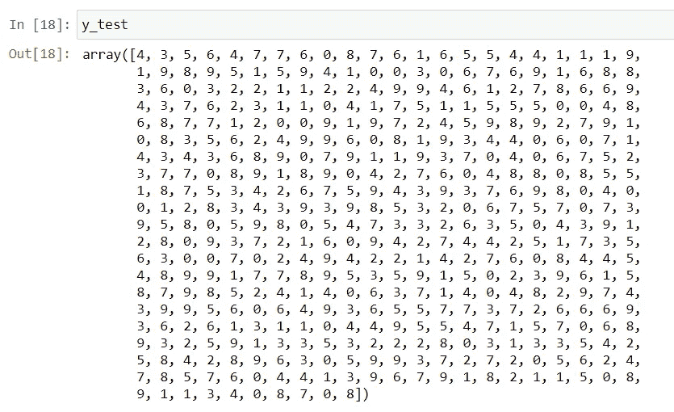

现在，我们比较这两个数据，检查我们的算法有多精确。

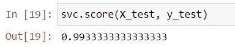

因此，我们可以得出结论，我们的算法可以预测高达 99%的准确性，我们的假设被接受。

# ***2。***

在将我们的第二类数据集输入算法之前，首先将输出数据绘制成图表。

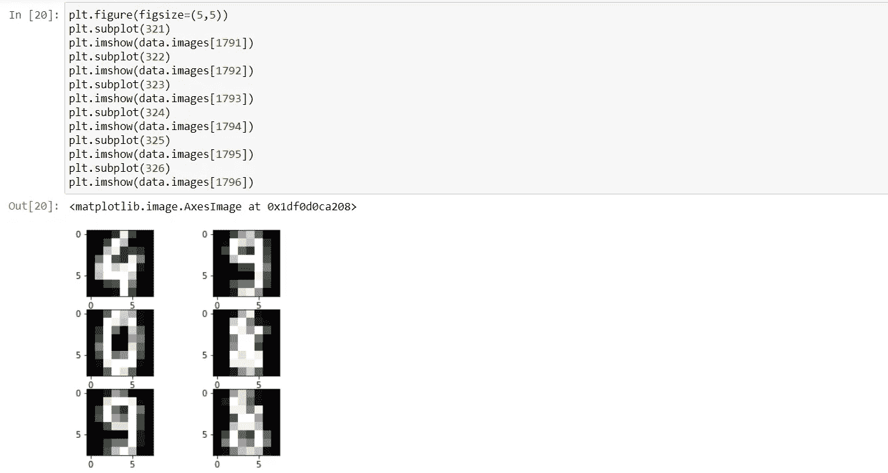

将我们的第二类数据集输入到我们的算法中。这里我们使用第 1 到第 1790 个数据来训练算法。

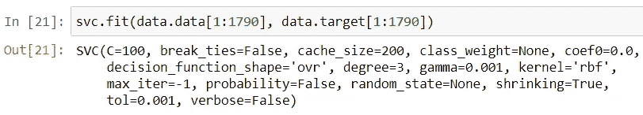

输入数据

现在，我们将检查我们的算法是如何工作的。我们将测试数据(X 部分)提供给算法进行预测，并检查输出。这里我们用 1791 年到 1796 年的数据进行预测。

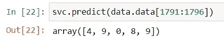

现在，在与预测进行比较之前，让我们看看测试数据(y 部分)。

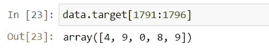

现在，我们比较这两个数据，检查我们的算法有多精确。

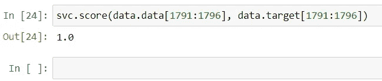

因此，我们可以看到，我们的算法可以预测 100%准确，因此，我们可以得出结论，我们的假设是接受的。

# **3。**

我们将为我们的预测目的设置我们的训练和测试数据。这里我使用第 1 到 1600 个数据作为我们的训练目的，第 1601 到 1796 个数据作为我们的测试目的。

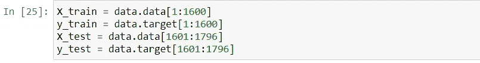

现在我们将训练数据输入到我们的算法中。

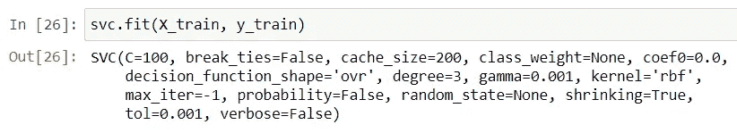

现在，我们将检查我们的算法是如何工作的。我们将测试数据(X 部分)提供给算法进行预测，并检查输出。

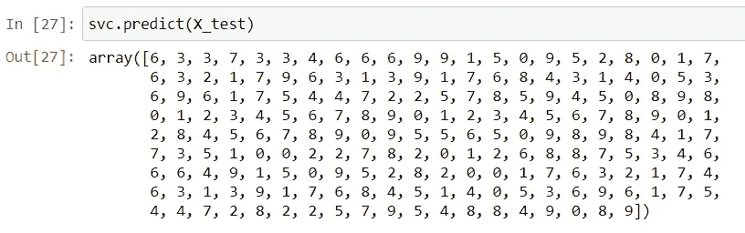

现在，在与预测进行比较之前，让我们看看测试数据(y 部分)。

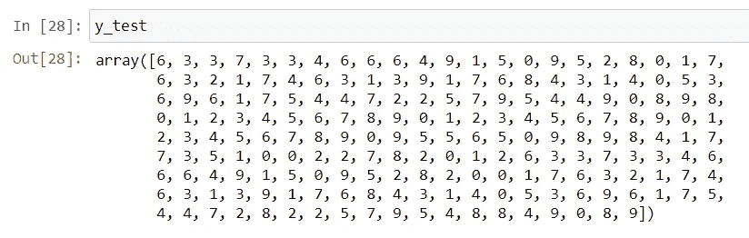

现在，我们比较这两个数据，检查我们的算法有多精确。

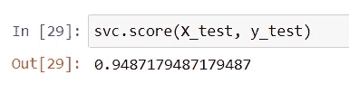

所以，我们可以看到上面的分数是 0.948，这已经足够接近 0.95 了。我们可以得出结论，我们的算法可以预测高达 95%的准确性，我们的假设被接受。

# **结论**

我们可以得出结论，SVM 算法可以在 95%或 95%以上的时间内准确预测数字。所以，我们对假设的测试是真实的，并且被接受。