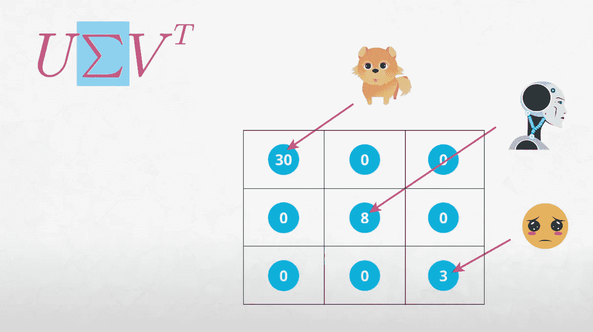

# 推荐引擎的心脏！—推荐的基本原则。

> 原文：<https://medium.com/analytics-vidhya/recommendation-engines-heart-the-fundamentals-of-recommendations-a659babc7417?source=collection_archive---------12----------------------->

来源谷歌图片

# 介绍

推荐被用来推荐一切，从电影到音乐到朋友到新的目的地。在这篇文章中，你将熟悉三种实现建议的主要方法:

*   基于知识的建议
*   基于协同过滤的推荐
*   基于内容的推荐

推荐引擎是数据科学领域中最受欢迎的应用之一，它在许多领域都有帮助，常见的例子有视频和音乐服务的播放列表生成器、在线商店的产品推荐器，或者社交媒体平台的内容推荐器和开放 web 内容推荐器。

好了，我们来探索一下吧！

## 建议的类型

在本帖中，我们将探讨三种推荐方法。

1.  基于知识的建议
2.  基于协同过滤的推荐
3.  基于内容的推荐

在协同过滤中，有两个主要分支:

1.  基于模型的协同过滤
2.  基于邻域的协同过滤

## 相似性度量

为了实现基于邻域的协同过滤，我们应该熟悉两个用户(或两个项目)之间的相似性度量，包括:

1.  皮尔逊相关系数
2.  斯皮尔曼相关系数
3.  肯德尔氏τ
4.  欧几里得距离
5.  曼哈顿距离

我们将通过观察一个特定的情况来了解为什么有时一个指标比另一个更好，其中一个指标比另一个提供更多的信息。

## 建议的商业案例

最后，我们将了解企业实施成功的建议以增加收入所需的四个理念，包括:

1.  关联
2.  新奇
3.  意外收获
4.  增加多样性

在这篇文章的最后，我们将获得大量的技能，可以在此基础上建立或开始在实践中创建我们自己的建议。

## **基于排名的建议**

"*关于某个项目的知识或用户偏好被用来做推荐* " —基于知识的推荐。

如果我们想推荐一本书、一部电影或一首歌，你会怎么做？我们可能会推荐那个类别中最受欢迎的商品。《麦田里的守望者》是最受欢迎的书，所以我向每位读者推荐这本书。“Despacito”是一首流行歌曲，所以我向每一位听众推荐这首歌。《泰坦尼克号》是一部受欢迎的电影，所以让我们为大家推荐这部电影。作为一个小的扩展，我们可能允许个人根据特定的类别过滤最受欢迎的项目。也许，我们不想推荐任何最受欢迎的电影，而是想过滤只允许戏剧电影。

添加一个这样的过滤器将这个推荐从简单的基于排名的推荐系统变成了所谓的**基于知识的推荐系统**。

基于排名的推荐系统根据一些标准对商品进行排序，例如最喜欢的商品、最常购买的商品或最常听的商品。

基于知识的推荐系统让用户提供关于商品的上下文或他们的偏好来做出推荐。添加过滤器以便用户可以选择电影制作的特定类型或特定年份是引入基于知识的推荐的一种非常常见的方式。

## **基于协同过滤的推荐**

“基于使用用户-项目交互的协作来进行推荐的方法”——协作过滤。

想想萨姆。同样经历了世界末日、独立日和降临节。然后是杰西。杰西也看过这些电影，但也看过《星际穿越》。由于萨姆和杰西看的电影重叠，因此萨姆可能也喜欢《星际穿越》。

数据科学家的纳米学位。

在这种性质的推荐中，找到看过相同电影的用户并根据其中一个用户看过而另一个用户没有看过的内容推荐新电影是有意义的。

从用户-项目交互中发现这些类型的关系被称为**协同过滤。**

实现协同过滤有两种主要方式:

1.  **基于模型的协同过滤**
2.  **基于邻域的协同过滤**

我们可以通过多种方式找到一个人的最近邻居，我们将仔细研究的指标包括:

1.  皮尔逊相关系数
2.  斯皮尔曼相关系数
3.  肯德尔氏τ
4.  欧几里得距离
5.  曼哈顿距离

第一种被称为基于模型的协同过滤，它使用机器学习技术来进行推荐。这将在后面的文章中讨论。

第二种是基于邻居的协同过滤，我们现在将讨论它。“邻居”这个名字是用来暗示我们对寻找彼此关系密切的个体感兴趣。

我们看到杰西和萨姆关系密切，因为他们看了同样的电影。因此，他们比没有看过这些电影的诺亚更亲近。

用两种可能的方法识别邻居。

*   一个是测量相似性
*   第二是测量距离。

我们可能会认为这些听起来是同一个东西，它们非常相似。常见的相似性度量包括皮尔逊相关系数、斯皮尔曼相关系数和肯德尔τ。

这些度量中的每一个都取负 1 到 1 之间的值。当使用这些方法中的任何一种时，随着数值越来越接近 1，这表明两个个体越来越相似。

为了进行推荐，我们想要找到具有这些系数的最高值的用户，并且他们是最相似的，因此住在更近的邻居中。

基于距离的度量包括欧几里德距离和曼哈顿距离。除了基于相似性的度量，我们希望找到这些度量的小值。基于距离的度量范围从零到基本无穷大。这些值越接近零，两个人就越相似。

用这些指标识别邻域意味着找到更接近于零的个体。选择合适的指标很大程度上取决于我们的具体情况。

相似度度量的详细解释:[https://towards data science . com/calculate-Similarity-the-most-relevant-metrics-in-a-null-9a 43564 f 533 e](https://towardsdatascience.com/calculate-similarity-the-most-relevant-metrics-in-a-nutshell-9a43564f533e)

值得阅读的有用文章:

*   多米诺数据实验室文件[r](https://blog.dominodatalab.com/recommender-systems-collaborative-filtering)
*   [关于加权评分的语义学者论文](https://pdfs.semanticscholar.org/3e9e/bcd9503ef7375c7bb334511804d1e45127e9.pdf)

**基于内容的推荐**

如果我们刚刚开始构建我们的推荐引擎，我们可能没有很多用户，或者我们可能没有很多用户。

在这种情况下，可能很难甚至不可能找到相似的用户。那么，当我们没有用户可以相互比较的时候，我们怎么能做出推荐呢？

在这些情况下，我们可以使用基于内容的推荐方法。假设我们发现一位客户购买了一辆自行车。我对我们可能喜欢的商品有一些猜测。我们可能还需要一个自行车头盔，或者一个自行车打气筒，或者一个自行车灯，或者一个自行车反光镜，或者其他与自行车相关的物品。

根据我们推荐的商品类型，可以根据商品的名称来查找相似的商品，比如这些与自行车相关的商品。或者，如果我们正在购买服装，我们可能会推荐看起来相似的服装。

如果我们推荐电影，我们可能会推荐相同类型的电影。使用这种类型的信息称为基于内容的推荐。一旦我们开始获得更多的用户，混合使用多种推荐技术通常是有用的。但在用户有限的情况下，基于内容的推荐器往往会派上用场。

通常，所有三种类型的混合技术在实践中被用于为特定环境提供最佳建议。

还有更高级的技术与我们在这里学到的方法相关，它们很可能属于下面三个类别中的一个。

*   [AirBnB 在其推荐中使用了嵌入技术，你可以在这里了解更多信息](/airbnb-engineering/listing-embeddings-for-similar-listing-recommendations-and-real-time-personalization-in-search-601172f7603e)
*   随着我们的智能手机变得越来越容易上瘾，很容易理解为什么基于位置的推荐会越来越受欢迎。你可以在这里阅读更多关于这些类型的建议。
*   [许多公司也在探索推荐系统中的深度学习用例。](https://ebaytech.berlin/deep-learning-for-recommender-systems-48c786a20e1a)

**用于推荐的矩阵分解——基于模型的推荐系统**

我们已经到了推荐系统的最后一部分，我们将回答一些我们想知道的问题。

*   我们的推荐好吗？
*   如何利用机器学习进行推荐？
*   最后！我们如何向新用户推荐？

## 验证我们的建议

## 在线测试

对于测试推荐器性能的在线方法，我们在上一节看到的许多方法都非常有效——我们可以部署我们的推荐，只需仔细观察我们的指标。在实践中，将在线推荐设置为推荐项目的“旧”版本是很常见的，这与使用新推荐策略的新页面相比较。

所有与 A/B 测试相关的想法对于在线学习中观察我们的指标，以及最终选择最适合我们的产品和客户的推荐策略都是至关重要的。

## 离线测试

在许多情况下，一家公司可能不会让我们在任何我们喜欢的时候简单地将我们的建议部署到现实世界中。在部署之前，在培训测试环境中测试我们的建议被称为**离线**测试。

上一节的推荐方法实际上对于离线测试并不太管用。在离线测试中，理想的情况是不仅仅获得每个人的推荐列表，因为我们最终不知道用户不使用某个项目是因为他们不喜欢它，还是因为他们还没有使用过它(但是会喜欢它)。更确切地说，如果我们能使用预测的评分来了解每个用户对每个商品的喜爱程度，那就太好了。然后，我们可以将这个预测评级与任何个人在未来对某个项目的实际评级进行比较。

与矩阵分解相关的技术很好地解决了这个问题。

## 用户组

验证我们推荐的最后(可能的)方法是让用户组对我们推荐给他们的项目给出反馈。获得代表我们客户的优秀用户群本身就是一个挑战。当我们有很多产品和非常大的消费者群时，尤其如此。

## 为什么是 SVD？—用于推荐的 ML 模型

## 奇异值分解

**奇异值分解** ( **SVD** )是实矩阵或复矩阵的因式分解。它将具有正交本征基的方阵的本征分解推广到任何 *m* x *n* 矩阵。然而，理解矩阵分解的传统 SVD 方法对于许多实际可行的矩阵分解技术的开始是有用的。

为了在许多推荐引擎中实现 SVD，我们需要使用一种稍加修改的方法，称为 FunkSVD。这种方法在[网飞竞赛](https://en.wikipedia.org/wiki/Netflix_Prize)中被证明非常有效，因此，它是当今最流行的推荐方法之一。

让我们先仔细看看传统的 SVD。

*A*=*U*σ*V 转置*

## 潜在因素

在执行 SVD 时，我们按项目创建一个用户矩阵(或者在我们的特定示例中按电影创建客户矩阵)，每个项目的用户评级分散在整个矩阵中。下图显示了一个示例。

潜在矩阵——不确定纳米度

我们可以看到，这个矩阵没有关于用户或项目的任何特定信息。相反，它只保存每个用户对每个项目的评分。在这个矩阵上使用奇异值分解，我们可以找到与电影和顾客相关的**潜在特征**。

我们将学习 SVD 作为一种传统的矩阵分解方法，不幸的是，我们会发现这种方法不能提供建议，因为它只在我们的用户项矩阵没有缺失值时才有效。

正如我们在上一节中看到的用户-项目矩阵是如何形成的，这里我们将改写如下:

纳米度

其中每个 R 代表用户对某个项目的评级。因此，第一个值 1 到 N 表示哪个用户进行了分级，第二个值 1 到 M 表示电影被分级。所以这里的 R11 代表用户 1 给电影 1 的评级，依此类推。当我们在用户项目矩阵上使用奇异值分解或 SVD 时，通常这些矩阵被称为:

1.  ***U 矩阵——用户如何与特定的潜在因素相关***

用户相关矩阵— Udacity 纳米度

带有这个 U 矩阵的数字将是每个用户对潜在因素感受的指示器。那么 U 矩阵将是一个 N 乘 K 的矩阵。其中 K 决定了我们希望保留的潜在因素的数量。

2. ***V 转置矩阵——一个潜在的因素是如何与电影*** 联系在一起的

U 和 V 转置矩阵的值可以取任何值。即使所有给定的评级和用户项目矩阵都是正的，电影或用户在特定潜在因素上的权重也不必是正的。

v 转置矩阵——uda city 纳米度

这是一个 K 乘 M 的矩阵，其中 K 是潜在因素的数量，M 是电影的数量。

***3。适马矩阵——潜在特征在预测评级中的重要性。***

这个矩阵是一个 K 乘 K 的对角线矩阵，这意味着不在对角线上的每个条目都是零。它的行数和列数与我们决定保留的潜在因子数相同。在实践中，我们决定保留的潜在因素的数量不一定是直截了当的。

适马矩阵——uda city 纳米度

对角线上的这些值可以帮助我们决定保留多少潜在因素。它们总是从最大到最小排序的正值。其中第一值是与第一潜在因素相关联的权重，第二值与第二主因素相关联，等等。

较大的权重表明潜在因素更重要，并且能够再现原始用户项目矩阵的评级。

通过将这三个矩阵相乘，我们基于 U(用户对潜在因素的感受)和适马(这些潜在因素对评级的影响程度)以及最终使用 V transpose(潜在因素在特定电影中的表现)为每个用户电影组合重建电影评级。

求矩阵 U、适马和 V 的转置值。我们可以为每个用户电影组合找到一个预测。

它看起来并不复杂，对吗？如果我们的矩阵有缺失值怎么办？这就是 FunkSVD 的切入点。我们来看看。

## FunkSVD —用于处理缺失值

Funk SVD 是一种矩阵分解技术，非常适合这种情况，其中矩阵有许多缺失值。

有缺失值的矩阵

在 Funk SVD 方法之前，常用的技术是用零填充这些缺失值。但是西蒙·芬克发现事实是我们实际上可以忽略所有这些缺失的值，找到一种方法只用我们知道的值来计算潜在因素。

这两个矩阵的随机值

在这种矩阵分解的方法中，考虑两个与我们之前看到的非常相似的矩阵。一个是用户和潜在因素，另一个是电影潜在因素。首先，我们将把值随机放入每个矩阵中。

然后，我们在用户项目矩阵中搜索已经存在的评级。当我们找到评级时，我们执行以下规则来更新这些随机值。我们将获取与用户相关的行和与电影相关的列之间的点积。这将为我们提供评级预测。类似这样的！！！！

使用行和列预测值

由此，我们可以将误差计算为实际额定值和预测额定值之间的差值。我们的目标是通过改变每个矩阵中的权重来最小化所有已知实际值的误差。我们可以使用*梯度下降来做到这一点。*

梯度下降以最小化误差。

在用户矩阵中，我们对这里用 U 表示的每个值取误差的导数。类似地，在电影矩阵中，我们对由 v 标识的每个值求误差的导数，使用链式法则，我们找到应该移动的方向，以最小化每个矩阵中的误差。在每个导数中，这部分就是实际值和预测值之间的差。我们现在可以用它来更新每个矩阵中的值。

让我们用前面的矩阵进行一次梯度下降迭代。这会派上用场的。为了执行我们的更新和用户矩阵，我们需要查看用户矩阵的这一行。这些值就是我们在上一个等式中看到的 U。

我们还需要这些值，它们在我们的电影矩阵的最后一栏中。这些是我们在前面的公式中看到的 V 值。我们新的 U 值将是我们当前的 U 值，但是我们需要通过向梯度的相反方向移动来更新这个当前值，这是我们刚刚在这一项中发现的。

然而，我们不想在这个方向上走得太远。所以，用一个学习率来朝这个方向迈出一小步是很常见的。让我们称之为α，并在我们移动的方向前面滑动。

对 U 矩阵执行梯度下降

将梯度下降更新为所有值。

让我们将这个规则应用到实践中来更新第一个值。因此，我们的更新说，我们采取当前值 0.8，并通过添加我们的学习率来更新它，我们姑且称之为 0.01。

我们可以用这个等式对 V 矩阵中的每个值进行类似的运算。

请注意，我们的新价值观和 U 矩阵已经对

我们将在 B 矩阵中看到的新值出现在我们的方程中。这允许我们更新所有的 V 值。我们可以把这些更新后的值代入 U 和 V 矩阵，这样一次迭代就结束了。像这样！！

更新的值。

此时，我们寻找下一个非缺失值，并再次更新 U 和 V 矩阵。我们对所有非缺失值执行这种技术，并且我们可能会多次遍历矩阵。

新的用户和电影一直在添加到我们的数据库中，矩阵分解技术不会对这些用户和电影进行预测，因为他们还没有任何评级。

## SVD 有两个主要好处。

*   第一个是，它给出了所有用户-电影对的预测评级，即使评级总数非常少。
*   其次，它提供了一种方法来评估这些评级实际上有多好，使用我们在回归机器学习技术中看到的传统指标。

尽管如此，仍然存在的问题是，我们没有新用户和电影的预测评级。这是一个常见的问题，称为**冷启动问题。**

***冷启动问题***

***冷启动问题**是一个平台的新用户和新物品没有任何评分的问题。因为这些用户和物品没有任何评分，所以无法使用协同过滤的方法进行推荐。*

*因此，我们在上一节中使用的方法，如(基于排名和基于内容的推荐)是开始为这些人做推荐的唯一方法。*

*一般来说，在这些情况下，协同过滤方法不适合做推荐。*

*相反，我们需要使用基于知识或基于内容的建议，就像我们在上一节中看到的那样。*

*结束了！！！！！*

*我真的希望以上所有的信息在开始使用推荐系统时会有所帮助。希望你喜欢，和平:)*

*点击[此处](https://github.com/Venky0892/Recoomendations_with_IBM/blob/main/Recommendations_with_IBM.ipynb)获取完整代码*

*通过 [Linkedin](https://www.linkedin.com/in/venkatesh-prasath-manoharan-918091133/) 联系*

# *参考资料:*

1.  *乌达城:[https://www.udacity.com/course/data-scientist-nanodegree-nd 025](https://www.udacity.com/course/data-scientist-nanodegree--nd025)*
2.  *谷歌:[https://en.wikipedia.org/wiki/Singular_value_decomposition](https://en.wikipedia.org/wiki/Singular_value_decomposition)*
3.  *[https://towards data science . com/calculate-similarity-the-most-relevant-metrics-in-a-shell-9a 43564 f533 e](https://towardsdatascience.com/calculate-similarity-the-most-relevant-metrics-in-a-nutshell-9a43564f533e)*