# 推荐系统:1 每个数据科学爱好者都应该知道并且必须努力实现的项目

> 原文：<https://medium.com/analytics-vidhya/recommendation-system-1-project-that-every-data-science-enthusiast-should-know-and-must-try-to-a5c0a3e43c49?source=collection_archive---------2----------------------->

萨洛尼和里泰什

[Salonitiwary1519@gmail.com](mailto:Salonitiwary1519@gmail.com)

【Ritesh.chunks7@gmail.com 号

众所周知，数据科学技术是一个多功能领域，它使用不同的技术从数据中提取知识和见解。此外，数据科学的出现为跨多个领域的计算机科学和工程铺平了道路，因此该领域存在巨大的就业机会。正因为如此，现在许多人都想在这个领域有一个职业生涯。因此，在本文中，我们以一种简化的方式讨论了一个在数据科学领域有很大影响的推荐系统项目，并且我们尽最大努力向每个有热情的人传授关于这个项目的适当知识。在这里，我们将讨论有关推荐系统项目的以下主题:

*   介绍
*   需要
*   应用
*   挑战
*   履行
*   结论

**关键词**:推荐系统、协同过滤、基于内容的过滤

# 介绍

一般来说，推荐是指给另一个人的建议，认为某样东西对某个特定的目的是好的。因此，推荐系统就是一个基于对历史数据的分析，向用户推荐不同产品和服务的系统。用更专业的术语来说，可以说推荐系统是信息过滤系统的一个子类，它基于用户过去对一个项目或产品给出的“评级”或“偏好”来推荐一个项目或产品。推荐系统的一些例子包括网飞、亚马逊、YouTube 等。

广泛使用的最常见的推荐系统类型有:

*   基于内容的过滤
*   协同过滤
*   混合推荐系统

图:推荐系统的类型

1.  **基于内容的过滤**:在基于内容的过滤中，向用户推荐产品是基于过去已经选择购买的其他产品的各种属性的相似性度量。
2.  **协同过滤**:在协同过滤中，向用户推荐产品是基于志同道合的人或物品的相似性度量。它又细分为基于邻域的方法、基于模型的方法和混合模型
3.  混合推荐系统:用户偏好本质上是动态的。单一的基于内容或协同过滤无法为用户提供非常准确的产品推荐。因此，在混合推荐系统中，向用户推荐产品是基于内容过滤和协同过滤的结合。

# 推荐系统的需求:

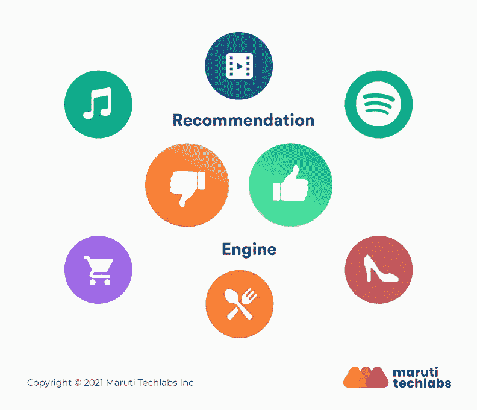

20 世纪最伟大的发明之一是互联网。正如我们所知，互联网是一个资源的海洋，从那里只需点击一下鼠标就可以获得许多知识。然而，对于用户和服务提供商来说，这个海洋包含了大量的信息。当用户搜索某些东西以获得关于它们的正确知识时，他们可能会感到困惑或者选择错误的选项。这不仅浪费了用户的时间和精力，也让他们感到烦恼。因此，用户可能会离开或拖延他或她的工作。不是吗？在这种情况下，非常需要一个能帮助用户决策的系统，或者一个能给用户很好建议的系统，这样他们就能方便快捷地做出选择。此外，这样的系统也将有益于服务提供商，因为它将帮助他们决定他们应该提供什么样的服务来获得用户对他们产品的注意。

# 推荐系统的应用:

推荐系统适用于各种领域，其中一些领域如下所述:

*   **电子商务**:用于电子商务网站向用户推荐产品。
*   **媒体**:用于电子媒体推荐最新消息和更新。
*   **银行**:用于银行部门，向用户建议最新的优惠和福利。
*   **电信**:用于电信行业，为用户提供最好的服务。
*   **电影**:用于根据用户选择推荐电影。
*   **音乐**:用于根据用户之前的选择向用户推荐歌曲。
*   **书籍**:用于根据最终用户喜欢阅读的类型向他们推荐书籍。
*   **旅游景点**:用于旅游景点，为用户提供最突出、最充分的旅游服务。

# 推荐系统面临的挑战:

像其他项目一样，推荐系统也面临一些挑战，包括:

1.  **缺乏数据**:推荐系统项目的主要挑战之一是需要足够数量的数据。像推荐系统中的每个数据科学项目一样，数据也起着至关重要的作用。向用户做出准确的推荐，需要海量的数据。
2.  **变化的数据**:经常可以看到，在时尚等很多领域，潮流都在快速变化。因此，在这样的领域，保留用户过去的行为作为推荐新产品的工具将是一个坏主意。通常观察到，每当过去的行为被用于向用户推荐产品时，推荐系统变得偏向旧的并且难以推荐新产品。
3.  **改变用户偏好**:在线平台本质上是动态的，同样用户的愿望也是动态的。今天他们想要一种产品，而另一天他们想要一种不同的产品。一天，他们想买某个作者的书，另一天，他们想买另一个不同流派的其他作者的书。由于用户偏好的这种快速变化，推荐系统很容易处理用户的选择可能变得具有挑战性。
4.  **用户数据的隐私**:如前所述，一个好的推荐系统需要大量的数据才能高效运行。但是攻击者或第三方可能会滥用用户共享的关于他们的选择的信息来获得其他好处。也许一个准确率最好的推荐系统并不总是能保证用户数据的安全。

# 实施:

让我们通过实现部分进一步阐述我们的讨论，其中我们已经实现了我们的模型，该模型基于最终用户的相似性偏好向他们推荐电影。

实现部分使用的数据集可以从:[https://media . geeks forgeeks . org/WP-content/uploads/Movie _ Id _ titles . CSV](https://media.geeksforgeeks.org/wp-content/uploads/Movie_Id_Titles.csv)下载

> *#导入熊猫库
> 导入熊猫为 pd*
> 
> *#获取数据
> column_names = ['user_id '，' item_id '，' rating '，' timestamp']*
> 
> *path = '*[*https://media . geeks forgeeks . org/WP-content/uploads/file . tsv '*](https://media.geeksforgeeks.org/wp-content/uploads/file.tsv')
> 
> *df = pd.read_csv(path，sep='\t '，names=column_names)*
> 
> *#检查数据头
> df.head()*

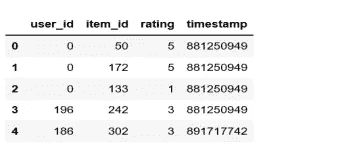

> #查看所有电影及其各自的 Id
> Movie _ titles = PD . read _ CSV([https://media . geeks forgeeks . org/WP-content/uploads/Movie _ Id _ titles . CSV '](https://media.geeksforgeeks.org/wp-content/uploads/Movie_Id_Titles.csv'))
> Movie _ titles . head()

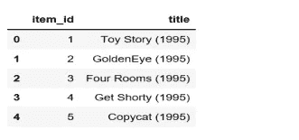

> #计算所有电影的平均评分
> data . group by(' title ')[' rating ']。平均值()。sort_values(升序=False)。头部()

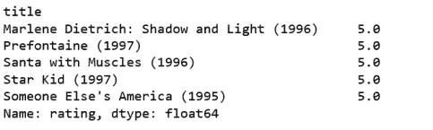

> #计算所有电影的计数评分
> data . group by(' title ')[' rating ']。计数()。sort_values(升序=False)。头部()

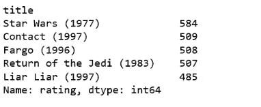

> #使用“评级”计数值创建数据帧
> 评级= pd。data frame(data . group by(' title ')[' rating ']。均值())
> 
> 收视率['收视率'] = pd。data frame(data . group by(' title ')[' rating ']。count())
> 
> ratings.head()

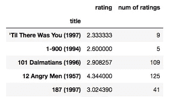

> 将 matplotlib.pyplot 导入为 plt
> 将 seaborn 导入为 sns
> 
> SNS . set _ style(' white ')
> % matplotlib inline
> 
> #绘制“评级列数”的图表
> PLT . fig(figsize =(10，4))
> 
> 评级['评级数量']。历史(箱数= 70)

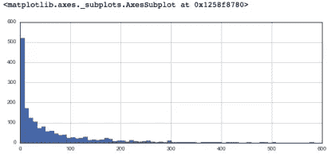

> #绘制“评级”列的图表
> PLT . fig(figsize =(10，4))
> 
> 评级['评级']。历史(箱数= 70)

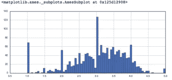

> #根据
> #的“分级列数”
> movie mat = data . pivot _ table(index = ' user _ id '，
> columns ='title '，values ='rating ')对值进行排序
> 
> moviemat.head()
> 
> ratings.sort_values('评级数量'，升序= False)。头(10)

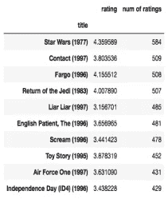

> #分析与类似电影的相关性
> Star Wars _ user _ ratings = movie mat[' Star Wars(1977)']
> Liar Liar _ user _ ratings = movie mat[' Liar Liar(1997)']
> 
> starwars_user_ratings.head()

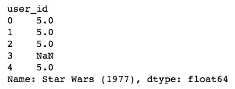

> #分析与相似电影的相关性
> similar _ to _ star wars = movie mat . corr with(star wars _ user _ ratings)
> similar _ to _ liar liar = movie mat . corr with(liar liar _ user _ ratings)
> 
> corr_starwars = pd。DataFrame(similar_to_starwars，columns =[' Correlation '])
> corr _ star wars . dropna(in place = True)
> 
> corr_starwars.head()

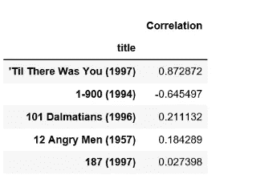

> #类似星球大战的电影
> corr _ star wars . sort _ values(' Correlation '，ascending = False)。head(10)
> corr _ star wars = corr _ star wars . join(ratings[' num of ratings '])
> 
> corr_starwars.head()
> 
> corr _ star wars[corr _ star wars[' num of ratings ']> 100]。sort_values('Correlation '，升序= False)。头部()

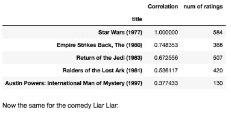

> # liar liar 的同类电影
> corr_liarliar = pd。DataFrame(similar_to_liarliar，columns =[' Correlation '])
> corr _ liar liar . dropna(in place = True)
> 
> corr _ liar liar = corr _ liar liar . join(ratings['收视率'])
> corr _ liar liar[corr _ liar liar['收视率'] > 100]。sort_values('Correlation '，升序= False)。头部()

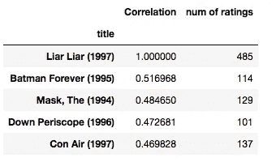

在本文中，我们讨论了推荐系统项目，并简要说明了它的需求、应用和挑战。此外，我们还在 jupyter notebook 上使用 python 编程语言实现了一个简单的推荐模型，该模型通过使用这两个项目之间的相关性来推荐与特定项目更相似的项目(在这种情况下，电影被视为一个项目，用户选择被视为另一个项目)。

**参考文献:**

 [## saloni 151/电影-推荐-系统

### 一种基本的推荐系统，通过建议与特定项目(在这种情况下是电影)最相似的项目。它…

github.com](https://github.com/saloni151/Movies-recommendation-system) 

如有任何疑问，请联系我们:

萨洛尼和里泰什

[Salonitiwary1519@gmail.com](mailto:Salonitiwary1519@gmail.com)

[Ritesh.chunks7@gmail.com](mailto:Ritesh.chunks7@gmail.com)