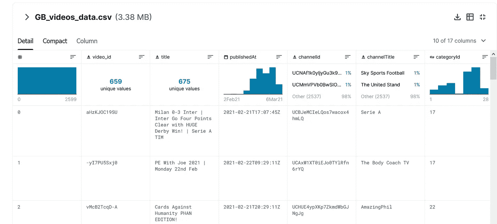

# 使用 BERT 嵌入的推荐系统

> 原文：<https://medium.com/analytics-vidhya/recommendation-system-using-bert-embeddings-1d8de5fc3c56?source=collection_archive---------0----------------------->

当你查看任何社交媒体平台时，你最有可能看到他们的大量推荐，比如“为你推荐”。这些建议大多是你目前感兴趣的，或者是你将来可能感兴趣的，这取决于你以前的类似兴趣。这概括了大多数公司向客户推荐新产品的两种主要方法，它们是:

*   **基于内容的过滤:**这种方法的推荐与你感兴趣的主题及其属性高度相关。例如:假设你喜欢阿森纳足球俱乐部和他们在 Youtube 上的内容，那么你更有可能看到像 AFTV，英超联赛等建议，因为所有这些都有像足球，阿森纳一样的属性。
*   **协同过滤:**这更多的是基于多个用户及其兴趣的推荐。例如:假设你的朋友喜欢曼彻斯特联队、皇家马德里和法甲，而你喜欢阿森纳、巴塞罗那和德甲，那么你的朋友很有可能会收到关于拜仁慕尼黑的建议，而你可能会收到关于巴黎圣日耳曼的建议，因为你们都喜欢足球，反之亦然。

因此，在这里，我试图在从以下 Kaggle 来源获得的 youtube 趋势视频数据集上创建一个基于内容的推荐系统: [*趋势视频 2021*](https://www.kaggle.com/jyotmakadiya/top-trending-videos-youtube-2021) ，其中我只使用了英国版本。数据集包含主要特征，如标题、描述、浏览次数、喜欢等。以下是数据集的示例:

数据集的示例视图

对于任何涉及文本的机器学习任务，人们都必须处理它们，并将其转换为数字，以便机器进行解释。因为我们将只使用数据集的标题来完成我们的任务，所以我们将做一些基本的预处理步骤，包括删除特殊字符、降低字符等等。下面的代码片段执行所需的预处理步骤。

文本预处理

为了创建单词嵌入，我们将使用 Tensorflow hub 上托管的预训练 BERT 嵌入，可以下载用于微调、迁移学习等。请访问 tf-hub，了解如何使用各种型号的更多说明。在这里，我使用了一个较小版本的 bert un_cased 进行预处理，如删除停用词等。然后，使用 small_bert 预训练嵌入，为我们的数据集中存在的每个标题创建核心对应嵌入向量。所得到的嵌入将具有整个序列/标题的汇集输出以及序列中每个标记的输出，但是这里我们将仅使用汇集输出，这是因为减少了计算能力的使用并且该模型是无监督学习模型。相同的代码片段如下所示:

为每个句子嵌入生成。

正如你在上面看到的，我已经为数据集中出现的所有标题生成了编码。因此，我们需要为我们感兴趣的单词创建编码，并找到我们的兴趣和标题编码之间的相似性。我使用余弦相似度来确定向量之间的相似度。简单来说，余弦相似度是两个给定向量的内积，它的值越大，表示这两个向量越相似。因此，现在让我们使用我们的各种兴趣来查询数据集，并对余弦相似性分数及其对应的标题进行排序。

让我们假设我们的兴趣是:动作片、好莱坞片、惊悚片，看看这个模型的核心建议

似乎模型的结果相当令人满意，有些与电影预告片和纪录片有一些模糊的内容

现在让我们看看同样的利益:阿森纳，欧洲联赛，英超联赛

是的，结果与此高度相关

让我们再检查一个:音乐，泰勒斯威夫特，想象龙

我们的模型肯定像桃子一样好用:)在这里，它给出的建议非常合理，可以通过更多的定制来创造奇迹。

所以这里的伙计们，我们使用 youtube 标题创建了自己的推荐系统，这些视频只是在英国流行的视频，我们可以用更多不同的数据做得更好，推荐频道而不是直接推荐视频。感谢大家花宝贵的时间阅读这篇文章，我很快会再带回来一些东西。如果你喜欢这篇文章，请与他人分享。