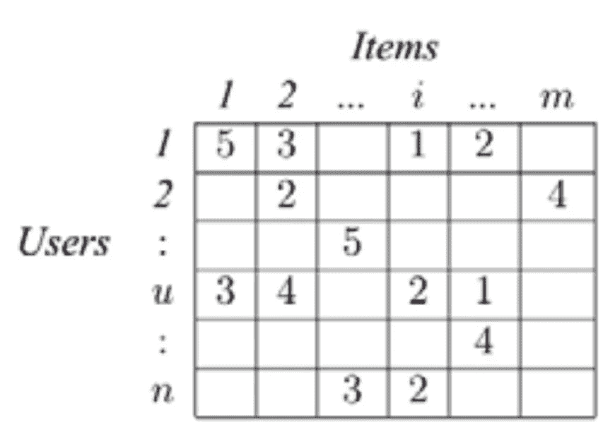

# 推荐系统:基础

> 原文：<https://medium.com/analytics-vidhya/recommender-systems-basics-6f55d9e67d4?source=collection_archive---------29----------------------->

这是我对推荐系统的观点。

我从来不喜欢商店里的售货员。永远不会。幸运的是，当我有自己的钱花的时候，我们有了亚马逊来买东西。

后来有一天天气很好，我的德国邻居称赞我的迷你鞋，我想送她一双类似的。我去亚马逊网站搜索了一下，很快意识到页面底部的推荐其实不错，我并不介意。

这就是我如何得出结论，推荐系统是一个销售人员，我们在两者中寻找相同的特征。

所以，推荐系统的**目的**很明显——

> 更多的亚马逊利润和我的好建议！

页（page 的缩写）她喜欢这些。

推荐和购买的鞋子

我的鞋子

现在，我对学习推荐系统是如何工作的很感兴趣，这也是你为什么会读这篇文章的原因。

嗯，在**最基本的**形态中——

1.  有前端——比如 Aamazon.de 网站

2.有一个推荐工程师——计算推荐哪些商品

3.有后端-我作为一个用户和这些鞋的信息是商店。

现在，我们将了解这个推荐器工程师是如何工作的，以及如何计算向哪个用户推荐哪个项目。

让我们重新开始思考 amazon.de。

**用户**——我们的许多朋友都在使用这个网站，而且从每天早上送到我们大楼的快递数量来看，有许多人在使用亚马逊。

有些商店通过亚马逊销售商品，因此亚马逊销售的商品非常多。

**用户-商品矩阵** —网站显然有每个用户的每次购买记录，也有卖家的每件商品的记录。如果我们只是把它放在一个表中，它将是每个用户对每个项目。

**评分**——如今，在 twitter 上发表意见和反馈是一种时尚，无论如何，如果人们花了钱，喜欢/不喜欢某样东西，很容易从他们那里获得反馈，可以是任何形式的反馈。

因此，在大多数情况下，从用户那里获得一个项目的评分是相当容易的。

现在，我们有这样的东西-

[https://www . research gate . net/figure/Sample-of-user-item-matrix _ fig 1 _ 284737564](https://www.researchgate.net/figure/Sample-of-user-item-matrix_fig1_284737564)

通过查看这种格式的数据，你会认为这就是亚马逊如何向我推荐剃须刀刀片的，因为我的朋友也在购买它，尽管我们都是秃头，都买啤酒？

我不是说不。

出现了**相似用户**和**相似物品的概念。**

> 如果用户喜欢/不喜欢相同的项目，则用户是相似的，如果对项目的评级相似，则项目是相似的。

所以，为什么不**猜猜**一个没有看过或买过某样东西的用户是否会喜欢或者有多喜欢这个东西。

对所有用户至今没有看到或评价过的类似项目都这样做。

根据最高评级对它们进行排名

然后“推荐”用户 top-k 物品？

听起来很简单也很有逻辑。

Tada！！！我们有一个推荐系统。

未完待续…

家庭作业——试着向你的母亲解释(确保她不是 ML 工程师),如果她收到了，请评论。