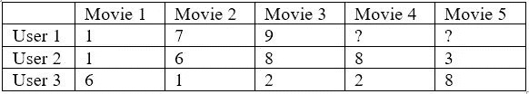
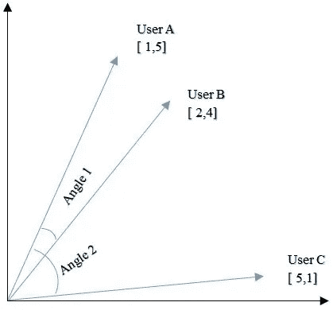
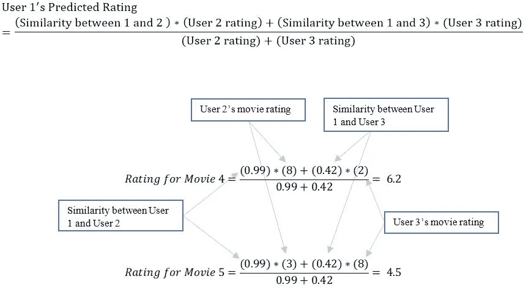

# 10 分钟推荐系统！

> 原文：<https://medium.com/analytics-vidhya/recommender-systems-in-10-minutes-2e50b430f98d?source=collection_archive---------12----------------------->

## 它们是什么，它们是如何工作的？对普通人的介绍。

尼古拉斯·J·勒克莱尔在 [Unsplash](https://unsplash.com/) 上拍摄的图片

在疫情冠状病毒的袭击中，我们已经非常熟悉网飞、亚马逊和 Spotify 等在线服务。被困在家里，我们每天都使用他们的服务来购买产品和娱乐自己。当你继续使用这些服务时，你可能会注意到他们经常向你推荐要看的电影、要听的歌曲或要购买的产品。他们是怎么做到的？这些推荐是随机的吗？这些服务向每个人推荐的产品都是一样的吗？

快速浏览一个朋友的网飞账户或他们的亚马逊推荐，我们会发现这些服务正在为他们的产品提供个性化推荐。他们使用一种非常聪明的机器学习应用程序来做到这一点，这种应用程序被称为“推荐系统”。

顾名思义，这些系统旨在向您推荐您可能喜欢的产品。如果你不熟悉什么是机器学习，我推荐你阅读文章[‘日常人的机器学习入门’](/analytics-vidhya/intro-to-machine-learning-for-the-everyday-person-1d4f09b6b754)。

然而，即使你对机器学习一无所知，也不用担心。我将努力使这篇文章尽可能的通俗易懂，将技术概念分解成普通人容易理解的小部分。到本文结束时，您应该对像亚马逊和网飞这样的服务如何为他们的用户创建个性化推荐有了很好的了解。

虽然有许多不同的算法和技术用于推荐，但它们可以大致分为四类:

-基于流行度的系统

-分类模型系统

-协同过滤

混合方法

这些类别绝不是确定的或详尽的。每天都有新类型的推荐系统被创造出来，不同的人对它们进行不同的分类。然而，每种类型的推荐系统都有它自己的优点和缺点。

# 1.基于流行度的系统

第一种也是最简单的推荐系统是“基于流行度的系统”。在这里，系统向用户推荐其最受欢迎的产品。这种类型的系统的优点是它需要很少的数据来实现。因此，它可能是处于发展初期、无法访问大量用户数据的公司或服务的一种选择。

图片由作者通过 [IMDB](https://www.imdb.com/chart/top/) 提供

这种系统的明显缺点是它不是个性化的。不管个人喜好如何，每个人都会得到相同的推荐。在像网飞这样的流媒体服务的背景下，这意味着人们可以根据评级系统(如 IMDB 使用的系统)获得最受欢迎的电影推荐。该系统将向恐怖电影和喜剧的粉丝推荐相同的电影。这在个人层面上会导致糟糕的推荐，但在公司收集用户数据时，它仍可用于推荐。

# 2.基于分类的建议

一种稍微复杂一点的推荐系统是“基于分类”的推荐系统。这些系统使用关于用户和/或产品的信息来将它们分类。然后，系统使用这些信息将用户与他们可能喜欢的产品匹配起来。

# 2.1 基于用户

这里，首先根据各种标准对用户进行分类，然后根据这些分类向用户推荐产品。

图片由作者通过[网飞](https://www.netflix.com/)提供

例如，用户可以根据人口统计进行分类，如国籍、年龄或性别。像网飞这样的公司会根据用户的人口统计数据来推荐电影。如果用户是，比如说，一个印度国籍的十几岁的男孩，他将被推荐宝莱坞动作片，以他的人口统计为目标。类似地，如果用户是西班牙的小孩，他将被推荐西班牙卡通。

这种分类系统不仅限于网飞。任何销售产品或服务的公司都可以利用这种类型的推荐系统来更好地将用户与他们可能喜欢的产品和服务相匹配。

实现这一系统的困难在于，它严重依赖于关于其用户的全面而准确的数据。收集这些数据通常很困难。此外，使用这些数据来准确地对用户进行分类，并将他们与潜在的理想产品相匹配，也是一项挑战。这就引出了下一种推荐系统，叫做“基于内容的”推荐系统。

# 2.2 基于项目

这种类型的推荐系统类似于基于用户的系统。关键区别在于，它不是对用户进行分类，而是对其产品进行分类。在实践中，这意味着公司提供的产品/服务根据其特点进行分类，然后根据这些类别推荐给用户。

因为这些系统不依赖于对用户的准确分类，所以比基于用户的系统更容易实现。这里的主要挑战者在于一家对其产品和服务进行准确分类的公司。毫不奇怪，这种类型的系统在像网飞这样的流媒体服务上工作得特别好。电影通常会根据它们的类型预先分类。这使得网飞很容易根据用户的观看历史向他们推荐类似的电影。例如，如果用户倾向于喜欢恐怖电影和动作电影，系统倾向于推荐这些类型的电影而不是其他类型的电影。这就是为什么如果你偷看一个朋友的网飞账户，他/她的推荐可能与你自己的大相径庭。

虽然基于分类的推荐系统工作得相当好，但它们仍然依赖于收集关于用户和产品的数据，然后实现可以准确分类用户和产品的系统。不幸的是，它们不能很好地扩展，拥有大量数据的公司可能会发现实施这些解决方案不切实际。对此的解决方案是基于“协同过滤”思想的推荐系统。

# 3.协同过滤

协同过滤被广泛认为是推荐系统的黄金标准。它使用了一种巧妙的操作方法，可以很好地处理大量数据。任何研究过推荐系统的人可能都熟悉这种类型的系统，但是对于我们这些不熟悉的人来说，让我来告诉你最新的情况。

协同过滤背后的基本思想是，过去喜欢类似产品的用户将来也会喜欢类似的产品。这是一个非常简单直观的想法。例如，如果你想看一部新电影，你会问一个和你有相似电影品味的朋友。这正是协作过滤运行的理念。

图片由作者通过[网飞](https://www.netflix.com/)提供

为了做出推荐，这些系统首先确定哪些用户是‘相似的’。然后，他们根据“相似”用户是否喜欢该产品向用户推荐产品。

# 3.1 流媒体服务示例

为了说明协同过滤的工作原理，我将使用一个像网飞这样的流媒体服务的例子。公平的警告，接下来的部分在数学上会有点重。然而，我会尝试用一种尽可能简单的形式来展示它，这样不管你的数学能力如何，你都可以理解它。

首先，假设我们的流媒体服务目前有 5 部不同的电影和 3 个用户。此外，我们的服务能够让用户对电影进行 1 到 10 级的评分。如果我们以表格的形式呈现这些数据，应该是这样的:

作者图片

上表告诉我们每个用户都看过哪些电影，以及他们对这些电影的评价。用户 1 没有看过电影 4 和 5。现在的问题是，在这两部电影中，我们建议用户 1 接下来看哪一部？

一种方法是对正在讨论的变动的现有评级取平均值。这将是一个基于流行度的推荐系统。然而，协同过滤使用了更复杂的方法。

推荐的第一步是确定每个用户与用户 1 的相似程度。有许多方法可以做到这一点；一种流行的方法叫做“余弦相似度”。

# 余弦相似性

要了解余弦相似性，请看下图:

作者图片

该图显示了三个用户基于其评级的“矢量表示”。用户 A 对两部电影 1 和 5 进行了评级，用户 B 对相同的电影 2 和 4 进行了评级，而用户 C 对它们进行了评级 5 和 1。“矢量表示法”只是一种奇特的说法，即把这些数字画在图上，并在上面画线。

余弦相似度的概念很简单。如果我们取这些向量之间的角度，那么，角度越小，向量越相似。我们通过取向量之间角度的余弦值来获得相似性。小角度的余弦接近 1，接近 90°的余弦接近 0。因此，直觉上，我们的值越接近 1，向量就越相似。

余弦相似度的计算公式如下:

作者图片

我不会深入讨论如何求解这个公式的细节，但是如果你想知道这个公式是如何求解的，你可以看看这篇精彩的文章。

对于上面的图表，用户 A 和用户 B 之间的余弦相似度是 0.96(非常相似)，用户 A 和用户 C 之间的余弦相似度是 0.38(不太相似)。因此，用户 A 和用户 B 比用户 A 和用户 c 更“相似”

上图是二维的，因为每个用户有 2 个评分。如果我们给每个用户添加另一个等级，它就变成三维的了。然而，我们的流媒体服务的原始示例中，每个用户有 5 个评分，这使得我们的图表是 5 维的。我们没有办法把它可视化，但是，我们仍然可以用同样的方法，用同样的数学公式，计算这些向量之间的余弦相似度。

使用流式服务原始示例中的用户公式，我们发现:

用户 1 和用户 2 之间的余弦相似度是 0.99

用户 1 和用户 3 之间的余弦相似度是 0.42

因此用户 1 和用户 2 非常相似，而用户 1 和用户 3 不太相似。

# 3.1.2 预测评级

在我们确定了用户之间的相似性之后，下一步是尝试并预测用户 1 会给电影 4 和电影 5 什么评价。这将告诉我们向用户 1 推荐哪个移动。我们的目标是推荐我们预测用户最喜欢的电影，即评分最高的电影。

我们通过针对每个用户的相似性对两部电影进行加权平均来做到这一点。这看起来像这样:

作者图片

因此，我们预测用户 1 将对电影 4 的评价高于电影 5，因此将推荐电影 4。

我们的这个例子有一个非常小的数据集。只有 3 个用户和 5 部电影。在像网飞这样的真实流媒体服务中，有数百万用户和数千部电影，使得这些计算变得更加复杂。然而，最终的结果是一个非常好的个性化推荐系统，并且受益于大量的用户。

# 3.2 限制

协同过滤有一些缺点。第一个问题被称为“稀缺性”。在我们使用的上面的例子中，用户 2 和用户 3 看过的所有电影都被他们评价了。在现实中，大量用户并不会对他们观看的所有电影进行评级。这给电影留下了很多空白空间，也让寻找相似用户变得困难。

第二个问题是众所周知的黑羊问题。在这里，灰羊就是那些处于两类相似用户风口浪尖上的人。他们并不完全属于任何一个群体，但却处于每一个群体的边缘。另一方面，害群之马是不属于任何群体的用户。向这些用户提供好的推荐被证明是困难的。

简而言之，这就是协同过滤。基于“相似”用户喜欢的产品/服务，向用户给出产品/服务的推荐。随着用户的增加，它可以很好地扩展，但最终依赖于大量的用户来提供好的推荐，这使得一个处于初创阶段的公司很难实施。

# 4.混合方法

大多数现代系统不仅仅使用上述方法中的一种，而是使用它们的组合。推荐系统每天都在不断发展。采用多于一种方法的原理的推荐系统被称为混合推荐系统。

混合推荐系统通常结合不同类型系统的优点来提供越来越复杂的推荐。混合系统的一种这样的植入可以是实现两个推荐系统，然后取两者的加权平均值。然而，有无数的方法来实现混合推荐系统，每天都有更多的方法被开发出来。

# 5.结论

现在，您已经熟悉了什么是推荐系统，以及实现推荐系统的几种方式。说到推荐系统，可能性真的是无穷无尽的。例如，它们在广告中的应用是巨大的。数据在当今世界如此有价值的部分原因是由于机器学习的应用，例如使用你的数据来提供个性化体验的推荐系统。它们可以帮助增加公司的收入以及客户的满意度。令人兴奋的是，推荐系统将会随着时间的推移不断发展，从而提供越来越好的推荐。

感谢您的阅读！

请记得把这篇文章分享给任何你认为可能会感兴趣的人！

如果你对推荐系统或者这篇文章中写的任何东西有任何问题，请随时联系我的 LinkedIn。

如果你想阅读更多我的文章，你可以在这里找到它们[。](https://rohitbaney.medium.com/)

祝您度过愉快的一天，并祝您的数据科学之旅好运！