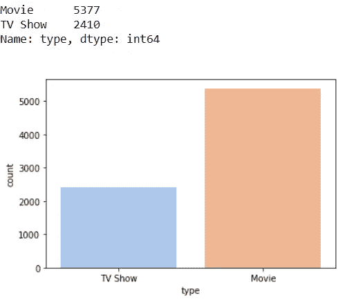
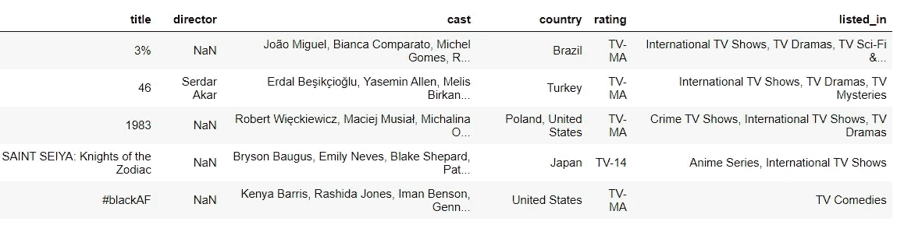
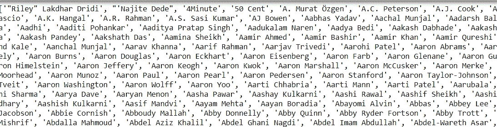

# 给自己推荐一部关于网飞的电影

> 原文：<https://medium.com/analytics-vidhya/recommending-myself-a-movie-on-netflix-c6af3d0741e0?source=collection_archive---------19----------------------->


我们有一个星期天的早上，我不知道如何浪费我的一天，我可能应该去网飞放松一下。不确定看哪个，通常是看电影/连续剧的前 5 分钟再决定是否继续。我的*转化率*低于 5%。所以我已经决定使用 Kaggle 网飞数据集，分析它并建立一个推荐系统来找到一部适合我的电影。[点击这里](https://www.kaggle.com/shivamb/netflix-shows)从 Kaggle 下载网飞数据集。

## 网飞数据分析

我已经下载了数据集，我将开始分析数据集。在网飞查印度电影。

```
import pyforest
data=pd.read_csv("netflix.csv") 
```

让我们来看看网飞的电影和节目的数量

```
data.groupby('type').count()
print(data.type.value_counts())
sns.countplot(data.type,palette="pastel")
```



我们将检查各个国家的电影数量。

```
print(data["country"].value_counts().head())
plt.figure(figsize=(20,6))
sns.countplot(x="country",data= data,hue= "type",order = data['country'].value_counts().index[0:15],palette="pastel")
plt.xticks(rotation=45)
plt.show()
```


让我们来看看排名前五的流派。

```
print(netflix["listed_in"].value_counts()[:5])
```


我们分析并可视化了我们所拥有的网飞数据。虽然能够了解你的数据很有帮助，但我仍然需要一个推荐者来决定观看哪个节目。

## 向量化电影特征

导入我们分析数据集和构建推荐系统所需的所有库，并删除我们分析数据集中的电影不需要的列。

```
import numpy as np # linear algebra
import pandas as pd # data processing, CSV file I/O (e.g. pd.read_csv)
import re
import nltk
from nltk.corpus import stopwords
nltk.download('stopwords')
from nltk.tokenize import word_tokenizedata = data.dropna(subset=['cast','country','rating'])
movies = data[data['type']=='Movie'].reset_index()
movies = movies.drop(['index','show_id','type','date_added','release_year','duration','description'],axis=1)
movies.head()
```


我们也会为网飞的电视节目做同样的事情。删除多余的列。

```
tv = data[data['type']=='TV Show'].reset_index()
tv = tv.drop(['index','show_id','date_added','release_year','duration','description','type'],axis=1)
tv.head()
```



将电影演员的名字符号化。我们先把同一部电影的演员拆分一下。

```
actors =[]
for i in movies['cast']:
    actor=re.split(r',\s*',i)
    actors.append(actor)
```


同一部电影中演员的符号化

进一步标记所有参与者，并按升序对它们进行排序。将*子列表*视为一个单一列表(从德梅恩·比希尔到卡门的演员都是一个单一列表)，条目是子列表中的每一个演员。所以我们在一个列表中添加了所有演员的名字。该列表被转换成一个所有演员按升序排序的集合*。 *Set* 用于保存单个变量中的所有值。*

```
flat_list=[]
for sublist in actors:
    for item in sublist:
        flat_list.append(item)
actor_list = sorted(set(flat_list))
```



*binary_actor* 是具有 actor_list 维度的空集。

```
binary_actor = [[0] * 0 for i in range(len(set(flat_list)))]
```


我们创建一个名为 binary_actor 的数据帧，如果演员姓名不在 cast 列中(该列将包含所有演员姓名),则该数据帧的值为 0，如果姓名存在，则值为 1。

```
for i in movies['cast']:
    k=0
    for j in actor_list:
        if j in i:
            binary_actor[k].append(1.0)
        else:
            binary_actor[k].append(0.0)
        k+=1
binary_actor = pd.DataFrame(binary_actor).transpose()
```

我们将对董事、国家和地区重复同样的过程，并对他们进行矢量化。

```
directors=[]for i in movies['director']:
    if pd.notna(i):
        director=re.split(r',\s*',i)
        directors.append(director)flat_list2=[]
for sublist in directors:
    for item in sublist:
        flat_list2.append(item)
directors_list=sorted(set(flat_list2))
binary_director = [[0]* 0 for i in range(len(set(flat_list2)))]
for i in movies['director']:
    k=0
    for j in directors_list:
        if pd.notna(j):
            binary_director[k].append(0.0)
        elif j in i:
            binary_director[k].append(1.0)
        else:
            binary_director[k].append(0.0)
        k+=1

binary_director = pd.DataFrame(binary_director).transpose()countries=[]
for i in movies['country']:
    country=re.split(r',\s*',i)
    countries.append(country)
flat_list3=[]
for sublist in countries:
    for item in sublist:
        flat_list3.append(item)
country_list = sorted(set(flat_list3))
binary_country=[[0]*0 for i in range(len(set(flat_list3)))]
for i in movies['country']:
    k=0
    for j in country_list:
        if j in i:
            binary_country[k].append(1.0)
        else:
            binary_country[k].append(0.0)
        k+=1
binary_country = pd.DataFrame(binary_country).transpose() 
```

将体裁矢量化。

```
genres=[]
for i in movies['listed_in']:
    genre=re.split(r',\s*',i)
    genres.append(genre)
flat_list4=[]
for sublist in genres:
    for item in sublist:
        flat_list4.append(item)
genre_list=sorted(set(flat_list4))
binary_genre=[[0] * 0 for i in range(len(set(flat_list4)))]
for i in movies['listed_in']:
    k = 0
    for j in genre_list:
        if j in i:
            binary_genre[k].append(1.0)
        else:
            binary_genre[k].append(0.0)
        k+=1
binary_genre=pd.DataFrame(binary_genre).transpose() 
```

将评级矢量化。

```
ratings = []
for i in movies['rating']:
    ratings.append(i)
rating_list = sorted(set(ratings))
binary_rating = [[0]*0 for i in range(len(set(rating_list)))]
```

好了，现在是时候通过*连接*所有的**矢量化特征**来创建数据框了。

```
binary = pd.concat([binary_actor,binary_director,binary_country,binary_genre],axis=1,ignore_index=True)
binary
```


## 向量化电视节目特征

我们对电影数据进行了矢量化。我们需要为网飞的电视节目做同样的事情。我们将使用不同变量名的相同代码。

```
actors2=[]
for i in tv['cast']:
    actor=re.split(r',\s*',i)
    actors2.append(actor)
flat_list5 = []
for sublist in actors2:
    for item in sublist:
        flat_list5.append(item) 
actors_list2 = sorted(set(flat_list5))
binary_actor2 = [[0] * 0 for i in range(len(set(flat_list5)))]
for i in tv['cast']:
    k=0
    for j in actors_list2:
        if j in i:
            binary_actor2[k].append(1.0)
        else:
            binary_actor2[k].append(0.0)
        k+=1
binary_actor2 = pd.DataFrame(binary_actor2).transpose()country2 = []
for i in tv['country']:

    countries2 = re.split(r',\s*',i)
    country2.append(countries2)
flat_list6 = []for sublist in country2:
    for item in sublist:
        flat_list6.append(item)
country_list2 = sorted(set(flat_list6))binary_country2 = [[0] * 0 for i in range(len(set(flat_list6)))]
for i in tv['country']:
    k=0
    for j in country_list2:
        if j in i:
            binary_country2[k].append(1.0)
        else:
            binary_country2[k].append(0.0)

        k+=1
binary_country2 = pd.DataFrame(binary_country2).transpose()genres2=[]for i in tv['listed_in']:
    genre2=re.split(r',\s*',i)
    genres2.append(genre2)flat_list8=[]for sublist in genres2:
    for item in sublist:
        flat_list8.append(item)genres_list2 = sorted(set(flat_list8))binary_genre2 = [[0] * 0 for i in range(len(set(flat_list8)))]for i in tv['listed_in']:
    k=0
    for j in genres_list2:
        if j in i:
            binary_genre2[k].append(1.0)
        else:
            binary_genre2[k].append(0.0)
        k+=1

binary_genre2 = pd.DataFrame(binary_genre2).transpose()ratings2 = []for i in tv['rating']:
    ratings2.append(i)

rating_list2 = sorted(set(ratings2))binary_rating2 = [[0] * 0 for i in range(len(set(rating_list2)))]for i in tv['rating']:
    k=0
    for j in rating_list2:
        if j in i:
            binary_rating2[k].append(1.0)
        else:
            binary_rating2[k].append(0.0)
        k+=1

binary_rating2 = pd.DataFrame(binary_rating2).transpose()
```

现在，所有电视节目功能都将连接在一起。

```
binary2 = pd.concat([binary_actor2,binary_country2,binary_genre2],axis=1,ignore_index=True)
binary2
```


## 使用余弦相似度的推荐系统

现在我们已经将所有的特征矢量化并连接起来。我们需要写一个推荐算法。我们将使用余弦等式来找出电影之间的相似之处。

> **余弦相似度**度量内积空间的两个向量之间的**相似度**。它通过两个向量之间的角度的**余弦**来测量，并确定两个向量是否大致指向同一方向。它用于测量分析文本和推荐系统之间的相似性。


余弦相似公式

> 其中 A 将是搜索的电影/电视节目，B 将是我们数据库中的所有电影/电视节目

```
def recommender(search):
    cs_list = []
    binary_list = []
    if search in movies['title'].values:
        idx = movies[movies['title']==search].index.item()
        for i in binary.iloc[idx]:
            binary_list.append(i)
        point1=np.array(binary_list).reshape(1,-1)
        point1=[val for sublist in point1 for val in sublist]
        for j in range(len(movies)):
            binary_list2 = []
            for k in binary.iloc[j]:
                binary_list2.append(k)
            point2 = np.array(binary_list2).reshape(1,-1)
            point2 = [val for sublist in point2 for val in sublist]

            dot_product = np.dot(point1,point2)

            norm_1 = np.linalg.norm(point1)
            norm_2 = np.linalg.norm(point2)
            cos_sim = dot_product / (norm_1*norm_2)
            cs_list.append(cos_sim)

        movies_copy = movies.copy()
        movies_copy['cos_sim'] = cs_list
        results = movies_copy.sort_values('cos_sim',ascending=False)
        results = results[results['title']!=search]
        top_results = results.head(5)
        return(top_results)

    elif search in tv['title'].values:
        idx = tv[tv['title']==search].index.item()
        for i in binary2.iloc[idx]:
            binary_list.append(i)

        point1 = np.array(binary_list).reshape(1,-1)
        point1 = [val for sublist in point1 for val in sublist]
        for j in range(len(tv)):
            binary_list2=[]
            for k in binary2.iloc[j]:
                binary_list2.append(k)
            point2 = np.array(binary_list2).reshape(1,-1)
            point2 = [val for sublist in point2 for val in sublist]

            dot_product = np.dot(point1,point2)

            norm_1 = np.linalg.norm(point1)
            norm_2 = np.linalg.norm(point2)
            cos_sim = dot_product / (norm_1*norm_2)
            cs_list.append(cos_sim)
        tv_copy = tv.copy()
        tv_copy['cos_sim'] = cs_list
        results = tv_copy.sort_values('cos_sim',ascending=False)
        results = results[results['title']!=search]
        top_results = results.head(5)
        return(top_results)
    else:
        return("Title is not in dataset.Please check what's worng !!")
```

我已经写了推荐算法。让我查一下推荐信。我看的最后一个节目是“食尸鬼”

```
recommender('GHOUL')
```


好吧，伙计们，我会看" *Darr sabko lagta hai* "

