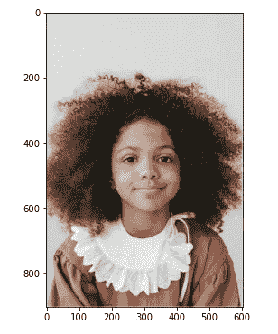
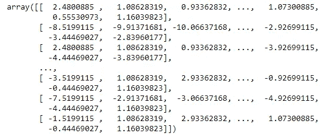
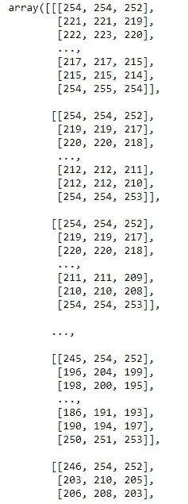
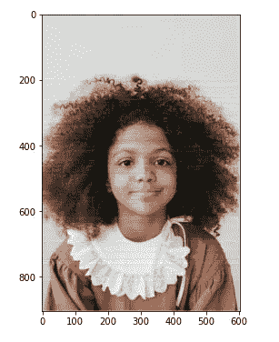

# 用主成分分析法重建一个黎族女孩的肖像

> 原文：<https://medium.com/analytics-vidhya/reconstructing-a-lil-girl-s-portrait-using-principal-component-analysis-part-1-60d2baac85de?source=collection_archive---------9----------------------->

PCA，即主成分分析，是将大量数据缩减为更小集合的基本技术之一。想法是减少数据集，但保留尽可能多的信息。

在这篇博客中，我们将探索 PCA 来压缩一幅图像，使之足以识别照片中的人。

这个博客是一个教程。人们可以将此作为他们努力理解 PCA 的参考。

请访问我的 [GitHub 库](https://github.com/AnneDroidd/studious-carnival/blob/main/PCA_Attempt3-Copy1.ipynb)了解更多信息和背景。

## 导入库和加载映像:

原图。演职员表:【https://www.instagram.com/anastasia.shuraeva 

## 将图像转换为 2D 阵列:

该阵列具有 904 行和 603 列像素，每个像素具有 3 个强度值，即红、绿和蓝平面(RGB 值)。我们将把它改造成适合 PCA 的格式。我保留了行，修改了列，如下:
1809 = 603 * 3

如果我们观察整形后的数组 *img_r* ，它现在的尺寸已经变成了 904x1809。

## 标准化数据集:

## 创建协方差矩阵:

输出:创建协方差矩阵

## 计算特征值和重构阵列:

我随机考虑了 100 个主成分来重建数组。我们可以取不同的值来观察重建后图像的质量。

## 将 2D 阵列转换为 3D 阵列以转换为图像:

2D 阵列转换为 3D

## 重建图像:

最后，我们从三维数组中取回我们的图像。

电脑数量为 100 时的重建图像

重建的图像有一些损失，特别是在中间部分，但我们仍然可以识别照片中的女孩。所以 100 台电脑足以重建图像。

事实上，100 是一个很好的数字，如果我们考虑到我们不需要所有的 904 组件来很好地说明我们的输入。

但是我们真的需要 100 个主成分吗？或者我们能用更少的电脑做得更好？

## 在不损失太多数据的情况下，我们还能压缩图像多少？

在本教程的下一部分，我们将找出多少台电脑足以进行重建，这仍然足以让我们识别照片中的女孩。

在此之前，您可以尝试考虑不同的电脑数量值，并观察输出图像。您也可以查看[我的 GitHub repo](https://github.com/AnneDroidd/studious-carnival/blob/main/PCA_Attempt3-Copy1.ipynb) 了解后续步骤。

我将很快发布第二部分！

**快乐学习！！**😊📚