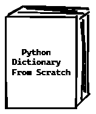

# 从头开始重新创建 Python 字典

> 原文：<https://medium.com/analytics-vidhya/recreating-python-dictionaries-from-scratch-e646b3515943?source=collection_archive---------8----------------------->



想知道怎么做吗？！嗯，那就继续看……:)

众所周知， *Python 字典*是一种用于存储键值对的数据结构；其中“密钥”用于存储和检索存储的“值”。例如，这里有一个字典，用于存储和检索一个班级中学生的标记；

```
# Creating a dictionary
result = 
{
  'A' : '20',
  'B' : '15',
  'C' : '10'
}
result# Retrieving the marks using key value(here, name)
result['A']# Add a new value
result['Z'] = '9'# Update existing value
result['A'] = '11'# View the updated dictionary
result# View all the names and marks stored in result using a for loop
for name in result:
    print('Name:', name, ', Marks:', result[name])
```

还在疑惑？这是如何工作的？预读…:)

*   Python 中的字典是使用一种叫做 ***哈希表*** 的数据结构实现的。
*   哈希表使用一个列表/数组来存储键值对，并使用一个*哈希函数*来确定用于存储或检索与给定键相关联的数据的索引。

```
MAX_HASH_TABLE_SIZE = 4096class HashTable:
    def __init__(self, max_size=MAX_HASH_TABLE_SIZE):
        self.data_list = [None] * max_size

    def get_valid_index(self, key):
        hash('key')

    def __getitem__(self, key):
        idx = get_valid_index(self.data_list, key)
        kv = self.data_list[idx]
        return None if kv is None else kv[1]

    def __setitem__(self, key, value):
        idx = get_valid_index(self.data_list, key)
        self.data_list[idx] = (key, value)     

    def __iter__(self):
        return (x for x in self.data_list if x is not None)

    def __len__(self):
        return len([x for x in self])

    def __repr__(self):
        from textwrap import indent
        pairs = [indent("{} : {}".format(repr(kv[0]), repr(kv[1])), '  ') for kv in self]
        return "{\n" + "{}".format(',\n'.join(pairs)) + "\n}"

    def __str__(self):
        return repr(self)
```

实现上述函数后，我们可以创建 Python 字典，如下所示→

```
# Create a hash table
table = HashTable()# Insert some key-value pairs
table['a'] = 1
table['b'] = 34# Retrieve the inserted values
table['a'] == 1 and table['b'] == 34# Update a value
table['a'] = 99# Check the updated value
table['a'] == 99# Get a list of key-value pairs
list(table) == [('a', 99), ('b', 34)]table
>>
{
  'a' : 99,
  'b' : 34
}
```

还有 ***搞定*** ！Python 中的字典数据结构是从零开始成功创建的:)