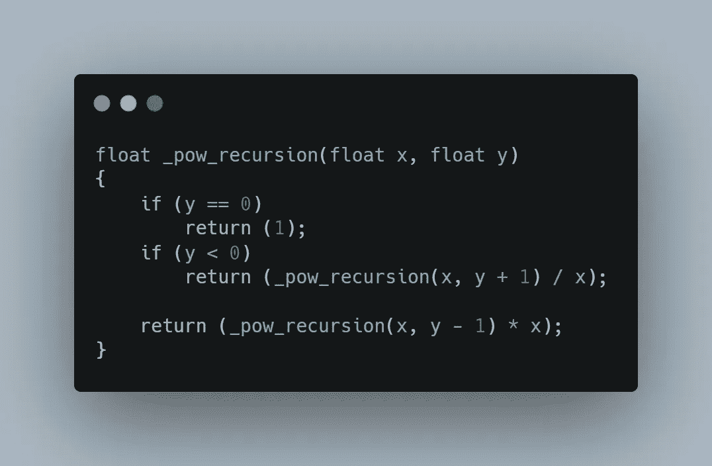
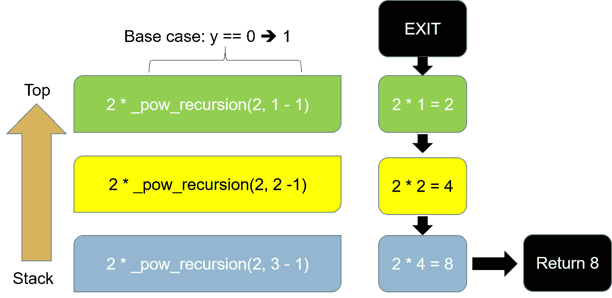

# 递归——梦中的梦

> 原文：<https://medium.com/analytics-vidhya/recursion-a-dream-within-a-dream-6a8dd2a5a775?source=collection_archive---------11----------------------->

照片由[雅克·肯帕宁](https://unsplash.com/@jaakkok?utm_source=unsplash&utm_medium=referral&utm_content=creditCopyText)在 [Unsplash](https://unsplash.com/s/photos/spiral-staircase?utm_source=unsplash&utm_medium=referral&utm_content=creditCopyText) 上拍摄

有一个关于递归的厚颜无耻的笑话我忍不住用在这里“要理解递归，你必须先理解递归”。

这可能是正确的，但有一个警告:像俄罗斯娃娃一样，递归**不应该永远继续下去，当基本情况满足时，它必须结束。**

基本情况是什么？

好吧，让我们重新开始。

什么是递归？

**递归是函数调用自己，直到它不调用为止。**

在计算机科学中，递归函数是由

1.  一个**递归 case** ，意思是一个 case 调用自身的一个**更小的**版本，直到它到达…
2.  …一个**基础案例**。基本情况是满足停止递归函数的条件。

如果没有基本情况，函数将无限循环，并且不会满足递归定义。

**迭代 vs 递归**

在编码中，所有的增量问题都可以通过 for 和 while 循环迭代解决。然而，在某些情况下，迭代方法的复杂性可能是压倒性的，它的递归版本将使它更具可读性。

树和图的遍历是递归最适合的例子。

根据*破解编码采访*“所有递归算法都可以迭代实现…”。

这两种方法完成了同样的事情，但是递归似乎更清晰，更容易理解和维护。

然而，使用递归并不会带来性能上的好处。甚至，有时循环在这方面更好。递归增加了每次递归调用的内存使用。

让我们看一个例子。

下面是一个递归函数的幂函数 x^y.

事实上，它已经:

1.  一种**递归情况**:如果 y 为正，它调用 y 的较小版本(如果 y 为负，则调用较大版本)，直到…
2.  … y 达到 0，这是**基本情况**，功能终止。

幂函数的递归算法

例如，为了计算`_pow_recursion(2, 3)`，递归函数执行以下步骤:

1.  `_pow_recursion(2, 3) = 2 * _pow_recursion(2, 2)`
2.  `_pow_recursion(2, 2) = 2 * _pow_recursion(2, 1)`
3.  `_pow_recursion(2, 1) = 2 * _pow_recursion(2, 0)`
4.  `_pow_recursion(2, 0) = 1`

每个递归调用都会添加到递归堆栈中。

**递归堆栈**

栈是 LIFO(后进先出)对象，这意味着任何添加的项都被“*”推到栈顶。并且每个“*弹出的*动作都会移除栈顶的项目。*

使用堆栈是一种对执行操作进行排序的方法。堆栈跟踪函数调用。

下图显示了堆栈在计算递归程序时的样子。

每个连续的函数调用都被推到栈顶，下面的函数等待上面的函数返回。

每次调用递归函数时，都会生成一个新的堆栈帧，这样每一组局部变量都不会干扰任何其他组。

从底部开始，它添加`2 * _pow_recursion(2, 3 — 1)`等等，直到到达最顶部的基本情况/退出条件，这是`_pow_recursion(2, 1 — 1)`。在堆栈的这一点上，它最终可以通过向下堆栈来计算待定乘法:

2 的堆栈操作

从堆栈顶部，它退出并向下到`2 * 2`，即`4`。现在它持有`4`，但是不能返回，直到它因为一个挂起的乘法而下降，以此类推，直到它到达堆栈的最后，在那里它返回它持有的东西；也就是`8`。

**时间复杂度大**

嵌套调用的最大数量(包括第一个)称为*递归深度*。在我们的例子中，它将是`y`。这个函数在到达基本情况之前被递归地调用`y`次，所以根据大 O 符号，它的时间复杂度是`O(y)`，通常被称为**线性**。

如果不满足基本情况退出条件，将发生**堆栈溢出**。

在西方艺术史中，mise en abyme 是一种正式的技术，在这种技术中，一幅图像包含其自身的一个较小的副本，其顺序似乎无限重现。

Mise en abyme，不是递归

快乐，无限，读书！