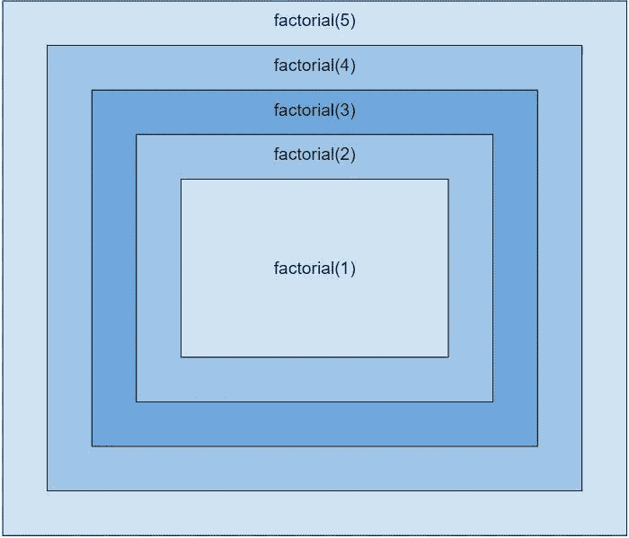

# 递归:编程的嵌套玩偶

> 原文：<https://medium.com/analytics-vidhya/recursion-the-nesting-doll-of-programming-404ae61708a0?source=collection_archive---------13----------------------->


图片来自[https://www . therussianstore . com/blog/the-history-of-nesting-dolls/](https://www.therussianstore.com/blog/the-history-of-nesting-dolls/)

递归可能是一个很难理解的概念，但却是程序员工具箱中的一个有用的工具。在最简单的定义中，递归函数是一个调用自身的函数，直到函数达到其基本情况。基本情况是我们不再需要调用函数的结束条件。基本情况的一些例子是数组的最后一个值、计数器到达零、字符串数组中的一个字符串等于某个单词。所以，就像一个嵌套的洋娃娃，函数里面有一个自己的函数，还有一个在那个里面，如此循环，直到我们到达基本情况。

这有点难以理解，所以我们来看一个例子。递归的一个基本例子是阶乘。一个数 n 的阶乘是所有小于或等于 n 的正数的乘积，阶乘用 n 表示！。例如:

```
6! = 6 * 5 * 4 * 3 * 2 * 1                // 120
```

阶乘的公式是:

```
n! = n * (n-1) * … * 1
```

当用代码写出来的时候，我们知道我们想要 5 乘以 4，然后乘以 3，一直到 1。那很容易！

```
function factorial(num) {return num * 4 * 3 * 2 * 1}
```

这个函数只在我们要找 5 的时候才起作用！。如果我们不知道 num 的值。num 不是 5 怎么办？该函数将返回错误的值。这就是递归发挥作用的地方。我们可以使用递归对所有正数再次调用阶乘函数，直到达到 1。

```
function factorial(num) {if(num === 1 || num === 0) return 1;    // base casereturn num * factorial(num-1);         // runs factorial again}
```

我们的 if 语句是我们的基本情况。如果阶乘中的参数是 1 或 0，我们将返回 1。0!= 1!= 1.这导致我们的递归结束。我们假设自变量总是大于或等于 0。

# 逐步地

让我们解释一下我们的函数发生了什么。让我们首先调用参数为 5 的阶乘函数。

```
factorial(5)
```

我们首先检查我们的参数是否等于 1 或 0。我们的 if 语句失败了，所以我们继续返回语句。

```
return 5 * factorial(5-1)
```

我们用参数 4 再次运行我们的函数。if 语句再次失败，因此递归再次发生，直到 if 语句通过。

```
return 4 * factorial(4-1)return 3 * factorial(3-1)return 2 * factorial(2-1)
```

我们现在的论点是 1，`factorial(1)`。1 是我们的基本情况，所以我们的 if 语句通过并将返回 1。我们的功能终于回归了。

# 返回函数

返回的顺序有点复杂。我们可以把递归想象成一组嵌套的函数调用。我们最内部的嵌套函数将首先返回，然后返回其最近的外层，依此类推。



递归将从内向外依次返回

```
factorial(1) => returns 1                 => 1factorial(2) => returns 2 * factorial(1)  => 2 * 1 = 2factorial(3) => returns 3 * factorial(2)  => 3 * 2 * 1 = 6factorial(4) => returns 4 * factorial(3)  => 4 * 3 * 2 * 1 = 24factorial(5) => returns 5 * factorial(4)  => 5 * 4 * 3 * 2 * 1 = 120
```

总之，`factorial(num)`首先以参数 5 运行。`factorial(num)`不断被调用，调用的参数比前一个参数小 1，直到参数为 1。最内层的嵌套函数返回值 1。我们将这个值插入下一个嵌套函数并返回 2。我们这样做，直到每个参数彼此相乘，得到最终值 120。

这是递归的许多例子之一。我希望这篇文章有助于理解递归的基础。

# 资源

要获得更多关于递归的资源，我建议看看这些有用的链接。

[https://medium . com/free-code-camp/how-recursion-works-explained-with-flow-and-a-video-de 61 f 40 CB 7 f 9](/free-code-camp/how-recursion-works-explained-with-flowcharts-and-a-video-de61f40cb7f9)

[https://www . khanacademy . org/computing/computer-science/algorithms/recursive-algorithms/a/recursion](https://www.khanacademy.org/computing/computer-science/algorithms/recursive-algorithms/a/recursion)

[https://www.youtube.com/watch?v=KEEKn7Me-ms](https://www.youtube.com/watch?v=KEEKn7Me-ms)