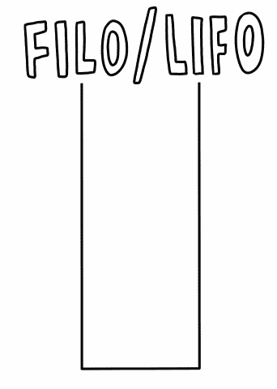
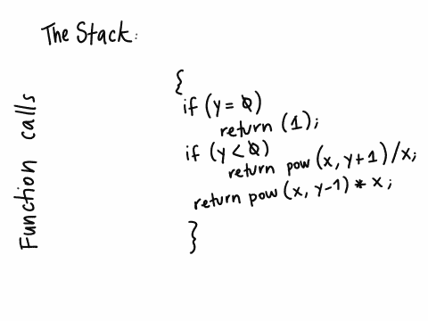

# 递归:到堆栈的末尾，然后返回-

> 原文：<https://medium.com/analytics-vidhya/recursion-to-the-end-of-the-stack-and-back-8bed3692e397?source=collection_archive---------17----------------------->


作为一名程序员，你可以拥有的最关键的属性之一就是优化。在编程中，这可以通过各种各样的方式付诸实践，你结合得越多，你就越能成为一名优秀的程序员。

一些推荐的优化实践包括能够用尽可能少的词语解释算法并使其通过，尽可能清晰并有教育意义的白板，以及防止过度使用系统内存的高效编码。对于小程序来说，总运行时间可能不是问题，但是对于大程序来说，如果代码使系统变大并且运行缓慢，这可能会成为一个麻烦——也就是说不是最佳的。

有效的编码包括许多实践，但是一个非常值得注意的是不要滥用循环。一些嵌套循环是可以的，但是当有一个太多的时候，那么优化雷达可能会滴答作响。你能用什么来代替循环呢？你猜对了，用**递归**。

就这样，亲爱的读者们，让我们直接进入让我们来到这个博客的主题。

# 递归

由[定义](https://www.google.com/search?client=ms-android-samsung-gs-rev1&sxsrf=ALeKk00W_Ch9bA0obZ2b3DBOwLpwTabv4w%3A1613924119539&ei=F4cyYM6rIP6_5OUP7662wA4&q=define+recursion&oq=define+recursion&gs_lcp=ChNtb2JpbGUtZ3dzLXdpei1zZXJwEAMyBAgjECcyBQgAEMsBMgUIABDLATIFCAAQywEyBQgAEMsBMgUIABDLATIFCAAQywEyBQgAEMsBOgQIABBHUKUPWJoVYKRJaABwAXgAgAHLB4gBlg-SAQM2LTKYAQCgAQHIAQjAAQE&sclient=mobile-gws-wiz-serp)，递归是:

> 递归过程或定义的重复应用。

有趣的是，在它自己的定义中，递归使用了递归这个词。这本身就是概念本身的定义，并使其不言自明。因为换句话说，把它与编程联系起来，递归指的是调用自身的函数或过程。

它的工作方式是一个函数，在这个函数内部，这个函数被再次调用。

递归函数**必须至少有两个条件才能正常工作:**

*   基本情况
*   互动/增加/减少

# 基础案例:

与循环一样，递归函数需要一个基本情况，也称为退出条件，以防止无限循环。付诸实践，这意味着该函数将被调用，直到达到该条件。然后它会开始递归，我们一会儿会讲到。

# 迭代:

与循环一样，每次调用递归函数时，至少有一个参与变量必须发生变化，以便更接近基本情况。如果没有变化，那么就会实现无限循环。

要进一步解释这个概念，没有比付诸实践更好的方法了。看一下下面的代码:

```
float _pow_recursion(float x, float y)
{
      if (y == 0)
           return (1);
      if (y < 0)
           return (_pow_recursion(x, y + 1) / x);
      return (_pow_recursion(x, y - 1) * x);
}
```

乍一看，它看起来像一个普通的短函数，但是仔细看，我们可以看到在函数内部，同样的函数被再次调用。

这是一个递归函数的例子。这个函数接收两个浮点数，`x`和`y`，并计算`x`的结果到`y`的幂。

对于循环，这可以通过以下方式解决:

```
int pow(x, y)
{
     int i, result = x;
     for (i = 0; i <= y; i++)
     {
         result  * = 2
     }
     return (result)
}
```

这是正确的，并且仅适用于正数，除非添加了边缘情况。然后，应该添加另一个循环，以防数字为负。首先，我们已经有两个循环来计算一个数的另一个幂。似乎有点多，是吧？

顶部的解决方案比 T4 更有效，因此更可取。由于递归是一个复杂的概念，尽管它看起来很复杂，但也很重要，我们将把它分解成几个步骤，并解释后台发生的事情，以进一步理解解决方案，并可能更容易将其付诸实践。

# 堆起来

为了充分理解递归是如何工作的，我们必须理解堆栈。

堆栈是指有序、有组织的“一堆”东西。想象一堆乐高积木。

在一个系统中，堆栈指的是一种数据结构，在这种结构中，数据项以有序的方式放置，并且由于它们存储的方式是有组织的，所以在任何时候内存中的地址都是已知的。这个系统堆栈是在堆之外使用的，它暂时存储正在执行的子程序的信息，直到轮到它们被执行。存储每个子程序的“乐高”块被称为**堆栈框架**。项目被“推入”堆栈中，就像您将一堆乐高积木“推入”堆栈一样，并以同样的方式“弹出”。顺序是后进先出。这意味着要堆叠的第一个项目是最后一个要移除的项目。同样，最后添加的是第一个删除的。

这可以在下面的 GIF 中说明:



黑色的边界不能被侵入，这意味着物品只能通过顶部的开口进出。考虑到这一点，我们可以进一步理解这个系统是如何工作的，这对理解将要发生的事情是极其重要的。

# 这和递归有什么关系？

嗯，一切！我们之前说过递归是一个调用自身的函数。从系统角度来说，这意味着调用了该函数的另一个实例，而第一个实例仍在运行，这意味着第一个实例没有完成执行。函数将在彼此内部被反复调用，直到到达出口情况。当这种情况发生时，会有大量“开放”的功能等待完成。这些实例或子例程中的每一个都将暂时存储在一个堆栈框架中。一旦轮到他们完成执行，他们将离开堆栈，然后轮到下面的实例被执行，这样继续下去，直到堆栈中不再有子程序，因此程序结束。

# 让我们再来看看这个例子:

在查看了示例并理解了堆栈如何处理递归之后，我们现在可以一步一步地分解示例并理解它。

```
float _pow_recursion(float x, float y)
{
      if (y == 0)
           return (1);
      if (y < 0)
           return (_pow_recursion(x, y + 1) / x);
      return (_pow_recursion(x, y - 1) * x);
}
```

所以，我们知道的是:

*   这是一个返回`float`的函数，它被称为`_pow_recursion`(提示它将做什么)，它接收两个浮点，`x`和`y`。
*   如果`y`等于 0，那么函数返回 1。
*   如果`y`小于零，该函数使用相同的`x`再次调用自身，并将`y`加 1。它将继续这样做，直到`y = 0`的退出情况，然后返回到每个子程序并除以`x`。
*   如果`y`大于 0，那么该函数将再次使用相同的`x`调用自身，并从`y`减去 1，直到到达`y = 0`的退出情况，然后对于保存在堆栈上的每个子例程中的每个返回值，通过乘以`x`返回。
*   最终返回值将是`x`对`y`的幂的结果。

让我们关注于`x`和`y`都有两个正值的情况。还有什么比用另一张 GIF 更好的方式来说明这个功能呢？



需要看多少遍就看多少遍，解释完后再回头参考。
我们将从值`x = 2`和`y = 6`开始，因此这个函数将计算`2`的值到`6`的幂。

首先在右边你会看到代码，值进入函数的部分会用不同的颜色突出显示。每种颜色代表一个不同的堆栈框架，它将显示在 GIF 的左侧，以相应的颜色和顺序存储每个函数调用的值。一旦到达 exit case，回调就开始，每个回调都用自己的颜色计算返回值，直到遍历完每个堆栈帧，程序以最终结果结束。

如前所述，函数以值`x = 2`和`y = 6`进入。`y`不为 0，也不小于 0，所以函数直接进入最后一个`return`。在返回之前，再次调用函数，因此我们的第一个子例程存储在第一个堆栈帧中。`* x`仍然是待定的，但是因为函数被调用了，所以剩余的乘法留给函数的回调。

就这样继续下去，`y = 5`、`y = 4`、`y = 3`、`y = 2`和`y = 1`，每次调用函数时，在每个堆栈帧中保存一个函数调用。最后，当`y = 0`时，功能不会转到第二个`return`，而是到达出口箱和`return 1`。这是回调开始的时候，按照我们之前看到的后进先出顺序。

1 被返回到先前的回调，并且`* x`仍然被该函数调用挂起。因为`x = 2`，返回值将被乘以 2，以完成函数的挂起部分。因此，在乘法运算之后，函数调用将`return 2`到先前的回调。并且对于每一步都将如此继续，总是乘以 2，因为它是`x`的值，并且它从不改变。因此`2 * 2 = 4`、`4 * 2 = 8`、`8 * 2 = 16`、`16 * 2= 32`、`32 * 2 = 64`，并且由于这最后一个是堆栈的最后一帧，因此也是最后一个等待完成递归的子例程，因此将返回值`64`，并且程序将被完成。

# 还有那个*戏剧性的停顿*…。递归…*拍手鞠躬*

乍一看，这似乎很难理解，但是就像生活中的所有事情一样，熟能生巧，只有将它付诸实践，程序员才能完善这种方法，并更好地应用它。

我希望这篇文章和动画能让你更容易理解。递归无疑是编程中最有趣和最有用的特性之一，它不仅高效，而且几乎可以代替任何循环。尝试在一个函数中至少应用一次递归，然后在同一个函数中可能不止一次…？*神魂颠倒*

# 附赠曲目

你知道递归不仅仅是编程的专利吗？在我们的日常生活和自然界中，有许多递归的例子。如果你想出了任何例子，请在下面留下评论！
递归狩猎快乐！:)