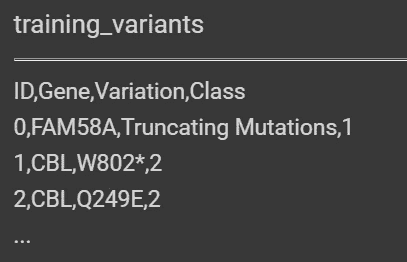
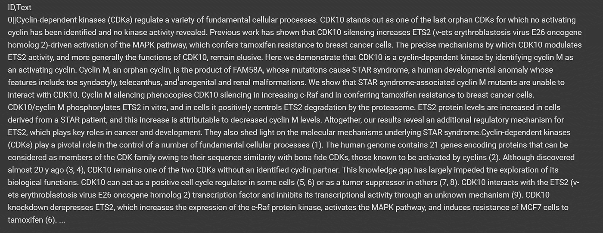
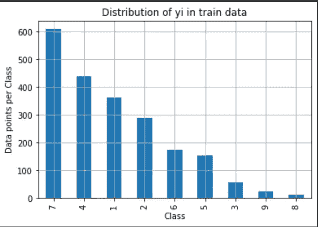
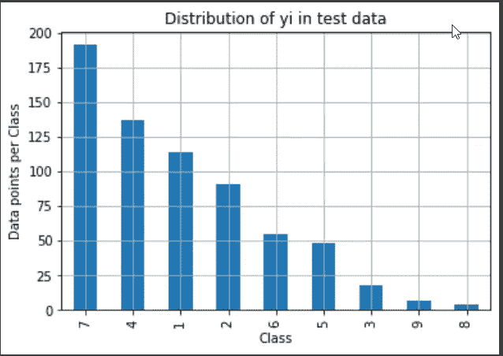
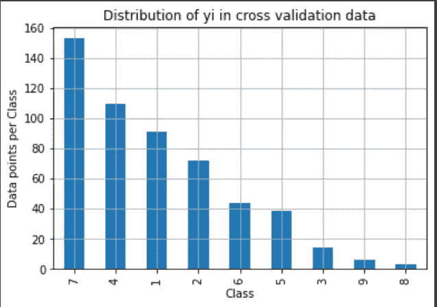
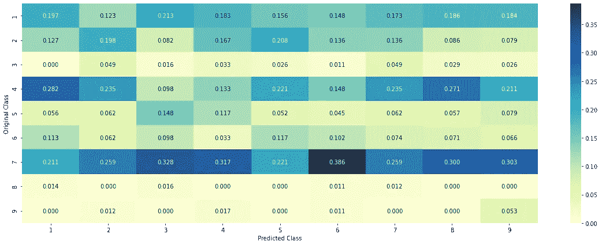
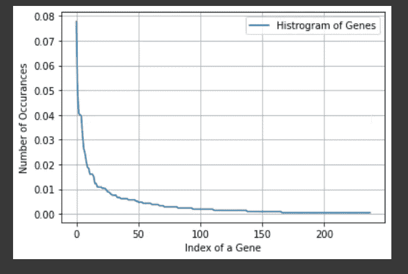
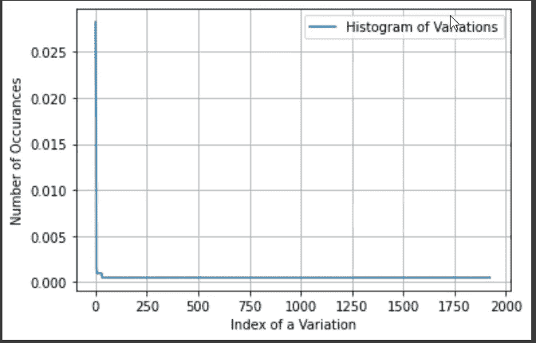
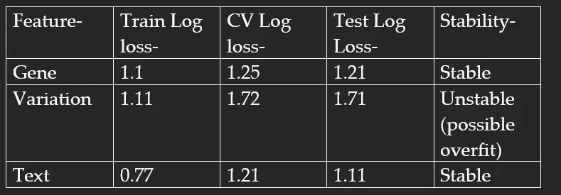
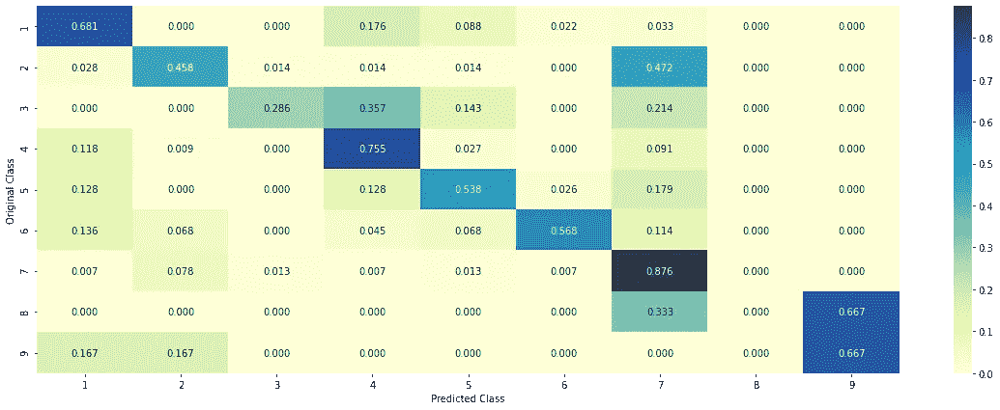

# 重新定义癌症治疗——纪念斯隆之路

> 原文：<https://medium.com/analytics-vidhya/redefining-cancer-treatment-the-memorial-sloan-way-b71ef4eed284?source=collection_archive---------3----------------------->


每当患者出现癌症症状时，就取出癌症肿瘤并进行测序。肿瘤细胞中的遗传信息以 DNA 的形式储存。然后转录形成 RNA，再翻译成蛋白质/氨基酸。在突变或 DNA 序列错误的情况下，产生的氨基酸受到影响，导致特定基因的变异。

该序列中可能存在数千种基因突变。我们需要区分恶性突变(导致肿瘤生长的驱动因素)和良性突变(过客)。

我们的目标是根据基于文本的临床文献的知识，将给定的基因变异对分类为 9 种癌症突变中的一种。

作为参考，每个分类标签对应于以下突变-

1:可能丧失功能

2:可能的功能增益

3:中性

4:功能丧失

5:可能中立

6:不确定

7:功能增益

8:可能的功能转换

9:功能转换

# 数据信息-

数据收集自[https://www . ka ggle . com/c/MSK-重新定义-癌症-治疗#评测](https://www.kaggle.com/c/msk-redefining-cancer-treatment#evaluation)。

存在两个数据文件——一个包含关于基因突变的信息，另一个包含人类专家/病理学家用于分类基因突变的临床证据(文本)。

这两个数据文件都有一个名为 ID 的公共列，可以在这个列上进行合并。

每个文件的列-

文件 1: training_variants (ID，Gene，Variations，Class)

它的字段是

*   **ID :** 用于将突变链接到临床证据的行的 ID
*   **基因:**该基因突变所在的基因
*   **变异:**该突变的氨基酸变化
*   **类别:**1–9 该基因突变被分类的类别

文件 2: training_text (ID，text)



来自 training_variants 数据集的样本数据点



来自 training_text 数据集的示例数据点。(当然，除了训练有素的病理学家，没有人能理解这一点！)

# 业务限制-

*   没有低延迟要求。(不需要像搜索引擎那样快速返回结果)
*   可解释性是一个值得关注的问题。(病理学家需要验证模型预测特定类别的原因)
*   错误可能会危及生命。
*   需要数据点属于每个类别的概率。(了解模型的置信度，决定是否进一步需要人体测试)。

# 机器学习问题的类型

由于我们有 9 个类，这是一个多类分类问题。

## 理想的绩效指标-

多级对数损失

混淆矩阵

**目标-**

以预测每个数据点属于九个类别中的每一个的概率。

# 文本预处理-

如前所述，数据由两个 CSV 文件组成——一个用于变体，另一个用于文本。稍后将使用 pd 在一个公共 ID 列的基础上连接它们。merge()函数。

文本 CSV 文件不是用逗号分隔的，而是用||分隔的。这是通过在读取数据时使用分隔符='/|/| '来实现的。[/=转义字符]

使用 NLTK 库对文本数据进行预处理

1.  任何特殊字符(除 A-Z 以外的字符(包括换行符)都被替换为单个空格字符。
2.  字母是小写的。
3.  多个空格被一个空格取代。
4.  停用词移除。

我们执行左外连接，因此我们一定会找到一些 id，它们的文本字段将为空。这些文本字段由包含基因+' '+变异的字符串替换。

# 数据分析-

训练-交叉验证-使用分层= y _ 标签以 64:16:20 的比例进行测试分割，以保持训练、cv、测试分割中的类别分布。

我们绘制柱状图来显示每一部分中的类别分布。他们在每个阶层都有相似的百分比，因为这种划分是分层的。



从上面的柱状图可以明显看出，数据集是不平衡的，类别 7、4、1、2 出现的频率更高。

# 随机模型-

因为我们的 KPI 是可解释的对数损失，并且变化到无穷大，所以我们需要根据随机模型来判断我们的模型。

对于交叉验证数据集和测试数据集中的每个数据点，我们使用 np.random.rand(1，9)生成大小为 9 的数组，并将每个元素除以数组的总和，以便总概率达到 1。

在我们的例子中，随机模型生成的日志损失为 2.5，作为基线。

绘制了随机模型的精度、召回和混淆矩阵。理想情况下，对角线元素应为 1，非对角线元素应为 0。



随机模型的精度矩阵。注意，这里列 sum=1，因为列在这里表示预测的类，precision 定义了所有那些预测为 k 的类，实际上有多少是 k

# 基因特征分析-

使用 value_counts()函数进行分类基因特征的单变量分析。有 238 种不同的基因，并绘制了它们的分布数量直方图。它显示了严重的偏态分布。



## 编码基因特征-

可以对分类特征进行两种类型的编码，一种是热编码，另一种是响应编码。

在 one-hot-encoding 中，每个特征由一个 n 维向量表示，其中 n 是该特征的唯一值的数量。同样在响应编码中，每个特征由 n 维向量表示，其中 n 是类别的数量。向量填充有基因特征属于 9 个类别之一的概率值(从整个数据集中捕获)。

下面的代码用于构建所需的响应编码字典，其中关键字是分类变量，值是 n(这里是 9)维向量，每个向量对应于类别标签的概率。[学分:堆栈溢出]

```
def get_gv_fea_dict(alpha, feature, df):# value_count: it contains a dict like# print(train_df[‘Gene’].value_counts())# output:# {BRCA1 174# TP53 106# EGFR 86# BRCA2 75# PTEN 69# KIT 61# BRAF 60# ERBB2 47# PDGFRA 46# …}# print(train_df[‘Variation’].value_counts())# output:# {# Truncating_Mutations 63# Deletion 43# Amplification 43# Fusions 22# Overexpression 3# E17K 3# Q61L 3# S222D 2# P130S 2# …# }value_count = train_df[feature].value_counts()# gv_dict : Gene Variation Dict, which contains the probability array for each gene/variationgv_dict = dict()# denominator will contain the number of time that particular feature occured in whole datafor i, denominator in value_count.items():# vec will contain (p(yi==1/Gi) probability of gene/variation belongs to perticular class# vec is 9 diamensional vectorvec = []for k in range(1,10):# print(train_df.loc[(train_df[‘Class’]==1) & (train_df[‘Gene’]==’BRCA1')])# ID Gene Variation Class# 2470 2470 BRCA1 S1715C 1# 2486 2486 BRCA1 S1841R 1# 2614 2614 BRCA1 M1R 1# 2432 2432 BRCA1 L1657P 1# 2567 2567 BRCA1 T1685A 1# 2583 2583 BRCA1 E1660G 1# 2634 2634 BRCA1 W1718L 1# cls_cnt.shape[0] will return the number of rowscls_cnt = train_df.loc[(train_df[‘Class’]==k) & (train_df[feature]==i)]# cls_cnt.shape[0](numerator) will contain the number of time that particular feature occured in whole datavec.append((cls_cnt.shape[0] + alpha*10)/ (denominator + 90*alpha))# we are adding the gene/variation to the dict as key and vec as valuegv_dict[i]=vecreturn gv_dict
```

请注意拉普拉斯(加法)平滑也是如何执行的。这样做是为了确保非常小的值得到很好的处理，并且模型不会过度拟合。

> 考虑特征“基因”的值“x”:
> 
> 对应于“x”的向量的第一个元素=(数据点属于类 1 的“x”出现的次数+ 10*alpha /总数据中“x”出现的次数+n * alpha)[其中 n 是类标签的数量，alpha 是超参数]

获取我们数据集的响应编码矩阵的代码-

```
# Get Gene variation featuredef get_gv_feature(alpha, feature, df):# print(gv_dict)#     {'BRCA1': [0.20075757575757575, 0.03787878787878788, 0.068181818181818177, 0.13636363636363635, 0.25, 0.19318181818181818, 0.03787878787878788, 0.03787878787878788, 0.03787878787878788],#      'TP53': [0.32142857142857145, 0.061224489795918366, 0.061224489795918366, 0.27040816326530615, 0.061224489795918366, 0.066326530612244902, 0.051020408163265307, 0.051020408163265307, 0.056122448979591837],#      'EGFR': [0.056818181818181816, 0.21590909090909091, 0.0625, 0.068181818181818177, 0.068181818181818177, 0.0625, 0.34659090909090912, 0.0625, 0.056818181818181816],#      'BRCA2': [0.13333333333333333, 0.060606060606060608, 0.060606060606060608, 0.078787878787878782, 0.1393939393939394, 0.34545454545454546, 0.060606060606060608, 0.060606060606060608, 0.060606060606060608],#      'PTEN': [0.069182389937106917, 0.062893081761006289, 0.069182389937106917, 0.46540880503144655, 0.075471698113207544, 0.062893081761006289, 0.069182389937106917, 0.062893081761006289, 0.062893081761006289],#      'KIT': [0.066225165562913912, 0.25165562913907286, 0.072847682119205295, 0.072847682119205295, 0.066225165562913912, 0.066225165562913912, 0.27152317880794702, 0.066225165562913912, 0.066225165562913912],#      'BRAF': [0.066666666666666666, 0.17999999999999999, 0.073333333333333334, 0.073333333333333334, 0.093333333333333338, 0.080000000000000002, 0.29999999999999999, 0.066666666666666666, 0.066666666666666666],#      ...#     }gv_dict = get_gv_fea_dict(alpha, feature, df)# value_count is similar in get_gv_fea_dictvalue_count = train_df[feature].value_counts()# gv_fea: Gene_variation feature, it will contain the feature for each feature prob dist value in the datagv_fea = []# for every feature values in the given data frame we will check if it is there in the train data then we will add the feature to gv_fea# if not we will add [1/9,1/9,1/9,1/9,1/9,1/9,1/9,1/9,1/9] to gv_feafor index, row in df.iterrows():if row[feature] in dict(value_count).keys():gv_fea.append(gv_dict[row[feature]])else:gv_fea.append([1/9,1/9,1/9,1/9,1/9,1/9,1/9,1/9,1/9])#             gv_fea.append([-1,-1,-1,-1,-1,-1,-1,-1,-1])return gv_fea# Get Gene variation featuredef get_gv_feature(alpha, feature, df):# print(gv_dict)#     {'BRCA1': [0.20075757575757575, 0.03787878787878788, 0.068181818181818177, 0.13636363636363635, 0.25, 0.19318181818181818, 0.03787878787878788, 0.03787878787878788, 0.03787878787878788],#      'TP53': [0.32142857142857145, 0.061224489795918366, 0.061224489795918366, 0.27040816326530615, 0.061224489795918366, 0.066326530612244902, 0.051020408163265307, 0.051020408163265307, 0.056122448979591837],#      'EGFR': [0.056818181818181816, 0.21590909090909091, 0.0625, 0.068181818181818177, 0.068181818181818177, 0.0625, 0.34659090909090912, 0.0625, 0.056818181818181816],#      'BRCA2': [0.13333333333333333, 0.060606060606060608, 0.060606060606060608, 0.078787878787878782, 0.1393939393939394, 0.34545454545454546, 0.060606060606060608, 0.060606060606060608, 0.060606060606060608],#      'PTEN': [0.069182389937106917, 0.062893081761006289, 0.069182389937106917, 0.46540880503144655, 0.075471698113207544, 0.062893081761006289, 0.069182389937106917, 0.062893081761006289, 0.062893081761006289],#      'KIT': [0.066225165562913912, 0.25165562913907286, 0.072847682119205295, 0.072847682119205295, 0.066225165562913912, 0.066225165562913912, 0.27152317880794702, 0.066225165562913912, 0.066225165562913912],#      'BRAF': [0.066666666666666666, 0.17999999999999999, 0.073333333333333334, 0.073333333333333334, 0.093333333333333338, 0.080000000000000002, 0.29999999999999999, 0.066666666666666666, 0.066666666666666666],#      ...#     }gv_dict = get_gv_fea_dict(alpha, feature, df)# value_count is similar in get_gv_fea_dictvalue_count = train_df[feature].value_counts()# gv_fea: Gene_variation feature, it will contain the feature for each feature prob dist value in the datagv_fea = []# for every feature values in the given data frame we will check if it is there in the train data then we will add the feature to gv_fea# if not we will add [1/9,1/9,1/9,1/9,1/9,1/9,1/9,1/9,1/9] to gv_feafor index, row in df.iterrows():if row[feature] in dict(value_count).keys():gv_fea.append(gv_dict[row[feature]])else:gv_fea.append([1/9,1/9,1/9,1/9,1/9,1/9,1/9,1/9,1/9])#             gv_fea.append([-1,-1,-1,-1,-1,-1,-1,-1,-1])return gv_fea
```

简单的一键编码适用于逻辑回归、线性 SVM，而响应编码适用于朴素贝叶斯、随机森林等。这是因为线性模型可以比集合/森林模型更好地处理大维度。

我们需要推断基因特征有多有用。为此，仅使用基因特征作为属性建立模型，并检查对数损失是否小于 2.5。

首先，SGD 分类器(具有“对数”损失和 l2 正则化以及 h-param 调整)被用于一键编码的基因特征。除此之外，还使用了经过校准的分类器。这实质上实现了逻辑回归

使用网格搜索进行超参数调谐，并测量相应的训练、cv、测试日志损失。它比随机模型更好，并且不会过度拟合。因此，我们的基因特征非常有用。

现在，我们必须检查基因特征是否稳定。稳定特征是其值在训练集、CV 集和测试集之间有显著重叠的特征。如果不是这样，ML 模型是不可能建立的。

计算训练、cv 和测试日志损失。没有过度拟合意味着特征稳定。此外，我们观察到 cv 和测试数据中的大多数(90%以上)基因特征也存在于训练数据中。因此基因特征是稳定的。

# 变异特征分析-

接下来，分析分类特征变化。

为 variation.value_counts()绘制的直方图显示了极度扭曲的数据。大多数值只出现一次！



CDF 显示一个线性图。这意味着大多数特性的值计数都是 1。

现在，完成了一次热编码，然后是逻辑回归+校准 CV。执行 alpha 的超参数调整。然而，可以看出，该模型确实过拟合，这是由特征不稳定性引起的。

集合中仅包含测试和 cv df 中约 10%的变化点(训练 df[变化])。因此，变化特征虽然有用，但并不稳定。

# 文本特征分析-

现在，分析文本特征。也提出了同样的问题，

在训练数据中有多少独特的单词？

词频是如何分布的？

如何特征化文本字段？

文本特征在预测 y_i 中有用吗？

文本特征在训练、测试和 CV 数据集中是否稳定？

在训练逻辑回归+校正 CV 上，具有最优超参数的训练对数损失是好的。该模型没有真正过拟合，表明文本特征是稳定的。



我们所有功能的度量比较

因此，我们的特征重要性是文本>基因>变异。这是从 cv 和测试数据测井损失值中推导出来的。

测试数据中出现的 95%以上的单词也出现在集合(训练数据)中。因此文本特征也是稳定的。

# 模特-

接下来，我们进行适当的 ML 建模。

一键基因、变异、文本特征被水平堆叠并转换成 csr 矩阵。反应编码基因、文本、特征也是如此。

## 单热编码特征是 55517 维的，而响应编码仅仅是 27 维的。因此，一次性特征适合逻辑回归、线性 SVM 模型，而响应编码更适合 KNN、Boosting、随机森林、决策树等。

## 具有一个热编码特征的多项式朴素贝叶斯

水平堆叠的特征被馈入多项式朴素贝叶斯分类器+具有网格搜索的超参数调谐的校准分类器。

测试日志损失不如仅使用文本特征的 LR 模型。此外，从精度和召回矩阵来看，该模型在构成大多数数据点的 2-7 和 1-4 类之间变得混乱。

根据业务需求，对于来自测试数据的特定查询点，使用 predict_proba()来预测预测的标签和类的概率。

请注意，每当需要输出概率时，总是建议在基本学习器上使用校准的分类器，因为它校准概率值以匹配每个类的概率的预期分布。输出概率与预期的类别概率相差很大，尤其是在复杂的非线性模型的情况下。

# 具有响应编码特征的 KNN 分类器

接下来，尝试具有响应编码特征的 KNN。该模型的性能优于以前的朴素贝叶斯分类器。然而，在大多数班级 2-7，1-4 中仍然会出现混乱。但是少数类的性能(对数损失)更好。

为了 KNN 的可解释性，使用 model.kneighbours()函数来获得最近 n 个邻居的类。

# 具有类平衡和一个热点特征的逻辑回归

接下来，SGD classifier(loss = ' log ' and class = ' balanced ')用于独热编码特征。这个模型给出了到目前为止最低的对数损失值。从混淆矩阵，我们观察到低密度类 8，9 也有好的结果。使用类平衡功能对类进行过采样。因此，平衡有助于提高少数类的精确度和召回率。



类别平衡逻辑回归的回忆矩阵

# 线性 SVM 分类器，具有类平衡和一个热点特征

接下来，实现一个 SGDClassifier(loss='hinge '，class='balanced ')。准确性低于逻辑回归模型，但其他指标与 LR 的 LinearSVM 相当。

# 具有一键和响应编码特征的随机森林分类器-

用超参数作为估计器的数目和树的最大深度来训练具有一热编码和响应编码的随机森林。对于这个模型，少数类的精度和召回率是 1 或接近 1。然而，大多数类并没有被很好地分类。

响应编码过拟合的随机森林具有最高的对数损失。

# 堆积分类器-

使用 MLXtend 库，现在尝试堆叠分类器。基础学习者逻辑回归、线性支持向量机和朴素贝叶斯分类器的概率输出被传递到最终的元分类器逻辑回归模型。

然而，堆叠模型面临可解释性的问题，并且训练数据在基本模型之间被分割。因此，单个模型的误差会增加。

因此，在数据点较少的情况下，叠加不是最佳的。

接下来，还使用了投票=“软”(即获取基础模型的概率输出)的多数投票分类器。

# **部署-**

使用 Flask 开发了一个网页，并部署在 Heroku 上进行实时预测。不幸的是，Heroku 突然停止了自由层。

网页运行的视频可以在 GitHub 项目链接上找到:

https://github.com/Debadri3/Personalized-Cancer-Diagnosis

如果你觉得这个项目有用，请慷慨鼓掌，并跟随我在媒体:【https://medium.com/@debadri3】T4。会真正帮助像我这样的崭露头角的作者！