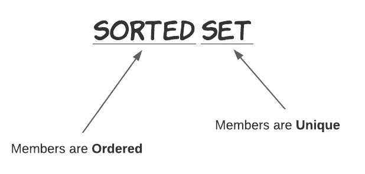
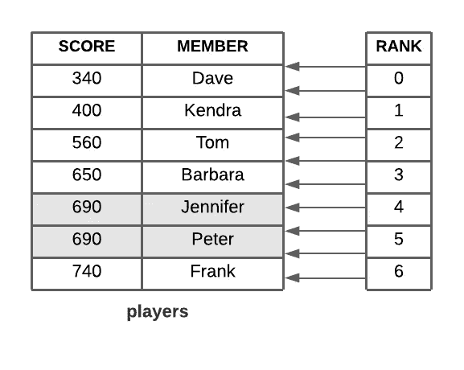
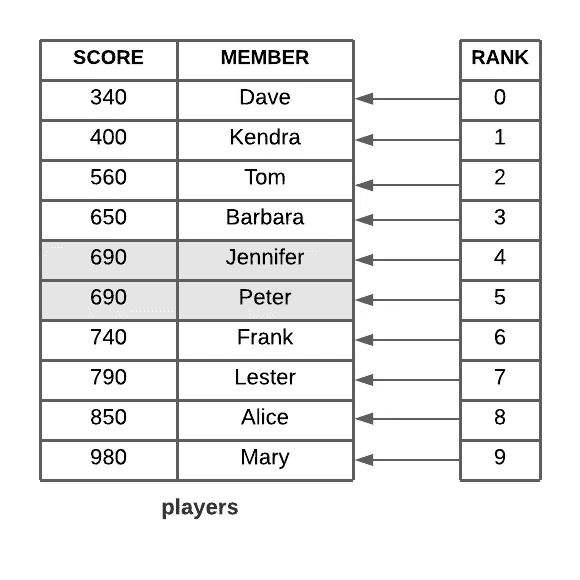
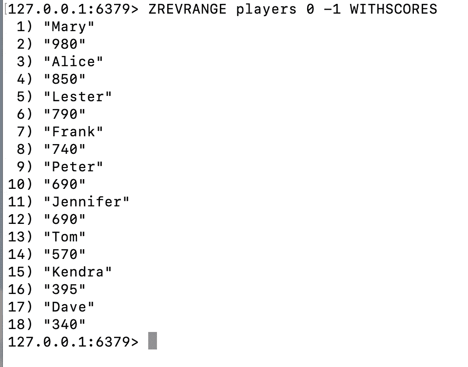

# Redis 有序集解释

> 原文：<https://medium.com/analytics-vidhya/redis-sorted-sets-explained-2d8b6302525?source=collection_archive---------1----------------------->

## 试着用排行榜的例子来理解已排序的集合


照片由[西格蒙德](https://unsplash.com/@sigmund?utm_source=medium&utm_medium=referral)在 [Unsplash](https://unsplash.com?utm_source=medium&utm_medium=referral) 上拍摄

在深入研究之前，让我们通过解构名称来理解有序集合。



如上所述，有序集合是一种不允许重复成员的集合数据结构。同时，其成员按升序排列。通过将两者结合起来，我们可以将有序集合定义为唯一成员的有序集合。

有序集合类似于 Redis 中的集合数据结构。成员可以是不重复的字符串列表。唯一的区别是每个成员都与一个分数相关联，这个分数是一个浮点数，为已排序的集合提供排序顺序。成员总是从最低分到最高分排序。

# 健身排行榜

理解排序集的最佳方式是将它想象成一个包含 score 和 member 列的表。下面是一个假想的健身排行榜，其中会员栏代表玩家，而分数代表他们迄今为止走过的步数。



计步数的玩家

排行榜已根据分数按升序排序。分数可以复制，但成员不能。

如果两个成员得分相同，Redis 将根据成员的字典顺序对它们进行排序。例如，**詹妮弗**和**彼得**同分 690。但是 Redis 确保将 Jennifer 放在 Peter 之前，因为 J 在 p 之前。

你还可以注意到右边的**排名**。等级是根据每个成员得分的大小分配给每个成员的隐式属性。这是一个从零开始的索引。得分最低的成员将被分配 0 级。

当您从已排序的集合中检索成员时，Rank 非常有用。

# 优势和使用案例

Redis 保证一个有序集合总是有序的。检索存储成员的客户端不需要额外的排序。这节省了客户端的 CPU 周期，也降低了代码的复杂性。

有序集合允许你快速地添加、删除或更新元素(在与元素数量的对数成比例的时间内)。因为元素是按顺序排列的，而不是按顺序排列的，所以您也可以通过分数或排名(位置)快速获得范围。访问有序集合的中间部分也非常快，因此您可以将有序集合用作不重复元素的智能列表，在这里您可以快速访问您需要的所有内容。

这使得排序集成为实现实时、低延迟排行榜、优先级队列和二级索引的绝佳选择。

到目前为止，我们已经介绍了有序集合的基础知识。让我们看看可以对它们执行的一些有趣的操作。

# 操作

我们可以对已排序的集合执行操作，以添加、删除、增加和检索成员。通常，这些操作以字母“z”开始

让我们使用上面讨论的健身排行榜示例来演示这些操作。使用 Redis CLI 执行操作。注意，我不打算在这里涵盖所有可用的有序集合操作。相反，我会浏览一下在构建类似排行榜的应用程序时重要的操作。有关操作的完整列表，您可以随时参考[分类器械包文档](https://redis.io/topics/data-types)。

## 向游戏中添加新玩家及其步骤

当新玩家加入时，他/她应该与步数一起添加到排行榜中。

操作`ZADD`向排序后的集合中再添加一个元素。下面是命令的格式。

`ZADD <key> <score> <member>`

`key`是已排序集合的名称。以下命令将 790 步的**莱斯特**添加到`players`中。作为回报，它给出了添加到集合中的元素数量，在本例中为 1。

```
127.0.0.1:6379> ZADD players 790 Lester
(integer) 1
127.0.0.1:6379>
```

您可以添加任意数量的元素及其分数，如下所示。请注意，元素是根据它们的分数存储的，而不是根据它们添加的顺序。

```
127.0.0.1:6379> ZADD players 980 Mary 850 Alice
(integer) 2
127.0.0.1:6379>
```

添加新玩家后，`players`的结构会是这样的。



新加入的莱斯特、弗兰克和玛丽

## 递增/递减玩家步数

当玩家进行日常行走时，他们的步数需要在排行榜上更新。

您可以使用`ZINCRBY`命令以任意值增加给定成员的分数。

`ZINCRBY <key> <increment> <member>`

以下命令将汤姆的步数增加 10。

```
127.0.0.1:6379> ZINCRBY players 10 Tom
"570"
```

您可以使用负值来减少分数。以下命令将**肯德拉**的步数减少 5。

```
127.0.0.1:6379> ZINCRBY players -5 Kendra
"395"
```

## 按分数检索前 10 名玩家

现在，我们只需要检索前 10 名玩家，将他们显示在排行榜上。

`ZREVRANGE`命令通过根据逆序分数只返回一组指定的成员来实现这一点。

该命令采用以下格式。

`ZREVRANGE <key> <start> <stop> [WITHSCORES]`

`ZREVRANGE`按逆序返回成员，分数从高到低排序。您必须用一个`start`和`stop`参数指定起始和结束等级索引位置。

让我们根据前 10 名选手走过的路数来选出他们。

```
127.0.0.1:6379> ZREVRANGE players 0 9
1) "Mary"
2) "Alice"
3) "Lester"
4) "Frank"
5) "Peter"
6) "Jennifer"
7) "Barbara"
8) "Tom"
9) "Kendra"
10) "Dave"
```

还有一个额外的参数:`WITHSCORES`，它返回每个成员的分数。

```
127.0.0.1:6379> ZREVRANGE players 0 9 WITHSCORES
1) "Mary"
2) "980"
3) "Alice"
4) "850"
5) "Lester"
6) "790"
7) "Frank"
8) "740"
9) "Peter"
10) "690"
11) "Jennifer"
12) "690"
13) "Barbara"
14) "650"
15) "Tom"
16) "570"
17) "Kendra"
18) "395"
19) "Dave"
20) "340"
```

`ZRANGE`命令与此相反。它按等级顺序返回成员，分数按从低到高的顺序排列。

下面的命令返回走的步数最少的前十名玩家。

```
127.0.0.1:6379> ZRANGE players 0 9
1) "Dave"
2) "Kendra"
3) "Tom"
4) "Barbara"
5) "Jennifer"
6) "Peter"
7) "Frank"
8) "Lester"
9) "Alice"
10) "Mary"
```

## 检索单个玩家的等级和分数

现在我们需要找到给定玩家的分数和排名。有时，这可以显示在玩家的个人资料上。

`ZRANK`和`ZREVRANK`命令返回成员的等级，这是基于 0 的索引位置。

该命令的格式是:

`[ZRANK|ZREVRANK] <key> <member>`

以下命令为目前位于排行榜底部的**戴夫**返回 0。

```
127.0.0.1:6379> ZRANK players Dave
(integer) 0
```

同样，**玛丽**的`ZREVRANK`应该返回 0。因为它以相反的顺序返回排名，分数从低到高排序。

```
127.0.0.1:6379> ZREVRANK players Mary
(integer) 0
```

`ZSCORE`提供与成员相关的当前分数。该命令的格式是:

`ZSCORE <key> <member>`

这将返回**彼得的**分数，即 690 分。

```
127.0.0.1:6379> ZSCORE players Peter
"690"
```

## 根据分数计算玩家人数

我们如何找到在给定范围内行走的玩家数量？例如，有多少玩家走了超过 500 步但少于 700 步？

命令`ZCOUNT`将对最小和最大分数之间的成员进行计数。这是包容性的。该命令的格式是:

`ZCOUNT <key> <min> <max>`

以下命令返回走了 500 到 700 步的玩家人数。

```
127.0.0.1:6379> ZCOUNT players 500 700
(integer) 4
```

## 将玩家从游戏中移除

当玩家离开游戏时，我们需要将他们从排行榜中删除。

`ZREM`命令从有序集合中删除一个或多个成员。命令格式是:

`ZREM <key> <member> [<member> …]`

我们可以将芭芭拉从排行榜中移除，因为她因为太累而决定离开游戏。

```
127.0.0.1:6379> ZREM players Barbara
(integer) 1
```

最后，在所有这些操作之后，我们的排行榜是这样的。



# 结论

由于其自然的排序和访问存储元素的效率，排序集在构建实时排行榜等应用程序中越来越受欢迎。它们通常在内存中存储超过一百万个元素，并提供对实时仪表板的低延迟访问。

用传统数据库实现相同的功能总是具有挑战性。即使你设法做到了这一点，把它输入到一个仪表盘上也会导致灾难。

因此，像 Redis 这样的内存数据结构在这里大放异彩。

# 资源

[](https://redis.io/topics/data-types) [## 数据类型- Redis

### 字符串是最基本的 Redis 值。Redis 字符串是二进制安全的，这意味着 Redis 字符串可以…

redis.io](https://redis.io/topics/data-types)