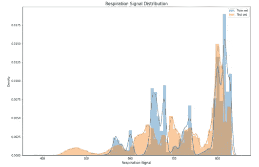

# 减少航空死亡——卡格尔竞赛

> 原文：<https://medium.com/analytics-vidhya/reducing-aviation-fatalities-kaggle-competition-9fc71d5ff6e0?source=collection_archive---------7----------------------->

[www.flyingmag.com](http://www.flyingmag.com)

# 目录

1.  概观
2.  商业问题
3.  数据集分析
4.  将现实世界问题映射到 ML 问题
5.  绩效指标
6.  探索性数据分析
7.  特征工程
8.  数据预处理
9.  模型
10.  未来的改进
11.  结果
12.  参考

80%的飞机失事是由人为失误造成的，其中大部分是由于飞行员的失误。博思艾伦汉密尔顿，一家与 Kaggle 合作的美国管理公司，试图通过减少飞行员的失误来使航空旅行更加安全。Kaggle 组织了一场比赛，根据飞行员的生理数据预测他/她的认知状态。

# 概观

随着航空旅行变得越来越流行和重要，关注每年数百万乘客的安全变得越来越重要。一次空难就能杀死数百人。因此，航空安全至关重要。在这里，我们着重于避免因飞行员失误造成的坠机。

# 商业问题

飞行员失误导致的空难很可能是由于飞行员丧失了飞机状态意识。飞机状态意识是指飞行员的警觉性，以及他理解和应对飞行中危机的能力。这种能力的丧失可能是由于困倦、高度紧张、分心等原因造成的。当飞行员处于这些状态中的任何一种时，提醒他可以挽救生命。

实验是在飞行模拟器之外的非飞行环境中进行的。这些实验包括 9 个机组，每个机组有两名飞行员。在这些实验中，飞行员受到不同的干扰，他们的生理数据被记录下来。作为目标的认知状态有:

粗略地说，通道化注意力(CA)是专注于一项任务而排除所有其他任务的状态。这是通过让受试者玩一个引人入胜的基于谜题的视频游戏来进行基准测试的。

转移注意力(DA)是指一个人的注意力被与决策相关的行为或思维过程转移的状态。这是通过让受试者执行显示监控任务来诱导的。周期性地，一个数学问题出现了，必须在返回到监控任务之前解决它。

惊吓/惊讶(SS)是通过让受试者观看带有跳跃惊吓的电影片段来诱发的。

# 数据集分析

数据集由 csv 格式的训练和测试数据组成。数据可以在[这里](https://www.kaggle.com/c/reducing-commercial-aviation-fatalities/data)找到。

# 将现实世界问题映射到 ML 问题

在这个问题中有四个不同的类别需要确定。这是一个多类分类问题。

## 绩效指标

使用的性能度量是多类日志丢失。

# 探索性数据分析

1.  检查数据中的不平衡

训练数据集是不平衡的，属于 A 类和 C 类的大多数数据点远远排在第二位。属于 D 类和 b 类的数据点少得多。

2 .检查缺失值和重复值:发现训练数据集没有任何缺失值和重复值。

3.单变量分析

a.每个小组的实验数量:有 9 个小组参与了实验。我们检查是否所有的 9 名工作人员都接受了相同数量的实验。

在这里，我们可以观察到，与其他班组相比，班组 1 对 SS 事件(B 级)进行的试验较少。团队 1 只有大约 75000 个 SS 类的实验，而所有其他团队都有大约 180000 个相同类的实验。所有机组人员都为 CA 和 DA 班进行了几乎相同数量的实验。

b.心电图

PDF 显示训练数据集的 ECG 值在 20000 到 35000 mv 的范围内。

测试数据中的 ECG 值仅在-20000 至~20000 mv 之间。我们很少看到超过 30000 mv 的值。

c.总参谋部要求

GSR 的值在 0 到 2000 之间。我们看到，与该范围内的其他值相比，许多数据点的值接近于零，而在 10 到 200 之间的范围内几乎没有数据点。

d.呼吸

呼吸值在 550 到 850 毫伏之间。在大约 820–830 毫伏之间有一个峰值。

4.双变量分析

a.心电图

在类别 A、C、B 中发现了一些异常值

既然，目标是寻找可以预测机组人员认知状态的生理因素；这些异常值可能对相应类别的预测有用。因此，不应该删除异常值。

B 类有更多数量的异常值(惊吓/意外)

当 ECG 值大于 10000 mv 时，飞行员更有可能处于 D 状态，当值为负值时，飞行员最有可能处于 C 状态。

b.总参谋部要求

GSR 特征显示了类别之间的一些重叠，但是仍然可以用于区分类别。

所有类别的最小值都是零。

c.呼吸

*   该图显示了呼吸功能类之间的大量重叠。仅用呼吸特征来预测事件是困难的。
*   呼吸的最小值因类别而异。

# 特征之间的相关性。

*   大多数脑电图读数彼此之间有很强的相关性。
*   心电图和 GSR 的相关性很弱，只有 0.2
*   GSR 和 seat 也是弱相关。
*   尽管座位和 r 有很强的相关性，飞行员的呼吸不太可能取决于他是坐在右边还是左边。

# 特征工程

心电图、呼吸和 GSR 等生理特征已从电子感觉设备中获取。这些设备除了传感数据之外，还会拾取大量外部噪音。我们必须把实际数据从噪音中分离出来。

在去除了特征中的噪声之后，我们可以从每个特征中导出相关的特征。一个名为 Biosppy 的 Python 库被用来从现有功能中派生新功能。

## 来自呼吸数据的呼吸率

## 来自心电图数据的心率

## 脑电图特征

脑电图数据来自如下图所示放置的电极。我们通过组合随后的电极值来导出相关特征。

## 从脑电图数据中导出频带

EEG 数据保存不同频段的数据。这些频带中的一些可以指示人的认知状态。这里考虑的频带有:

## 推导 GSR 滚动平均值和最大-最小特征

从 GSR 数据中提取平均值和最大最小值有助于我们跟踪每个时间窗口的平均值变化。GSR 值的峰值表示压力，因此有助于捕捉这些特征。

## 删除不相关的列

ECG 和 r 特征包含大量噪声。我们已经创建了这些特征的去噪数据，因此不再需要这些数据。

事件值已经用 LabelEncoder 编码成一个新特性。

通过导出随后值之间的差异提取来自 eeg 特征的数据，并且还提取频带信息。现在可以安全地删除这些单独的读数了。

# 建模

首先，随机模型适合数据，并根据交叉验证数据进行评估。我们希望用更好的模型如逻辑回归和光梯度推进模型或 LGBM 来改善由此产生的对数损失。对数损失在逻辑回归模型中略有改善。然而，LGBM 产生的测井曲线损失最小。

# 未来的改进

多尝试合奏模式。集成模型已经显示出对于训练数据集的前景。

借助领域专业知识，从 ECG/GSR/呼吸数据中提取更多特征。

尝试深度学习模型

# 结果

LGBM 模型用于预测测试数据集的结果，结果随后提交给 Kaggle。

[源代码。](https://github.com/PreethiBright/Reducing-Aviation-Fatalities) [领英](https://www.linkedin.com/in/preethimadhusudhan/)

# 参考

1.【https://www.appliedaicourse.com/ 

2.[https://www . ka ggle . com/stuartbman/生理数据简介](https://www.kaggle.com/stuartbman/introduction-to-physiological-data)

3.[https://towards data science . com/getting-the-right-beat-e 18 ACD 48 b 8 c 1](https://towardsdatascience.com/getting-the-right-beat-e18acd48b8c1)

4.[http://arno.uvt.nl/show.cgi?fid=149399](http://arno.uvt.nl/show.cgi?fid=149399)