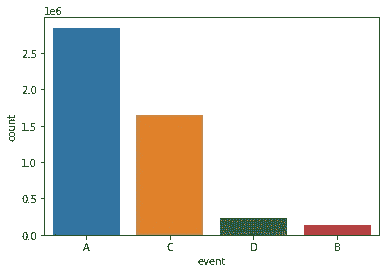

# 减少商业航空死亡事故

> 原文：<https://medium.com/analytics-vidhya/reducing-commercial-aviation-fatalities-cb0e34a21728?source=collection_archive---------14----------------------->

# 索引

1.概观

2.商业问题

3.数据集分析

4.将现实世界的问题映射成最大似然问题

5.性能问题

6.探索性数据集分析

7.特征工程

8.数据预处理

9.建模

10.未来的改进

11.结果

12.参考

# **1。概述**

[Booz Allen Hamilton](https://www.boozallen.com/) 是一家咨询公司，在分析、数字、工程和网络方面拥有专业知识，企业、政府和军事组织举办了这次 Kaggle 竞赛。他们有许多与现实世界相关的复杂问题。航空事故是指在飞行操作或任何其他涉及航空器的操作过程中，航空器、航天器或任何其他航空航天器内外的一人或多人死亡。这些死亡事故与飞机的运行直接相关，被称为航空事故。减少商业航空中的死亡事故——如果我们能够检测到提醒飞行员和航空工作人员的麻烦事件，这是可以实现的。所以我们会在问题变得更糟之前找到解决方案。这是我们解决这个问题的目标——大多数与飞行相关的死亡事故都源于“飞机状态意识”的丧失也就是说，可能注意力分散、困倦或处于其他危险认知状态的飞行员的注意力管理无效。

# **2。商业问题**

来自不同国家的人们通过商业航空在国家之间或国家内部旅行。因此，乘客的安全出行取决于以下一些条件

1.飞行员应该身体健康才能操作

2.飞机起飞前应检查外机身

3.应该测试发动机

因此，我们的问题围绕着飞行员，由于更多的航班和奇怪的时间安排，飞行员遭受疲劳，时差和呼吸问题。因此，当飞行员操作飞行时，他们进入飞机状态感知(ASA)。飞机状态意识(ASA)是飞行员的一种表现属性，飞行员应该能够意识到飞机状态的任何变化并做出快速反应。飞机状态意识的丧失可能导致许多危险情况，并且可能导致飞机失控，其中可能发生与预期飞行路径的极端偏离，或者换句话说，可能注意力分散、困倦或处于其他危险认知状态的飞行员的注意力管理无效。

在这个数据集中，为你提供了来自飞行员的真实生理数据，这些飞行员受到各种干扰事件的影响。飞行员经历了旨在诱发以下三种认知状态之一的分心:

*   粗略地说，通道化注意力(CA)是专注于一项任务而排除所有其他任务的状态。这是通过让受试者玩一个引人入胜的基于谜题的视频游戏来进行基准测试的。
*   转移注意力(DA)是指一个人的注意力被与决策相关的行为或思维过程转移的状态。这是通过让受试者执行显示监控任务来诱导的。周期性地，一个数学问题出现了，必须在返回到监控任务之前解决它。
*   惊吓/惊讶(SS)是通过让受试者观看带有跳跃惊吓的电影片段来诱发的。

目的是建立一个模型，可以使用给定的生理数据实时估计飞行员的精神状态。当飞行员进入上述任何一种危险的认知状态时，他/她应该被警告，从而防止任何可能的事故。

# **3。数据集分析**

本次比赛提供了三个 CSV 文件。第一个是 train.csv，其中包含用于训练的所有数据。Test.csv 用于测试模型。

Sample_submission.csv 用于以 csv 格式提交最终输出。

现在，让我们分析一下[数据集中的每个属性](https://www.kaggle.com/c/reducing-commercial-aviation-fatalities/data)。

训练数据由三个实验组成:CA、DA 和 SS。输出是四个标签之一:基线(无事件)、CA、DA 或 SS。例如，如果实验是 CA，则输出是 CA 或基线(无事件)。测试数据取自一个完整的飞行模拟器。这里的实验被称为 LOFT 或 Line Oriented 飞行训练，飞行员的训练是在飞行模拟器中进行的，它人为地创造了真实飞行的环境。在测试数据中，实验以 LOFT 形式给出，输出可以是给定时间的四种状态之一。为了预测飞行员的状态，需要生理数据。我们有来自四个传感器的数据——脑电图、心电图、呼吸、皮肤电反应。让我们分析数据集的每个属性。

Id:团队+时间组合的唯一标识符。使用 id 来表示进入实验的特定时间的飞行员。所以对于每个 id，我们需要预测状态

机组:一对或飞行员的唯一 id

实验:对于培训，它将是 CA 或 DA 或 SS。为了测试，它将是阁楼

时间:实验开始几秒钟

座位:飞行员的座位- 0 代表左边，1 代表右边

脑电图——多年来，脑电图的作用被大大夸大了，它绝对不是大脑活动的灵丹妙药。临床上，你可以有效地判断一个人是醒着、睡着、脑死亡、癫痫发作还是其他一些情况。脑电图是大脑表面所有电活动的总和。这是大脑表面所有活动的总和。我们得到了 20 个电极的数据。每个电极导线被放置在大脑的特定部分(前额叶(fp)、颞(t)、额(f)、顶(p)、枕(o)、中央(c))附近。图示中奇数表示电极放置在大脑左侧，偶数表示右侧，z 表示中间区域。

Eeg_f7:来自前额部分附近电极的数据—左侧

Eeg_f8:来自额区附近电极的数据—右侧

Eeg_t4:来自颞区附近电极的数据—右侧

Eeg_t6:来自颞区附近电极的数据—右侧

Eeg_t5:来自颞区附近电极的数据—左侧

Eeg_t3:来自颞区附近电极的数据—左侧

Eeg_fp2:来自前额区附近电极的数据—右侧

Eeg_o1:枕部附近电极的数据—左侧

Eeg_p3:来自顶部区域附近电极的数据—左侧

Eeg_pz:来自顶叶区附近电极的数据——中间区域

Eeg_f3:来自额区附近电极的数据——左侧

Eeg_fz:来自额区附近电极的数据——中间区域

Eeg_f4:来自额区附近电极的数据—右侧

Eeg_c4:来自中央区域附近电极的数据—右侧

Eeg_p4:来自右侧顶骨区附近电极的数据

Eeg_poz:来自顶枕结合部附近电极的数据——中间区域

Eeg_c3:来自中央区域附近电极的数据——左侧

Eeg_cz:来自靠近中心区域——中间区域的电极的数据

Eeg_o2:枕部附近电极的数据—右侧

Ecg:三点心电图(ECG)信号——它测量心脏的电活动(传感器输出以微伏为单位)

r:呼吸传感器——它测量胸部的起伏(传感器输出以微伏为单位)

Gsr:皮肤电反应——测量皮肤电活动(传感器输出以微伏为单位)

事件:要预测的输出——飞行员在给定时间的状态。它将是基线(无事件)或 SS(B)或 CA(C)或 DA(D)。

# **4。毫升配方**

# **4.1 题型:-**

该模型需要在实验期间预测飞行员在一段时间内的以下认知状态之一 A(基线)、B (SS)、C (CA)和 D (DA)。

# **4.2 数据类型:-**

此处的数据集具有时间序列性质，由心电图、脑电图、呼吸和 GSR 等医学参数组成，这些参数是随时间记录的电信号。

# **4.3 对数据的挑战:-**

数据集包括从在 18 个不同飞行员身上操作的不同机器收集的生理数据，并且这些机器的电线倾向于拾取不必要的信号，因此在数据中存在一些噪声

# **4.4 业务约束:-**

它应该能够实时预测飞行员的认知状态，以便如果飞行员处于令人不安的状态，他们可以立即得到警告，防止事故发生并拯救生命。

# **5。绩效指标:-**

多级对数损失用于模型的性能评估。

多级原木损失

# **6。探索性数据集分析**

*   **事件的频率** —使用计数图，我们可以看到 4 个类别之间的分布

*   座位在预测中不起任何重要作用。飞行员经历任何一种认知状态都是完全不相关的，因为他坐在左边还是右边。

座位

## 工作人员和事件之间的观察

1.  这里的船员分为 9 个部分
2.  通过这个计数图，我们可以看到所有船员之间的分布几乎相同

## 事件和心电图之间的观察

1.  在可视化该图之后，我们可以说，对于某些区域，值缺失，而对于某些区域，值重叠
2.  对于-10k 到 20k，它是较密集的区域，而对于 20k 到 30k，它是较稀疏的区域
3.  对于-10k 到 10k 之间的 C，它是较密集的区域，而对于 25k 到 30k，它是较稀疏的区域
4.  对于 D -15k 到 22k，它是较密集的区域，而对于-20k 到-15k，它是较稀疏的区域
5.  B 0 到 10k 是密集区，25k 到 30k 是稀疏区

## GSR 和事件之间的观察

1.  这里底部的区域显示了所有三种认知状态的缺失值
2.  这里的负值在可视化中是不存在的
3.  图表类似于心电图

## R 和事件之间的观察

1.  这里我们可以说范围被定义在 500 到 850 之间
2.  显示所有 4 种认知状态的呼吸
3.  所有 4 种认知状态的图表看起来都很相似
4.  特征越不同，特征就越好。

*   **检查数据中的噪音**–获得数据后，您必须检查您的数据是否有噪音。就好像你开始对你的数据进行分析，然后你发现因为你的数据中有噪声，所以模型表现很差

## 在这里，我将打印每个特征的图形，如果它看起来有噪声

*   **ECG** — ECG 看起来有噪声，如果我们不去除噪声，则此功能没有用。绘制心电图特征后，图表在 x 轴和 y 轴上没有显示有用的信息。

*   **呼吸** —呼吸看起来也有噪音，因此我们需要消除噪音。绘制呼吸特征后，图表在 x 和 y 轴上没有显示有用的信息

*   **GSR** — GSR 特征看起来有噪声，因此我们需要去除噪声。GSR 特征看起来有噪声，所以我们需要消除噪声。绘制 GSR 特征后，图表在 x 和 y 轴上没有显示有用的信息

*   **EEG** — EEG 特征看起来有噪声，所以我们需要去除噪声。脑电图特征该图在 x 轴和 y 轴上没有显示有用的信息。在这里，我有 20 个脑电图特征，显示有价值的信息，但由于噪音，它并不清楚。

## **盒图分析**以及 ECG、呼吸和 GSR 特征的无噪声表示。

*   **ECG** 具有无噪声方框图表示

1.间隔(0，1000)涵盖了大部分数据

2.图中的变化显示了它的分布

ECG 无噪声箱线图表示

*   **呼吸**无噪声方框图表示

1.区间(0，750)覆盖了大部分数据

2.图中的变化显示了它的分布

呼吸无噪声箱线图表示

*   **Gsr** 无噪声方框图表示

1.区间(500，1250)覆盖了大部分数据

2.图中的变化显示了它的分布

Gsr 无噪声方框图表示

# 7.数据预处理

从数据中去除噪声

缩放功能

在 Scikit learn MinMaxScaler()和 filtfilt from signal 的帮助下，我们将从噪声特征中去除噪声，并对其进行缩放。

去除噪声后的 ECG 特征

去除噪声后的 GSR 特征

移除后的呼吸特征

去除后的脑电特征

# 8.特征工程

特征工程是一个从现有特征中获得特征并使用这些特征预测结果的过程。

将编码器解码器模型应用于我的脑电图特征。

在这里，我将解释我的编码器解码器模型是如何工作的

## **编码器型号:**

这里，我有一个输入层，它包含 20 个脑电图特征，接下来我有 3 个密集层，它们具有不同的滤波器大小，他们的工作是将我的模型压缩为 4 个特征。在我的解码器部分，以相反的顺序以相同的模式扩展模型。

## **想法:**

自动编码器背后的主要思想是将 EEG 特征压缩为 4 个特征，并将这 4 个特征添加到我的数据中。

对保存的模型调用自动编码器功能

我将编码器模型应用于脑电图特征，并尝试将其压缩为四个特征，并在数据中使用它来预测认知状态。

四个新特性。

# 9.建模

建模是一个过程，在这个过程中，我们可以看到哪个模型最适合我们的数据。不同的模型处理数据的方式不同。在这里，LGBM 模型对我来说非常有用，除了 LGBM 之外，我还尝试了像逻辑回归、随机森林、ada boost 和 LGBM 这样的模型。

# 9.1 数据分割

这是我们在特征工程后得到的 x，y 是所有状态数据的列

拿到 X 和 y 后，我试着在各种型号上安装我的模型。

# 9.2 逻辑回归

我已经用最佳参数运行了逻辑回归，但是它过度拟合并且只预测了 4 个类中的一个类。

# 9.3 随机森林

我已经在我的数据上尝试了随机森林模型，以查看它的性能。对我来说，随机森林是最耗时的模型，如果你运行随机森林分配，尝试创建非常深的树。

# 9.4 LGBM 模型

LGBM 模型在我的数据中表现最好。我建模的最佳参数

# 9.5 Ada Boost 型号

# 10.结果

从训练和测试集获得的多级对数损失如下所示

在这里，我最好的私人分数排在第 16 位，但模型过拟合，所以选择选择 LGBM 模型分数在第 79 位

提交后从 kaggle 获得的测试损失如下所示

# 11.部署

我尝试使用 flask api 在我的本地系统上部署这个模型。如果飞行员在飞行中遇到任何情况，它将输出状态。

在 GitHub 存储库中找到完整的解决方案— [Abhijeet sengar](https://github.com/DaggerAJ/Reducing-commercial-aviation-fatalities-)

我的 linkedin 个人资料[阿比吉特·森加](http://linkedin.com/in/abhijeet-sengar-b36ba5179)

# 12.未来的改进

1.  在 [Biosppy](https://biosppy.readthedocs.io/en/stable/biosppy.signals.html#biosppy-signals-resp) 的帮助下，我们可以得到呼吸率和心率
2.  脑电信号之间的电位差

# 13.参考

1.  [https://medium . com/analytics-vid hya/reducing-商用-航空-死亡事故-ec338e37900c](/analytics-vidhya/reducing-commercial-aviation-fatalities-ec338e37900c)
2.  [https://maheshmahi 7 . medium . com/reducing-commercial-aviation-deadlines-ka ggle-problem-c10c 50543481](https://maheshmahi7.medium.com/reducing-commercial-aviation-fatalities-kaggle-problem-c10c50543481)
3.  [https://anudeeparedy-s . medium . com/reducing-commercial-aviation-deadlines-c 0 D2 ef 478 c 41](https://anudeepareddy-s.medium.com/reducing-commercial-aviation-fatalities-c0d2ef478c41)
4.  [https://www.appliedaicourse.com/](https://www.appliedaicourse.com/)